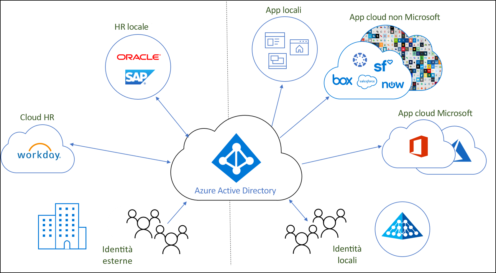
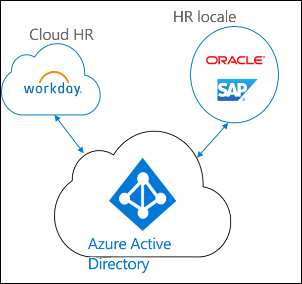
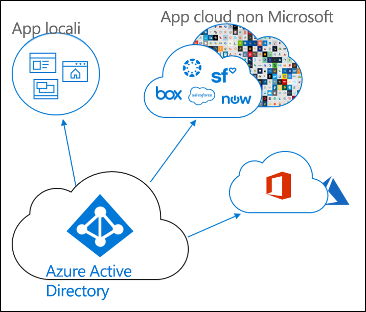
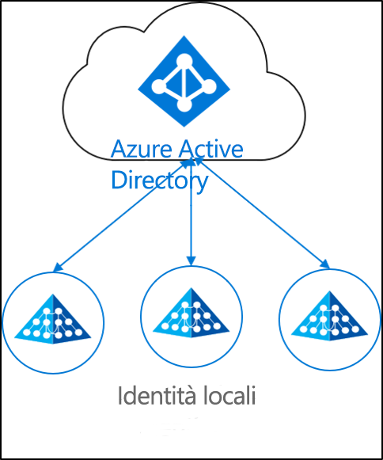

# Che cos'è il provisioning di identità?

Oggi nelle aziende di piccole e grandi dimensioni si ricorre sempre più spesso a una combinazione di applicazioni locali e cloud e  gli utenti devono poter accedere alle applicazioni sia in locale che nel cloud. È necessario avere una singola identità tra le varie applicazioni (in locale e nel cloud).

Il provisioning è il processo di creazione di un oggetto in base a determinate condizioni, mantenendo l'oggetto aggiornato ed eliminandolo quando le condizioni non vengono più soddisfatte. Ad esempio, un nuovo utente che entra a far parte dell'organizzazione viene immesso nel sistema di gestione delle risorse umane.  A quel punto, il provisioning può creare un account utente corrispondente nel cloud, in Active Directory e nelle varie applicazioni a cui l'utente deve poter accedere.  In questo modo l'utente può iniziare a lavorare e avrà accesso fin dal primo giorno alle applicazioni e ai sistemi necessari. 

Per quanto riguarda Azure Active Directory, il provisioning può essere suddiviso negli scenari chiave seguenti.  

- **[Provisioning basato su risorse umane](#hr-driven-provisioning)**  
- **[Provisioning di app](#app-provisioning)**  
- **[Provisioning della directory](#directory-provisioning)** 

## Provisioning basato su risorse umane

Il provisioning dalle risorse umane al cloud comporta la creazione di oggetti (utenti, ruoli, gruppi e così via) in base alle informazioni incluse nel sistema di gestione delle risorse umane.  

Lo scenario più comune è quando un nuovo dipendente entra a far parte dell'azienda e viene immesso nel sistema di gestione delle risorse umane.  A quel punto, ne viene effettuato il provisioning nel cloud,  in questo caso, Azure AD.  Il provisioning dalle risorse umane può coprire gli scenari seguenti. 

- **Assunzione di nuovi dipendenti**: quando viene aggiunto un nuovo dipendente al sistema di gestione delle risorse umane nel cloud viene creato automaticamente un account utente in Active Directory, Azure Active Directory e, facoltativamente, in Office 365 e in altre applicazioni SaaS supportate da Azure AD, con il writeback dell'indirizzo di posta elettronica al sistema di gestione delle risorse umane nel cloud.
- **Aggiornamenti di attributi e profili dei dipendenti**: se il record di un dipendente viene aggiornato nel sistema di gestione delle risorse umane nel cloud (ad esempio, il nome, la qualifica o il manager), il relativo account utente verrà aggiornato automaticamente in Active Directory, Azure Active Directory e, facoltativamente, in Office 365 e in altre applicazioni SaaS supportate da Azure AD.
- **Termine del rapporto con i dipendenti**: quando un dipendente viene eliminato dal sistema di gestione delle risorse umane nel cloud, il relativo account utente viene disabilitato automaticamente in Active Directory, Azure Active Directory e, facoltativamente, in Office 365 e in altre applicazioni SaaS supportate da Azure AD.
- **Riassunzioni di dipendenti**: quando un dipendente viene nuovamente aggiunto nel sistema di gestione delle risorse umane nel cloud, il relativo account utente precedente può essere automaticamente riattivato o sottoposto di nuovo a provisioning (a seconda delle preferenze) in Active Directory, Azure Active Directory e, facoltativamente, in Office 365 e in altre applicazioni SaaS supportate da Azure AD.

## Provisioning di app

Il provisioning di app comporta il provisioning di utenti e ruoli nelle applicazioni a cui l'utente deve poter accedere.  

Lo scenario più comune è quando viene effettuato il provisioning di un utente di Azure AD in O365 o Salesforce.

## Provisioning della directory

Il provisioning locale comporta il provisioning da origini locali (ad esempio Active Directory) ad Azure AD.  

Lo scenario più comune è quando viene effettuato il provisioning di un utente di Active Directory (AD) in Azure AD.

Questo risultato si ottiene con il servizio di sincronizzazione di Azure AD Connect, il provisioning cloud di Azure AD Connect e Microsoft Identity Manager. 
 
## Passaggi successivi 

- [Cos'è il provisioning?](what-is-provisioning.md)
- [Che cos'è il provisioning cloud di Azure AD Connect?](what-is-cloud-provisioning.md)
