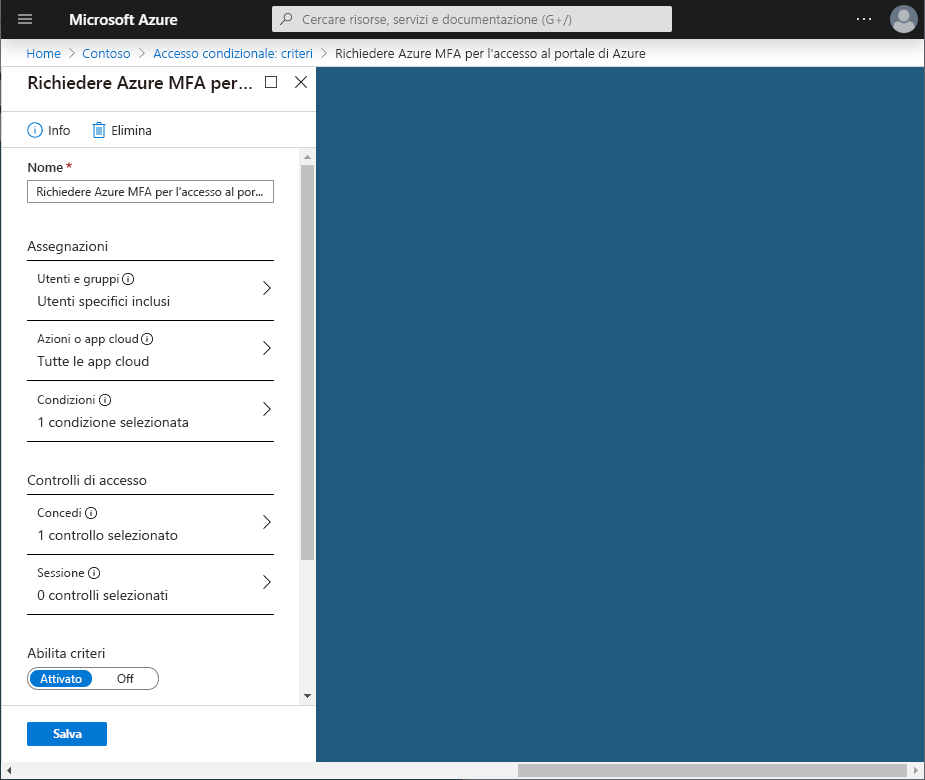
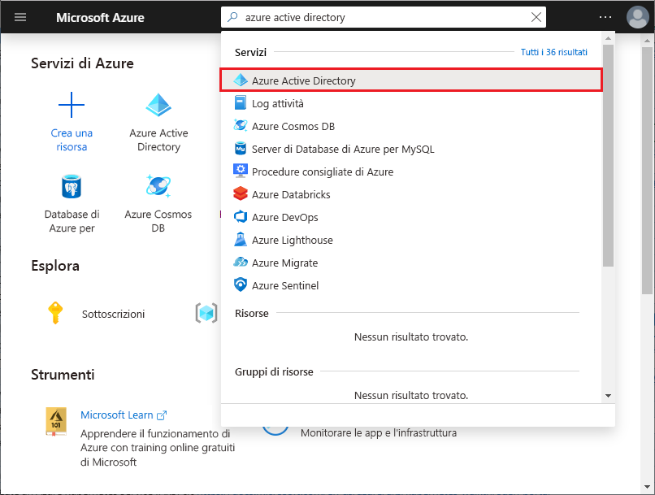

# Guida introduttiva: Richiedere MFA per app specifiche con l'accesso condizionale di Azure Active Directory

Per semplificare l'esperienza di accesso degli utenti, è possibile consentire di accedere alle app cloud usando un nome utente e una password. Molti ambienti hanno tuttavia almeno alcune applicazioni per cui è consigliabile richiedere una forma più affidabile di verifica dell'account, ad esempio Multi-Factor Authentication (MFA), come nel caso dell'accesso al sistema di posta elettronica dell'organizzazione o alle app per la gestione delle risorse umane. In Azure Active Directory (Azure AD) è possibile raggiungere questo obiettivo con i criteri di accesso condizionale.

Questa guida introduttiva illustra come configurare i [criteri di accesso condizionale di Azure AD](../active-directory-conditional-access-azure-portal.md) che richiedono Multi-Factor Authentication per un'app cloud selezionata dell'ambiente.

Se non si ha una sottoscrizione di Azure, creare un [account gratuito](https://azure.microsoft.com/free/?WT.mc_id=A261C142F) prima di iniziare.

## Prerequisiti

Per completare lo scenario in questa guida introduttiva, sono necessari gli elementi seguenti:

- **Accesso a un'edizione Azure AD Premium**: l'accesso condizionale di Azure AD è una funzionalità di Azure AD Premium.

- **Account di test denominato Isabella Simonsen**: se non si conosce la procedura per creare un account di test, vedere [Aggiungere gli utenti basati su cloud](../fundamentals/add-users-azure-active-directory.md#add-a-new-user).

Per lo scenario di questo argomento di avvio rapido è necessario che il servizio Multi-Factor Authentication per utente non sia abilitato per l'account di test. Per altre informazioni, vedere [Come richiedere la verifica in due passaggi per un utente](../authentication/howto-mfa-userstates.md).

## Verificare il proprio accesso

L'obiettivo di questo passaggio è farsi un'idea dell'esperienza di accesso senza un criterio di accesso condizionale.

**Per inizializzare l'ambiente:**

1. Accedere al portale di Azure come Isabella Simonsen.
1. Uscire,

## Creare i criteri di accesso condizionale

Questa sezione illustra come creare i criteri di accesso condizionale necessari. Lo scenario di questa guida introduttiva usa:

- Portale di Azure come segnaposto per un'app cloud che richiede MFA. 
- Utente di esempio per testare i criteri di accesso condizionale.  

Nei criteri, impostare:

| Impostazione | Valore |
| --- | --- |
| Utenti e gruppi | Isabella Simonsen |
| App cloud | Gestione di Microsoft Azure |
| Concedere l'accesso | Richiedi autenticazione a più fattori |

**Per configurare i criteri di accesso condizionale:**

1. Accedere al [portale di Azure](https://portal.azure.com) come amministratore globale, amministratore della sicurezza o amministratore di accesso condizionale.

1. Sulla barra di spostamento a sinistra nel portale di Azure fare clic su **Azure Active Directory**.

   

1. Nella sezione **Sicurezza** della pagina **Azure Active Directory** fare clic su **Accesso condizionale**.

   

1. Nella pagina **Accesso condizionale** fare clic su **Nuovi criteri** sulla barra degli strumenti in alto.

   

1. Nella pagina **Nuovo** digitare **Richiedi MFA per l'accesso al portale di Azure** nella casella di testo **Nome**.

   

1. Nella sezione **Assegnazioni** fare clic su **Utenti e gruppi**.

   

1. Nella pagina **Utenti e gruppi** seguire questa procedura:

   

   1. Fare clic su **Seleziona utenti e gruppi** e quindi selezionare **Utenti e gruppi**.

   1. Fare clic su **Seleziona**.

   1. Nella pagina **Seleziona** scegliere **Isabella Simonsen** e quindi fare clic su **Seleziona**.

   1. Nella pagina **Utenti e gruppi** fare clic su **Fatto**.

1. Fare clic su **App cloud**.

   

1. Nella pagina **App cloud** attenersi alla procedura seguente:

   

   1. Fare clic su **Selezionare le app**.

   1. Fare clic su **Seleziona**.

   1. Nella pagina **Seleziona** selezionare **Gestione di Microsoft Azure** e quindi fare clic su **Seleziona**.

   1. Nella pagina **App cloud** fare clic su **Fatto**.

1. Nella sezione **Controlli di accesso** fare clic su **Concedi**.

   

1. Nella pagina **Concedi** seguire questa procedura:

   

   1. Selezionare **Concedi accesso**.

   1. Selezionare **Richiedi autenticazione a più fattori**.

   1. Fare clic su **Seleziona**.

1. Nella sezione **Attiva criterio** fare clic su **Sì**.

   

1. Fare clic su **Create**(Crea).

## Valutare un accesso simulato

Ora che sono stati configurati i criteri di accesso condizionale, è possibile sapere se funzionano come previsto. Come primo passaggio, usare lo strumento per i criteri What If dell'accesso condizionale per simulare un accesso dell'utente di test. La simulazione valuta l'impatto di questo accesso sui criteri e genera un report di simulazione.  

Per inizializzare lo strumento Valutazioni dei criteri di simulazione, impostare:

- **Isabella Simonsen** come utente
- **Gestione di Microsoft Azure** come app cloud

Fare clic su **What If** per creare un report di simulazione che indica:

- **Richiedi MFA per l'accesso al portale di Azure** sotto **Criteri applicabili**
- **Richiedi autenticazione a più fattori** in **Concedi controlli**.

**Per valutare i criteri di accesso condizionale:**

1. Nella pagina [Accesso condizionale - Criteri](https://portal.azure.com/#blade/Microsoft_AAD_IAM/ConditionalAccessBlade/Policies) fare clic su **What If** nel menu in alto.  

   

1. Fare clic su **Utenti**, scegliere **Isabella Simonsen** e quindi fare clic su **Seleziona**.

   

1. Per selezionare un'app cloud, seguire questa procedura:

   

   1. Fare clic su **App cloud**.

   1. Nella pagina **App cloud** fare clic su **Selezionare le app**.

   1. Fare clic su **Seleziona**.

   1. Nella pagina **Seleziona** selezionare **Gestione di Microsoft Azure** e quindi fare clic su **Seleziona**.

   1. Nella pagina App cloud fare clic su **Fine**.

1. Fare clic su **What If**.

## Testare i criteri di accesso condizionale

Nella sezione precedente si è appreso come valutare un accesso simulato. Oltre a una simulazione, è anche consigliabile testare i criteri di accesso condizionale per assicurarsi che funzionino come previsto.

Per testare i criteri, provare ad accedere al [portale di Azure](https://portal.azure.com) usando l'account di test **Isabella Simonsen**. Verrà visualizzata una finestra di dialogo che richiede di impostare l'account per la verifica aggiuntiva della sicurezza.

## Pulire le risorse

Quando non sono più necessari, eliminare l'utente di test e i criteri di accesso condizionale:

- Se non si conosce la procedura per eliminare un utente di Azure AD, vedere [Eliminare gli utenti da Azure Active Directory](../fundamentals/add-users-azure-active-directory.md#delete-a-user).
- Per eliminare i criteri, selezionarli e quindi fare clic su **Elimina** nella barra di accesso rapido.

    

## Passaggi successivi

> [!div class="nextstepaction"]
> [Richiedere le condizioni d'uso per essere accettati](require-tou.md)
> [Bloccare l'accesso quando viene rilevato un rischio per la sessione](app-sign-in-risk.md)
