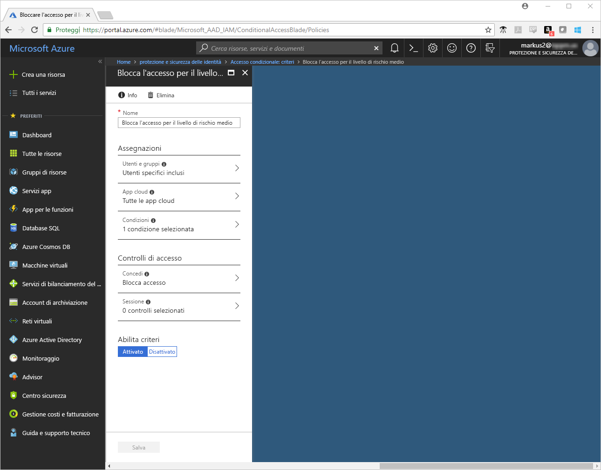
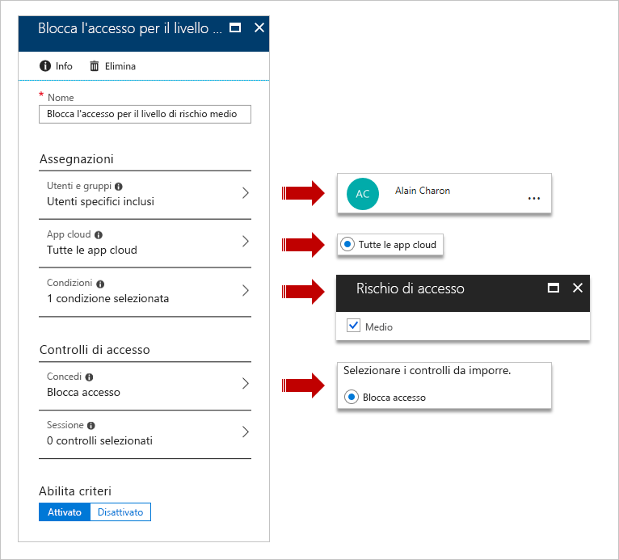
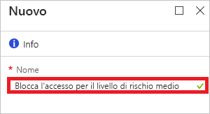
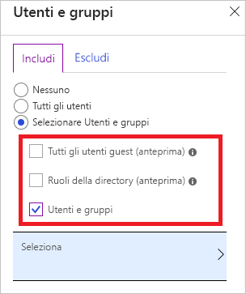
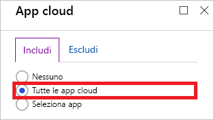
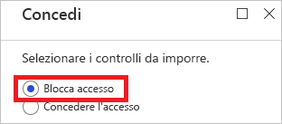
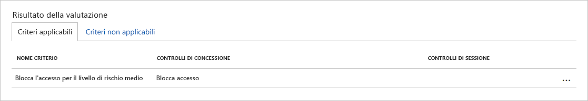
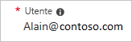
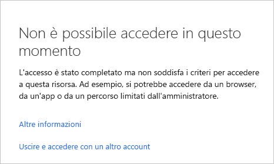

# Guida introduttiva: Bloccare l'accesso quando viene rilevato un rischio per la sessione con l'accesso condizionale di Azure Active Directory  

Per mantenere l'ambiente protetto, è possibile bloccare l'accesso per gli utenti sospetti. [Azure Active Directory (Azure AD) Identity Protection](../active-directory-identityprotection.md) analizza ciascun accesso e calcola la probabilità che un tentativo di accesso non venga eseguito dal proprietario legittimo di un account utente. La probabilità (bassa, media, elevata) è indicata in forma di valore calcolato denominato [livelli di rischio di accesso](conditions.md#sign-in-risk). Impostando la condizione di rischio di accesso, è possibile configurare i criteri di accesso condizionale per rispondere ai livelli di rischio di accesso specifico.

Questa guida introduttiva illustra come configurare i [criteri di accesso condizionale](../active-directory-conditional-access-azure-portal.md) che bloccano l'accesso quando viene rilevato un livello di rischio di accesso configurato.

Se non si ha una sottoscrizione di Azure, creare un [account gratuito](https://azure.microsoft.com/free/?WT.mc_id=A261C142F) prima di iniziare.

## Prerequisiti

Per completare lo scenario in questa esercitazione, sono necessari gli elementi seguenti:

- **Accesso a un'edizione di Azure AD Premium P2**: sebbene l'accesso condizionale sia una funzionalità di Azure AD Premium P1, è necessaria un'edizione P2 poiché lo scenario di questa guida introduttiva richiede Identity Protection.

- **Identity Protection**: lo scenario in questa guida introduttiva richiede l'abilitazione di Identity Protection. Per scoprire come abilitare Identity Protection, vedere [Abilitazione di Azure Active Directory Identity Protection](../identity-protection/enable.md).

- **Tor Browser**: [Tor Browser](https://www.torproject.org/projects/torbrowser.html.en) è progettato per salvaguardare la privacy online. Identity Protection rileva un accesso da un Tor Browser come **accesso da indirizzi IP anonimi**, con un livello di rischio medio. Per altre informazioni, vedere [Eventi di rischio di Azure Active Directory](../reports-monitoring/concept-risk-events.md).  

- **Account di test denominato Alain Charon**: se non si conosce la procedura per creare un account di test, vedere [Aggiungere gli utenti basati su cloud](../fundamentals/add-users-azure-active-directory.md#add-a-new-user).

## Verificare il proprio accesso

L'obiettivo di questo passaggio è assicurarsi che l'account di test possa accedere al tenant tramite Tor Browser.

**Per testare l'accesso:**

1. Accedere al [portale di Azure](https://portal.azure.com) come **Alain Charon**.
1. Uscire,

## Creare i criteri di accesso condizionale

Lo scenario di questa guida introduttiva sfrutta un accesso da un Tor Browser per generare un evento di rischio rilevato da **accessi provenienti da indirizzi IP anonimi**. Il livello di rischio di questo evento di rischio è medio. Per rispondere a questo evento di rischio, impostare la condizione di rischio di accesso su medio. In un ambiente di produzione, è necessario impostare la condizione di rischio di accesso sia su elevato sia su medio ed elevato.

Questa sezione illustra come creare i criteri di accesso condizionale necessari. Nei criteri, impostare:

| Impostazione | Valore |
| --- | --- |
| Utenti e gruppi | Alain Charon  |
| App cloud | Tutte le app cloud |
| Rischio di accesso | Media |
| Concessione | Blocca accesso |

**Per configurare i criteri di accesso condizionale:**

1. Accedere al [portale di Azure](https://portal.azure.com) come amministratore globale, amministratore della sicurezza o amministratore di accesso condizionale.

1. Sulla barra di spostamento a sinistra nel portale di Azure fare clic su **Azure Active Directory**.

   

1. Nella sezione **Sicurezza** della pagina **Azure Active Directory** fare clic su **Accesso condizionale**.

   

1. Nella pagina **Accesso condizionale** fare clic su **Aggiungi** nella barra degli strumenti in alto.

   

1. Nella pagina **Nuovo**, nella casella di testo **Nome** digitare **Bloccare l'accesso per livello di rischio medio**.

   

1. Nella sezione **Assegnazioni** fare clic su **Utenti e gruppi**.

   

1. Nella pagina **Utenti e gruppi**:

   

   1. Fare clic su **Seleziona utenti e gruppi** e quindi selezionare **Utenti e gruppi**.

   1. Fare clic su **Seleziona**.

   1. Nella pagina **Seleziona** scegliere **Alain Charon**, quindi fare clic su **Seleziona**.

   1. Nella pagina **Utenti e gruppi** fare clic su **Fatto**.

1. Fare clic su **App cloud**.

   

1. Nella pagina **App cloud**:

   

   1. Fare clic su **Tutte le app cloud**.

   1. Fare clic su **Done**.

1. Fare clic su **Condizioni**.

   

1. Nella pagina **Condizioni**:

   

   1. Fare clic su **Rischio di accesso**.

   1. In **Configura** fare clic su **Sì**.

   1. Selezionare **Medio** come livello di rischio di accesso.

   1. Fare clic su **Seleziona**.

   1. Nella pagina **Condizioni** fare clic su **Fatto**.

1. Nella sezione **Controlli di accesso** fare clic su **Concedi**.

   

1. Nella pagina **Concedi**:

   

   1. Selezionare **Blocca accesso**.

   1. Fare clic su **Seleziona**.

1. Nella sezione **Attiva criterio** fare clic su **Sì**.

   

1. Fare clic su **Create**(Crea).

## Valutare un accesso simulato

Ora che sono stati configurati i criteri di accesso condizionale, è possibile sapere se funzionano come previsto. Come primo passaggio, usare lo **strumento per i criteri What If** dell'accesso condizionale per simulare un accesso dell'utente di test. La simulazione valuta l'impatto di questo accesso sui criteri e genera un report di simulazione.  

Quando si esegue lo **strumento per i criteri What If** per questo scenario, **Bloccare l'accesso per livello di rischio medio** dovrebbe essere elencato nei **Criteri applicabili**.

**Per valutare i criteri di accesso condizionale:**

1. Nella pagina [Accesso condizionale - Criteri](https://portal.azure.com/#blade/Microsoft_AAD_IAM/ConditionalAccessBlade/Policies) fare clic su **What If** nel menu in alto.  

   

1. Fare clic su **Utente**, selezionare **Alan Charon** dalla pagina **Utenti**, quindi fare clic su **Seleziona**.

   

1. Selezionare **Medio** come **Rischio di accesso**.

   

1. Fare clic su **What If**.

## Testare i criteri di accesso condizionale

Nella sezione precedente si è appreso come valutare un accesso simulato. Oltre a una simulazione, è anche consigliabile testare i criteri di accesso condizionale per assicurarsi che funzionino come previsto.

Per testare i criteri, provare a effettuare l'accesso al [portale di Azure](https://portal.azure.com) come **Alan Charon** usando Tor Browser. Il tentativo di accesso dovrebbe essere bloccato dai criteri di accesso condizionale.

## Pulire le risorse

Quando non sono più necessari, eliminare l'utente di test, Tor Browser e i criteri di accesso condizionale:

- Se non si conosce la procedura per eliminare un utente di Azure AD, vedere [Eliminare gli utenti da Azure Active Directory](../fundamentals/add-users-azure-active-directory.md#delete-a-user).

- Per eliminare i criteri, selezionarli e quindi fare clic su **Elimina** nella barra di accesso rapido.

   

- Per istruzioni su come rimuovere Tor Browser, vedere [Disinstallazione](https://tb-manual.torproject.org/uninstalling/).

## Passaggi successivi

> [!div class="nextstepaction"]
> [Richiedere le condizioni d'uso per essere accettati](require-tou.md)
> [Richiedere MFA per app specifiche](app-based-mfa.md)
