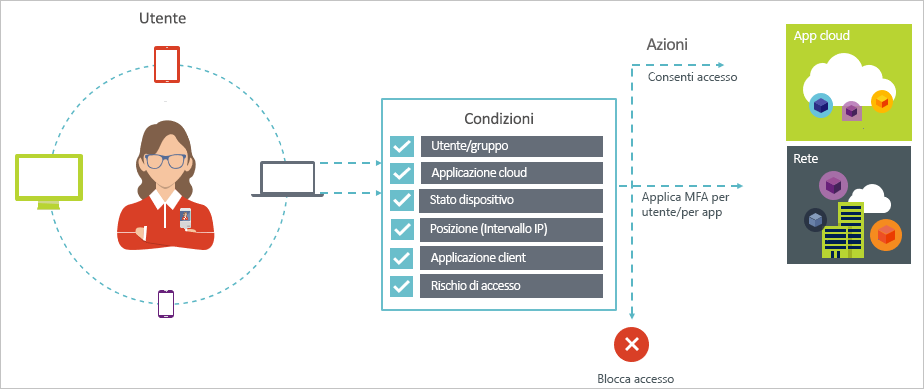

# Che cos'è l'accesso condizionale in Azure Active Directory?

La sicurezza è una priorità assoluta per le organizzazioni che usano il cloud. Identità e accesso rappresentano aspetti chiave della sicurezza cloud in ambito di gestione delle risorse cloud. In un mondo dominato dai dispositivi mobili e basato sul cloud, gli utenti possono accedere alle risorse dell'organizzazione con una serie di dispositivi e app ovunque si trovino. Di conseguenza, non è più sufficiente concentrarsi solo su chi può accedere a una risorsa. Per ottenere un equilibrio ideale tra produttività e sicurezza, nelle decisioni relative al controllo di accesso è anche necessario considerare il modo in cui si accede a una risorsa. Con l'accesso condizionale di Azure Active Directory (Azure AD) è possibile soddisfare questo requisito. L'accesso condizionale è una funzionalità di Azure Active Directory. Con l'accesso condizionale è possibile implementare decisioni di controllo di accesso automatiche per l'accesso alle app cloud in base a determinate condizioni.

I criteri di accesso condizionale vengono applicati dopo il completamento dell'autenticazione con primo fattore. Pertanto l'accesso condizionale non è da intendersi come una prima misura difensiva da attacchi Denial of Service (DoS), ma può utilizzare segnali da questi eventi, come il livello di rischio di accesso, la posizione della richiesta e così via, per determinare l'accesso.  

Questo articolo offre una panoramica concettuale dell'accesso condizionale in Azure AD.

## Scenari comuni

In un mondo in cui i dispositivi mobili e il cloud hanno sempre più importanza, Azure Active Directory consente ovunque l'accesso Single Sign-On a dispositivi, app e servizi. Con il proliferare dei dispositivi (inclusi i dispositivi BYOD), del lavoro al di fuori delle reti aziendali e delle app SaaS di terze parti, è necessario confrontarsi con due obiettivi contrapposti:

- Fare in modo che gli utenti siano produttivi sempre e ovunque
- Proteggere gli asset aziendali in qualsiasi momento

Grazie ai criteri di accesso condizionale è possibile applicare i controlli di accesso idonei nelle condizioni richieste. L'accesso condizionale di Azure AD offre maggiore sicurezza quando è necessario e non interferisce con le attività dell'utente quando non lo è.

Di seguito sono indicate alcune problematiche di accesso comuni per cui l'accesso condizionale può risultare utile:

- **[Rischio di accesso](conditions.md#sign-in-risk)**: Azure AD Identity Protection rileva i rischi di accesso. Come limitare l'accesso se un rischio di accesso rilevato indica un attore malintenzionato? Come fare se si intende avere prove più chiare del fatto che è stato eseguito un accesso da parte dell'utente legittimo o se sussistono dubbi sufficienti a impedire addirittura a utenti specifici di accedere a un'app?  

- **[Percorso di rete](location-condition.md)**: Azure AD è accessibile da qualsiasi posizione. Cosa accade se si esegue un tentativo di accesso da un percorso di rete al di fuori del controllo del reparto IT? Una combinazione di nome utente e password potrebbe essere sufficiente come identificazione per i tentativi di accesso dalla rete aziendale. Cosa accade se è necessario un livello superiore di identificazione per i tentativi di accesso avviati da altri paesi o aree geografiche non previsti del mondo? Cosa accade se si intende addirittura bloccare i tentativi di accesso da alcune posizioni?  

- **[Gestione dei dispositivi](conditions.md#device-platforms)**: in Azure AD gli utenti possono accedere alle app cloud da una vasta gamma di dispositivi, inclusi i dispositivi mobili e i dispositivi personali. Cosa accade se è necessario che i tentativi di accesso vengano eseguiti solo con dispositivi gestiti dal reparto IT? Cosa accade se si intende addirittura impedire a determinati tipi di dispositivi l'accesso alle app cloud nell'ambiente in uso?

- **[Applicazione client](conditions.md#client-apps)**: oggi è possibile accedere a molte app cloud con tipi di app diversi, ad esempio app basate sul Web, app per dispositivi mobili o app desktop. Cosa accade se un tentativo di accesso viene eseguito usando un tipo di app client che causa problemi noti? Cosa accade se è necessario un dispositivo gestito dal reparto IT per determinati tipi di app?

Queste domande e le relative risposte rappresentano scenari comuni per l'accesso condizionale di Azure AD.
L'accesso condizionale è una funzionalità di Azure Active Directory che consente di gestire gli scenari di accesso con un approccio basato su criteri.

> [!VIDEO https://www.youtube.com/embed/eLAYBwjCGoA]

## Criteri di accesso condizionale

I criteri di accesso condizionale rappresentano una definizione di uno scenario di accesso con il criterio seguente:

La **seconda parte** specifica la risposta dei criteri. È importante notare che l'obiettivo dei criteri di accesso condizionale è quello di non concedere l'accesso a un'app cloud. In Azure AD la concessione dell'accesso alle app cloud è soggetta alle assegnazioni utente. Con i criteri di accesso condizionale l'utente controlla il modo in cui gli utenti autorizzati (che hanno ottenuto l'accesso a un'app cloud) possono accedere alle app cloud in condizioni specifiche. Nella risposta l'utente applica altri requisiti, ad esempio l'autenticazione a più fattori o un dispositivo gestito. Nel contesto dell'accesso condizionale di Azure AD, i requisiti applicati dai criteri vengono chiamati controlli di accesso. Nella forma più restrittiva, i criteri possono bloccare l'accesso. Per altre informazioni, vedere [Controlli di accesso nell'accesso condizionale di Azure Active Directory](controls.md).

**Quando accade questo** definisce il motivo per attivare i criteri. Questo motivo è caratterizzato da un gruppo di condizioni soddisfatte. Nell'accesso condizionale di Azure AD le due condizioni di assegnazione svolgono un ruolo particolare:

- **[Utenti](conditions.md#users-and-groups)**: gli utenti che eseguono un tentativo di accesso (**Chi**).

- **[App cloud](conditions.md#cloud-apps-and-actions)**: le destinazioni di un tentativo di accesso (**Cosa**).

Queste due condizioni sono obbligatorie nei criteri di accesso condizionale. Oltre alle due condizioni obbligatorie, è anche possibile includere altre condizioni che descrivono il modo in cui viene eseguito il tentativo di accesso. Esempi comuni sono l'uso di dispositivi mobili o posizioni all'esterno della rete aziendale. Per altre informazioni, vedere [Condizioni nell'accesso condizionale di Azure Active Directory](conditions.md).

La combinazione delle condizioni con i controlli di accesso rappresenta un tipo di criteri di accesso condizionale.

Con l'accesso condizionale di Azure AD è possibile controllare il modo in cui gli utenti autorizzati possono accedere alle app cloud. L'obiettivo dei criteri di accesso condizionale è applicare controlli di accesso aggiuntivi per un tentativo di accesso a un'app cloud in base a come il tentativo viene eseguito.

Con un approccio basato su criteri per la protezione dell'accesso alle app cloud, si può iniziare a definire i requisiti dei criteri per l'ambiente usando la struttura illustrata in questo articolo senza preoccuparsi dell'implementazione tecnica.

## Autenticazione federata e accesso condizionale di Azure AD

I criteri di accesso condizionale interagiscono senza problemi con l'[autenticazione federata](../../security/azure-ad-choose-authn.md#federated-authentication). Tale interazione include tutti i controlli e le condizioni supportati e la visibilità del modo in cui i criteri vengono applicati agli accessi utente attivi con i [report di Azure AD](../reports-monitoring/concept-sign-ins.md).

Con l'*autenticazione federata con Azure AD*, l'autenticazione degli utenti ad Azure AD viene gestita da un servizio di autenticazione attendibile, come ad esempio Active Directory Federation Services (AD FS) o qualsiasi altro servizio federativo. In questa configurazione, l'autenticazione utente primaria viene eseguita nel servizio, quindi viene usato Azure AD per l'accesso alle singole applicazioni. L'accesso condizionale di Azure AD viene applicato prima della concessione dell'accesso all'applicazione a cui l'utente sta accedendo. 

Quando i criteri di accesso condizionale configurati richiedono l'autenticazione a più fattori, Azure AD usa per impostazione predefinita Azure MFA. Se si usa il servizio federativo per MFA, è possibile configurare Azure AD in modo da reindirizzare il servizio federativo quando è necessario MFA impostando `-SupportsMFA` su `$true` in [PowerShell](https://docs.microsoft.com/powershell/module/msonline/set-msoldomainfederationsettings). Questa impostazione funziona per i servizi di autenticazione federata che supportano la richiesta di autenticazione MFA generata da Azure AD con `wauth= http://schemas.microsoft.com/claims/multipleauthn`.

Dopo l'accesso dell'utente al servizio di autenticazione federata, Azure AD gestisce gli altri requisiti dei criteri, come la conformità del dispositivo o un'applicazione approvata.

## Requisiti relativi alle licenze

[!INCLUDE [Active Directory P1 license](../../../includes/active-directory-p1-license.md)]

## Passaggi successivi

Per informazioni su come implementare l'accesso condizionale nell'ambiente in uso, vedere [Pianificare la distribuzione dell'accesso condizionale in Azure Active Directory](plan-conditional-access.md).
