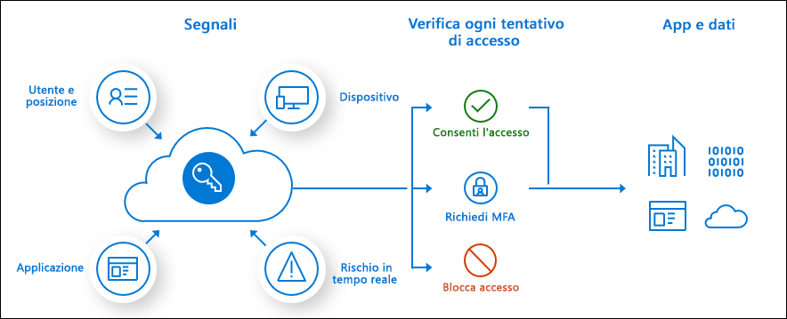

# Informazioni sull'accesso condizionale

Il perimetro di sicurezza moderno si estende ora oltre la rete di un'organizzazione per includere l'identità di utenti e dispositivi. Le organizzazioni possono usare questi segnali di identità come parte delle decisioni relative al controllo di accesso. 

> [!VIDEO https://channel9.msdn.com/Shows/Docs-Azure/Azure-AD-Conditional-Access/player]

L'accesso condizionale è lo strumento usato da Azure Active Directory per raggruppare i segnali, consentendo di prendere decisioni e applicare i criteri dell'organizzazione. L'accesso condizionale è la base del nuovo piano di controllo basato su identità.

I criteri di accesso condizionale nella loro forma più semplice sono istruzioni if-then: se un utente vuole accedere a una risorsa, deve completare un'azione. Esempio: Un responsabile retribuzioni per accedere all'apposita applicazione deve eseguire l'autenticazione a più fattori.

Gli amministratori devono perseguire due obiettivi principali:

- Fare in modo che gli utenti siano produttivi sempre e ovunque
- Proteggere gli asset dell'organizzazione

Con i criteri di accesso condizionale, è possibile applicare i controlli di accesso appropriati per preservare la sicurezza dell'organizzazione quando è necessario ed evitare di ostacolare gli utenti quando non lo è.

> [!IMPORTANT]
> I criteri di accesso condizionale vengono applicati dopo il completamento del primo fattore di autenticazione. L'accesso condizionale non è destinato a essere usato come prima misura di difesa di un'organizzazione per attacchi Denial of Service (DoS), ma può usare i segnali provenienti da questi eventi per determinare l'accesso.

## Segnali comuni

I segnali comuni su cui si basa l'accesso condizionale per stabilire i criteri includono i seguenti:

- Appartenenza di utenti o gruppi
   - I criteri possono essere destinati a specifici utenti e gruppi offrendo agli amministratori un controllo granulare dell'accesso.
- Informazioni sugli indirizzi IP
   - Le organizzazioni possono creare intervalli di indirizzi IP attendibili da usare per prendere decisioni sui criteri. 
   - Gli amministratori possono specificare intervalli IP in interi paesi/aree geografiche per bloccare o consentire il traffico in ingresso e in uscita.
- Dispositivo
   - Per applicare i criteri di accesso condizionale, è possibile considerare utenti con dispositivi di specifiche piattaforme o contrassegnati con uno stato specifico.
- Applicazione
   - Gli utenti che provano ad accedere a specifiche applicazioni possono attivare diversi criteri di accesso condizionale. 
- Rilevamento del rischio calcolato e in tempo reale
   - Grazie all'integrazione dei segnali con Azure AD Identity Protection, i criteri di accesso condizionale identificano il comportamento di accesso a rischio. I criteri possono quindi forzare gli utenti a cambiare la password o a eseguire l'autenticazione a più fattori per ridurre il livello di rischio oppure possono bloccarne l'accesso finché un amministratore non interviene manualmente.
- Microsoft Cloud App Security (MCAS)
   - Consente il monitoraggio e il controllo in tempo reale delle sessioni e dell'accesso alle applicazioni, aumentando la visibilità e il controllo sull'accesso e sulle attività eseguite nell'ambiente cloud.

## Decisioni comuni

- Blocca accesso
   - Decisione più restrittiva
- Concedere l'accesso
   - Decisione meno restrittiva, può comunque richiedere una o più opzioni seguenti:
      - Richiedi autenticazione a più fattori
      - Richiedere che i dispositivi siano contrassegnati come conformi
      - Richiedi dispositivo aggiunto ad Azure AD ibrido
      - Richiedere app client approvata
      - Richiedi criteri di protezione delle pp (anteprima)

## Criteri comunemente applicati

Molte organizzazioni condividono [preoccupazioni che possono essere risolte con i criteri di accesso condizionale](concept-conditional-access-policy-common.md), ad esempio:

- Obbligo di eseguire l'autenticazione a più fattori per gli utenti con ruoli amministrativi
- Obbligo di eseguire l'autenticazione a più fattori per le attività di gestione di Azure
- Blocco degli accessi per gli utenti che provano a usare protocolli di autenticazione legacy
- Obbligo di usare posizioni attendibili per la registrazione ad Azure AD Multi-Factor Authentication
- Blocco o concessione dell'accesso da specifiche posizioni
- Blocco dei comportamenti di accesso rischiosi
- Obbligo di usare dispositivi gestiti dall'organizzazione per specifiche applicazioni

## Requisiti relativi alle licenze

[!INCLUDE [Active Directory P1 license](../../../includes/active-directory-p1-license.md)]

Anche i clienti con [licenze Premium di Microsoft 365 Business](/office365/servicedescriptions/microsoft-365-service-descriptions/microsoft-365-business-service-description) possono accedere alle funzionalità di accesso condizionale. 

[Rischio di accesso](concept-conditional-access-conditions.md#sign-in-risk) richiede l'accesso a [Identity Protection](../identity-protection/overview-identity-protection.md)

## Passaggi successivi

- [Creazione dettagliata di criteri di accesso condizionale](concept-conditional-access-policies.md)
- [Pianificare la distribuzione dell'accesso condizionale](plan-conditional-access.md)
- [Informazioni su Identity Protection](../identity-protection/overview-identity-protection.md)
- [Informazioni su Microsoft Cloud App Security](/cloud-app-security/what-is-cloud-app-security)
- [Informazioni su Microsoft Intune](/intune/index)
