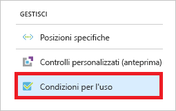
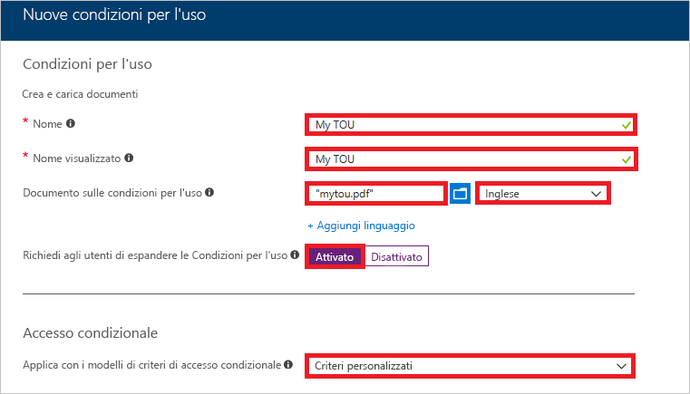
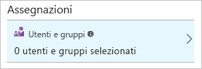
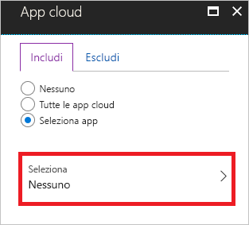
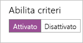
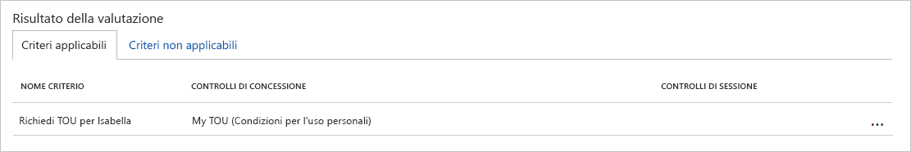
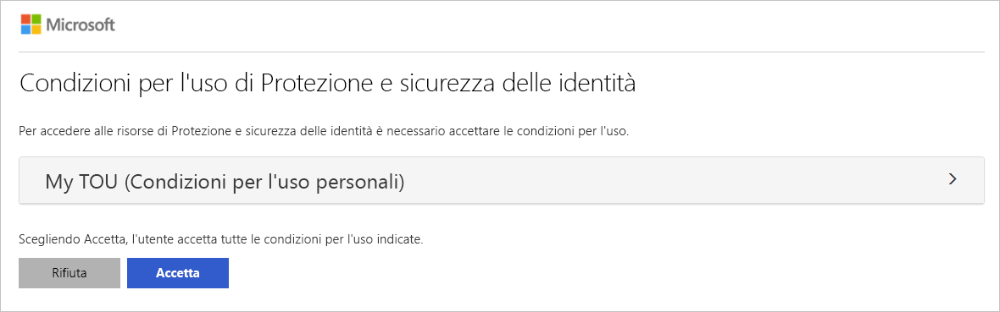
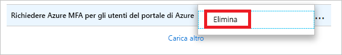

# Guida introduttiva: Richiedere l'accettazione di condizioni per l'utilizzo prima dell'accesso alle app cloud 

Prima che gli utenti accedano ad app cloud specifiche all'interno dell'ambiente in uso, è consigliabile ottenere il consenso di questi sotto forma di accettazione delle condizioni per l'utilizzo. L'accesso condizionale di Azure Active Directory (Azure AD) offre: 

- Un metodo semplice per la configurazione delle condizioni per l'utilizzo
- La possibilità di richiedere l'accettazione delle condizioni per l'utilizzo tramite criteri di accesso condizionale  

Questa guida introduttiva illustra come configurare [criteri di accesso condizionale di Azure AD](../active-directory-conditional-access-azure-portal.md) che richiedono l'accettazione di condizioni per l'utilizzo per un'app cloud selezionata all'interno dell'ambiente.

Se non si ha una sottoscrizione di Azure, creare un [account gratuito](https://azure.microsoft.com/free/?WT.mc_id=A261C142F) prima di iniziare.

## Prerequisiti 

Per completare lo scenario in questa guida introduttiva, sono necessari gli elementi seguenti:

- **Accesso a un'edizione Azure AD Premium**: l'accesso condizionale di Azure AD è una funzionalità di Azure AD Premium. 

- **Account di test denominato Isabella Simonsen**: se non si conosce la procedura per creare un account di test, vedere [Aggiungere gli utenti basati su cloud](../fundamentals/add-users-azure-active-directory.md#add-cloud-based-users).

## Verificare il proprio accesso

L'obiettivo di questo passaggio è farsi un'idea dell'esperienza di accesso senza un criterio di accesso condizionale.

**Per verificare il proprio accesso:**

1. Accedere al [portale di Azure](https://portal.azure.com/) come Isabella Simonsen.

2. Uscire,

## Creare le condizioni per l'utilizzo

Questa sezione illustra i passaggi necessari per creare un esempio di condizioni per l'utilizzo. Quando si creano condizioni per l'utilizzo, si seleziona un valore per **Applica con i modelli di criteri di accesso condizionale**. Se si seleziona **Criteri personalizzati**, subito dopo la creazione di condizioni per l'utilizzo viene visualizzata la finestra di dialogo per la creazione di un nuovo criterio di accesso condizionale.

**Per creare condizioni per l'utilizzo:**

1. In Microsoft Word creare un nuovo documento.

2. Digitare **My terms of use** (Condizioni per l'utilizzo personali) e quindi salvare il documento con il nome **mytou.pdf**.

3. Accedere al [portale di Azure](https://portal.azure.com) come amministratore globale, amministratore della sicurezza o amministratore di accesso condizionale.

4. Sulla barra di spostamento a sinistra nel portale di Azure fare clic su **Azure Active Directory**. 

    

5. Nella sezione **Gestisci** della pagina **Azure Active Directory** fare clic su **Accesso condizionale**.

     

6. Nella sezione **Gestisci** fare clic su **Condizioni per l'utilizzo**.

     

7. Nel menu in alto fare clic su **Nuove condizioni**.

     

8. Nella pagina **Nuove condizioni d'uso**:

     

    a. Nella casella di testo **Nome** digitare **My TOU** (Condizioni per l'utilizzo personali).

    b. Nella casella di testo **Nome visualizzato** digitare **My TOU** (Condizioni per l'utilizzo personali).

    c. Caricare il file PDF delle condizioni per l'utilizzo.

    d. Per **Lingua**, selezionare **Inglese**.

    e. Per **Richiedi agli utenti di espandere le Condizioni d'uso** selezionare **Attivata**.

    f. Per **Applica con i modelli di criteri di accesso condizionale** selezionare **Criteri personalizzati**.

    g. Fare clic su **Create**(Crea).
 

## Creare i criteri di accesso condizionale 

Questa sezione illustra come creare i criteri di accesso condizionale necessari. Lo scenario di questa guida introduttiva usa:

- Portale di Azure come segnaposto per un'app cloud che richiede l'accettazione delle condizioni per l'utilizzo. 
- Utente di esempio per testare i criteri di accesso condizionale.  

Nei criteri, impostare:

|Impostazione |Valore|
|---     | --- |
|Utenti e gruppi | Isabella Simonsen |
|App cloud | Gestione di Microsoft Azure |
|Concedere l'accesso | My TOU (Condizioni per l'utilizzo personali) |
 

 

**Per configurare i criteri di accesso condizionale:**

1. Nella casella di testo **Nome** della pagina **Nuovo** digitare **Require TOU for Isabella** (Richiedi condizioni per l'utilizzo per Isabella).

    

2. Nella sezione **Assegnazioni** fare clic su **Utenti e gruppi**.

    

3. Nella pagina **Utenti e gruppi**:

    

    a. Fare clic su **Seleziona utenti e gruppi** e quindi selezionare **Utenti e gruppi**.

    b. Fare clic su **Seleziona**.

    c. Nella pagina **Seleziona** scegliere **Isabella Simonsen** e quindi fare clic su **Seleziona**.

    d. Nella pagina **Utenti e gruppi** fare clic su **Fatto**.

4. Fare clic su **App cloud**.

    

5. Nella pagina **App cloud**:

    

    a. Fare clic su **Selezionare le app**.

    b. Fare clic su **Seleziona**.

    c. Nella pagina **Seleziona** selezionare **Gestione di Microsoft Azure** e quindi fare clic su **Seleziona**.

    d. Nella pagina **App cloud** fare clic su **Fatto**.

6. Nella sezione **Controlli di accesso** fare clic su **Concedi**.

    

7. Nella pagina **Concedi**:

    

    a. Selezionare **Concedi accesso**.

    a. Selezionare **My TOU** (Condizioni per l'utilizzo personali).

    b. Fare clic su **Seleziona**.

8. Nella sezione **Attiva criterio** fare clic su **Sì**.

    

9. Fare clic su **Create**(Crea).

## Valutare un accesso simulato

Ora che sono stati configurati i criteri di accesso condizionale, è possibile sapere se funzionano come previsto. Come primo passaggio, usare lo strumento per i criteri What If dell'accesso condizionale per simulare un accesso dell'utente di test. La simulazione valuta l'impatto di questo accesso sui criteri e genera un report di simulazione.  

Per inizializzare lo strumento Valutazioni dei criteri di simulazione, impostare:

- **Isabella Simonsen** come utente 
- **Gestione di Microsoft Azure** come app cloud

Fare clic su **What If** per creare un report di simulazione che indica:

- **Require TOU for Isabella** (Richiedi condizioni per l'utilizzo per Isabella) in **Criteri applicabili** 
- **My TOU** (Condizioni per l'utilizzo personali) per **Controlli di concessione**.

**Per valutare i criteri di accesso condizionale:**

1. Nella pagina [Accesso condizionale - Criteri](https://portal.azure.com/#blade/Microsoft_AAD_IAM/ConditionalAccessBlade/Policies) fare clic su **What If** nel menu in alto.  
 
    

2. Fare clic su **Utenti**, scegliere **Isabella Simonsen** e quindi fare clic su **Seleziona**.

    

2. Per selezionare un'app cloud:

    

    a. Fare clic su **App cloud**.

    b. Nella pagina **App cloud** fare clic su **Selezionare le app**.

    c. Fare clic su **Seleziona**.

    d. Nella pagina **Seleziona** selezionare **Gestione di Microsoft Azure** e quindi fare clic su **Seleziona**.

    e. Nella pagina App cloud fare clic su **Fine**.

3. Fare clic su **What If**.

## Testare i criteri di accesso condizionale

Nella sezione precedente si è appreso come valutare un accesso simulato. Oltre a una simulazione, è anche consigliabile testare i criteri di accesso condizionale per assicurarsi che funzionino come previsto. 

Per testare i criteri, provare ad accedere al [portale di Azure](https://portal.azure.com) usando l'account di test **Isabella Simonsen**. Verrà visualizzata una finestra di dialogo che richiede di accettare le condizioni per l'utilizzo.

## Pulire le risorse

Quando non sono più necessari, eliminare l'utente di test e i criteri di accesso condizionale:

- Se non si conosce la procedura per eliminare un utente di Azure AD, vedere [Eliminare gli utenti da Azure Active Directory](../fundamentals/add-users-azure-active-directory.md#delete-users-from-azure-ad).

- Per eliminare i criteri, selezionarli e quindi fare clic su **Elimina** nella barra di accesso rapido.

    

- Per eliminare le condizioni per l'utilizzo, selezionarle e quindi fare clic su **Elimina le condizioni** sulla barra degli strumenti nella parte superiore. 

    

## Passaggi successivi

> [!div class="nextstepaction"]
> [Richiedere l'autenticazione a più fattori per app specifiche](app-based-mfa.md)
> [Bloccare l'accesso quando viene rilevato un rischio per la sessione](app-sign-in-risk.md)

