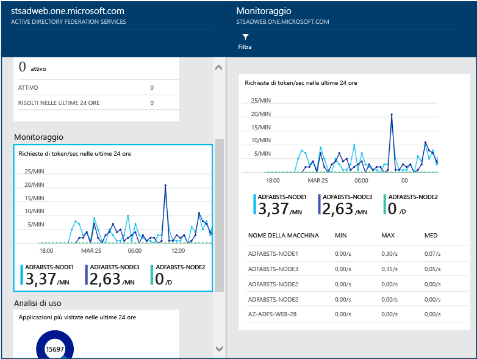

# Monitorare AD FS con Azure AD Connect Health
La documentazione seguente è specifica per il monitoraggio dell'infrastruttura AD FS con Azure AD Connect Health. Per informazioni sul monitoraggio di Azure Active Directory Connect (Sincronizzazione) con Azure AD Connect Health, vedere [Uso di Azure AD Connect Health per la sincronizzazione](active-directory-aadconnect-health-sync.md). Per informazioni sul monitoraggio di Servizi di dominio Active Directory con Azure AD Connect Health, vedere [Uso di Azure AD Connect Health con Servizi di dominio Active Directory](active-directory-aadconnect-health-adds.md).

## Avvisi per AD FS
La sezione degli avvisi di Azure AD Connect Health contiene l'elenco degli avvisi attivi. Ogni avviso include informazioni pertinenti, la procedura di risoluzione e collegamenti alla documentazione correlata.

È possibile fare doppio clic su un avviso attivo o risolto per aprire un nuovo pannello con informazioni aggiuntive, procedure utili per risolvere l'avvisto e collegamenti alla documentazione rilevante. È anche possibile visualizzare dati storici sugli avvisi risolti in passato.

## Analisi di utilizzo per AD FS
Analisi di utilizzo di Azure AD Connect Health analizza il traffico di autenticazione dei server federativi. È possibile fare doppio clic sulla casella dell'analisi di utilizzo per aprire il pannello corrispondente, che mostra diverse metriche e diversi raggruppamenti.

> [!NOTE]
> Per poter usare l'analisi di utilizzo con AD FS, è necessario verificare che il controllo di AD FS sia abilitato. Per altre informazioni, vedere [Abilitare il controllo per AD FS](active-directory-aadconnect-health-agent-install.md#enable-auditing-for-ad-fs).
>
>

Per selezionare altre metriche, specificare un intervallo di tempo o modificare il raggruppamento, è sufficiente fare clic con il pulsante destro del mouse sul pannello dell'analisi di utilizzo e scegliere Modifica grafico. È quindi possibile specificare l'intervallo di tempo, selezionare metriche diverse e cambiare il raggruppamento. È possibile visualizzare la distribuzione del traffico di autenticazione in "metriche" diverse e raggruppare ogni metrica con i parametri di raggruppamento pertinenti descritti nella sezione seguente:

**Metrica: richieste totali**, numero totale di richieste elaborate dal servizio AD FS.

|Raggruppa per | Cosa significa il raggruppamento e perché è utile? |
| --- | --- |
| Tutti | Mostra il conteggio del numero totale di richieste elaborate da tutti i server AD FS.|
| Applicazione | Raggruppa le richieste totali in base alla relying party di destinazione. Questo raggruppamento è utile per conoscere la percentuale del traffico totale ricevuta da ogni applicazione. |
|  Server |Raggruppa le richieste totali in base al server che ha elaborato la richiesta. Questo raggruppamento è utile per conoscere la distribuzione del carico del traffico totale.
| Aggiunta all'area di lavoro |Raggruppa le richieste totali in base al fatto che provengano da dispositivi aggiunti all'area di lavoro (noti). Questo raggruppamento è utile per conoscere se le risorse sono accessibili con dispositivi sconosciuti all'infrastruttura di gestione delle identità. |
|  Metodo di autenticazione | Raggruppa le richieste totali in base al metodo di autenticazione usato per l'autenticazione. Questo raggruppamento è utile per conoscere il metodo di autenticazione comune usato per l'autenticazione. Di seguito sono indicati i metodi di autenticazione possibili  <ol> <li>Autenticazione integrata di Windows (Windows)</li> <li>Autenticazione basata su moduli (Forms)</li> <li>SSO (Single Sign On)</li> <li>Autenticazione certificato X509 (certificato)</li>  Se i server federativi ricevono la richiesta con un cookie SSO, tale richiesta viene considerata SSO (Single Sign-On). In questi casi, se il cookie è valido, all'utente non viene chiesto di fornire le credenziali e ottiene l'accesso trasparente all'applicazione. Questo comportamento è normale se sono presenti più relying party protette dai server federativi. |
| Percorso di rete | Raggruppa le richieste totali in base al percorso di rete dell'utente. Può essere Intranet o Extranet. Questo raggruppamento è utile per conoscere la percentuale del traffico proveniente dalla Intranet e dalla Extranet. |

**Metrica: totale richieste non riuscite**, numero totale di richieste non riuscite elaborate dal servizio federativo. (Questa metrica è disponibile solo in AD FS per Windows Server 2012 R2)

|Raggruppa per | Cosa significa il raggruppamento e perché è utile? |
| --- | --- |
| Tipo di errore | Mostra il numero di errori in base ai tipi di errore predefiniti. Questo raggruppamento è utile per conoscere i tipi di errori comuni. <ul><li>Nome utente o password non corretta: errori causati da un nome utente o una password non corretta.</li> <li>"Blocco Extranet": errori causati dalle richieste ricevute da un utente per il quale è stato bloccato l'accesso alla Extranet. </li><li> "Password scaduta": errori causati da utenti che effettuano l'accesso con una password scaduta.</li><li>"Account disabilitato": errori causati da utenti che effettuano l'accesso con un account disabilitato.</li><li>"Autenticazione dispositivo": errori causati da utenti che non riescono ad autenticarsi con Autenticazione dispositivo.</li><li>"Autenticazione certificato utente": errori causati da utenti che non riescono ad autenticarsi a causa di un certificato non valido.</li><li>"MFA": errori causati da utenti che non riescono ad autenticarsi con Multi-Factor Authentication.</li><li>"Altre credenziali" e "Autorizzazione rilascio": errori causati da errori di autorizzazione.</li><li>"Delega rilascio": errori causati da errori di delega rilascio.</li><li>"Accettazione token": errori causati dal rifiuto da parte di AD FS del token di un provider di identità di terze parti.</li><li>"Protocollo": errore causato da errori del protocollo.</li><li>"Sconosciuto": tutti gli errori. Eventuali altri errori che non rientrano nelle categorie definite.</li> |
| Server | Raggruppa gli errori in base al server. Questo raggruppamento è utile per conoscere la distribuzione degli errori nei server. Una distribuzione non uniforme potrebbe indicare che un server è in uno stato difettoso. |
| Percorso di rete | Raggruppa gli errori in base al percorso di rete delle richieste (Intranet ed Extranet). Questo raggruppamento è utile per conoscere il tipo di richieste che hanno esito negativo. |
|  Applicazione | Raggruppa gli errori in base all'applicazione di destinazione (relying party). Questo raggruppamento è utile per conoscere l'applicazione di destinazione che sta visualizzando il maggior numero di errori. |

**Metrica: numero di utenti**, media del numero di utenti univoci che eseguono attivamente l'autenticazione con ADFS

|Raggruppa per | Cosa significa il raggruppamento e perché è utile? |
| --- | --- |
|Tutti |Questa metrica fornisce un conteggio del numero medio di utenti che usano il servizio federativo nel periodo di tempo selezionato. Gli utenti non sono raggruppati.  La media dipende dal periodo di tempo selezionato. |
| Applicazione |Raggruppa il numero medio di utenti in base all'applicazione di destinazione (relying party). Questo raggruppamento è utile per conoscere quanti utenti stanno usando una determinata applicazione. |

## Monitoraggio delle prestazioni per AD FS
Il monitoraggio delle prestazioni di Azure AD Connect Health offre informazioni di monitoraggio sulle metriche. Se si seleziona la casella Monitoraggio, viene visualizzato un nuovo pannello che include informazioni dettagliate sulle metriche.

Selezionando l'opzione Filtro nella parte superiore del pannello, è possibile filtrare in base al server per visualizzare le metriche di un singolo server. Per modificare le metriche, fare clic con il pulsante destro del mouse sul grafico di monitoraggio nel pannello Monitoraggio e scegliere Modifica grafico (oppure selezionare il pulsante Modifica grafico). Dal nuovo pannello visualizzato è possibile selezionare altre metriche nell'elenco a discesa e specificare un intervallo di tempo per cui visualizzare i dati delle prestazioni.

## Primi 50 utenti con accessi tramite nome utente/password non riusciti
Uno dei motivi più comuni per cui una richiesta di autenticazione può non riuscire in un server AD FS è l'uso di credenziali che non sono valide, vale a dire che il nome utente o la password non è valida. Gli utenti rilevano questo problema in genere a causa di password complesse, password dimenticate o errori di digitazione.

Esistono tuttavia altri motivi che possono provocare un numero inaspettatamente elevato di richieste gestite dai server AD FS, ad esempio un'applicazione che memorizza nella cache le credenziali utente in corrispondenza con la scadenza delle credenziali oppure un utente malintenzionato che prova ad accedere a un account con una serie di password note. Questi due esempi sono motivi validi di un'eventuale picco nelle richieste.

Azure AD Connect Health per AD FS fornisce un report sui primi 50 utenti con tentativi di accesso non riusciti a causa di un nome utente o una password non valida. Questo report si ottiene elaborando gli eventi di controllo generati da tutti i server AD FS nelle farm.

All'interno del report è possibile accedere facilmente alle informazioni seguenti:

* Numero totale di richieste non riuscite con nome utente o password non valida negli ultimi 30 giorni.
* Numero medio di utenti che non sono riusciti ad accedere con un nome utente o una password non valida ogni giorno.

Facendo clic su questa parte si passa al pannello principale del report che fornisce dettagli aggiuntivi. Questo pannello include un grafico con le informazioni relative alla tendenza, utile per stabilire una baseline sulle richieste con nome utente non valido o password errata. Fornisce anche l'elenco dei primi 50 utenti con il numero di tentativi non riusciti nella settimana precedente. Rilevare i primi 50 utenti della settimana precedente consentirà di identificare i picchi di password errate.  

Il grafico fornisce le informazioni seguenti:

* Numero totale di accessi non riusciti a causa di un nome utente o una password non valida ogni giorno.
* Numero totale di utenti univoci con accessi non riusciti ogni giorno.
* Indirizzo IP client dell'ultima richiesta

Il report fornisce le informazioni seguenti:

| Elemento del report | DESCRIZIONE |
| --- | --- |
| ID utente |Mostra l'ID utente che è stato usato. Questo valore corrisponde a quanto digitato dall'utente, che a volte corrisponde all'uso di un ID utente non valido. |
| Tentativi non riusciti |Mostra il numero totale di tentativi non riusciti per l'ID utente specifico. La tabella è riportata in ordine decrescente a partire dal numero maggiore di tentativi non riusciti. |
| Ultimo errore |Mostra il timestamp del momento in cui si è verificato l'ultimo errore. |
| Ultimo errore IP |Mostra l'indirizzo IP client dell'ultima richiesta non valida. |

> [!NOTE]
> Il report viene aggiornato automaticamente ogni 12 ore con le nuove informazioni raccolte. Di conseguenza, i tentativi di accesso nelle ultime 12 ore potrebbero non essere inclusi nel report.
>
>

## Report sugli indirizzi IP rischiosi 
I clienti con AD FS possono esporre endpoint di autenticazione delle password in Internet per offrire servizi di autenticazione per l'accesso degli utenti finali ad applicazioni SaaS come Office 365. In questo caso, un attore malintenzionato potrebbe eseguire tentativi di accesso nel sistema AD FS per indovinare la password di un utente finale e ottenere l'accesso alle risorse dell'applicazione. A partire da AD FS in Windows Server 2012 R2, AD FS offre la funzionalità di blocco account Extranet per impedire questi tipi di attacchi. Se si usa una versione precedente, è consigliabile eseguire l'aggiornamento del sistema AD FS a Windows Server 2016.  
È anche possibile che un singolo indirizzo IP esegua più tentativi di accesso per più utenti. In questi casi, il numero di tentativi per utente potrebbe essere al di sotto della soglia della protezione del blocco account in AD FS. Azure AD Connect Health offre ora un report sugli indirizzi IP rischiosi che rileva questa condizione e invia una notifica agli amministratori quando si verifica. Di seguito sono riportati i vantaggi principali di questo report: 
- Rilevamento degli indirizzi IP che superano una soglia di accessi basati su password non riusciti
- Supporto per accessi non riusciti a causa di password errata o dello stato di blocco Extranet
- Notifica tramite posta elettronica per avvisare gli amministratori non appena questo si verifica, con impostazioni di posta elettronica personalizzabili
- Impostazioni di soglia personalizzabili corrispondenti ai criteri di sicurezza di un'organizzazione
- Report scaricabili per l'analisi offline e l'integrazione con altri sistemi tramite automazione

> [!NOTE]
> Per usare questo report, è necessario verificare che il servizio di controllo AD FS sia abilitato. Per altre informazioni, vedere [Abilitare il controllo per AD FS](active-directory-aadconnect-health-agent-install.md#enable-auditing-for-ad-fs).
>
>

### Contenuto del report
Ogni elemento nel report sugli indirizzi IP rischiosi mostra informazioni aggregate sulle attività di accesso ad AD FS non riuscite che superano la soglia designata. Vengono riportate le informazioni seguenti: 

| Elemento del report | DESCRIZIONE |
| ------- | ----------- |
| Timestamp | Mostra il timestamp corrispondente all'inizio dell'intervallo di tempo di rilevamento, in base all'ora locale del portale di Azure.  Tutti gli eventi giornalieri vengono generati a mezzanotte nel fuso orario UTC.  Il timestamp degli eventi orari viene arrotondato all'inizio dell'ora. L'ora di inizio della prima attività è riportata in "firstAuditTimestamp" nel file esportato. |
| Tipo di trigger | Mostra il tipo di intervallo di tempo di rilevamento. I tipi di trigger di aggregazione sono su base oraria o giornaliera. Questo è utile per il rilevamento rispetto a un attacco di forza bruta con frequenza elevata e rispetto a un attacco lento in cui il numero di tentativi è distribuito durante il giorno. |
| Indirizzo IP | Il singolo indirizzo IP rischioso con attività di accesso con password errata o blocco Extranet. Potrebbe essere un indirizzo IPv4 o IPv6. |
| Numero errori di password errata | Il numero di errori di password errata provenienti dall'indirizzo IP durante l'intervallo di tempo di rilevamento. Gli errori di password errata possono verificarsi più volte per determinati utenti. Si noti che non sono inclusi i tentativi non riusciti a causa di password scadute. |
| Numero errori di blocco Extranet | Il numero di errori di blocco Extranet provenienti dall'indirizzo IP durante l'intervallo di tempo di rilevamento. Gli errori di blocco Extranet possono verificarsi più volte per determinati utenti. Questo verrà rilevato solo se il blocco Extranet è configurato in AD FS (versione 2012R2 o successiva). <b>Nota</b>: se si consentono accessi Extranet con password, è consigliabile attivare questa funzionalità. |
| Tentativi con utenti univoci | Il numero di tentativi riguardanti utenti univoci provenienti dall'indirizzo IP durante l'intervallo di tempo di rilevamento. Questo offre un meccanismo per distinguere uno schema di attacco a utente singolo da uno schema di attacco multiutente.  |

L'elemento del report seguente, ad esempio, indica che nell'intervallo orario dalle 18 alle 19 del 28 febbraio 2018 l'indirizzo IP <i>104.2XX.2XX.9</i> ha generato zero errori di password errata e 284 errori di blocco Extranet. In base ai criteri sono stati coinvolti 14 utenti univoci. L'evento dell'attività ha superato la soglia oraria designata del report. 

> [!NOTE]
> - Nell'elenco del report verranno visualizzate solo le attività che superano la soglia designata. 
> - Questo report può risalire indietro al massimo di 30 giorni.
> - Questo report di avviso non mostra gli indirizzi IP di Exchange o quelli privati, che sono però inclusi nell'elenco esportato. 
>

### Scaricare il report sugli indirizzi IP rischiosi
Usando la funzionalità **Scarica** è possibile esportare l'intero elenco degli indirizzi IP rischiosi degli ultimi 30 giorni dal portale di Connect Health. Il risultato dell'esportazione includerà tutte le attività di accesso ad AD FS non riuscite in ogni intervallo di tempo di rilevamento, consentendo così di personalizzare i filtri dopo l'esportazione. Oltre alle aggregazioni evidenziate nel portale, il risultato dell'esportazione mostra anche altri dettagli sulle attività di accesso non riuscite in base all'indirizzo IP:

|  Elemento del report  |  DESCRIZIONE  | 
| ------- | ----------- | 
| firstAuditTimestamp | Mostra il primo timestamp corrispondente all'inizio delle attività non riuscite durante l'intervallo di tempo di rilevamento.  | 
| lastAuditTimestamp | Mostra l'ultimo timestamp corrispondente alla fine delle attività non riuscite durante l'intervallo di tempo di rilevamento.  | 
| attemptCountThresholdIsExceeded | Flag che indica se le attività correnti stanno superando la soglia di avviso.  | 
| isWhitelistedIpAddress | Flag che indica se l'indirizzo IP è escluso da avvisi e report. Gli indirizzi IP privati (<i>10.x.x.x, 172.x.x.x & 192.168.x.x</i>) e quelli di Exchange vengono filtrati e contrassegnati come True. Se vengono visualizzati intervalli di indirizzi IP privati, è molto probabile che il servizio di bilanciamento del carico esterno non invii l'indirizzo IP del client quando passa la richiesta al server proxy applicazione Web.  | 

### Configurare le impostazioni di notifica
I contatti degli amministratori del report possono essere aggiornati tramite **Impostazioni di notifica**. Per impostazione predefinita, la notifica di avviso tramite posta elettronica relativa agli indirizzi IP rischiosi è disattivata. È possibile abilitare la notifica facendo clic sul pulsante sotto "Ricevi notifiche tramite posta elettronica per gli indirizzi IP che superano la soglia di attività non riuscite nel report". Come per le impostazioni delle notifiche di avviso generiche di Connect Health, da qui è possibile personalizzare l'elenco dei destinatari designati della notifica per il report sugli indirizzi IP rischiosi. Si può anche inviare una notifica a tutti gli amministratori globali mentre si apporta la modifica. 

### Configurare le impostazioni di soglia
La soglia di avviso può essere aggiornata tramite le impostazioni di soglia. Per iniziare, il sistema prevede un'impostazione predefinita della soglia. Le impostazioni di soglia per il report sugli indirizzi IP rischiosi includono quattro categorie:

| Elemento soglia | DESCRIZIONE |
| --- | --- |
| Nome utente/password non validi e blocco Extranet - Giorno  | Impostazione di soglia per segnalare l'attività e attivare la notifica di avviso quando il numero di errori di password errata e il numero di errori di blocco Extranet superano tale valore in un **giorno**. |
| Nome utente/password non validi e blocco Extranet - Ora | Impostazione di soglia per segnalare l'attività e attivare la notifica di avviso quando il numero di errori di password errata e il numero di errori di blocco Extranet superano tale valore in un'**ora**. |
| Blocco Extranet - Giorno | Impostazione di soglia per segnalare l'attività e attivare la notifica di avviso quando il numero di errori di blocco Extranet supera tale valore in un **giorno**. |
| Blocco Extranet - Ora| Impostazione di soglia per segnalare l'attività e attivare la notifica di avviso quando il numero di errori di blocco Extranet supera tale valore in un'**ora**. |

> [!NOTE]
> - La modifica della soglia per il report verrà applicata dopo un'ora dall'impostazione. 
> - La modifica della soglia non influirà sugli elementi segnalati esistenti. 
> - È consigliabile analizzare il numero di eventi rilevati nell'ambiente e modificare la soglia in modo appropriato. 
>
>

### Domande frequenti
1. Perché nel report sono inclusi intervalli di indirizzi IP privati?   
Gli indirizzi IP privati (<i>10.x.x.x, 172.x.x.x & 192.168.x.x</i>) e quelli di Exchange vengono filtrati e contrassegnati come True nell'elenco di IP consentiti. Se vengono visualizzati intervalli di indirizzi IP privati, è molto probabile che il servizio di bilanciamento del carico esterno non invii l'indirizzo IP del client quando passa la richiesta al server proxy applicazione Web.

2. Come si può bloccare l'indirizzo IP?   
È consigliabile aggiungere l'indirizzo IP dannoso identificato al firewall o al blocco in Exchange.    
Per AD FS 2016 + 1803.C + QFE, è possibile bloccare l'indirizzo IP direttamente in AD FS. 

3. Perché non vengono visualizzati elementi nel report?  
   - Le attività di accesso non riuscite non superano le impostazioni di soglia. 
   - Verificare che nell'elenco di server AD FS non sia attivo alcun avviso "Health service is not up to date" (Servizio integrità non aggiornato).  Vedere altre informazioni su [come risolvere i problemi relativi a questo avviso](active-directory-aadconnect-health-data-freshness.md).
   - Il servizio di controllo non è abilitato nelle farm AD FS.

## Collegamenti correlati
* [Azure AD Connect Health](active-directory-aadconnect-health.md)
* [Installazione dell'agente di Azure AD Connect Health](active-directory-aadconnect-health-agent-install.md)
* [Operazioni di Azure AD Connect Health](active-directory-aadconnect-health-operations.md)
* [Uso di Azure AD Connect Health per la sincronizzazione](active-directory-aadconnect-health-sync.md)
* [Uso di Azure AD Connect Health con Servizi di dominio Active Directory](active-directory-aadconnect-health-adds.md)
* [Domande frequenti su Azure AD Connect Health](active-directory-aadconnect-health-faq.md)
* [Cronologia delle versioni di Azure AD Connect Health](active-directory-aadconnect-health-version-history.md)
