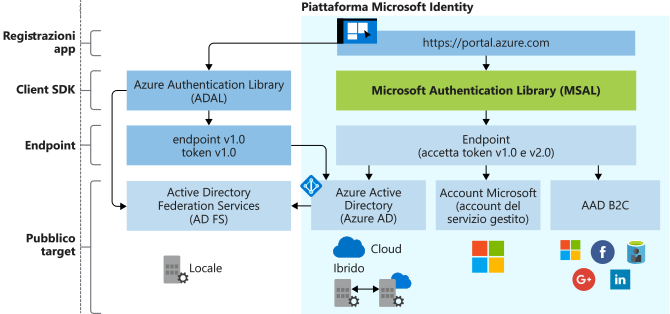

# Evoluzione di Microsoft Identity Platform

Microsoft Identity Platform è un'evoluzione della piattaforma per sviluppatori e del servizio di gestione delle identità di Azure Active Directory (Azure AD). Consente agli sviluppatori di creare applicazioni che supportano l'accesso per gli utenti e il recupero di token per chiamare API come Microsoft Graph o API create dagli sviluppatori. Include un servizio di autenticazione, librerie open source, la configurazione e la registrazione delle applicazioni (attraverso un portale per sviluppatori e l'API dell'applicazione), una documentazione esaustiva, esempi di avvio rapido, esempi di codice, esercitazioni, guide pratiche e altri contenuti per gli sviluppatori. Microsoft Identity Platform supporta protocolli standard di settore come OAuth 2.0 e OpenID Connect.

La maggior parte degli sviluppatori ha finora usato la piattaforma di Azure AD v1.0 per l'autenticazione degli account aziendali e degli istituti di istruzione (di cui Azure AD ha effettuato il provisioning) richiedendo i token all'endpoint di Azure AD v1.0, usando Azure AD Authentication Library (ADAL), il portale di Azure per la registrazione e la configurazione delle applicazioni e l'API Graph di Azure AD per la configurazione delle applicazioni a livello di codice.

Con Microsoft Identity Platform (v2.0) è possibile espandere il raggio d'azione a questi tipi di utenti:

- Account aziendali e degli istituti di istruzione (di cui Azure AD ha effettuato il provisioning)
- Account personali (ad esempio, di Outlook.com o Hotmail.com)
- Clienti che portano il loro indirizzo di posta elettronica o la loro identità di social networking (ad esempio, di LinkedIn, Facebook o Google) tramite l'offerta Azure AD B2C

Con la piattaforma unificata Microsoft Identity Platform è possibile scrivere codice una sola volta e autenticare qualsiasi identità Microsoft nell'applicazione. Per alcune piattaforme è disponibile una libreria open source completamente supportata, denominata Microsoft Authentication Library (MSAL). MSAL è semplice da usare, offre straordinarie esperienze Single Sign-On (SSO) per gli utenti, consente di raggiungere elevati livelli di affidabilità e prestazioni e viene sviluppata usando Microsoft Secure Development Lifecycle (SDL). Quando si chiamano le API, è possibile configurare l'applicazione in modo da sfruttare il consenso incrementale. Questo permette di ritardare la richiesta di consenso per ambiti più estesi fino al momento in cui l'utilizzo dell'applicazione lo consente in fase di runtime.

È possibile usare il portale di Azure per registrare e configurare l'applicazione, nonché usare l'API Microsoft Graph per configurare l'applicazione a livello di codice.

Aggiornare l'applicazione in base alle proprie esigenze. Le applicazioni create con librerie ADAL continuano a essere supportate. Sono supportati anche i portfolio misti, costituiti da applicazioni create con ADAL e da applicazioni create con librerie MSAL. Questo significa che le applicazioni che usano le librerie ADAL e MSAL più recenti forniranno l'accesso SSO all'intero portfolio, fornito dalla cache dei token condivisa tra queste librerie. Le applicazioni aggiornate da ADAL a MSAL manterranno lo stato di accesso dell'utente al momento dell'aggiornamento.

## Esperienza con Microsoft Identity Platform

Il diagramma seguente illustra l'esperienza con Microsoft Identity a un alto livello, inclusi l'esperienza di registrazione delle app, gli SDK, gli endpoint e le identità supportate.

### Esperienza di registrazione delle app

L'esperienza **[Registrazioni app](https://go.microsoft.com/fwlink/?linkid=2083908)** disponibile nel portale di Azure rappresenta l'esperienza su portale per eccellenza per la gestione di tutte le applicazioni integrate con Microsoft Identity Platform. Se finora è stato usato il portale di registrazione delle applicazioni, iniziare a usare l'esperienza di registrazione delle app del portale di Azure.

Per l'integrazione con Azure AD B2C (per l'autenticazione di identità locali o di social networking), sarà necessario registrare l'applicazione in un tenant B2C. Anche questa esperienza è inclusa nel portale di Azure.

L'**API dell'applicazione in Microsoft Graph** attualmente è in anteprima. Usare tale API per configurare a livello di codice le applicazioni integrate con Microsoft Identity Platform per l'autenticazione di qualsiasi identità Microsoft. Tuttavia, finché l'API non sarà disponibile a livello generale, è consigliabile usare l'API Azure AD Graph 1.6 e il manifesto dell'applicazione.

### Librerie MSAL

È possibile usare la libreria MSAL per creare applicazioni in grado di eseguire l'autenticazione di tutte le identità Microsoft. Le librerie MSAL in .NET sono disponibili a livello generale. Le librerie MSAL per JavaScript, iOS e Android sono in anteprima e sono adatte per l'uso in un ambiente di produzione. Per le librerie MSAL in anteprima viene garantito lo stesso supporto a livello di produzione offerto per le versioni di MSAL e ADAL disponibili a livello generale.

È anche possibile usare le librerie MSAL per integrare l'applicazione con Azure AD B2C.

Le librerie sul lato server per la creazione di app Web e API Web sono disponibili a livello generale: [ASP.NET](https://docs.microsoft.com/aspnet/overview) e [ASP.NET Core](https://docs.microsoft.com/aspnet/core/?view=aspnetcore-2.2)

### Endpoint di Microsoft Identity Platform

L'endpoint di Microsoft Identity Platform (v2.0) ora ha la certificazione OIDC. Funziona con le librerie MSAL (Microsoft Authentication Library) o con qualsiasi altra libreria conforme agli standard. Implementa ambiti leggibili in conformità agli standard del settore.

## Passaggi successivi

Altre informazioni su v1.0 e v2.0.

* [Panoramica di Microsoft Identity Platform (v2.0)](v2-overview.md)
* [Panoramica di Azure Active Directory per sviluppatori (v1.0)](v1-overview.md)