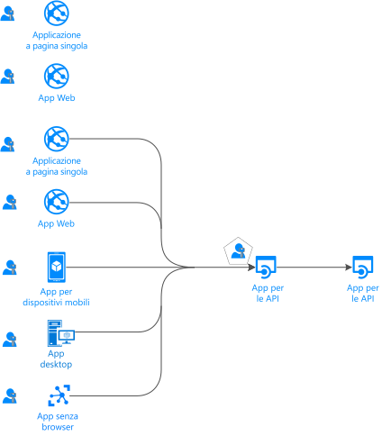
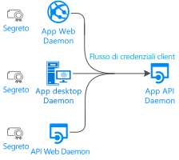
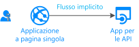
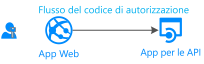
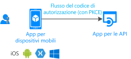
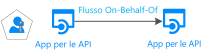

# Flussi di autenticazione e scenari di applicazioni

L'endpoint di Microsoft Identity Platform (v2.0) supporta l'autenticazione per un'ampia gamma di architetture di app moderne, tutte basate sui protocolli standard del settore [OAuth 2.0 o OpenID Connect](active-directory-v2-protocols.md).  Usando le [librerie di autenticazione](reference-v2-libraries.md) le applicazioni autenticano le identità e acquisiscono i token per accedere alle API protette. Questo articolo descrive i diversi flussi di autenticazione e gli scenari di applicazioni in cui sono usati.  Questo articolo include anche elenchi di [scenari di applicazioni e flussi di autenticazione supportati](#scenarios-and-supported-authentication-flows) e [scenari di applicazioni e piattaforme e linguaggi supportati](#scenarios-and-supported-platforms-and-languages).

## Categorie di applicazioni

I token possono essere acquisiti da svariati tipi di applicazione: Applicazioni Web, applicazioni per dispositivi mobili o desktop, API Web e applicazioni in esecuzione su dispositivi che non hanno un browser (o IoT). Le applicazioni possono essere categorizzate in base agli elementi seguenti:

- [Risorse protette o applicazioni client](#protected-resources-vs-client-applications). Alcuni scenari riguardano la protezione delle risorse (app Web o API Web) e altri l'acquisizione di un token di sicurezza per chiamare un'API Web protetta.
- [Con utenti o senza utenti](#with-users-or-without-users). Alcuni scenari coinvolgono un utente che ha eseguito l'accesso, mentre altri non coinvolgono un utente (scenari daemon).
- [Applicazioni a pagina singola, applicazioni client pubbliche e applicazioni client riservate](#single-page-applications-public-client-applications-and-confidential-client-applications). Queste sono tre grandi categorie di tipi di applicazioni. Le librerie e gli oggetti usati per modificarle saranno diversi.
- [Destinatari per l'accesso](v2-supported-account-types.md#certain-authentication-flows-dont-support-all-the-account-types). Alcuni flussi di autenticazione non sono disponibili per determinati destinatari. Alcuni flussi sono disponibili solo per gli account aziendali o dell'istituto di istruzione e alcuni sono disponibili sia per gli account aziendali o dell'istituto di istruzione che per gli account Microsoft personali. I destinatari consentiti dipendono dai flussi di autenticazione.
- [Flussi OAuth 2.0 supportati](#scenarios-and-supported-authentication-flows).  I flussi di autenticazione vengono usati per implementare gli scenari di applicazioni che richiedono token.  Non esiste un mapping uno-a-uno tra scenari di applicazioni e flussi di autenticazione.
- [Piattaforme supportate](#scenarios-and-supported-platforms-and-languages). Non tutti gli scenari di applicazioni sono disponibili per ogni piattaforma.

### Risorse protette o applicazioni client

Gli scenari di autenticazione coinvolgono due attività:

- **Acquisizione dei token di sicurezza** per un'API Web protetta. Microsoft consiglia di usare le [librerie di autenticazione](reference-v2-libraries.md#microsoft-supported-client-libraries) per acquisire i token, in particolare la famiglia di librerie Microsoft Authentication Library (MSAL)
- **Protezione di un'API Web** (o di un'app Web). Uno degli aspetti critici della protezione di una risorsa (app Web o API Web) è la convalida del token di sicurezza. Microsoft offre [librerie middleware](reference-v2-libraries.md#microsoft-supported-server-middleware-libraries) in alcune piattaforme.

### Con utenti o senza utenti

La maggior parte degli scenari di autenticazione acquisisce token per conto di un **utente** (che ha eseguito l'accesso).

Esistono tuttavia anche scenari (app daemon), in cui le applicazioni acquisiranno i token per conto dell'applicazione stessa (senza utente).

### Applicazioni a pagina singola, applicazioni client pubbliche e applicazioni client riservate

I token di sicurezza possono essere acquisiti da diversi tipi di applicazione. Le applicazioni tendono a essere separate in tre categorie:

- Le **applicazioni a pagina singola** sono un tipo di applicazione Web in cui i token vengono acquisiti dall'app in esecuzione nel browser (scritta in JavaScript o Typescript). Molte app moderne hanno un front-end dell'app a singola pagina scritto principalmente in JavaScript. L'app viene scritta spesso usando un framework come Angular, React o Vue. MSAL.js è l'unica libreria di autenticazione Microsoft che supporta le applicazioni a pagina singola.

- Le **applicazioni client pubbliche** gestiscono sempre l'accesso degli utenti. Queste app sono:
  - Applicazioni desktop che chiamano API Web per conto dell'utente che ha eseguito l'accesso.
  - Applicazioni per dispositivi mobili.
  - Una terza categoria di applicazioni, in esecuzione su dispositivi che non hanno un browser (app senza browser, in esecuzione su dispositivi IoT ad esempio).

  Sono rappresentate dalla classe MSAL denominata [PublicClientApplication.](msal-client-applications.md)

- **Applicazioni client riservate**
  - Applicazioni Web che chiamano un'API Web
  - API Web che chiamano un'API Web
  - Applicazioni daemon (anche se implementate come un servizio console come un daemon in Linux o un servizio Windows)
 
  Questi tipi di app usano la classe [ConfidentialClientApplication](msal-client-applications.md)

## Scenari applicativi

L'endpoint di Microsoft Identity Platform supporta l'autenticazione per un'ampia gamma di architetture di app: app a pagina singola, app Web, API Web, app per dispositivi mobili e native, nonché app daemon e app sul lato server.  Le applicazioni usano i vari flussi di autenticazione per concedere l'accesso agli utenti e ottenere i token per chiamare le API protette.

### Applicazione a pagina singola

Molte applicazioni Web moderne vengono create come applicazioni a pagina singola sul lato client scritte usando JavaScript o un apposito framework come Angular, Vue.js e React.js. Queste applicazioni vengono eseguite in un Web browser e presentano caratteristiche di autenticazione diverse rispetto alle applicazioni Web tradizionali sul lato server. Microsoft Identity Platform consente alle applicazioni a pagina singola di gestire l'accesso agli utenti e ottenere i token per l'accesso a servizi back-end o API Web.

Per altre informazioni, vedere [Applicazioni a pagina singola](scenario-spa-overview.md).

### Applicazione Web che concede l'accesso a un utente

Per **proteggere un'app Web** (con accesso dell'utente), si userà:

- Nel mondo .NET, ASP.NET o ASP.NET Core con il middleware ASP.NET Open ID Connect. Dietro le quinte, la protezione di una risorsa comporta la convalida del token di sicurezza, operazione eseguita dalla libreria delle [estensioni IdentityModel per .NET](https://github.com/AzureAD/azure-activedirectory-identitymodel-extensions-for-dotnet/wiki) e non dalle librerie MSAL.

- Se si sviluppa in Node.js, si userà Passport.js.

Per altre informazioni, vedere [App Web per l'accesso degli utenti](scenario-web-app-sign-user-overview.md).

### Applicazione Web che concede l'accesso a un utente e chiama un'API Web per conto dell'utente

Nell'app Web, per **chiamare l'API Web** per conto dell'utente, usare `ConfidentialClientApplication` MSAL. Si userà il flusso di codice di autorizzazione, archiviando il token acquisito nella cache dei token. Il controller acquisirà quindi i token automaticamente dalla cache all'occorrenza. Se necessario, MSAL aggiorna il token.

Per altre informazioni, vedere [App Web che chiama le API Web](scenario-web-app-call-api-overview.md).

### Applicazione desktop che chiama un'API Web per conto dell'utente che ha eseguito l'accesso

Per chiamare un'API Web da un'applicazione desktop che gestisce l'accesso degli utenti, usare i metodi di acquisizione dei token interattivi della classe PublicClientApplication di MSAL. Questi metodi interattivi consentono di controllare l'esperienza dell'interfaccia utente di accesso. Per abilitare questa interazione, MSAL sfrutta un Web browser.

Per le applicazioni ospitate in Windows in esecuzione in computer aggiunti a un dominio Windows o ad AAD, esiste un'altra possibilità. Queste applicazioni possono acquisire un token in modo invisibile all'utente tramite l'[autenticazione integrata di Windows](https://aka.ms/msal-net-iwa).

Le applicazioni in esecuzione in un dispositivo senza browser saranno comunque in grado di chiamare un'API per conto di un utente. Per eseguire l'autenticazione, l'utente dovrà eseguire l'accesso in un altro dispositivo che dispone di un Web browser. Per abilitare questo scenario, sarà necessario usare il [flusso di codice del dispositivo](https://aka.ms/msal-net-device-code-flow).

Infine, anche se non è consigliabile, è possibile usare [nome utente e password](https://aka.ms/msal-net-up) nelle applicazioni client pubbliche. Questo flusso è ancora necessario in alcuni scenari (ad esempio, DevOps), ma tenere presente che l'uso di questa funzione imporrà vincoli sull'applicazione. Ad esempio, le app che usano questo flusso non saranno in grado di concedere l'accesso a un utente che deve eseguire l'autenticazione a più fattori (accesso condizionale). L'applicazione non potrà neanche trarre vantaggio da Single Sign-On. L'autenticazione con nome utente e password è anche contraria ai principi dell'autenticazione moderna e viene fornita solo per motivi di compatibilità con le versioni precedenti.

Nelle applicazioni desktop, se si vuole che la cache dei token sia persistente, è necessario [personalizzare la serializzazione della cache dei token](https://aka.ms/msal-net-token-cache-serialization). È anche possibile abilitare le cache di token compatibili con le versioni precedenti e successive con le generazioni precedenti di librerie di autenticazione (ADAL.NET 3.x e 4.x), implementando la [serializzazione doppia della cache dei token](https://aka.ms/msal-net-dual-cache-serialization).

Per altre informazioni, vedere [App desktop che chiama le API Web](scenario-desktop-overview.md).

### Applicazione per dispositivi mobili che chiama un'API Web per conto dell'utente che ha eseguito l'accesso in modo interattivo

Come per le applicazioni desktop, per acquisire un token per chiamare un'API Web, un'applicazione per dispositivi mobili userà i metodi di acquisizione dei token interattivi della classe PublicClientApplication di MSAL.

In iOS e Android, MSAL usa il Web browser di sistema per impostazione predefinita, ma è anche possibile specificare l'uso della visualizzazione Web incorporata. Esistono alcune considerazioni specifiche a seconda della piattaforma per dispositivi mobili: (UWP, iOS, Android).

Per alcuni scenari che comportano l'accesso condizionale correlato all'ID del dispositivo o la registrazione del dispositivo, è richiesta l'installazione di un [broker](https://github.com/AzureAD/azure-activedirectory-library-for-dotnet/wiki/leveraging-brokers-on-Android-and-iOS) in un dispositivo. Sono esempi di broker il portale aziendale Microsoft (in Android), Microsoft Authenticator (Android e iOS). MSAL è ora in grado di interagire con i broker.

> [!NOTE]
> È possibile che all'app per dispositivi mobili (con MSAL.iOS, MSAL.Android o MSAL.NET/Xamarin) siano applicati criteri di protezione delle app, ad esempio per impedire all'utente di copiare testo protetto. Questa app [viene gestita da Intune](https://docs.microsoft.com/intune/app-sdk) ed è riconosciuta da Intune come app gestita. [Intune SDK](https://docs.microsoft.com/intune/app-sdk-get-started) è separato dalle librerie MSAL e comunica con AAD autonomamente.

Per altre informazioni, vedere [App per dispositivi mobili che chiama le API Web](scenario-mobile-overview.md).

### API Web protetta

È possibile usare l'endpoint di Microsoft Identity Platform per proteggere i servizi Web, ad esempio l'API Web RESTful dell'app. Un'API Web protetta viene chiamata con un token di accesso per proteggere i dati e per autenticare le richieste in ingresso. Il chiamante di un'API Web aggiunge un token di accesso nell'intestazione dell'autorizzazione di una richiesta HTTP. Se si vuole proteggere l'API Web ASP.NET o ASP.NET Core, sarà necessario convalidare il token di accesso. A questo scopo verrà usato il middleware JWT ASP.NET. Dietro le quinte, la convalida viene eseguita dalla libreria delle [estensioni IdentityModel per .NET](https://github.com/AzureAD/azure-activedirectory-identitymodel-extensions-for-dotnet/wiki) e non da MSAL.NET

Per altre informazioni, vedere [API Web protetta](scenario-protected-web-api-overview.md).

### API Web che chiama un'altra API Web downstream per conto dell'utente per cui è stata chiamata

Se si vuole anche che l'API Web protetta ASP.NET o ASP.NET Core chiami un'altra API Web per conto dell'utente, l'app dovrà acquisire un token per l'API Web downstream usando il metodo della classe ConfidentialClientApplication che acquisisce un token [per conto di un utente](https://aka.ms/msal-net-on-behalf-of). Questa operazione è nota anche come chiamate da servizio a servizio.
Le API Web che chiamano altre API Web dovranno anche fornire una serializzazione della cache personalizzata.

  

Per altre informazioni, vedere [API Web che chiama le API Web](scenario-web-api-call-api-overview.md).

### Applicazione desktop/di servizio o daemon Web che chiama l'API Web senza un utente (con il proprio nome)

Anche le app che contengono processi a esecuzione prolungata o che non prevedono l'interazione con l'utente necessitano di un modo per accedere alle API Web protette. Queste app possono autenticarsi e ottenere i token usando l'identità dell'app, anziché un'identità delegata dell'utente. Possono dimostrare l'identità usando un certificato o un segreto client.
È possibile scrivere tali app (app daemon) acquisendo un token per l'app usando i metodi di acquisizione delle [credenziali client](https://aka.ms/msal-net-client-credentials) della classe ConfidentialClientApplication di MSAL. Si supponga che l'app abbia precedentemente registrato un segreto (password dell'applicazione, certificato o asserzione client) in Azure AD, che viene poi condiviso con questa chiamata.

Per altre informazioni, vedere [Applicazione daemon che chiama le API Web](scenario-daemon-overview.md).

## Scenari e flussi di autenticazione supportati

Gli scenari che prevedono l'acquisizione di token corrispondono anche ai flussi di autenticazione OAuth 2.0 descritti in dettaglio in [Protocolli di Microsoft Identity Platform](active-directory-v2-protocols.md).

<table>
 <thead>
  <tr><th>Scenario</th> <th>Procedura dettagliata per lo scenario</th> <th>Flusso/concessione OAuth 2.0</th> <th>Audience</th></tr>
 </thead>
 <tbody>
  <tr>
   <td></td>
   <td><a href="scenario-spa-overview.md">App a singola pagina</a></td>
   <td><a href="v2-oauth2-implicit-grant-flow.md">Implicito</a></td>
   <td>Account aziendali o dell'istituto di istruzione e account personali, B2C</td>
 </tr>

  <tr>
   <td></td>
   <td><a href="scenario-web-app-sign-user-overview.md">App Web che concede l'accesso agli utenti</a></td>
   <td><a href="v2-oauth2-auth-code-flow.md">Codice di autorizzazione</a></td>
   <td>Account aziendali o dell'istituto di istruzione e account personali, B2C</td>
 </tr>

  <tr>
   <td></td>
   <td><a href="scenario-web-app-call-api-overview.md">App Web che chiama le API Web</a></td>
   <td><a href="v2-oauth2-auth-code-flow.md">Codice di autorizzazione</a></td>
   <td>Account aziendali o dell'istituto di istruzione e account personali, B2C</td>
 </tr>

  <tr>
   <td rowspan="3"></td>
   <td rowspan="4"><a href="scenario-desktop-overview.md">App desktop che chiama le API Web</a></td>
   <td>Interattivo (<a href="v2-oauth2-auth-code-flow.md">codice di autorizzazione</a> con PKCE)</td>
   <td>Account aziendali o dell'istituto di istruzione e account personali, B2C</td>
 </tr>

  <tr>
   <td>Autenticazione integrata di Windows</td>
   <td>Account aziendali o dell'istituto di istruzione</td>
 </tr>

  <tr>
   <td><a href="v2-oauth-ropc.md">Password del proprietario della risorsa</a></td>
   <td>Account aziendali o dell'istituto di istruzione, B2C</td>
 </tr>

  <tr>
   <td></td>
   <td><a href="v2-oauth2-device-code.md">Codice del dispositivo</a></td>
   <td>Account aziendali o dell'istituto di istruzione*</td>
 </tr>

 <tr>
   <td rowspan="2"></td>
   <td rowspan="2"><a href="scenario-mobile-overview.md">App per dispositivi mobili che chiama le API Web</a></td>
   <td>Interattivo (<a href="v2-oauth2-auth-code-flow.md">codice di autorizzazione</a> con PKCE)</td>
   <td>Account aziendali o dell'istituto di istruzione e account personali, B2C</td>
 </tr>

  <tr>
   <td><a href="v2-oauth-ropc.md">Password del proprietario della risorsa</a></td>
   <td>Account aziendali o dell'istituto di istruzione, B2C</td>
 </tr>

  <tr>
   <td></td>
   <td><a href=scenario-daemon-overview.md">App daemon che chiama le API Web</a></td>
   <td><a href="v2-oauth2-client-creds-grant-flow.md">Credenziali del client</a></td>
   <td>Autorizzazioni solo app (nessun utente) solo nelle organizzazioni AAD</td>
 </tr>

  <tr>
   <td></td>
   <td><a href=scenario-web-api-call-api-overview.md">App Web che chiama le API Web</a></td>
   <td><a href="v2-oauth2-on-behalf-of-flow.md">Per conto di</a></td>
   <td>Account aziendali o dell'istituto di istruzione e account personali</td>
 </tr>

 </tbody>
</table>

## Scenari e piattaforme e linguaggi supportati

Non tutti i tipi di applicazioni sono disponibili in ogni piattaforma. Per creare le applicazioni è anche possibile usare vari linguaggi. Le librerie MSAL (Microsoft Authentication Library) supportano numerose **piattaforme** (JavaScript, .NET Framework, .NET Core, Windows 10/UWP, Xamarin.iOS, Xamarin.Android, iOS nativa, Mac OS, Android nativa, Java, Python). Nella tabella seguente ogni volta che viene menzionato .NET Core in Windows è possibile usare anche .NET Framework (omesso per evitare confusione nella tabella)

|Scenario  | Windows | Linux | Mac | iOS | Android
|--|--|--|--|--|--|--|
| [App a singola pagina](scenario-spa-overview.md)   |  MSAL.js |  MSAL.js |  MSAL.js |  MSAL.js |  MSAL.js
| [App Web che concede l'accesso agli utenti](scenario-web-app-sign-user-overview.md)   |  ASP.NET Core |  ASP.NET Core |  ASP.NET Core
| [App Web che chiama le API Web](scenario-web-app-call-api-overview.md)     |  ASP.NET Core + MSAL.NET   msal4j  Flask + MSAL Python|  ASP.NET Core + MSAL.NET  msal4j  Flask + MSAL Python|  ASP.NET Core + MSAL.NET  msal4j   Flask + MSAL Python
| [App desktop che chiama le API Web](scenario-desktop-overview.md)      | MSAL.NET  msal4j   MSAL Python| MSAL.NET msal4j  MSAL Python| MSAL.NET  msal4j  MSAL Python   MSAL.objc |
| [App per dispositivi mobili che chiama le API Web](scenario-mobile-overview.md)    |  MSAL.NET  MSAL.NET | | |  MSAL.objc |  MSAL.Android
| [App daemon](scenario-daemon-overview.md)    | MSAL.NET  msal4j  MSAL Python|  MSAL.NET  msal4j  MSAL Python| MSAL.NET  msal4j  MSAL Python
| [App Web che chiama le API Web](scenario-web-api-call-api-overview.md)     |  ASP.NET Core + MSAL.NET  msal4j  MSAL Python|  ASP.NET Core + MSAL.NET  msal4j  MSAL Python|  ASP.NET Core + MSAL.NET  msal4j  MSAL Python

Vedere anche [Librerie supportate da Microsoft per sistema operativo/lingua](reference-v2-libraries.md#microsoft-supported-libraries-by-os--language)

## Passaggi successivi
Vedere altre informazioni sui [concetti di base dell'autenticazione](authentication-scenarios.md) e i [token di accesso](access-tokens.md).
