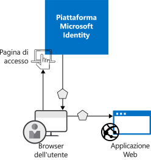
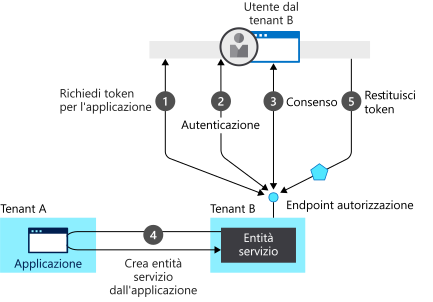

# Informazioni sull'autenticazione

Per *autenticazione* si intende la richiesta di credenziali legittime a una parte, che costituiscono la base per la creazione di un'entità di sicurezza da usare per il controllo delle identità e di accesso. In termini semplici, si tratta del processo di dimostrare la propria identità. In lingua inglese, il termine autenticazione viene talvolta abbreviato in AuthN.

Per *autorizzazione* si intende la concessione a un'entità di sicurezza autenticata dell'autorizzazione a eseguire determinate operazioni. L'autorizzazione specifica a quali dati l'utente può accedere e le operazioni che può eseguirvi. In lingua inglese, il termine autorizzazione viene talvolta abbreviato in AuthZ.

Microsoft Identity Platform semplifica l'autenticazione per gli sviluppatori di applicazioni offrendo le identità come servizio con il supporto per protocolli standard del settore, come OAuth 2.0 e OpenID Connect, nonché librerie open source per diverse piattaforme che consentono di iniziare rapidamente a creare codice.

Nel modello di programmazione di Microsoft Identity Platform esistono due casi d'uso principali:

* Durante un flusso di concessione di autorizzazione OAuth 2.0: quando il proprietario delle risorse concede l'autorizzazione all'applicazione client che può così accedere alle risorse del proprietario.
* Durante l'accesso alle risorse da parte del client: l'implementazione viene eseguita dal server di risorse, usando i valori di attestazione presenti nel token di accesso come base per le decisioni relative al controllo di accesso.

## Concetti di autenticazione in Microsoft Identity Platform

Si consideri lo scenario più semplice in cui è necessaria l'identità, ovvero quello in cui un utente deve eseguire l'autenticazione a un'applicazione Web in un Web browser. Il diagramma seguente illustra questo scenario:

Di seguito vengono indicate le informazioni sui diversi componenti presenti nel diagramma:

* Microsoft Identity Platform è il provider di identità. Il provider di identità si occupa della verifica dell'identità degli utenti e delle applicazioni presenti in una directory aziendale e rilascia i token di sicurezza se l'autenticazione di tali utenti e applicazioni ha esito positivo.
* Un'applicazione che intende affidare l'autenticazione a Microsoft Identity Platform deve essere registrata in Azure Active Directory (Azure AD). che registra e identifica in modo univoco l'app nella directory.
* Gli sviluppatori possono usare le librerie di autenticazione open source di Microsoft Identity Platform per semplificare l'autenticazione gestendo direttamente i dettagli del protocollo. Per altre informazioni, vedere [Librerie di autenticazione 2.0](reference-v2-libraries.md) e [Librerie di autenticazione 1.0](active-directory-authentication-libraries.md) di Microsoft Identity Platform.
* Dopo l'autenticazione di un utente, l'applicazione deve convalidare il token di sicurezza dell'utente per verificare che l'autenticazione abbia avuto esito positivo. È possibile trovare guide introduttive, esercitazioni ed esempi di codice in un'ampia gamma di linguaggi e framework che illustrano le operazioni che l'applicazione deve eseguire.
  * Per compilare in modo rapido un'app e aggiungere funzionalità, ad esempio il recupero e l'aggiornamento dei token, l'accesso di un utente, la visualizzazione di alcune informazioni utente e altro ancora, vedere la sezione **Guide introduttive** della documentazione.
  * Per ottenere procedure dettagliate basate su scenari specifici per attività di sviluppo relative all'autenticazione primarie, ad esempio il recupero di token di accesso e il relativo uso in chiamate all'API Microsoft Graph e ad altre API, l'implementazione dell'accesso con Microsoft tramite un'app basata su Web browser tradizionale tramite OpenID Connect e altro ancora, vedere la sezione **Esercitazioni** della documentazione.
  * Per scaricare esempi di codice, vedere [GitHub](https://github.com/Azure-Samples?q=active-directory).
* Il flusso di richieste e risposte per il processo di autenticazione dipende dal protocollo di autenticazione usato, ad esempio OAuth 2.0, OpenID Connect, WS-Federation o SAML 2.0. Per altre informazioni sui protocolli, vedere la sezione **Concetti > Protocolli** della documentazione.

Nello scenario di esempio precedente è possibile classificare le app in base ai due ruoli seguenti:

* App che devono accedere in modo sicuro alle risorse
* App che rivestono il ruolo della risorsa stessa

Ora che è disponibile una panoramica dei concetti di base, continuare a leggere per comprendere il modello dell'app e l'API di identità, le modalità di funzionamento del provisioning in Microsoft Identity Platform e i collegamenti a informazioni dettagliate sugli scenari comuni supportati da Microsoft Identity Platform.

## Modello di applicazione

Microsoft Identity Platform rappresenta le applicazioni basate su un modello specifico progettato per soddisfare due funzioni principali indicate di seguito:

* **Identificare l'app in base ai protocolli di autenticazione supportati**. Questa operazione richiede l'enumerazione di tutti gli identificatori, URL, segreti e informazioni correlate necessarie al momento dell'autenticazione. A questo punto, Microsoft Identity Platform:

    * Contiene tutti i dati necessari per supportare l'autenticazione in fase di esecuzione.
    * Contiene tutti i dati per decidere quali risorse potrebbero essere necessarie a un'app per eseguire l'accesso e per stabilire se una determinata richiesta deve essere soddisfatta e in quali circostanze.
    * Offre l'infrastruttura per l'implementazione del provisioning dell'app nel tenant per gli sviluppatori di app e in un altro tenant di Azure AD.

* **Gestire il consenso dell'utente durante la fase di richiesta di token e semplificare il provisioning dinamico delle app tra tenant**. In questo caso, Microsoft Identity Platform:

    * Consente a utenti e amministratori di concedere o negare dinamicamente il consenso all'app di accedere alle risorse per loro conto.
    * Consente agli amministratori di decidere quali app sono autorizzati a eseguire e quali utenti possono usare app specifiche, nonché la modalità di accesso alle risorse di directory.

In Microsoft Identity Platform un'**oggetto applicazione** descrive un'applicazione come un'entità astratta. Gli sviluppatori lavorano con le applicazioni. In fase di distribuzione Microsoft Identity Platform usa un oggetto applicazione specificato come un progetto per creare un'**entità servizio**, che rappresenta un'istanza concreta di un'applicazione in un tenant oppure in una directory. L'entità servizio definisce ciò che l'app può effettivamente eseguire in una directory di destinazione specifica, chi può usarla, a quali risorse può accedere e così via. Microsoft Identity Platform crea un'entità servizio da un oggetto applicazione tramite il **consenso**.

Il diagramma seguente illustra un flusso di provisioning di Microsoft Identity Platform semplificato basato su consenso.  Sono presenti due tenant (A e B), in cui il tenant A è proprietario dell'applicazione e il tenant B crea un'istanza dell'applicazione tramite un'entità servizio.  

In questo flusso di provisioning:

1. Un utente del tenant B prova ad accedere con l'app, l'endpoint di autorizzazione richiede un token per l'applicazione.
1. Le credenziali dell'utente vengono acquisite e verificate per l'autenticazione
1. All'utente viene richiesto di specificare il consenso per l'app per ottenere l'accesso al tenant B
1. Microsoft Identity Platform usa l'oggetto applicazione del tenant A come un progetto per creare un'entità servizio nel tenant B
1. L'utente riceve il token richiesto

È possibile ripetere questo processo ogni volta che si desidera per altri tenant (C, D e così via). Il tenant A mantiene il progetto per l'app (oggetto applicazione). Gli utenti e amministratori di tutti gli altri tenant in cui all'app viene dato il consenso mantengono il controllo su ciò che l'applicazione può eseguire tramite l'oggetto entità servizio corrispondente in ogni tenant. Per altre informazioni, vedere [Oggetti applicazione e oggetti entità servizio in Microsoft Identity Platform](app-objects-and-service-principals.md).

## Attestazioni nei token di sicurezza di Microsoft Identity Platform

I token di sicurezza (token di accesso e ID) emessi da Microsoft Identity Platform contengono attestazioni o asserzioni di informazioni sull'oggetto autenticato. Le applicazioni possono usare le attestazioni per varie attività, tra cui:

* Convalidare il token
* Identificare il tenant di directory dell'oggetto
* Visualizzare le informazioni utente
* Determinare l'autorizzazione dell'oggetto

Le attestazioni presenti in un determinato token di sicurezza dipendono dal tipo di token, dal tipo di credenziali usate per autenticare l'utente e dalla configurazione dell'applicazione.

La tabella seguente fornisce una breve descrizione dei tipi di attestazione generati da Microsoft Identity Platform. Per informazioni più dettagliate, vedere i [token di accesso](access-tokens.md) e i [token ID](id-tokens.md) emessi da Microsoft Identity Platform.

| Attestazione | DESCRIZIONE |
| --- | --- |
| ID applicazione | Identifica l'applicazione che usa il token. |
| Audience | Identifica la risorsa di destinazione del token. |
| Riferimento alla classe contesto di autenticazione applicazione | Indica la modalità di autenticazione del client (client pubblico e client riservato). |
| Istante di autenticazione | Registra la data e l'ora in cui è avvenuta l'autenticazione. |
| Metodo di autenticazione | Indica la modalità di autenticazione dell'oggetto del token (password, certificato e così via). |
| Nome | Fornisce il nome dell'utente come è impostato in Azure AD. |
| Gruppi | Contiene gli ID oggetto dei gruppi di Azure AD di cui l'utente è membro. |
| Provider di identità | Registra il provider di identità che ha autenticato l'oggetto del token. |
| Issued At | Registra l'ora in cui il token è stato emesso. Spesso usata per l'aggiornamento del token. |
| Issuer | Identifica il servizio token di sicurezza che ha emesso il token, nonché il tenant di Azure AD. |
| Cognome | Fornisce il cognome dell'utente come è impostato in Azure AD. |
| NOME | Fornisce un valore leggibile che identifica l'oggetto del token. |
| ID oggetto | Contiene un identificatore univoco e non modificabile dell'oggetto in Azure AD. |
| Ruoli | Contiene i nomi descrittivi dei ruoli applicazione di Azure AD concessi all'utente. |
| Scope | Indica le autorizzazioni concesse all'applicazione client. |
| Oggetto | Indica l'entità su cui il token rilascia informazioni. |
| ID tenant | Contiene un identificatore univoco e non modificabile del tenant di directory che ha emesso il token. |
| Durata del token | Definisce l'intervallo di tempo entro il quale un token è valido. |
| Nome dell'entità utente | Contiene il nome dell'entità utente dell'oggetto. |
| Versione | Contiene il numero di versione del token. |

## Passaggi successivi

* Informazioni sui [tipi di applicazioni supportati in Microsoft Identity Platform](app-types.md)
