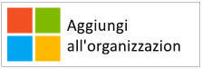
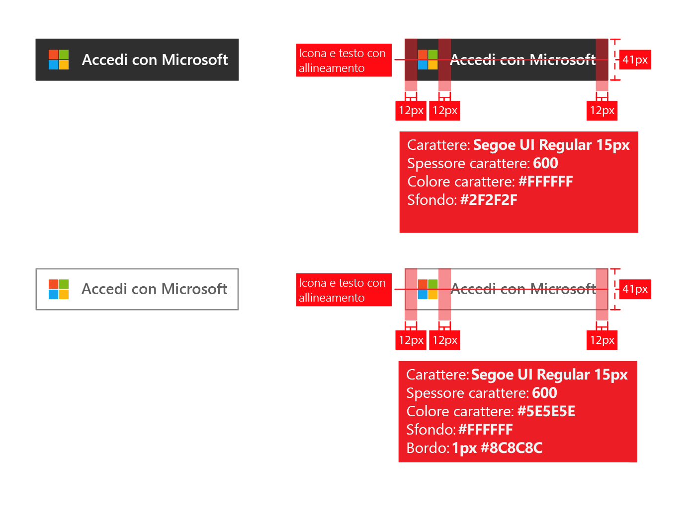
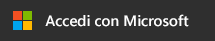
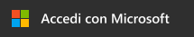
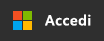

# Linee guida sulla personalizzazione per le applicazioni

Quando si sviluppano applicazioni con la piattaforma di identità Microsoft, è necessario indirizzare i clienti quando vogliono usare l'account aziendale o dell'Istituto di istruzione (gestito in Azure AD) o il proprio account personale per l'iscrizione e l'accesso all'applicazione.

Contenuto dell'articolo:

- Informazioni sui due tipi di account utente gestiti da Microsoft e come fare riferimento agli account di Azure AD nell'applicazione
- Informazioni sulle operazioni necessarie per aggiungere il logo Microsoft per l'uso nell'app
- Scaricare le immagini **Accedi** oppure **Accedi con Microsoft** da usare nell'app
- Informazioni sulle operazioni di personalizzazione e navigazione consigliate e sconsigliate

## Confronto tra account Microsoft personali e aziendali o dell'istituto di istruzione

Microsoft gestisce due tipi di account utente:

- **Account personali** (noti in precedenza come Windows Live ID). Rappresentano la relazione tra utenti *individuali* e Microsoft e vengono usati per accedere a dispositivi di consumo e servizi forniti da Microsoft. Questi account sono concepiti per un uso personale.
- **Account aziendali o dell'Istituto di istruzione.**  Questi account sono gestiti da Microsoft per conto delle organizzazioni che usano Azure Active Directory. Questi account vengono usati per accedere a Microsoft 365 e ad altri servizi aziendali da Microsoft.

Gli account Microsoft aziendali o dell'istituto di istruzione vengono normalmente assegnati agli utenti finali (dipendenti, studenti, impiegati pubblici) dalle relative organizzazioni (azienda, istituto di istruzione, agenzia governativa). Questi account sono gestiti direttamente nel cloud (nella piattaforma Azure AD) o sincronizzati con Azure AD da una directory locale, ad esempio Windows Server Active Directory. Microsoft è *responsabile* degli account aziendali o dell'istituto di istruzione, che sono tuttavia di proprietà e controllati dall'organizzazione.

## Riferimento agli account Azure AD nella propria applicazione

Microsoft non mostra agli utenti finali il nome del marchio Azure o Active Directory, né dovrebbero farlo gli sviluppatori.

- Dopo che gli utenti hanno eseguito l'accesso, è consigliabile visualizzare il nome e il logo dell'organizzazione il più estesamente possibile. Questa soluzione è preferibile rispetto all'uso di termini generici come "organizzazione".
- Quando gli utenti non hanno eseguito l'accesso, è consigliabile fare riferimento ai loro account come "Account aziendali o dell'istituto di istruzione" e usare il logo Microsoft per indicare che sono account gestiti da Microsoft. Non usare termini quali "account dell'azienda", "account dell'impresa" o "account della società", perché potrebbero creare confusione nell'utente.

## Pittogramma dell'account utente

In una versione precedente di queste linee guida si è consigliato di usare un pittogramma di "badge blu". In base ai commenti e suggerimenti degli utenti e degli sviluppatori, ora si consiglia invece di usare il logo Microsoft. Il logo Microsoft consentirà agli utenti di comprendere che possono riutilizzare l'account usato con Microsoft 365 o altri servizi aziendali Microsoft per accedere all'app.

## Iscrizione e accesso con Azure AD

Le app degli sviluppatori possono presentare percorsi separati per l'iscrizione e l'accesso. Nelle sezioni seguenti vengono fornite indicazioni visive per entrambi gli scenari.

**Se l'app supporta l'iscrizione da parte dell'utente, ad esempio, per una versione di valutazione gratuita o per il modello freemium**: è possibile visualizzare un pulsante di **accesso** per consentire agli utenti di accedere all'app con l'account aziendale o personale. La prima volta che l'utente accede all'app, Azure AD visualizzerà una richiesta di consenso.

**Se l'app richiede autorizzazioni che solo gli amministratori possono concedere oppure se l'app richiede una licenza dell'organizzazione**: separare l'acquisizione amministrativa dall'accesso utente. Il **pulsante per "ottenere l'app"** reindirizzerà gli amministratori alla pagina di accesso, quindi verrà richiesto di concedere il consenso per conto degli utenti dell'organizzazione, che il vantaggio aggiunto di sopprimere i messaggi di richiesta di consenso dell'utente finale all'app.

## Indicazioni visive per l'acquisizione di app

Il collegamento per "ottenere l'app" deve reindirizzare l'utente alla pagina di Azure AD per concedere (autorizzare) l'accesso, in modo che l'amministratore di un'organizzazione possa autorizzare l'app perché possa accedere ai dati dell'organizzazione ospitati da Microsoft. Verranno fornite informazioni dettagliate su come richiedere l'accesso nell’articolo [Integrazione di applicazioni con Azure Active Directory](./quickstart-register-app.md) .

Dopo aver acconsentito all'app, gli amministratori possono scegliere di aggiungerla all'esperienza di avvio dell'app Microsoft 365 degli utenti, accessibile da waffle e da [https://portal.office.com/myapps](https://portal.office.com/myapps) . Se si vuole annunciare questa funzionalità, è possibile usare termini come "Aggiungere questa app alla propria organizzazione" e visualizzare un pulsante simile al seguente:

È tuttavia consigliabile scrivere un testo descrittivo, invece di fare affidamento sui pulsanti. Ad esempio:

> *Se si usa già Microsoft 365 o un altro servizio aziendale di Microsoft, è possibile concedere <your_app_name> l'accesso ai dati dell'organizzazione. Ciò consentirà agli utenti di accedere <your_app_name> con gli account di lavoro esistenti.*

Per scaricare il logo ufficiale di Microsoft per l'uso nell'app, fare clic con il pulsante destro del mouse su quello che si vuole usare e salvarlo sul computer.

| Asset                                | Formato PNG | Formato SVG |
| ------------------------------------ | ---------- | ---------- |
| Logo Microsoft  |  |  |

## Indicazioni visive per l'accesso

Nell'app dovrà essere visualizzato un pulsante di accesso che reindirizza gli utenti all'endpoint di accesso corrispondente al protocollo usato per l'integrazione con Azure AD. La sezione seguente illustra in dettaglio come dovrebbe apparire questo pulsante.

### Pittogramma e "Accedi con Microsoft"

È l'associazione del logo Microsoft e dei termini "Accedi con Microsoft" che distingue in modo univoco Azure AD dagli altri provider di identità eventualmente supportati dall'app. Se non è disponibile spazio sufficiente per "Accedi con Microsoft" è possibile usare la dicitura abbreviata "Accedi". È anche possibile usare una combinazione di colori chiara per i pulsanti.

Il diagramma seguente mostra le annotazioni consigliate da Microsoft quando si usano gli asset con l'app. Le annotazioni si applicano ad "Accedi con Microsoft" o alla versione più breve "Accedi".

Per scaricare le immagini ufficiali per l'uso nell'app, fare clic con il pulsante destro del mouse su quelle che si vuole usare e salvarle sul computer.

| Asset                                | Formato PNG | Formato SVG |
| ------------------------------------ | ---------- | ---------- |
| Accedi con Microsoft (tema scuro)  |  |  |
| Accedi con Microsoft (tema chiaro) |  |  |
| Accedi (tema scuro)                 |  |  |
| Accedi (tema chiaro)                |  |  |

## Azioni consentite e non consentite per la personalizzazione

**USARE** "account aziendale o dell'istituto di istruzione" insieme al pulsante "Accedi con Microsoft" per fornire altre spiegazioni che consentano agli utenti finali di comprendere se possono usare l'account. **NON** usare termini quali "account dell'azienda", "account dell'impresa" o "account della società".

**Non** usare "ID Microsoft 365" o "ID di Azure". Microsoft 365 è anche il nome di un'offerta di consumer di Microsoft, che non usa Azure AD per l'autenticazione.

**NON MODIFICARE** il logo Microsoft.

**NON ESPORRE** le personalizzazioni di Azure o Active Directory agli utenti finali. È tuttavia accettabile usare questi termini con sviluppatori, professionisti IT e amministratori.

## Azioni consentite e non consentite per la navigazione

**FORNIRE** agli utenti un modo per disconnettersi e passare a un altro account utente. Quasi tutte le persone hanno in genere un singolo account per Microsoft, Facebook, Google e Twitter, ma sono spesso associate a più organizzazioni. Il supporto per l'accesso di più utenti sarà presto disponibile.