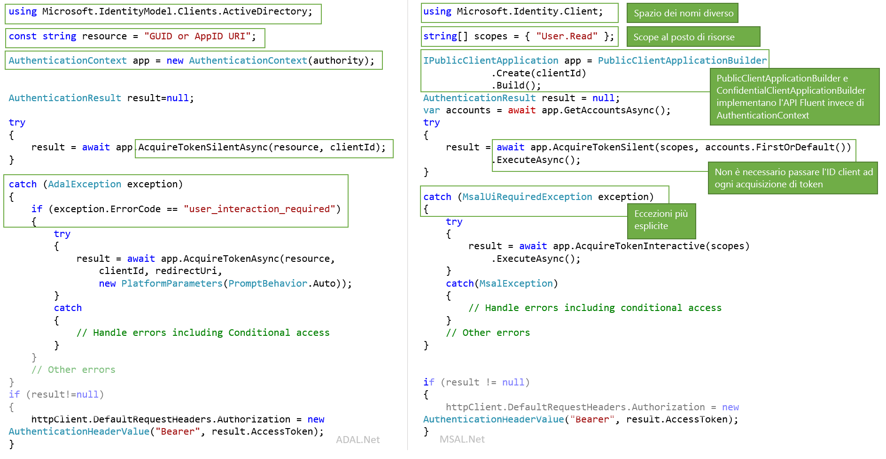

# <a name="migrating-applications-to-msalnet"></a>Migrazione di applicazioni a MSAL.NET

Sia Microsoft Authentication Library per .NET (MSAL.NET) che Azure AD Authentication Library per .NET (ADAL.NET) vengono usati per eseguire l'autenticazione delle entità di Azure AD e richiedere token da Azure AD. Finora la maggior parte degli sviluppatori ha lavorato con Azure AD per la piattaforma per sviluppatori (v1.0) per autenticare le identità di Azure AD (account aziendali e dell'istituto di istruzione) richiedendo token con Azure AD Authentication Library (ADAL). Uso di MSAL:

- è possibile autenticare un set più ampio di identità Microsoft (Azure AD identità e account Microsoft e account social e locali tramite Azure AD B2C) perché usa l'endpoint della piattaforma Microsoft Identity,
- Gli utenti otterranno la migliore esperienza Single Sign-on.
- l'applicazione può abilitare il consenso incrementale e il supporto dell'accesso condizionale è più semplice
- è possibile trarre vantaggio dall'innovazione.

**MSAL.NET è ora la libreria di autenticazione consigliata da usare con la piattaforma di identità Microsoft**. In ADAL.NET non verranno implementate nuove funzionalità. Gli sforzi sono incentrati sul miglioramento di MSAL.

Questo articolo descrive le differenze tra Microsoft Authentication Library per .NET (MSAL.NET) e Autenticazione di Azure AD Library for .NET (ADAL.NET) e consente di eseguire la migrazione a MSAL.  

## <a name="differences-between-adal-and-msal-apps"></a>Differenze tra le app ADAL e MSAL

Nella maggior parte dei casi è consigliabile usare MSAL.NET e l'endpoint di Microsoft Identity Platform, che rappresenta l'ultima generazione delle librerie di autenticazione di Microsoft. Tramite MSAL.NET è possibile acquisire i token per gli utenti eseguendo l'accesso all'applicazione con Azure AD (account aziendali e dell'istituto di istruzione), account Microsoft (personali) o Azure AD B2C. 

Se si ha già familiarità con l'endpoint di Azure AD per sviluppatori (v1.0) (e ADAL.NET), è possibile leggere l'articolo sulle [differenze rispetto all'endpoint di Microsoft Identity Platform (v2.0)](active-directory-v2-compare.md).

È comunque necessario usare ADAL.NET se l'applicazione deve consentire l'accesso degli utenti con versioni precedenti di [Active Directory Federation Services (ADFS)](/windows-server/identity/active-directory-federation-services). Per ulteriori informazioni, vedere [supporto per ADFS](https://aka.ms/msal-net-adfs-support).

Nella figura seguente sono riepilogate alcune delle differenze tra ADAL.NET e MSAL.NET 

### <a name="nuget-packages-and-namespaces"></a>Pacchetti NuGet e spazi dei nomi

ADAL.NET viene usato dal pacchetto NuGet [Microsoft.IdentityModel.Clients.ActiveDirectory](https://www.nuget.org/packages/Microsoft.IdentityModel.Clients.ActiveDirectory). Lo spazio dei nomi da usare è `Microsoft.IdentityModel.Clients.ActiveDirectory`.

Per usare MSAL.NET, sarà necessario aggiungere il pacchetto NuGet [Microsoft.Identity.Client](https://www.nuget.org/packages/Microsoft.Identity.Client) e usare lo spazio dei nomi `Microsoft.Identity.Client`

### <a name="scopes-not-resources"></a>Ambiti e non risorse

ADAL.NET acquisisce i token per le *risorse*, mentre MSAL.NET acquisisce i token per gli *ambiti*. Numerosi override AcquireToken di MSAL.NET richiedono un parametro denominato scopes (`IEnumerable<string> scopes`). Questo parametro è un semplice elenco di stringhe che dichiarano le autorizzazioni desiderate e le risorse richieste. Ambiti ben noti sono gli [ambiti di Microsoft Graph](/graph/permissions-reference).

In MSAL.NET è anche possibile accedere alle risorse v1.0. Per informazioni dettagliate, vedere [Ambiti per un'applicazione v1.0](#scopes-for-a-web-api-accepting-v10-tokens). 

### <a name="core-classes"></a>Classi di base

- ADAL.NET usa [AuthenticationContext](https://github.com/AzureAD/azure-activedirectory-library-for-dotnet/wiki/AuthenticationContext:-the-connection-to-Azure-AD) come rappresentazione della connessione al Servizio token di sicurezza (STS) o al server di autorizzazione, tramite un'autorità. Al contrario, MSAL.NET è basato sulle [applicazioni client](https://github.com/AzureAD/microsoft-authentication-library-for-dotnet/wiki/Client-Applications). Fornisce due classi distinte: `PublicClientApplication` e `ConfidentialClientApplication`

- Acquisizione di token: ADAL.NET e MSAL.NET hanno le stesse chiamate di autenticazione (`AcquireTokenAsync` e `AcquireTokenSilentAsync` per ADAL.NET e `AcquireTokenInteractive` e `AcquireTokenSilent` in MSAL.NET) ma con parametri diversi necessari. Una differenza è il fatto che, in MSAL.NET, è non è più necessario passare il `ClientID` dell'applicazione in ogni chiamata AcquireTokenXX. Di fatto, `ClientID` viene impostato una sola volta durante la creazione di `IPublicClientApplication` o `IConfidentialClientApplication`.

### <a name="iaccount-not-iuser"></a>IAccount invece di IUser

ADAL.NET consentiva di manipolare utenti. Tuttavia, un utente è una persona o un agente software, ma può possedere o essere responsabile per uno o più account nel sistema di identità di Microsoft (diversi account Azure AD, Azure AD B2C, account Microsoft personali). 

MSAL.NET 2.x ora definisce il concetto di account (tramite l'interfaccia IAccount). Questa importante modifica fornisce la semantica appropriata: il fatto che lo stesso utente può avere più account, in diverse directory di Azure AD. MSAL.NET offre inoltre informazioni più complete negli scenari guest, perché sono disponibili informazioni sull'account principale.

Per altre informazioni sulle differenze tra IUser e IAccount, vedere [MSAL.NET 2.x](https://aka.ms/msal-net-2-released).

### <a name="exceptions"></a>Eccezioni

#### <a name="interaction-required-exceptions"></a>Eccezioni di interazione richiesta

MSAL.NET dispone di eccezioni più esplicite. Ad esempio, quando l'autenticazione automatica non riesce in ADAL, la procedura prevede di intercettare l'eccezione e cercare il codice di errore `user_interaction_required`:

```csharp
catch(AdalException exception)
{
 if (exception.ErrorCode == "user_interaction_required")
 {
  try
  {“try to authenticate interactively”}}
 }
}
```

Vedere i dettagli relativi al [modello consigliato per l'acquisizione di un token](https://github.com/AzureAD/azure-activedirectory-library-for-dotnet/wiki/AcquireTokenSilentAsync-using-a-cached-token#recommended-pattern-to-acquire-a-token) con ADAL.NET

Tramite MSAL.NET, è possibile intercettare `MsalUiRequiredException` come descritto in [AcquireTokenSilent](https://github.com/AzureAD/microsoft-authentication-library-for-dotnet/wiki/AcquireTokenSilentAsync-using-a-cached-token).

```csharp
catch(MsalUiRequiredException exception)
{
 try {“try to authenticate interactively”}
}
```

#### <a name="handling-claim-challenge-exceptions"></a>Gestione delle eccezioni relative alla richiesta di attestazione

In ADAL.NET, le eccezioni relative alla richiesta di attestazione vengono gestite nel modo seguente:

- `AdalClaimChallengeException` è un'eccezione (che deriva da `AdalServiceException`) generata dal servizio nel caso in cui una risorsa richieda altre attestazioni da parte dell'utente (ad esempio, l'autenticazione a due fattori). Il membro `Claims` contiene alcuni frammenti JSON con le attestazioni che sono previste.
- Sempre in ADAL.NET, l'applicazione client pubblica che riceve questa eccezione deve chiamare l'override `AcquireTokenInteractive` con un parametro claims. L'override di `AcquireTokenInteractive` non tenta nemmeno di usare la cache, poiché non è necessario. Il motivo è che il token nella cache non dispone delle attestazioni corrette (in caso contrario, non sarebbe stata generata un'eccezione `AdalClaimChallengeException`). Pertanto, non è necessario esaminare la cache. Si noti che `ClaimChallengeException` può essere ricevuto in un'API Web con OBO, mentre è necessario chiamare `AcquireTokenInteractive` in un'applicazione client pubblica che chiama questa API Web.
- Per informazioni dettagliate ed esempi, vedere [Gestione di AdalClaimChallengeException](https://github.com/AzureAD/azure-activedirectory-library-for-dotnet/wiki/Exceptions-in-ADAL.NET#handling-adalclaimchallengeexception)

In MSAL.NET, le eccezioni relative alla richiesta di attestazione vengono gestite nel modo seguente:

- `Claims` è disponibile in `MsalServiceException`.
- È presente un metodo `.WithClaim(claims)` che può essere applicato al generatore `AcquireTokenInteractive`. 

### <a name="supported-grants"></a>Concessioni supportate

Non tutte le concessioni sono ancora supportate in MSAL.NET e nell'endpoint v2.0. Di seguito è riportato un riepilogo con un confronto tra le concessioni supportate in ADAL.NET e MSAL.NET.

#### <a name="public-client-applications"></a>Applicazioni client pubbliche

Ecco le concessioni supportate in ADAL.NET e MSAL.NET per le applicazioni desktop e per dispositivi mobili

Concessione | ADAL.NET | MSAL.NET
----- |----- | -----
Interattività | [Autenticazione interattiva](https://github.com/AzureAD/azure-activedirectory-library-for-dotnet/wiki/Acquiring-tokens-interactively---Public-client-application-flows) | [Acquisizione dei token in modo interattivo in MSAL.NET](https://github.com/AzureAD/microsoft-authentication-library-for-dotnet/wiki/Acquiring-tokens-interactively)
Autenticazione integrata di Windows | [Autenticazione integrata di Windows (Kerberos)](https://github.com/AzureAD/azure-activedirectory-library-for-dotnet/wiki/AcquireTokenSilentAsync-using-Integrated-authentication-on-Windows-(Kerberos)) | [Autenticazione integrata di Windows](msal-authentication-flows.md#integrated-windows-authentication)
Nome utente/password | [Acquisizione di token con nome utente e password](https://github.com/AzureAD/azure-activedirectory-library-for-dotnet/wiki/Acquiring-tokens-with-username-and-password)| [Autenticazione con nome utente e password](msal-authentication-flows.md#usernamepassword)
Flusso del codice del dispositivo | [Profilo di dispositivo per i dispositivi senza Web browser](https://github.com/AzureAD/azure-activedirectory-library-for-dotnet/wiki/Device-profile-for-devices-without-web-browsers) | [Flusso del codice del dispositivo](msal-authentication-flows.md#device-code)

#### <a name="confidential-client-applications"></a>Applicazioni client riservate

Ecco le concessioni supportate in ADAL.NET e MSAL.NET per applicazioni Web, API Web e applicazioni daemon:

Tipo di app | Concessione | ADAL.NET | MSAL.NET
----- | ----- | ----- | -----
App Web, API Web, daemon | Client Credentials | [Flussi di credenziali client in ADAL.NET](https://github.com/AzureAD/azure-activedirectory-library-for-dotnet/wiki/Client-credential-flows) | [Flussi di credenziali client in MSAL.NET](msal-authentication-flows.md#client-credentials))
API Web | On-Behalf-Of | [Chiamate da servizio a servizio per conto dell'utente con ADAL.NET](https://github.com/AzureAD/azure-activedirectory-library-for-dotnet/wiki/Service-to-service-calls-on-behalf-of-the-user) | [On-Behalf-Of in MSAL.NET](msal-authentication-flows.md#on-behalf-of)
App Web | Codice di autenticazione | [Acquisizione di token con codici di autorizzazione nelle app Web con ADAL.NET](https://github.com/AzureAD/azure-activedirectory-library-for-dotnet/wiki/Acquiring-tokens-with-authorization-codes-on-web-apps) | [Acquisizione di token con codici di autorizzazione nelle app Web con MSAL.NET](msal-authentication-flows.md#authorization-code)

### <a name="cache-persistence"></a>Persistenza della cache

ADAL.NET consente di estendere la classe `TokenCache` per implementare la funzionalità di persistenza desiderata nelle piattaforme senza un archivio sicuro (.NET Framework e .NET Core) usando i metodi `BeforeAccess` e `BeforeWrite`. Per informazioni dettagliate, vedere [Serializzazione della cache dei token in ADAL.NET](https://github.com/AzureAD/azure-activedirectory-library-for-dotnet/wiki/Token-cache-serialization).

MSAL.NET rende la cache dei token una classe sealed, eliminando la possibilità di estenderla. Pertanto, l'implementazione della persistenza della cache dei token deve essere sotto forma di una classe helper che interagisce con la cache dei token sealed. Questa interazione è descritta in [Serializzazione della cache dei token in MSAL.NET](https://github.com/AzureAD/microsoft-authentication-library-for-dotnet/wiki/token-cache-serialization).

## <a name="signification-of-the-common-authority"></a>Significato dell'autorità comune

Nella versione 1.0, se si usa l'autorità https://login.microsoftonline.com/common , si consente agli utenti di accedere con qualsiasi account AAD (per qualsiasi organizzazione). Vedere [Convalida dell'autorità in ADAL.NET](https://github.com/AzureAD/azure-activedirectory-library-for-dotnet/wiki/AuthenticationContext:-the-connection-to-Azure-AD#authority-validation)

Se si usa l'autorità https://login.microsoftonline.com/common nella versione 2.0, si consentirà agli utenti di accedere con qualsiasi organizzazione AAD o account Microsoft personale. In MSAL.NET, se si vuole limitare l'accesso a qualsiasi account AAD (stesso comportamento di ADAL.NET), è necessario usare https://login.microsoftonline.com/organizations. Per informazioni dettagliate, vedere il parametro `authority` nell'[applicazione client pubblica](https://github.com/AzureAD/microsoft-authentication-library-for-dotnet/wiki/Client-Applications#publicclientapplication).

## <a name="v10-and-v20-tokens"></a>Token v1.0 e v2.0

Esistono due versioni dei token:
- Token v1.0
- Token v2.0 

L'endpoint v1.0 (usato da ADAL) genera solo token v1.0.

L'endpoint v2.0 (usato da MSAL) genera invece la versione del token accettata dall'API Web. Una proprietà del manifesto dell'applicazione dell'API Web consente agli sviluppatori di scegliere quale versione del token viene accettata. Vedere `accessTokenAcceptedVersion` nella documentazione di riferimento sul [manifesto dell'applicazione](reference-app-manifest.md).

Per altre informazioni sui token v1.0 e v2.0, vedere [Token di accesso di Azure Active Directory](access-tokens.md)

## <a name="scopes-for-a-web-api-accepting-v10-tokens"></a>Ambiti per un'API Web che accetta i token v1.0

Le autorizzazioni OAuth2 sono ambiti di autorizzazione che l'applicazione dell'API web v1.0 (risorsa) espone alle applicazioni client. Questi ambiti di autorizzazione possono essere concessi alle applicazioni client durante il consenso. Vedere la sezione su oauth2Permissions in [Manifesto dell'applicazione in Azure Active Directory](active-directory-application-manifest.md).

### <a name="scopes-to-request-access-to-specific-oauth2-permissions-of-a-v10-application"></a>Ambiti per richiedere l'accesso a specifiche autorizzazioni OAuth2 di un'applicazione v1.0

Se si vuole acquisire i token per gli ambiti specifici di un'applicazione v1.0 (ad esempio, Graph di AAD, ovvero https://graph.windows.net) ), è necessario creare `scopes` concatenando un identificatore di risorsa con un'autorizzazione OAuth2 per tale risorsa.

Ad esempio, per accedere al nome dell'utente in un'API Web v1.0 il cui URI dell'ID App è `ResourceId`, è possibile usare:

```csharp
var scopes = new [] {  ResourceId+"/user_impersonation"};
```

Per eseguire operazioni di lettura e scrittura con Azure Active Directory in MSAL.NET tramite l'API Graph di AAD (https://graph.windows.net/) , è possibile creare un elenco di ambiti come nel frammento di codice seguente:

```csharp
ResourceId = "https://graph.windows.net/";
var scopes = new [] { ResourceId + "Directory.Read", ResourceID + "Directory.Write"}
```

#### <a name="warning-should-you-have-one-or-two-slashes-in-the-scope-corresponding-to-a-v10-web-api"></a>Avviso: è necessario avere una o due barre nell'ambito corrispondente a un'API Web v 1.0

Per eseguire operazioni di scrittura nell'ambito corrispondente all'API di Azure Resource Manager (https://management.core.windows.net/) , è necessario richiedere l'ambito seguente (si notino le due barre) 

```csharp
var scopes = new[] {"https://management.core.windows.net//user_impersonation"};
var result = await app.AcquireTokenInteractive(scopes).ExecuteAsync();

// then call the API: https://management.azure.com/subscriptions?api-version=2016-09-01
```

Questo perché l'API di Resource Manager prevede una barra nell'attestazione dei destinatari (`aud`) e quindi è presente una barra per separare il nome dell'API dall'ambito.

La logica usata da Azure AD è la seguente:
- Per l'endpoint ADAL (v1.0) con un token di accesso v1.0 (l'unico possibile), aud=resource
- Per MSAL (endpoint v2.0) che richiede un token di accesso per una risorsa che accetta i token v2.0, aud=resource.AppId
- Per MSAL (endpoint v2.0) che richiede un token di accesso per una risorsa che accetta un token di accesso v1.0 (come nel caso precedente), Azure AD analizza i destinatari desiderati dall'ambito richiesto, prendendo tutto ciò che precede l'ultima barra e usandolo come identificatore della risorsa. Di conseguenza, se https:\//database.windows.net prevede un gruppo di destinatari "https://database.windows.net/ ", è necessario richiedere un ambito di https:\/ /database.windows.net//.default. Vedere anche il problema #[747](https://github.com/AzureAD/microsoft-authentication-library-for-dotnet/issues/747): la barra finale dell'URL della risorsa è stata omessa, causando un errore di autenticazione SQL #747


### <a name="scopes-to-request-access-to-all-the-permissions-of-a-v10-application"></a>Ambiti per richiedere l'accesso a tutte le autorizzazioni di un'applicazione v1.0

Ad esempio, per acquisire un token per tutti gli ambiti statici di un'applicazione v1.0, è possibile usare

```csharp
ResourceId = "someAppIDURI";
var scopes = new [] {  ResourceId+"/.default"};
```

### <a name="scopes-to-request-in-the-case-of-client-credential-flow--daemon-app"></a>Ambiti da richiedere in caso di flusso di credenziali client/app daemon

Anche nel caso del flusso di credenziali client, l'ambito da passare è `/.default`. Questo ambito indica a Azure AD: "tutte le autorizzazioni a livello di app a cui l'amministratore ha acconsentito nella registrazione dell'applicazione.

## <a name="adal-to-msal-migration"></a>Migrazione da ADAL a MSAL

In ADAL.NET v2.x sono stati esposti i token di aggiornamento, consentendo di sviluppare soluzioni basate sull'uso di tali token, memorizzandoli nella cache e usando i metodi `AcquireTokenByRefreshToken` forniti da ADAL versione 2.x. Alcune soluzioni di questo tipo sono state usate in scenari come:
* Servizi a esecuzione prolungata che eseguono azioni come l'aggiornamento di dashboard per conto degli utenti, quando gli utenti non sono più connessi. 
* Scenari di Web farm per consentire al client portare il token di aggiornamento nel servizio Web (la memorizzazione nella cache viene eseguita sul lato client, con un cookie crittografato, invece che sul lato server)

MSAL.NET non espone i token di aggiornamento per motivi di sicurezza: MSAL gestisce automaticamente i token di aggiornamento. 

Fortunatamente, MSAL.NET dispone ora di un'API che consente di migrare i token di aggiornamento precedenti (acquisiti con ADAL) nel `IConfidentialClientApplication`:

```CSharp
/// <summary>
/// Acquires an access token from an existing refresh token and stores it and the refresh token into 
/// the application user token cache, where it will be available for further AcquireTokenSilent calls.
/// This method can be used in migration to MSAL from ADAL v2 and in various integration 
/// scenarios where you have a RefreshToken available. 
/// (see https://aka.ms/msal-net-migration-adal2-msal2)
/// </summary>
/// <param name="scopes">Scope to request from the token endpoint. 
/// Setting this to null or empty will request an access token, refresh token and ID token with default scopes</param>
/// <param name="refreshToken">The refresh token from ADAL 2.x</param>
IByRefreshToken.AcquireTokenByRefreshToken(IEnumerable<string> scopes, string refreshToken);
```
 
Con questo metodo, è possibile fornire il token di aggiornamento usato in precedenza insieme a tutti gli ambiti (risorse) desiderati. Il token di aggiornamento verrà scambiato con uno nuovo e memorizzato nella cache nell'applicazione.  

Poiché questo metodo è destinato a scenari che non sono tipici, non è facilmente accessibile con `IConfidentialClientApplication` senza prima eseguirne il cast in `IByRefreshToken`.

Il frammento di codice seguente mostra un esempio di codice di migrazione in un'applicazione client riservata. `GetCachedRefreshTokenForSignedInUser` recupera il token di aggiornamento che è stato memorizzato in una risorsa di archiviazione da una versione precedente dell'applicazione che impiegava ADAL 2.x. `GetTokenCacheForSignedInUser` deserializza una cache per l'utente connesso (perché le applicazioni client riservate devono avere una sola cache per utente).

```csharp
TokenCache userCache = GetTokenCacheForSignedInUser();
string rt = GetCachedRefreshTokenForSignedInUser();

IConfidentialClientApplication app;
app = ConfidentialClientApplicationBuilder.Create(clientId)
 .WithAuthority(Authority)
 .WithRedirectUri(RedirectUri)
 .WithClientSecret(ClientSecret)
 .Build();
IByRefreshToken appRt = app as IByRefreshToken;
         
AuthenticationResult result = await appRt.AcquireTokenByRefreshToken(null, rt)
                                         .ExecuteAsync()
                                         .ConfigureAwait(false);
```

Quando il nuovo token di aggiornamento viene memorizzato nella cache, verranno restituiti un token di accesso e un token ID in AuthenticationResult.

È anche possibile usare questo metodo per vari scenari di integrazione in cui è disponibile un token di aggiornamento.

## <a name="next-steps"></a>Passaggi successivi

Per altre informazioni sugli ambiti, vedere [Scopes, permissions, and consent in the Microsoft identity platform endpoint](v2-permissions-and-consent.md) (Ambiti, autorizzazioni e consenso nell'endpoint di Microsoft Identity Platform)
