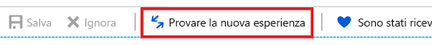
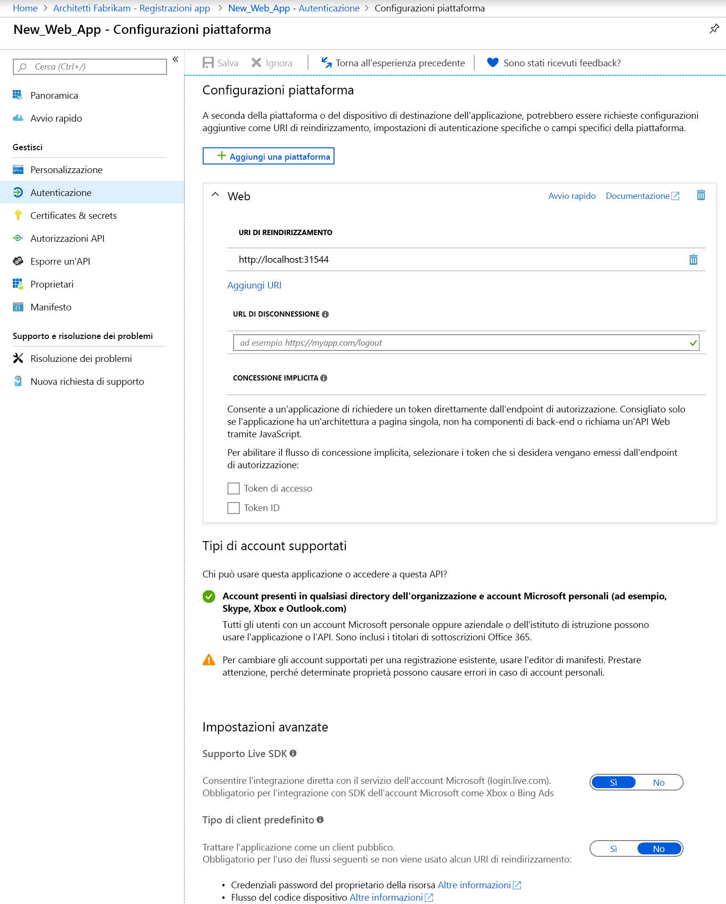
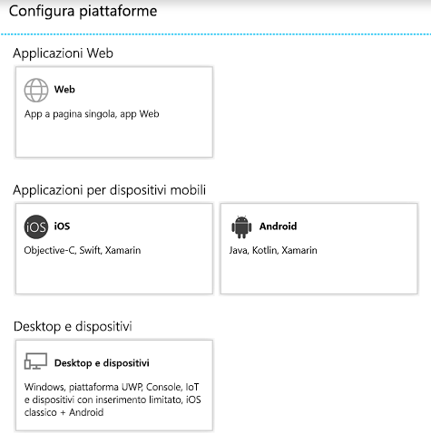

# Guida introduttiva: Configurare un'applicazione client per accedere alle API Web

Per consentire a un'applicazione Web/client riservata di partecipare a un flusso di concessioni di autorizzazioni che richiede l'autenticazione (e ottenere un token di accesso), è necessario definire credenziali protette. Il metodo di autenticazione predefinito supportato dal portale di Azure è ID client + chiave privata.

Prima che un client possa accedere a un'API Web esposta da un'applicazione della risorsa (come l'API Microsoft Graph), inoltre, il framework di consenso assicura che il client ottenga la concessione di autorizzazioni necessaria in base alle autorizzazioni richieste. Per impostazione predefinita, tutte le applicazioni possono scegliere le autorizzazioni dall'API Microsoft Graph. L'[autorizzazione "Consente l'accesso e la lettura del profilo utente" dell'API Graph](https://developer.microsoft.com/graph/docs/concepts/permissions_reference#user-permissions) è selezionata per impostazione predefinita. È possibile scegliere fra [due tipi di autorizzazioni](developer-glossary.md#permissions) per ogni API Web desiderata:

* **Autorizzazioni di tipo applicazione**: l'applicazione client deve accedere all'API Web direttamente come se stessa (senza contesto utente). Questo tipo di autorizzazione richiede il consenso dell'amministratore e non è disponibile per applicazioni client pubbliche (desktop e per dispositivi mobili).
* **Autorizzazioni delegate**: l'applicazione client deve accedere all'API Web come utente connesso, ma con accesso limitato dall'autorizzazione selezionata. Questo tipo di autorizzazione può essere concesso da un utente, a meno che l'autorizzazione richieda il consenso dell'amministratore.

  > [!NOTE]
  > L'aggiunta di un'autorizzazione delegata a un'applicazione non concede automaticamente il consenso all'utente all'interno del tenant. Gli utenti devono comunque concedere manualmente il consenso per le autorizzazioni delegate aggiuntive in fase di esecuzione, a meno che l'amministratore non conceda il consenso per conto di tutti gli utenti.

In questa guida introduttiva verrà illustrato come configurare l'app per eseguire queste operazioni:

* [Aggiungere URI di reindirizzamento all'applicazione](#add-redirect-uris-to-your-application)
* [Configurare le impostazioni avanzate per l'applicazione](#configure-advanced-settings-for-your-application)
* [Modificare i tipi di account supportati](#modify-supported-account-types)
* [Aggiungere credenziali all'applicazione Web](#add-credentials-to-your-web-application)
* [Aggiungere autorizzazioni per accedere ad API Web](#add-permissions-to-access-web-apis)

## Prerequisiti

Per iniziare, assicurarsi di soddisfare questi prerequisiti:

* Acquisire informazioni su [autorizzazioni supportate e consenso](v2-permissions-and-consent.md), la cui conoscenza è importante per creare applicazioni che dovranno essere usate da altri utenti o applicazioni.
* Avere un tenant in cui sono registrate applicazioni.
  * Se non si hanno app registrate, vedere come [registrare applicazioni con Microsoft Identity Platform](quickstart-register-app.md).

## Accedere al portale di Azure e selezionare l'app

Per poter configurare l'app, seguire prima questa procedura:

1. Accedere al [portale di Azure](https://portal.azure.com) con un account aziendale o dell'istituto di istruzione oppure con un account Microsoft personale.
1. Se l'account consente di accedere a più tenant, selezionare l'account nell'angolo in alto a destra e impostare la sessione del portale sul tenant di Azure AD desiderato.
1. Cercare e selezionare **Azure Active Directory**. 
1. Nel riquadro a sinistra selezionare **Registrazioni app**.
1. Trovare e selezionare l'applicazione che si vuole configurare. Dopo la selezione dell'app verrà visualizzata la pagina **Panoramica** o la pagina di registrazione principale dell'applicazione.
1. Seguire questa procedura per configurare l'applicazione per l'accesso ad API Web:
    * [Aggiungere URI di reindirizzamento all'applicazione](#add-redirect-uris-to-your-application)
    * [Configurare le impostazioni avanzate per l'applicazione](#configure-advanced-settings-for-your-application)
    * [Modificare i tipi di account supportati](#modify-supported-account-types)
    * [Aggiungere credenziali all'applicazione Web](#add-credentials-to-your-web-application)
    * [Aggiungere autorizzazioni per accedere ad API Web](#add-permissions-to-access-web-apis)

## Aggiungere URI di reindirizzamento all'applicazione

Per aggiungere un URI di reindirizzamento all'applicazione:

1. Nella pagina **Panoramica** dell'app selezionare la sezione **Autenticazione**.
1. Per aggiungere un URI di reindirizzamento personalizzato per applicazioni client pubbliche e Web, seguire questa procedura:
   1. Individuare la sezione **URI di reindirizzamento**.
   1. Selezionare il tipo di applicazione che si sta creando, ossia **Web** o **Client pubblico (per dispositivi mobili e desktop)** .
   1. Immettere l'URI di reindirizzamento per l'applicazione.
      * Per le applicazioni Web, specificare l'URL di base dell'applicazione. L'URL per un'applicazione Web in esecuzione nel computer locale potrebbe essere ad esempio `http://localhost:31544`. Gli utenti useranno questo URL per accedere a un'applicazione client Web.
      * Per le applicazione pubbliche, specificare l'URI usato da Azure AD per restituire le risposte dei token. Immettere un valore specifico dell'applicazione, ad esempio: `https://MyFirstApp`.

1. Per scegliere tra gli URI di reindirizzamento suggeriti per client pubblici (per dispositivi mobili e desktop), seguire questa procedura:
    1. Individuare la sezione **URI di reindirizzamento suggeriti per client pubblici (dispositivi mobili, desktop)** .
    1. Selezionare uno o più URI di reindirizzamento appropriati per l'applicazione usando le caselle di controllo. È anche possibile immettere un URI di reindirizzamento personalizzato. In caso di dubbi su quale usare, consultare la documentazione della libreria.

Agli URI di reindirizzamento si applicano determinate restrizioni. Per altre informazioni, vedere [Restrizioni e limitazioni degli URI di reindirizzamento](https://docs.microsoft.com/azure/active-directory/develop/reply-url).
> [!NOTE]
> Provare la nuova esperienza per le Impostazioni di **autenticazione** che consente di configurare le impostazioni dell'applicazione in base alla piattaforma o al dispositivo di destinazione.
>
> Per accedere a questa visualizzazione, selezionare **Prova la nuova esperienza** dalla visualizzazione predefinita della pagina **Autenticazione**.
>
> 
>
> Si verrà reindirizzati alla [nuova pagina **Configurazioni della piattaforma**](#configure-platform-settings-for-your-application).

### Configurare le impostazioni avanzate per l'applicazione

A seconda dell'applicazione che si sta registrando, potrebbe essere necessario configurare impostazioni aggiuntive, ad esempio:

* **URL di disconnessione**
* Per le app a singola pagina, è possibile abilitare **Concessione implicita** e selezionare i token che dovranno essere rilasciati dall'endpoint di autorizzazione.
* Per le app desktop che acquisiscono i token tramite l'autenticazione integrata di Windows, il flusso del codice del dispositivo o il nome utente e la password nella sezione **Tipo di client predefinito**, configurare l'impostazione **Gestisci l'applicazione come un client pubblico** su **Sì**.
* Per le app legacy che usano Live SDK per l'integrazione con il servizio account Microsoft, configurare il **Supporto Live SDK**. Per le nuove app, questa impostazione non è necessaria.
* **Tipo di client predefinito**

### Modificare i tipi di account supportati

Nei **Tipi di account supportati** sono specificati gli utenti autorizzati a usare l'applicazione o ad accedere all'API.

Dopo aver [configurato i tipi di account supportati](quickstart-register-app.md) durante la registrazione iniziale dell'applicazione, è possibile modificare questa impostazione usando l'editor del manifesto dell'applicazione solo se:

* Il tipo di account viene modificato da **AzureADMyOrg** o **AzureADMultipleOrgs** ad **AzureADandPersonalMicrosoftAccount** o viceversa.
* Il tipo di account viene modificato da **AzureADMyOrg** ad **AzureADMultipleOrgs** o viceversa.

Per modificare i tipi di account supportati per una registrazione app esistente:

* Vedere [Configurare il manifesto dell'applicazione](reference-app-manifest.md) e aggiornare la chiave `signInAudience`.

## Configurare le impostazioni della piattaforma per l'applicazione

Per configurare le impostazioni dell'applicazione in base alla piattaforma o al dispositivo di destinazione:

1. Nella pagina **Configurazioni della piattaforma** selezionare **Aggiungi una piattaforma** e scegliere una delle opzioni disponibili.

   

1. Immettere le informazioni sulle impostazioni in base alla piattaforma selezionata.

   | Piattaforma                | Opzioni              | Impostazioni di configurazione            |
   |-------------------------|----------------------|-----------------------------------|
   | **Applicazioni Web**    | **Web**              | Immettere l'**URI di reindirizzamento** per l'applicazione. |
   | **Applicazioni per dispositivi mobili** | **iOS**              | Immettere l'**ID bundle** dell'app, disponibile nell'ambiente XCode nel file Info.plist o nelle impostazioni di compilazione. L'aggiunta dell'ID bundle crea automaticamente un URI di reindirizzamento per l'applicazione. |
   |                         | **Android**          | * Specificare il **Nome pacchetto** dell'app, disponibile nel file AndroidManifest.xml. * Generare e immettere l'**Hash della firma**. L'aggiunta dell'hash della firma crea automaticamente un URI di reindirizzamento per l'applicazione.  |
   | **Desktop e dispositivi**   | **Desktop e dispositivi** | * Facoltativo. Selezionare uno degli **URI di reindirizzamento suggeriti** se si creano app per desktop e dispositivi. * Facoltativo. Immettere un **URI di reindirizzamento personalizzato** che costituisce la posizione a cui Azure AD reindirizzerà gli utenti in risposta alle richieste di autenticazione. Ad esempio, per le applicazioni .NET Core che richiedono interazione, usare `https://localhost`. |

   > [!IMPORTANT]
   > Per le applicazioni per dispositivi mobili che non usano la libreria MSAL più recente o che non usano un broker, è necessario configurare gli URI di reindirizzamento per le applicazioni in **Desktop e dispositivi**.

1. A seconda della piattaforma scelta, potrebbe essere possibile configurare impostazioni aggiuntive. Per le app **Web**, è possibile:
    * Aggiungere più URI di reindirizzamento
    * Configurare la **Concessione implicita** per selezionare i token che devono essere rilasciati dall'endpoint di autorizzazione:
        * Per le app a singola pagina, selezionare sia **Token di accesso** sia **Token ID**
        * Per le app Web, selezionare **Token ID**

## Aggiungere credenziali all'applicazione Web

Per aggiungere una credenziale all'applicazione Web:

1. Nella pagina **Panoramica** dell'app selezionare la sezione **Certificati e segreti**.

1. Per aggiungere un certificato, seguire questa procedura:

    1. Selezionare **Carica certificato**.
    1. Selezionare il file da caricare. Il tipo di file deve essere uno dei seguenti: .cer, .pem, .crt.
    1. Selezionare **Aggiungi**.

1. Per aggiungere un segreto client, seguire questa procedura:

    1. Selezionare **Nuovo segreto client**.
    1. Aggiungere una descrizione per il segreto client.
    1. Selezionare una durata.
    1. Selezionare **Aggiungi**.

> [!NOTE]
> Dopo il salvataggio delle modifiche alla configurazione, nella colonna più a destra verrà visualizzato il valore del segreto client. **Assicurarsi di copiare il valore** per usarlo nel codice dell'applicazione client, perché non sarà più accessibile dopo aver lasciato la pagina.

## Aggiungere autorizzazioni per accedere ad API Web

Per aggiungere autorizzazioni per accedere ad API di risorsa dal client:

1. Nella pagina **Panoramica** dell'app selezionare **Autorizzazioni API**.
1. Nella sezione **Autorizzazioni configurate** selezionare il pulsante **Aggiungi un'autorizzazione**.
1. Per impostazione predefinita, la visualizzazione consente di selezionare tra **API Microsoft**. Selezionare la sezione delle API a cui si è interessati:
    * **API Microsoft** consente di selezionare le autorizzazioni per API Microsoft come Microsoft Graph.
    * **API usate dall'organizzazione** consente di selezionare le autorizzazioni per le API che sono state esposte dall'organizzazione o con cui l'organizzazione ha eseguito l'integrazione.
    * **API personali** consente di selezionare le autorizzazioni per le API esposte dall'utente.
1. Al termine della selezione delle API, verrà visualizzata la pagina **Richiedi le autorizzazioni dell'API**. Se l'API espone autorizzazioni sia delegate che di tipo applicazione, selezionare il tipo di autorizzazione necessario all'applicazione.
1. Al termine, selezionare **Aggiungi autorizzazioni**. Verrà nuovamente visualizzata la pagina **Autorizzazioni API**, con le autorizzazioni salvate e aggiunte alla tabella.

## Informazioni sulle autorizzazioni API e sull'interfaccia utente di consenso amministratore

### Autorizzazioni configurate

Questa sezione illustra le autorizzazioni configurate in modo esplicito nell'oggetto applicazione (autorizzazioni \the che fanno parte dell'elenco di accesso alle risorse richiesto dall'app). È possibile aggiungere o rimuovere autorizzazioni da questa tabella. In qualità di amministratore, è anche possibile concedere/revocare il consenso amministratore per un set di autorizzazioni o per singole autorizzazioni di un'API in questa sezione.

### Altre autorizzazioni concesse

Se l'applicazione è registrata in un tenant, è possibile che venga visualizzata una sezione aggiuntiva intitolata **Altre autorizzazioni concesse per Tenant**. Questa sezione illustra le autorizzazioni concesse per il tenant, ma non configurate in modo esplicito nell'oggetto applicazione (ad esempio, le autorizzazioni richieste e consentite in modo dinamico). Questa sezione viene visualizzata solo se è presente almeno un'autorizzazione applicabile.

È possibile aggiungere un set di autorizzazioni o singole autorizzazioni di un'API visualizzate in questa sezione sulla sezione **Autorizzazioni configurate**. In qualità di amministratore, è anche possibile revocare il consenso amministratore per singole API o autorizzazioni in questa sezione.

### Pulsante Consenso amministratore

Se l'applicazione è registrata in un tenant, verrà visualizzato un pulsante **Concedi consenso amministratore per Tenant**. Verrà disabilitato se non si è un amministratore o se non sono state configurate autorizzazioni per l'applicazione.
Questo pulsante consente a un amministratore di concedere facilmente il consenso amministratore alle autorizzazioni configurate per l'applicazione. Facendo clic sul pulsante Consenso amministratore, viene avviata una nuova finestra con una richiesta di consenso che mostra tutte le autorizzazioni configurate.

> [!NOTE]
> Si verifica un ritardo tra la configurazione delle autorizzazioni per l'applicazione e la relativa visualizzazione nella richiesta di consenso. Se non vengono visualizzate tutte le autorizzazioni configurate nella richiesta di consenso, chiuderla e riavviarla.

In caso di autorizzazioni concesse ma non configurate, quando si fa clic sul pulsante Consenso amministratore, verrà richiesto di decidere come gestire tali autorizzazioni. È possibile aggiungerle alle autorizzazioni configurate o rimuoverle.

La richiesta di consenso fornisce le opzioni **Accetta** o **Annulla**. Se si seleziona **Accetta**, viene concesso il consenso amministratore. Se si seleziona **Annulla**, il consenso amministratore non viene concesso e verrà visualizzato un errore indicante che il consenso è stato rifiutato.

> [!NOTE]
> Si è verificato un ritardo tra la concessione del consenso amministratore (selezionando **Accetta** nella richiesta di consenso) e lo stato del consenso amministratore riflesso nell'interfaccia utente.

## Passaggi successivi

Vedere le altre guide introduttive correlate sulla gestione delle app:

* [Registrare un'applicazione con Microsoft Identity Platform](quickstart-register-app.md)
* [Configurare un'applicazione per l'esposizione di API Web](quickstart-configure-app-expose-web-apis.md)
* [Modificare gli account supportati da un'applicazione](quickstart-modify-supported-accounts.md)
* [Rimuovere un'applicazione registrata con Microsoft Identity Platform](quickstart-remove-app.md)

Per altre informazioni su due oggetti di Azure AD che rappresentano un'applicazione registrata e la relazione tra essi, vedere [Oggetti applicazione e oggetti entità servizio](app-objects-and-service-principals.md).

Per altre informazioni sulle linee guida sulla personalizzazione da seguire per lo sviluppo di applicazioni con Azure Active Directory, vedere [Linee guida sulla personalizzazione delle applicazioni](howto-add-branding-in-azure-ad-apps.md).
