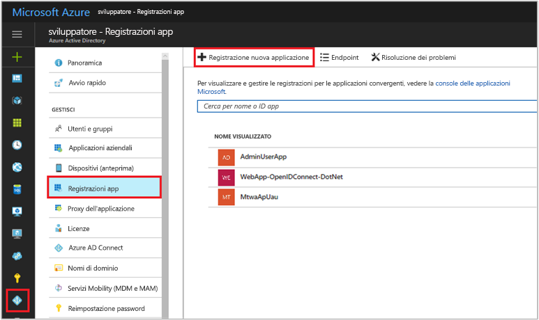
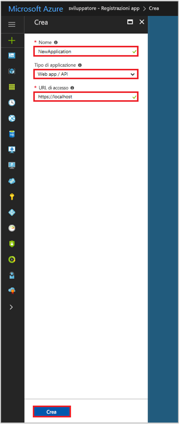

# Guida introduttiva: Registrare un'app con l'endpoint v1.0 di Azure Active Directory

[!INCLUDE [active-directory-develop-applies-v1](../../../includes/active-directory-develop-applies-v1.md)]

Gli sviluppatori aziendali e i provider SaaS possono sviluppare servizi cloud commerciali o applicazioni line-of-business che possono essere integrate con Azure Active Directory (Azure AD) per garantire la sicurezza dell'accesso e delle autorizzazioni per i loro servizi. Per integrare un'applicazione o un servizio con Azure AD, uno sviluppatore deve prima di tutto registrare l'applicazione con Azure AD.

Qualsiasi applicazione che vuole usare le funzionalità di Azure AD deve prima essere registrata in un tenant di Azure AD. Questo processo di registrazione comporta l'assegnazione ad Azure AD dei dettagli sull'applicazione, come l'URL in cui è disponibile, l'URL per inviare le risposte dopo l'autenticazione di un utente, l'URI che identifica l'app e così via.

Questa guida introduttiva illustra come aggiungere e registrare un'applicazione in Azure AD usando il servizio **Registrazioni app** disponibile nel portale di Azure.

> [!NOTE]
> Se si vuole registrare una nuova app, provare il servizio **Registrazioni app (anteprima)** disponibile nel portale di Azure. Vedere [Registrazioni app (anteprima)](quickstart-register-app.md) per iniziare.

## Prerequisiti

Per iniziare, assicurarsi di disporre di un tenant di Azure AD che è possibile usare per registrare le App. Se non si ha già un tenant, vedere le [informazioni su come ottenerne uno](quickstart-create-new-tenant.md).

## Registrare una nuova applicazione mediante il portale di Azure

1. Accedere al [portale di Azure](https://portal.azure.com).
1. Se l'account consente di accedere a più tenant, selezionare l'account in alto a destra e impostare la sessione del portale sul tenant di Azure AD desiderato.
1. Nel riquadro di spostamento a sinistra selezionare il servizio **Azure Active Directory**.
1. Selezionare **Registrazioni per l'app** e quindi **Registrazione nuova applicazione**.

    

1. Quando viene visualizzata la pagina **Crea**, immettere le informazioni di registrazione dell'applicazione: 

   - **Nome:** immettere un nome significativo per l'applicazione.
   - **Tipo di applicazione:**
     - Selezionare **Nativa** per le [applicazioni client](developer-glossary.md#client-application) che sono installate localmente in un dispositivo. Questa impostazione viene usata per i [client nativi](developer-glossary.md#native-client) OAuth pubblici.
     - Selezionare **App/API Web** per le [applicazioni client](developer-glossary.md#client-application) e le [applicazioni della risorsa/API](developer-glossary.md#resource-server) installate su un server protetto. Questa impostazione viene utilizzata per i [client Web](developer-glossary.md#web-client) OAuth riservati e i [client basati su agente utente](developer-glossary.md#user-agent-based-client) pubblici. La stessa applicazione può anche esporre sia un'API client che un'API di risorse.
   - **URL di accesso:** per le applicazioni "App Web/API" specificare l'URL di base dell'app. Ad esempio, `http://localhost:31544` potrebbe essere l'URL per un'app Web eseguita sul computer locale. Gli utenti possono usare questo URL per accedere a un'applicazione client Web. 
   - **URI di reindirizzamento:** per le applicazione "native" specificare l'URI usato da Azure AD per restituire le risposte dei token. Immettere un valore specifico per l'applicazione in uso, ad esempio `http://MyFirstAADApp`

     

     Per ottenere esempi specifici per applicazioni Web o per applicazioni native, vedere le **Guide introduttive** nella nostra documentazione.

1. Al termine selezionare **Crea**.

    Azure AD assegna un ID applicazione univoco all'applicazione e si viene reindirizzati alla pagina di registrazione principale dell'applicazione. A seconda che si tratti di un'applicazione Web o nativa, sono fornite opzioni diverse per l'aggiunta di altre funzionalità all'applicazione.

      > [!NOTE]
      > Per impostazione predefinita, un'applicazione Web appena registrata viene configurata in modo da consentire **solo** agli utenti dello stesso tenant di accedere all'applicazione stessa.

## Passaggi successivi

- Vedere [Framework di consenso di Azure AD](consent-framework.md) per una panoramica del consenso.
- Per abilitare funzionalità di configurazione aggiuntive nella registrazione dell'applicazione, come credenziali, autorizzazioni, abilitazione dell'accesso per gli utenti di altri tenant, vedere [Aggiornare un'applicazione in Azure AD](quickstart-v1-update-azure-ad-app.md).
- Per altre informazioni su due oggetti di Azure AD che rappresentano un'applicazione registrata e la relazione tra essi, vedere [Oggetti applicazione e oggetti entità servizio](app-objects-and-service-principals.md).
- Per altre informazioni sulle linee guida sulla personalizzazione da seguire per lo sviluppo di applicazioni con Azure Active Directory, vedere [Linee guida sulla personalizzazione delle applicazioni](howto-add-branding-in-azure-ad-apps.md).
