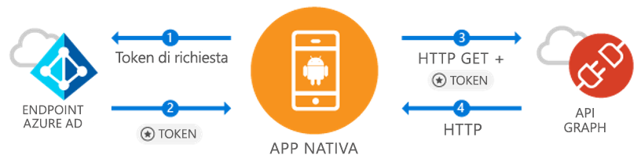

# <a name="quickstart-sign-in-users-and-call-the-microsoft-graph-api-from-an-android-app"></a>Guida introduttiva: Accesso utenti e chiamata dell'API Microsoft Graph da un'app di Android

[!INCLUDE [active-directory-develop-applies-v1-adal](../../../includes/active-directory-develop-applies-v1-adal.md)]

Se si sviluppa un'applicazione Android, con Microsoft l'accesso ai dati degli utenti di Azure Active Directory (Azure AD) è semplice e diretto. Azure AD consente all'applicazione di accedere ai dati degli utente tramite Microsoft Graph o la propria API Web protetta.

La libreria di Android Azure AD Authentication Library (ADAL) consente all'app di iniziare a usare il [cloud di Microsoft Azure](https://azure.microsoft.com/free/cloud-services/) e l'[API Microsoft Graph](https://developer.microsoft.com/graph) grazie al supporto degli [account Microsoft Azure Active Directory](https://azure.microsoft.com/services/active-directory/) che usano lo standard di settore OAuth 2.0 e OpenID Connect.

In questa guida introduttiva si apprende come:

* Ottenere un token per Microsoft Graph
* Aggiornare un token
* Chiamare Microsoft Graph
* Disconnettere l'utente

## <a name="prerequisites"></a>Prerequisiti

Per iniziare, sarà necessario un tenant di Azure AD in cui poter creare gli utenti e registrare un'applicazione. Se non si ha già un tenant, vedere le [informazioni su come ottenerne uno](quickstart-create-new-tenant.md).

## <a name="scenario-sign-in-users-and-call-the-microsoft-graph"></a>Scenario: Accedere agli utenti e chiamare Microsoft Graph



È possibile usare questa app per tutti gli account Azure AD. Supporta sia gli scenari con un singolo tentant che quelli con più tenant (illustrati nei passaggi). Illustra come uno è possibile compilare app per la connessione agli utenti aziendali e l'accesso ai dati di Azure e O365 tramite Microsoft Graph. Durante il flusso di autorizzazione, gli utenti finali dovranno effettuare l'accesso e dare il consenso per le autorizzazioni dell'applicazione. In alcuni casi potrebbe essere necessario che sia un amministratore a dare il consenso per l'app. La maggior parte della logica in questo esempio mostra come autorizzare un utente finale ed eseguire una chiamata di base a Microsoft Graph.

## <a name="sample-code"></a>Codice di esempio

Il codice di esempio completo è disponibile [in GitHub](https://github.com/Azure-Samples/active-directory-android).

```Java
// Initialize your app with MSAL
AuthenticationContext mAuthContext = new AuthenticationContext(
        MainActivity.this,
        AUTHORITY,
        false);


// Perform authentication requests
mAuthContext.acquireToken(
    getActivity(),
    RESOURCE_ID,
    CLIENT_ID,
    REDIRECT_URI,
    PromptBehavior.Auto,
    getAuthInteractiveCallback());

// ...

// Get tokens to call APIs like the Microsoft Graph
mAuthResult.getAccessToken()
```

## <a name="step-1-register-and-configure-your-app"></a>Passaggio 1: Registrare e configurare l'app

Sarà necessaria un'applicazione client nativa registrata con Microsoft tramite il [portale di Azure](https://portal.azure.com).

1. Passaggio alla registrazione dell'app
    - Passare al [portale di Azure](https://aad.portal.azure.com).
    - Passare ad ***Azure Active Directory*** > ***Registrazioni per l'app***.

2. Creare l'app
    - Selezionare **Nuova registrazione**.
    - Immettere un nome per l'app nel campo **Nome**.
    - In **Tipi di account supportati** selezionare **Account in qualsiasi directory organizzativa e account Microsoft personali**.
    - In **URI di reindirizzamento**, selezionare **Client pubblico (per dispositivi mobili e desktop)** dall'elenco a discesa e immettere `http://localhost`.
    - Fare clic su **Register**.

3. Configurare Microsoft Graph
    - Selezionare **Autorizzazioni API**.
    - Selezionare **Aggiungi un'autorizzazione** e in **Selezionare un'API** selezionare ***Microsoft Graph***.
    - In **Autorizzazioni delegate** selezionare l'autorizzazione **User.Read** e quindi fare clic su **Aggiungi** per salvare.        
    
4. Congratulazioni. L'app è stata configurata correttamente. Nella sezione seguente sarà necessario:
    - `Application ID`
    - `Redirect URI`

## <a name="step-2-get-the-sample-code"></a>Passaggio 2: Scaricare il codice di esempio

1. Clonare il codice.
    ```
    git clone https://github.com/Azure-Samples/active-directory-android
    ```
2. Aprire l'esempio in Android Studio.
    - Selezionare **Open an existing Android Studio project** (Apri un progetto di Android Studio esistente).

## <a name="step-3-configure-your-code"></a>Passaggio 3: Configurare il codice

È possibile trovare tutta la configurazione per questo esempio di codice nel file ***src/main/java/com/azuresamples/azuresampleapp/MainActivity.java***.

1. Sostituire la costante `CLIENT_ID` con `ApplicationID`.
2. Sostituire la costante `REDIRECT URI` con `Redirect URI` configurato prima (`http://localhost`).

## <a name="step-4-run-the-sample"></a>Passaggio 4: Eseguire l'esempio

1. Selezionare **Compilazione > Pulisci progetto**.
2. Selezionare **Esegui > (Esegui app)** .
3. L'app verrà compilata e verranno visualizzate alcune funzionalità di base dell'esperienza utente. Quando si fa clic sul pulsante `Call Graph API`, verrà chiesto un nome di accesso e quindi verrà effettuata una chiamata automatica all'API Microsoft Graph con il nuovo token.

## <a name="next-steps"></a>Passaggi successivi

1. Vedere il [wiki su ADAL per Android](https://github.com/AzureAD/azure-activedirectory-library-for-android/wiki) per altre informazioni sui meccanismi della libreria e su come configurare nuovi scenari e funzionalità.
2. Negli scenari nativi l'app userà un'istanza di WebView incorporata e non uscirà dall'app. `Redirect URI` può essere arbitrario.
3. Per eventuali problemi o richieste, è possibile creare un problema o un post in Stack Overflow con il tag `azure-active-directory`.

### <a name="cross-app-sso"></a>Accesso Single Sign-On tra app

Informazioni su [Come abilitare l'accesso Single Sign-On tra app su Android usando ADAL](howto-v1-enable-sso-android.md).

### <a name="auth-telemetry"></a>Telemetria per l'autorizzazione

La libreria ADAL espone i dati di telemetria per l'autorizzazione per consentire agli sviluppatori di app di conoscere il comportamento delle app e di offrire esperienze migliori. Ciò consente di acquisire dati sugli accessi riusciti, sugli utenti attivi e diverse altre importanti informazioni. L'uso dei dati di telemetria per l'autorizzazione richiede agli sviluppatori di app di creare un servizio di telemetria per aggregare e archiviare gli eventi.

Per altre informazioni sulla telemetria per l'autorizzazione, vedere [ADAL Android auth telemetry](https://github.com/AzureAD/azure-activedirectory-library-for-android/wiki/Telemetry) (Telemetria per l'autorizzazione di ADAL in Android).
