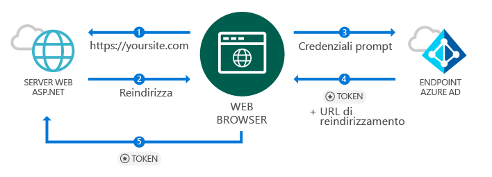
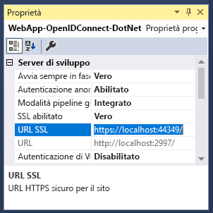
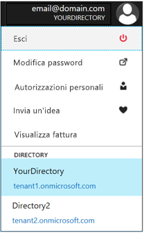
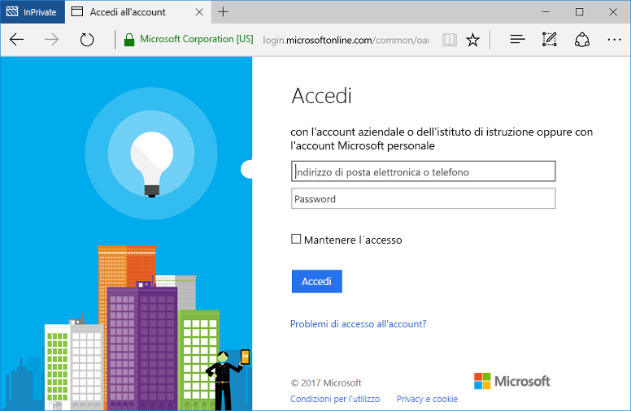

# <a name="quickstart-add-sign-in-with-microsoft-to-an-aspnet-web-app"></a>Guida introduttiva: Aggiungere l'accesso con Microsoft a un'app Web ASP.NET

[!INCLUDE [active-directory-develop-applies-v1](../../../includes/active-directory-develop-applies-v1.md)]

Questo argomento di avvio rapido descrive come implementare l'accesso con Microsoft tramite una soluzione ASP.NET MVC (Model View Controller) con un'applicazione tradizionale basata su Web browser con OpenID Connect. Verrà illustrato come abilitare gli accessi da account aziendali e dell'istituto di istruzione nell'applicazione ASP.NET.

Al termine di questa guida introduttiva, l'applicazione accetterà gli accessi di account aziendali e dell'istituto di istruzione di organizzazioni integrate con Azure Active Directory (Azure AD).

> [!NOTE]
> Se è necessario abilitare gli accessi per gli account personali, oltre che per gli account aziendali e dell'istituto di istruzione, è possibile usare l'*[endpoint di Microsoft Identity Platform](azure-ad-endpoint-comparison.md)*. Per altre informazioni, vedere [questa esercitazione su ASP.NET](tutorial-v2-asp-webapp.md) e [questo articolo](active-directory-v2-limitations.md) che illustra le caratteristiche dell'*endpoint di Microsoft Identity Platform*.

## <a name="prerequisites"></a>Prerequisiti

Per iniziare, assicurarsi che siano soddisfatti questi prerequisiti:

* Installazione d Visual Studio 2015 Update 3 o versione successiva. Se non lo si ha, è possibile [scaricare Visual Studio 2019 gratuitamente](https://www.visualstudio.com/downloads/)

## <a name="scenario-sign-in-users-from-work-and-school-accounts-in-your-aspnet-app"></a>Scenario: consentire l'accesso di utenti da account aziendali e di istituti di istruzione all'app ASP.NET



In questo scenario un browser accede a un sito Web ASP.NET e richiede a un utente di autenticarsi con un pulsante di accesso. In questo scenario, la maggior parte delle operazioni necessarie per il rendering della pagina Web viene eseguita sul lato server.

L'argomento di avvio rapido descrive come abilitare l'accesso degli utenti in un'applicazione Web ASP.NET a partire da un modello vuoto. Include anche alcuni passaggi, tra cui l'aggiunta di un pulsante di accesso e tutti i controlli e i metodi, presentando i concetti alla base di queste attività. È anche possibile creare un progetto per abilitare l'accesso degli utenti di Azure AD (account aziendali e dell'istituto di istruzione) usando il [modello Web di Visual Studio](https://docs.microsoft.com/aspnet/visual-studio/overview/2013/creating-web-projects-in-visual-studio#organizational-account-authentication-options) e selezionando **Account aziendali** e quindi una delle opzioni cloud: questa opzione usa un modello più avanzato, con controller, visualizzazioni e metodi aggiuntivi.

## <a name="libraries"></a>Librerie

Questa guida introduttiva usa i pacchetti seguenti:

| Libreria | DESCRIZIONE |
|---|---|
| [Microsoft.Owin.Security.OpenIdConnect](https://www.nuget.org/packages/Microsoft.Owin.Security.OpenIdConnect/) | Middleware che consente a un'applicazione di usare OpenID Connect per l'autenticazione |
| [Microsoft.Owin.Security.Cookies](https://www.nuget.org/packages/Microsoft.Owin.Security.Cookies) |Middleware che consente a un'applicazione di mantenere la sessione utente usando i cookie |
| [Microsoft.Owin.Host.SystemWeb](https://www.nuget.org/packages/Microsoft.Owin.Host.SystemWeb) | Consente l'esecuzione in IIS di applicazioni basate su OWIN tramite la pipeline di richieste ASP.NET |
|  |  |

## <a name="step-1-set-up-your-project"></a>Passaggio 1: Configurare il progetto

Questa procedura illustra l'installazione e la configurazione della pipeline di autenticazione tramite middleware OWIN in un progetto ASP.NET mediante OpenID Connect.

Se invece si preferisce scaricare questo progetto Visual Studio di esempio, attenersi alla procedura seguente:
1. [Scaricare il progetto in GitHub](https://github.com/AzureADQuickStarts/WebApp-OpenIdConnect-DotNet/archive/GuidedSetup.zip).
1. Procedere direttamente al passaggio di configurazione per configurare l'esempio di codice prima dell'esecuzione.

## <a name="step-2-create-your-aspnet-project"></a>Passaggio 2: Creare un progetto ASP.NET

1. In Visual Studio passare a **File > Nuovo > Progetto**.
2. Per **Tipo di progetto** selezionare **Web** e quindi selezionare **Applicazione Web ASP.NET (.NET Framework)**.
3. Assegnare un nome all'applicazione e selezionare **Crea**.
4. Selezionare **Vuoto** e quindi selezionare **MVC** in **Aggiungi cartelle e riferimenti principali** per aggiungere i riferimenti MVC.
5. Selezionare **Create**.

## <a name="step-3-add-authentication-components"></a>Passaggio 3: Aggiungere i componenti per l'autenticazione

1. In Visual Studio passare a **Strumenti > Gestione pacchetti NuGet > Console di Gestione pacchetti**.
2. Aggiungere **pacchetti NuGet del middleware OWIN** digitando quanto segue nella finestra della Console di Gestione pacchetti:

    ```powershell
    Install-Package Microsoft.Owin.Security.OpenIdConnect
    Install-Package Microsoft.Owin.Security.Cookies
    Install-Package Microsoft.Owin.Host.SystemWeb
    ```

<!--start-collapse-->
> ### <a name="about-these-packages"></a>Informazioni su questi pacchetti
>Le librerie precedenti abilitano l'accesso Single Sign-On (SSO) usando OpenID Connect tramite l'autenticazione basata su cookie. Al termine dell'autenticazione e dopo l'invio del token che rappresenta l'utente all'applicazione, il middleware OWIN crea un cookie di sessione. Il browser usa quindi questo cookie nelle richieste successive, in modo che l'utente non debba ripetere l'autenticazione, e non sono necessarie operazioni di verifica aggiuntive.
<!--end-collapse-->

## <a name="step-4-configure-the-authentication-pipeline"></a>Passaggio 4: Configurare la pipeline di autenticazione

Attenersi alla procedura seguente per creare una *classe di avvio* del middleware OWIN per configurare l'autenticazione OpenID Connect. Questa classe viene eseguita automaticamente.

> [!TIP]
> Se il progetto non include alcun file `Startup.cs` nella cartella radice:<br/>
> 1. Fare clic con il pulsante destro del mouse sulla cartella radice del progetto: >    **Aggiungi > Nuovo elemento... > Classe di avvio di OWIN**<br/>
> 2. Assegnare il nome `Startup.cs`<br/>
>
>> Assicurarsi che la classe selezionata sia una classe di avvio di OWIN e non una classe C# standard. Per confermarlo, verificare se `[assembly: OwinStartup(typeof({NameSpace}.Startup))]` viene visualizzato sopra lo spazio dei nomi.

Per creare una *classe di avvio* del middleware OWIN:

1. Aggiungere gli spazi dei nomi *OWIN* e *Microsoft.IdentityModel* a `Startup.cs`:

    [!code-csharp[main](../../../WebApp-OpenIDConnect-DotNet/WebApp-OpenIDConnect-DotNet/Startup.cs?name=AddedNameSpaces "Startup.cs")]

2. Sostituire la classe di avvio con il codice seguente:

    [!code-csharp[main](../../../WebApp-OpenIDConnect-DotNet/WebApp-OpenIDConnect-DotNet/Startup.cs?name=Startup "Startup.cs")]

<!--start-collapse-->
> [!NOTE]
> I parametri forniti in *OpenIDConnectAuthenticationOptions* fungeranno da coordinate per consentire all'applicazione di comunicare con Azure AD. Poiché il middleware OpenID Connect usa i cookie, è anche necessario configurare l'autenticazione dei cookie, come illustrato nel codice precedente. Il valore *ValidateIssuer* segnala a OpenIdConnect di non limitare l'accesso a un'organizzazione specifica.
<!--end-collapse-->

<!--end-setup-->

<!--start-use-->

## <a name="step-5-add-a-controller-to-handle-sign-in-and-sign-out-requests"></a>Passaggio 5: Aggiungere un controller per gestire le richieste di accesso e disconnessione

Creare un nuovo controller per esporre i metodi di accesso e disconnessione.

1.  Fare clic con il pulsante destro del mouse sulla cartella **Controller** e scegliere **Aggiungi > Controller**
2.  Selezionare **Controller MVC {versione} - Vuoto**.
3.  Selezionare **Aggiungi**.
4.  Denominarlo `HomeController` e selezionare **Aggiungi**.
5.  Aggiungere gli spazi dei nomi **OWIN** alla classe:

    [!code-csharp[main](../../../WebApp-OpenIDConnect-DotNet/WebApp-OpenIDConnect-DotNet/Controllers/HomeController.cs?name=AddedNameSpaces "HomeController.cs")]

6. Aggiungere al controller i metodi seguenti per gestire l'accesso e la disconnessione avviando una richiesta di autenticazione tramite codice:

    [!code-csharp[main](../../../WebApp-OpenIDConnect-DotNet/WebApp-OpenIDConnect-DotNet/Controllers/HomeController.cs?name=SigInAndSignOut "HomeController.cs")]

## <a name="step-6-create-the-apps-home-page-to-sign-in-users-via-a-sign-in-button"></a>Passaggio 6: Creare la home page dell'app per l'accesso degli utenti tramite un pulsante di accesso

In Visual Studio creare una nuova visualizzazione per aggiungere il pulsante di accesso e mostrare le informazioni relative all'utente dopo l'autenticazione:

1. Fare clic con il pulsante destro del mouse sulla cartella **Views\Home** e scegliere **Aggiungi visualizzazione**.
1. Denominarla **Index**.
1. Aggiungere al file il codice HTML seguente, che include il pulsante di accesso:

    [!code-html[main](../../../WebApp-OpenIDConnect-DotNet/WebApp-OpenIDConnect-DotNet/Views/Home/Index.cshtml "Index.cshtml")]

<!--start-collapse-->
Questa pagina aggiunge un pulsante di accesso in formato SVG con sfondo nero:<br/><br/> Per altri pulsanti di accesso, vedere [Linee guida sulla personalizzazione per le applicazioni](howto-add-branding-in-azure-ad-apps.md).
<!--end-collapse-->

## <a name="step-7-display-users-claims-by-adding-a-controller"></a>Passaggio 7: Visualizzare le attestazioni dell'utente tramite l'aggiunta di un controller

Questo controller illustra gli usi dell'attributo `[Authorize]` per la protezione di un controller. Questo attributo limita l'accesso al controller ai soli utenti autenticati. Il codice seguente usa l'attributo per visualizzare le attestazioni utente recuperate durante l'accesso.

1. Fare clic con il pulsante destro del mouse sulla cartella **Controllers** e scegliere **Aggiungi > Controller**.
1. Selezionare **Controller MVC {versione} - Vuoto**.
1. Selezionare **Aggiungi**.
1. Denominarlo **ClaimsController**.
1. Sostituire il codice della classe controller con il codice seguente. In questo esempio viene aggiunto l'attributo `[Authorize]` alla classe:

    [!code-csharp[main](../../../WebApp-OpenIDConnect-DotNet/WebApp-OpenIDConnect-DotNet/Controllers/ClaimsController.cs?name=ClaimsController "ClaimsController.cs")]

<!--start-collapse-->
> [!NOTE]
> A causa dell'uso dell'attributo `[Authorize]`, tutti i metodi di questo controller possono essere eseguiti solo se l'utente è autenticato. Se un utente non autenticato prova ad accedere al controller, OWIN avvia una richiesta di autenticazione e impone all'utente di autenticarsi. Il codice riportato sopra cerca nella raccolta di attestazioni dell'utente attributi specifici inclusi nel token dell'utente. Tali attributi includono nome e cognome, nome utente e soggetto ID utente globale dell'utente. Contengono anche l'*ID tenant*, che rappresenta l'ID dell'organizzazione dell'utente.
<!--end-collapse-->

## <a name="step-8-create-a-view-to-display-the-users-claims"></a>Passaggio 8: Creare una visualizzazione per mostrare le attestazioni dell'utente

In Visual Studio creare una nuova visualizzazione per mostrare le attestazioni dell'utente in una pagina Web:

1. Fare clic con il pulsante destro del mouse sulla cartella **Views\Claims** e scegliere **Aggiungi visualizzazione**.
1. Denominarla **Index**.
1. Aggiungere il codice HTML seguente al file:

    [!code-html[main](../../../WebApp-OpenIDConnect-DotNet/WebApp-OpenIDConnect-DotNet/Views/Claims/Index.cshtml "Index.cshtml")]

<!--end-use-->

<!--start-configure-->

## <a name="step-9-configure-your-webconfig-and-register-an-application"></a>Passaggio 9: Configurare *web. config* e registrare un'applicazione

1. In Visual Studio, aggiungere il codice seguente in `web.config`, disponibile nella sezione `configuration\appSettings` della cartella radice:

    ```xml
    <add key="ClientId" value="Enter_the_Application_Id_here" />
    <add key="RedirectUrl" value="Enter_the_Redirect_Url_here" />
    <add key="Tenant" value="common" />
    <add key="Authority" value="https://login.microsoftonline.com/{0}" />
    ```
2. In Esplora soluzioni selezionare il progetto e controllare la finestra <i>Proprietà</i> (se non viene visualizzata la finestra Proprietà, premere F4)
3. Impostare il valore di SSL abilitato su <code>True</code>
4. Copiare l'URL SSL del progetto negli Appunti:<br/><br/><br />
5. In <code>web.config</code> sostituire <code>Enter_the_Redirect_URL_here</code> con l'URL SSL del progetto.

### <a name="register-your-application-in-the-azure-portal-then-add-its-information-to-webconfig"></a>Registrare l'applicazione nel portale di Azure, quindi aggiungere le informazioni associate in *web.config*

1. Passare al [portale di Microsoft Azure - Registrazioni per l'app](https://portal.azure.com/#blade/Microsoft_AAD_IAM/ActiveDirectoryMenuBlade/RegisteredApps) per registrare un'applicazione.
2. Selezionare **Registrazione nuova applicazione**.
3. Immettere un nome per l'applicazione.
4. Incollare l'*URL SSL* del progetto Visual Studio in **URL di accesso**. Questo URL viene anche aggiunto automaticamente all'elenco di URL di risposta per l'applicazione che si sta registrando.
5. Selezionare **Crea** per registrare l'applicazione. Questa azione consente di tornare all'elenco di applicazioni.
6. A questo punto, eseguire la ricerca e/o selezionare l'applicazione appena creata per aprirne le relative proprietà.
7. Copiare il GUID in **ID applicazione** negli Appunti.
8. Tornare a Visual Studio e in `web.config` sostituire `Enter_the_Application_Id_here` con l'ID applicazione dell'applicazione registrata.

> [!TIP]
> Se l'account è configurato per l'accesso a più directory, assicurarsi di avere selezionato la directory corretta per l'organizzazione per cui si intende registrare l'applicazione facendo clic sul nome account in alto a destra nel portale di Azure e quindi verificando la directory selezionata come indicato:<br/>

## <a name="step-10-configure-sign-in-options"></a>Passaggio 10: Configurare le opzioni di accesso

È possibile configurare l'applicazione per consentire l'accesso solo agli utenti che appartengono a un'istanza specifica di Azure AD dell'organizzazione o accettare gli accessi di utenti che appartengono a qualsiasi organizzazione. Seguire le istruzioni di una delle opzioni seguenti:

### <a name="configure-your-application-to-allow-sign-ins-of-work-and-school-accounts-from-any-company-or-organization-multi-tenant"></a>Configurare l'applicazione per consentire gli accessi di account aziendali e dell'istituto di istruzione da qualsiasi azienda o organizzazione (multi-tenant)

Seguire la procedura seguente se si intende accettare gli accessi di account aziendali e dell'istituto di istruzione da qualsiasi organizzazione o azienda integrata con Azure AD. Questo è uno scenario comune per le *applicazioni SaaS*:

1. Tornare al [portale di Microsoft Azure - Registrazioni per l'app](https://portal.azure.com/#blade/Microsoft_AAD_IAM/ActiveDirectoryMenuBlade/RegisteredApps) e individuare l'applicazione registrata.
2. In **Tutte le impostazioni** selezionare **Proprietà**.
3. Impostare la proprietà **Multi-tenant** su **Sì** e selezionare **Salva**.

Per altre informazioni su questa impostazione e sul concetto di applicazioni multi-tenant, vedere la [panoramica multi-tenant](howto-convert-app-to-be-multi-tenant.md).

### <a name="restrict-users-from-only-one-organizations-active-directory-instance-to-sign-in-to-your-application-single-tenant"></a>Limitare l'accesso all'applicazione solo agli utenti di una specifica istanza di Active Directory dell'organizzazione (tenant singolo)

Questa opzione è uno scenario comune per le applicazioni line-of-business.

Se si vuole che l'applicazione accetti gli accessi solo da account appartenenti a una specifica istanza di Azure AD (inclusi gli *account Guest*dell'istanza), procedere come segue:

1. Sostituire il parametro `Tenant` in *web.config* di `Common` con il nome del tenant dell'organizzazione, ad esempio *contoso.onmicrosoft.com*.
1. Modificare l'argomento `ValidateIssuer` nella [*classe di avvio OWIN*](#step-4-configure-the-authentication-pipeline) in `true`.

Per consentire gli utenti di uno specifico elenco di organizzazioni, seguire questa procedura:

1. Impostare `ValidateIssuer` su true.
1. Usare il parametro `ValidIssuers` per specificare un elenco di organizzazioni.

Un'altra opzione consiste nell'implementare un metodo personalizzato per convalidare le autorità di certificazione usando il parametro *IssuerValidator*. Per altre informazioni su `TokenValidationParameters`, vedere [questo articolo di MSDN](https://msdn.microsoft.com/library/system.identitymodel.tokens.tokenvalidationparameters.aspx "Articolo di MSDN su TokenValidationParameters").

<!--end-configure-->

<!--start-configure-arp-->
<!--
## Configure your ASP.NET Web App with the application's registration information

In this step, you will configure your project to use SSL, and then use the SSL URL to configure your application’s registration information. After this, add the application’ registration information to your solution via *web.config*.

1.  In Solution Explorer, select the project and look at the `Properties` window (if you don’t see a Properties window, press F4)
2.  Change `SSL Enabled` to `True`
3.  Copy the value from `SSL URL` above and paste it in the `Redirect URL` field on the top of this page, then click *Update*:<br/><br/><br />
4.  Add the following in `web.config` file located in root’s folder, under section `configuration\appSettings`:

```xml
<add key="ClientId" value="[Enter the application Id here]" />
<add key="RedirectUri" value="[Enter the Redirect URL here]" />
<add key="Tenant" value="common" />
<add key="Authority" value="https://login.microsoftonline.com/{0}" /> 
```
-->
<!--end-configure-arp-->
<!--start-test-->

## <a name="step-11-test-your-code"></a>Passaggio 11: Testare il codice

1. Premere **F5** per eseguire il progetto in Visual Studio. Viene aperto il browser e l'utente viene indirizzato a `http://localhost:{port}`, in cui è visibile il pulsante **Accedi con Microsoft**.
1. Selezionare il pulsante per l'accesso.

### <a name="sign-in"></a>Accesso

Quando si è pronti per eseguire il test, usare un account aziendale (Azure AD) per accedere.




#### <a name="expected-results"></a>Risultati previsti

Dopo l'accesso, l'utente viene reindirizzato alla home page del sito Web, ovvero all'URL HTTPS specificato nelle informazioni di registrazione dell'applicazione nel portale di registrazione delle applicazioni Microsoft. Nella pagina vengono ora visualizzati *Hello {utente}*, un collegamento per la disconnessione e uno per visualizzare le attestazioni dell'utente, ossia un collegamento al controller Authorize creato in precedenza.

### <a name="see-users-claims"></a>Visualizzare le attestazioni dell'utente

Selezionare il collegamento ipertestuale per visualizzare le attestazioni dell'utente. Tramite questa azione si accede al controller e alla visualizzazione disponibile solo per gli utenti autenticati.

#### <a name="expected-results"></a>Risultati previsti

 Verrà visualizzata una tabella contenente le proprietà di base dell'utente connesso:

| Proprietà | Valore | DESCRIZIONE |
|---|---|---|
| NOME | {Nome e cognome utente} | Nome e cognome dell'utente |
| Username | <span>user@domain.com</span> | Nome utente usato per identificare l'utente connesso |
| Oggetto| {Soggetto} |Stringa che identifica in modo univoco l'account di accesso dell'utente sul Web |
| ID tenant | {GUID} | *GUID* che rappresenta in modo univoco l'organizzazione di Azure AD dell'utente |

Viene visualizzata anche una tabella contenente tutte le attestazioni utente incluse nella richiesta di autenticazione. Per un elenco e una spiegazione di tutte le attestazioni in un token ID, vedere l'[elenco di attestazioni nel token ID](https://docs.microsoft.com/azure/active-directory/develop/active-directory-token-and-claims).

### <a name="optional-access-a-method-that-has-an-authorize-attribute"></a>(Facoltativo) Accedere a un metodo con attributo *[Authorize]*

In questo passaggio si testerà l'accesso al controller di attestazioni come utente anonimo:<br/>
Selezionare il collegamento per la disconnessione dell'utente e completare il processo di disconnessione.<br/>
Nel browser digitare `http://localhost:{port}/claims` per accedere al controller protetto con l'attributo `[Authorize]`.

#### <a name="expected-results"></a>Risultati previsti

Verrà visualizzata la richiesta di eseguire l'autenticazione per accedere alla visualizzazione.

## <a name="additional-information"></a>Informazioni aggiuntive

<!--start-collapse-->
### <a name="protect-your-entire-web-site"></a>Proteggere l'intero sito Web

Per proteggere l'intero sito Web, aggiungere `AuthorizeAttribute` a `GlobalFilters` nel metodo `Application_Start` di `Global.asax`:

```csharp
GlobalFilters.Filters.Add(new AuthorizeAttribute());
```
<!--end-collapse-->

<div></div>
<br/>

<!--end-test-->

## <a name="next-steps"></a>Passaggi successivi

Ora è possibile passare ad altri scenari.

> [!div class="nextstepaction"]
> [Esercitazione di ASP.NET](https://docs.microsoft.com/azure/active-directory/develop/tutorial-v2-asp-webapp)
