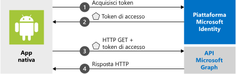

# <a name="quickstart-sign-in-users-and-call-the-microsoft-graph-api-from-an-android-app"></a>Guida introduttiva: Accesso utenti e chiamata dell'API Microsoft Graph da un'app di Android

[!INCLUDE [active-directory-develop-applies-v2-msal](../../../includes/active-directory-develop-applies-v2-msal.md)]

Questa guida introduttiva contiene un esempio di codice che illustra come un'applicazione Android può concedere l'accesso ad account personali, di lavoro o dell'istituto di istruzione, ottenere un token di accesso e chiamare l'API Graph di Microsoft.



> [!NOTE]
> **Prerequisiti**
> * Android Studio 
> * Android 16+ (obbligatorio) 


> [!div renderon="docs"]
> ## <a name="register-and-download-your-quickstart-app"></a>Registrare e scaricare l'app della guida introduttiva
> Per avviare l'applicazione della guida introduttiva sono disponibili due opzioni:
> * [Rapida] [Opzione 1: Registrare e configurare automaticamente l'app e quindi scaricare l'esempio di codice](#option-1-register-and-auto-configure-your-app-and-then-download-your-code-sample)
> * [Manuale] [Opzione 2: Registrare e configurare manualmente l'applicazione e il codice di esempio](#option-2-register-and-manually-configure-your-application-and-code-sample)
>
> ### <a name="option-1-register-and-auto-configure-your-app-and-then-download-your-code-sample"></a>Opzione 1: Registrare e configurare automaticamente l'app e quindi scaricare l'esempio di codice
> #### <a name="step-1-register-your-application"></a>Passaggio 1: Registrare l'applicazione
> Per registrare l'app
> 1. Passare al nuovo riquadro [Portale di Azure - Registrazioni app](https://portal.azure.com/#blade/Microsoft_AAD_RegisteredApps/applicationsListBlade/quickStartType/AndroidQuickstartPage/sourceType/docs).
> 1. Immettere un nome per l'applicazione e fare clic su **Registra**.
> 1. Seguire le istruzioni per scaricare e configurare automaticamente la nuova applicazione con un clic.
>
> ### <a name="option-2-register-and-manually-configure-your-application-and-code-sample"></a>Opzione 2: Registrare e configurare manualmente l'applicazione e il codice di esempio
>
> #### <a name="step-1-register-your-application"></a>Passaggio 1: Registrare l'applicazione
> Per registrare l'applicazione e aggiungere manualmente le informazioni di registrazione dell'app alla soluzione, seguire questa procedura:
>
> 1. Passare alla pagina [Registrazioni app](https://aka.ms/MobileAppReg) di Microsoft Identity Platform per sviluppatori.
> 1. Selezionare **Nuova registrazione**.
> 1. Nella pagina **Registra un'applicazione** visualizzata immettere le informazioni di registrazione dell'applicazione.
>      - Nella sezione **Nome** immettere un nome di applicazione significativo che verrà visualizzato agli utenti dell'app, ad esempio `AndroidQuickstart`.
>      - È possibile ignorare le altre configurazioni in questa pagina. 
>      - Premere il pulsante `Register`.
> 1. Fare clic sulla nuova app e passare a `Authentication` > `Add Platform` > `Android`.    
>      - Immettere il nome del pacchetto dal progetto di Android Studio. 
>      - Generare un hash della firma. Fare riferimento al portale per le istruzioni.
> 1. Fare clic su `Configure` e salvare il JSON della ***configurazione MSAL*** per usarlo in seguito. 

> [!div renderon="portal" class="sxs-lookup"]
> #### <a name="step-1-configure-your-application"></a>Passaggio 1: Configurare l'applicazione
> Per il funzionamento dell'esempio di codice di questo argomento di avvio rapido è necessario aggiungere un URI di reindirizzamento compatibile con il broker di autenticazione. 
> > [!div renderon="portal" id="makechanges" class="nextstepaction"]
> > [Apporta questa modifica per me]()
>
> > [!div id="appconfigured" class="alert alert-info"]
> >  L'applicazione è configurata con questi attributi

#### <a name="step-2-download-the-project"></a>Passaggio 2: Scaricare il progetto

* [Scaricare il codice di esempio](https://github.com/Azure-Samples/active-directory-android-native-v2/archive/master.zip)

#### <a name="step-3-configure-your-project"></a>Passaggio 3: Configurare il progetto

> [!div renderon="docs"]
> Se in precedenza è stata selezionata l'opzione 1, è possibile ignorare questi passaggi. 

> [!div renderon="portal" class="sxs-lookup"]
> 1. Estrarre e aprire il progetto in Android Studio.
> 1. In **app** > **src** > **main** > **res** > **raw** aprire **auth_config.json**.
> 1. Modificare **auth_config.json** e sostituirlo con il JSON dal portale di Azure. Se si vogliono apportare manualmente le modifiche:
>    ```javascript
>    {
>       "client_id" : "Enter_the_Application_Id_Here",
>       "authorization_user_agent" : "DEFAULT",
>       "redirect_uri" : "Enter_the_Redirect_Uri_Here",
>       "authorities" : [
>          {
>             "type": "AAD",
>             "audience": {
>                "type": "Enter_the_Audience_Info_Here",
>                "tenant_id": "Enter_the_Tenant_Info_Here"
>             }
>          }
>       ]
>    }
>    ```
> 
> 1. In **app** > **manifests** aprire **AndroidManifest.xml**.
> 1. Incollare l'attività seguente nel nodo **manifest\application**: 
>    ```xml
>    <!--Intent filter to catch Microsoft's callback after Sign In-->
>    <activity
>        android:name="com.microsoft.identity.client.BrowserTabActivity">
>        <intent-filter>
>            <action android:name="android.intent.action.VIEW" />
>            <category android:name="android.intent.category.DEFAULT" />
>            <category android:name="android.intent.category.BROWSABLE" />
>            <data android:scheme="msauth"
>                android:host="Enter_the_Package_Name"
>                android:path="/Enter_the_Signature_Hash" />
>        </intent-filter>
>    </activity>
>    ```
> 1. Eseguire l'app. 

> [!div class="sxs-lookup" renderon="portal"]
> > [!NOTE]
> > Questo argomento di avvio rapido supporta Enter_the_Supported_Account_Info_Here.

> [!div renderon="docs"]
> 1. Estrarre e aprire il progetto in Android Studio.
> 1. In **app** > **res** > **raw** aprire **auth_config.json**.
> 1. Modificare **auth_config.json** e sostituirlo con il JSON dal portale di Azure. Se si vogliono apportare manualmente queste modifiche:
>    ```javascript
>    "client_id" : "ENTER_YOUR_APPLICATION_ID",
>    "redirect_uri": "ENTER_YOUR_REDIRECT_URI", 
>     ```
> 1. In **app** > **manifests** aprire **AndroidManifest.xml**.
> 1. Aggiungere l'attività seguente al nodo **manifest\application**. Questo frammento di codice registra un'attività **BrowserTabActivity** per consentire al sistema operativo di riavviare l'applicazione dopo il completamento dell'autenticazione:
>    ```xml
>    <!--Intent filter to catch Microsoft's callback after Sign In-->
>    <activity
>        android:name="com.microsoft.identity.client.BrowserTabActivity">
>        <intent-filter>
>            <action android:name="android.intent.action.VIEW" />
>            <category android:name="android.intent.category.DEFAULT" />
>            <category android:name="android.intent.category.BROWSABLE" />
>            <data android:scheme="msauth"
>                android:host="Enter_the_Package_Name"
>                android:path="/Enter_the_Decoded_Signature_Hash" />
>        </intent-filter>
>    </activity>
>    ```
> 1. Sostituire `Enter_the_Package_Name` e `Enter_the_Signature_Hash` con i valori registrati nel portale di Azure. 
> 1. Eseguire l'app. 

## <a name="more-information"></a>Altre informazioni

Leggere le sezioni seguenti per altre informazioni su questa guida introduttiva.

### <a name="getting-msal"></a>Ottenere MSAL

MSAL ([com.microsoft.identity.client](https://javadoc.io/doc/com.microsoft.identity.client/msal)) è la libreria usata per concedere l'accesso agli utenti e richiedere i token usati per accedere a un'API protetta da Microsoft Identity Platform. È possibile usare Gradle 3.0+ per l'installazione aggiungendo quanto segue in **Gradle Scripts** > **build.gradle (Module: app)** in **Dependencies**:

```gradle  
implementation 'com.android.volley:volley:1.1.1'
implementation 'com.microsoft.identity.client:msal:0.3.+'
```

### <a name="msal-initialization"></a>Inizializzazione della libreria MSAL

È possibile aggiungere il riferimento per la libreria MSAL aggiungendo il codice seguente:

```java
import com.microsoft.identity.client.*;
```

Inizializzare quindi la libreria MSAL usando il codice seguente:

```java
    sampleApp = new PublicClientApplication(
        this.getApplicationContext(),
        R.raw.auth_config);
```

> |Dove: ||
> |---------|---------|
> |`R.raw.auth_config` | questo file contiene le configurazioni per l'applicazione, tra cui l'ID app/client, il gruppo di destinatari dell'accesso, URI di reindirizzamento e diverse altre opzioni di personalizzazione. |

### <a name="requesting-tokens"></a>Richiesta di token

In MSAL sono disponibili due metodi per acquisire i token: `acquireToken` e `acquireTokenSilentAsync`

#### <a name="acquiretoken-getting-a-token-interactively"></a>acquireToken: Recupero di un token in modo interattivo

Alcune situazioni richiedono agli utenti di interagire con Microsoft Identity Platform. In questi casi, l'utente finale può dover selezionare il proprio account, immettere le credenziali o fornire il consenso alle autorizzazioni richieste dall'app. Ad esempio, 

* La prima volta che gli utenti accedono all'applicazione
* Se un utente reimposta la password, dovrà immettere le credenziali 
* Se il consenso viene revocato 
* Se l'app richiede esplicitamente il consenso. 
* Quando l'applicazione richiede l'accesso a una risorsa per la prima volta
* Quando è necessario eseguire l'autenticazione a più fattori o soddisfare altri criteri di accesso condizionale

```java
sampleApp.acquireToken(this, SCOPES, getAuthInteractiveCallback());
```

> |Dove:||
> |---------|---------|
> | `SCOPES` | Contiene gli ambiti richiesti, vale a dire `{ "user.read" }` per Microsoft Graph o `{ "<Application ID URL>/scope" }` per le API Web personalizzate (ad esempio, `api://<Application ID>/access_as_user`) |
> | `getAuthInteractiveCallback` | Callback eseguito quando il controllo passa nuovamente all'applicazione dopo l'autenticazione |

#### <a name="acquiretokensilent-getting-a-user-token-silently"></a>acquireTokenSilent: Acquisizione di un token utente in modo invisibile

Le app non dovrebbero richiedere agli utenti di accedere ogni volta che richiedono un token. Se l'utente ha già eseguito l'accesso, questo metodo consente alle app di richiedere i token in modo invisibile all'utente.

```java
    sampleApp.getAccounts(new PublicClientApplication.AccountsLoadedCallback() {
        @Override
        public void onAccountsLoaded(final List<IAccount> accounts) {

            if (!accounts.isEmpty()) {
                sampleApp.acquireTokenSilentAsync(SCOPES, accounts.get(0), getAuthSilentCallback());
            } else {
                /* No accounts */
            }
        }
    });
```

> |Dove:||
> |---------|---------|
> | `SCOPES` | Contiene gli ambiti richiesti, vale a dire `{ "user.read" }` per Microsoft Graph o `{ "<Application ID URL>/scope" }` per le API Web personalizzate (ad esempio, `api://<Application ID>/access_as_user`) |
> | `getAccounts(...)` | Contiene l'account per cui si sta provando a ottenere i token automaticamente |
> | `getAuthSilentCallback()` | Callback eseguito quando il controllo passa nuovamente all'applicazione dopo l'autenticazione |

## <a name="next-steps"></a>Passaggi successivi

### <a name="learn-the-steps-to-create-the-application-used-in-this-quickstart"></a>Informazioni sulla procedura per creare l'applicazione usata in questa guida introduttiva

Provare l'esercitazione Android per una guida dettagliata completa sulla creazione di applicazioni e di nuove funzionalità, tra cui una spiegazione completa di questa guida introduttiva.

> [!div class="nextstepaction"]
> [Esercitazione Android per le chiamate API Graph](https://docs.microsoft.com/azure/active-directory/develop/guidedsetups/active-directory-android)

### <a name="msal-for-android-library-wiki"></a>MSAL per wiki della libreria Android

Leggere altre informazioni sulla libreria MSAL per Android:

> [!div class="nextstepaction"]
> [MSAL per wiki della libreria Android](https://github.com/AzureAD/microsoft-authentication-library-for-android/wiki)

[!INCLUDE [Help and support](../../../includes/active-directory-develop-help-support-include.md)]

Contribuire al miglioramento di Microsoft Identity Platform. Completare un breve sondaggio di due domande per condividere la propria opinione.

> [!div class="nextstepaction"]
> [Sondaggio su Microsoft Identity Platform](https://forms.office.com/Pages/ResponsePage.aspx?id=v4j5cvGGr0GRqy180BHbRyKrNDMV_xBIiPGgSvnbQZdUQjFIUUFGUE1SMEVFTkdaVU5YT0EyOEtJVi4u)