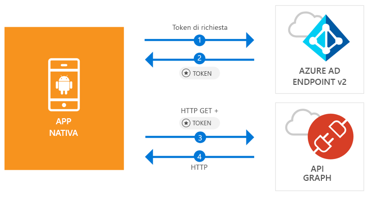

# <a name="quickstart-sign-in-users-and-call-the-microsoft-graph-api-from-an-android-app"></a>Guida introduttiva: Accesso per gli utenti e chiamata dell'API Microsoft Graph da un'app di Android

[!INCLUDE [active-directory-develop-applies-v2-msal](../../../includes/active-directory-develop-applies-v2-msal.md)]

Questa guida introduttiva contiene un esempio di codice che illustra come un'applicazione Android può concedere l'accesso ad account personali, di lavoro o dell'istituto di istruzione, ottenere un token di accesso e chiamare l'API Graph di Microsoft.



> [!NOTE]
> **Prerequisiti**
> * Android Studio 3 o versioni successive
> * È necessario Android SDK 21 o versione successiva (è consigliato SDK 27)

> [!div renderon="docs"]
> ## <a name="register-and-download"></a>Registrazione e download
> ### <a name="register-and-configure-your-application-and-code-sample"></a>Registrare e configurare l'applicazione e il codice di esempio
> #### <a name="step-1-register-your-application"></a>Passaggio 1: Registrare l'applicazione
> Per registrare l'applicazione e aggiungere le relative informazioni di registrazione alla soluzione, seguire questa procedura:
> 1. Passare al [portale di registrazione delle applicazioni Microsoft](https://apps.dev.microsoft.com/portal/register-app) per registrare un'applicazione.
> 1. Nella casella **Application Name** (Nome applicazione) immettere un nome per l'applicazione.
> 1. Verificare che la casella di controllo **Guided Setup** (Configurazione guidata) sia deselezionata e quindi selezionare **Create** (Crea).
> 1. Selezionare **Aggiungi piattaforma**, **Applicazione nativa** e quindi **Salva**.

> [!div renderon="portal" class="sxs-lookup"]
> #### <a name="step-1-configure-your-application"></a>Passaggio 1: Configurare l'applicazione
> Affinché il codice di esempio di questa guida introduttiva funzioni, è necessario aggiungere un URL di risposta come **msal{AppId}://auth** (dove {AppId} è l'ID applicazione dell'app).
> > [!div renderon="portal" id="makechanges" class="nextstepaction"]
> > [Apporta questa modifica per me]()
>
> > [!div id="appconfigured" class="alert alert-info"]
> >  l'applicazione è configurata con questi attributi

#### <a name="step-2-download-the-project"></a>Passaggio 2 : Scaricare il progetto

* [Scaricare il progetto Android Studio](https://github.com/Azure-Samples/active-directory-android-native-v2/archive/master.zip)

#### <a name="step-3-configure-your-project"></a>Passaggio 3: Configurare il progetto

1. Estrarre e aprire il progetto in Android Studio.
1. In **app** > **java** > **<i>{host}.{namespace}</i>** aprire **MainActivity**.
1. Sostituire la riga che inizia con `final static String CLIENT_ID` con:

    > [!div renderon="portal" class="sxs-lookup"]
    > ```java
    > final static String CLIENT_ID = "ENTER_THE_APPLICATION_ID_HERE";
    > ```

    > [!div renderon="docs"]
    > ```java
    > final static String CLIENT_ID = "<ENTER_THE_APPLICATION_ID_HERE>";
    > ```

1. Aprire: **app** > **manifests** > **AndroidManifest.xml**.
1. Aggiungere l'attività seguente al nodo **manifest\application**. Questo frammento di codice registra un'attività **BrowserTabActivity** per consentire al sistema operativo di riavviare l'applicazione dopo il completamento dell'autenticazione:

    > [!div renderon="docs"]
    > ```xml
    > <!--Intent filter to capture System Browser calling back to our app after Sign In-->
    > <activity
    >     android:name="com.microsoft.identity.client.BrowserTabActivity">
    >     <intent-filter>
    >         <action android:name="android.intent.action.VIEW" />
    >         <category android:name="android.intent.category.DEFAULT" />
    >         <category android:name="android.intent.category.BROWSABLE" />
    > 
    >         <!--Add in your scheme/host from registered redirect URI-->
    >         <!--By default, the scheme should be similar to 'msal[appId]' -->
    >         <data android:scheme="msal<ENTER_THE_APPLICATION_ID_HERE>"
    >             android:host="auth" />
    >     </intent-filter>
    > </activity>
    > ```

    > [!div renderon="portal" class="sxs-lookup"]
    > ```xml
    > <!--Intent filter to capture System Browser calling back to our app after Sign In-->
    > <activity
    >     android:name="com.microsoft.identity.client.BrowserTabActivity">
    >     <intent-filter>
    >         <action android:name="android.intent.action.VIEW" />
    >         <category android:name="android.intent.category.DEFAULT" />
    >         <category android:name="android.intent.category.BROWSABLE" />
    > 
    >         <!--Add in your scheme/host from registered redirect URI-->
    >         <!--By default, the scheme should be similar to 'msal[appId]' -->
    >         <data android:scheme="msalENTER_THE_APPLICATION_ID_HERE"
    >             android:host="auth" />
    >     </intent-filter>
    > </activity>
    > ```

> [!div renderon="docs"]
> <span>6.</span> Sostituire `<ENTER_THE_APPLICATION_ID_HERE>` con l'*ID della propria applicazione*. Se è necessario trovare l'*ID applicazione*, andare alla pagina *Panoramica*.

## <a name="more-information"></a>Altre informazioni

Leggere le sezioni seguenti per altre informazioni su questa guida introduttiva.

### <a name="msal"></a>MSAL

MSAL ([com.microsoft.identity.client](http://javadoc.io/doc/com.microsoft.identity.client/msal)) è la libreria usata per concedere l'accesso agli utenti e richiedere i token usati per accedere a un'API protetta da Microsoft Azure Active Directory (Azure AD). È possibile usare Gradle per l'installazione aggiungendo quanto segue in **Gradle Scripts** > **build.gradle (Module: app)** in **Dependencies**:

```gradle  
implementation 'com.android.volley:volley:1.1.1'
implementation 'com.microsoft.identity.client:msal:0.1.+'
```

### <a name="msal-initialization"></a>Inizializzazione della libreria MSAL

È possibile aggiungere il riferimento per la libreria MSAL aggiungendo il codice seguente:

```java
import com.microsoft.identity.client.*;
```

Inizializzare quindi la libreria MSAL usando il codice seguente:

```java
sampleApp = new PublicClientApplication(
        this.getApplicationContext(),
        CLIENT_ID);
```

> |Dove: ||
> |---------|---------|
> |`CLIENT_ID` | ID dell'applicazione registrata in *portal.azure.com* |

### <a name="requesting-tokens"></a>Richiesta di token

In MSAL sono disponibili due metodi per acquisire i token: `acquireToken` e `acquireTokenSilentAsync`

#### <a name="getting-a-user-token-interactively"></a>Acquisizione di un token utente in modo interattivo

Alcune situazioni richiedono di forzare gli utenti a interagire con l'endpoint v2.0 di Azure AD, determinando un cambio di contesto per il browser del sistema per convalidare le credenziali dell'utente o per il consenso. Di seguito sono riportati alcuni esempi:

* La prima volta che gli utenti accedono all'applicazione
* Quando gli utenti devono immettere nuovamente le credenziali perché la password è scaduta
* Quando l'applicazione richiede l'accesso a una risorsa per cui è necessario il consenso dell'utente
* Quando è necessaria l'autenticazione a due fattori

```java
sampleApp.acquireToken(this, SCOPES, getAuthInteractiveCallback());
```

> |Dove:||
> |---------|---------|
> | `SCOPES` | Contiene gli ambiti richiesti, vale a dire `{ "user.read" }` per Microsoft Graph o `{ "<Application ID URL>/scope" }` per le API Web personalizzate (ad esempio, `api://<Application ID>/access_as_user`) |
> | `getAuthInteractiveCallback` | Callback eseguito quando il controllo passa nuovamente all'applicazione dopo l'autenticazione |

#### <a name="getting-a-user-token-silently"></a>Acquisizione di un token utente in modo invisibile

Non si desidera richiedere all'utente di convalidare le proprie credenziali ogni volta che deve accedere a una risorsa. La maggior parte delle volte si desidera che le acquisizioni e i rinnovi dei token avvengano senza alcuna interazione da parte dell'utente. È possibile usare il metodo `AcquireTokenSilentAsync` per ottenere i token per accedere alle risorse protette dopo il metodo `acquireToken` iniziale:

```java
sampleApp.acquireToken(getActivity(), SCOPES, getAuthInteractiveCallback());
```

> |Dove:||
> |---------|---------|
> | `SCOPES` | Contiene gli ambiti richiesti, vale a dire `{ "user.read" }` per Microsoft Graph o `{ "<Application ID URL>/scope" }` per le API Web personalizzate (ad esempio, `api://<Application ID>/access_as_user`) |
> | `getAuthInteractiveCallback` | Callback eseguito quando il controllo passa nuovamente all'applicazione dopo l'autenticazione |

## <a name="next-steps"></a>Passaggi successivi

### <a name="learn-the-steps-to-create-the-application-used-in-this-quickstart"></a>Informazioni sulla procedura per creare l'applicazione usata in questa guida introduttiva

Provare l'esercitazione Android per una guida dettagliata completa sulla creazione di applicazioni e di nuove funzionalità, tra cui una spiegazione completa di questa guida introduttiva.

> [!div class="nextstepaction"]
> [Esercitazione Android per le chiamate API Graph](https://docs.microsoft.com/azure/active-directory/develop/guidedsetups/active-directory-android)

### <a name="msal-for-android-library-wiki"></a>MSAL per wiki della libreria Android

Leggere altre informazioni sulla libreria MSAL per Android:

> [!div class="nextstepaction"]
> [MSAL per wiki della libreria Android](https://github.com/AzureAD/microsoft-authentication-library-for-android/wiki)

[!INCLUDE [Help and support](../../../includes/active-directory-develop-help-support-include.md)]