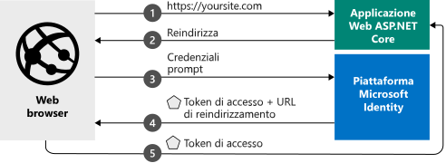

# <a name="quickstart-add-sign-in-with-microsoft-to-an-aspnet-core-web-app"></a>Avvio rapido: Aggiungere l'accesso con Microsoft a un'app Web ASP.NET Core

In questa guida introduttiva si usa un esempio di codice per illustrare in che modo l'app Web ASP.NET Core può consentire l'accesso ad account personali (hotmail.com, outlook.com e di altro tipo) e account aziendali e dell'istituto di istruzione da qualsiasi istanza di Azure Active Directory (Azure AD). Per un'illustrazione, vedere [Funzionamento dell'esempio](#how-the-sample-works).

> [!div renderon="docs"]
> ## <a name="prerequisites"></a>Prerequisiti
>
> * [Visual Studio 2019](https://visualstudio.microsoft.com/vs/) o [Visual Studio Code](https://code.visualstudio.com/)
> * [.NET Core SDK 3.1+](https://dotnet.microsoft.com/download)
>
> ## <a name="register-and-download-your-quickstart-app"></a>Registrare e scaricare l'app della guida introduttiva
> Per avviare l'applicazione della guida introduttiva sono disponibili due opzioni:
> * [Rapida] [Opzione 1: Registrare e configurare automaticamente l'app e quindi scaricare l'esempio di codice](#option-1-register-and-auto-configure-your-app-and-then-download-your-code-sample)
> * [Manuale] [Opzione 2: Registrare e configurare manualmente l'applicazione e il codice di esempio](#option-2-register-and-manually-configure-your-application-and-code-sample)
>
> ### <a name="option-1-register-and-auto-configure-your-app-and-then-download-your-code-sample"></a>Opzione 1: Registrare e configurare automaticamente l'app e quindi scaricare l'esempio di codice
>
> 1. Passare a [Registrazioni app nel portale di Azure](https://aka.ms/aspnetcore2-1-aad-quickstart-v2).
> 1. Immettere un nome per l'applicazione e fare clic su **Registra**.
> 1. Seguire le istruzioni per scaricare e configurare automaticamente la nuova applicazione con un clic.
>
> ### <a name="option-2-register-and-manually-configure-your-application-and-code-sample"></a>Opzione 2: Registrare e configurare manualmente l'applicazione e il codice di esempio
>
> #### <a name="step-1-register-your-application"></a>Passaggio 1: Registrare l'applicazione
> Per registrare l'applicazione e aggiungere manualmente le informazioni di registrazione dell'app alla soluzione, seguire questa procedura:
>
> 1. Accedere al [portale di Azure](https://portal.azure.com).
> 1. Se si accede a più tenant, usare il filtro **Directory e sottoscrizione** :::image type="icon" source="./media/common/portal-directory-subscription-filter.png" border="false"::: nel menu in alto e selezionare il tenant in cui si vuole registrare un'applicazione.
> 1. Cercare e selezionare **Azure Active Directory**.
> 1. In **Gestisci** selezionare **Registrazioni app** e quindi **Nuova registrazione**.
> 1. In **Nome** immettere un nome per l'applicazione, ad esempio `AspNetCore-Quickstart`. Tale nome, che potrebbe essere visualizzato dagli utenti dell'app, può essere modificato in un secondo momento.
> 1. Immettere `https://localhost:44321/` per **URI di reindirizzamento**
> 1. Selezionare **Registra**.
> 1. In **Gestisci** selezionare **Autenticazione**.
> 1. In **URI di reindirizzamento** selezionare **Aggiungi URI** e quindi immettere `https://localhost:44321/signin-oidc`
> 1. Immettere `https://localhost:44321/signout-oidc` per **URI di disconnessione**
> 1. In **Concessione implicita** selezionare **Token ID**.
> 1. Selezionare **Salva**.

> [!div class="sxs-lookup" renderon="portal"]
> #### <a name="step-1-configure-your-application-in-the-azure-portal"></a>Passaggio 1: Configurare l'applicazione nel portale di Azure
> Per il funzionamento dell'esempio di codice per questa guida introduttiva, è necessario aggiungere `https://localhost:44321/` e `https://localhost:44321/signin-oidc` come URL di risposta e `https://localhost:44321/signout-oidc` come URL di disconnessione e richiedere il rilascio di token ID da parte dell'endpoint di autorizzazione.
> > [!div renderon="portal" id="makechanges" class="nextstepaction"]
> > [Apporta questa modifica per me]()
>
> > [!div id="appconfigured" class="alert alert-info"]
> >  L'applicazione è configurata con questi attributi.

#### <a name="step-2-download-your-aspnet-core-project"></a>Passaggio 2: Scaricare il progetto ASP.NET Core

> [!div renderon="docs"]
> [Scaricare la soluzione ASP.NET Core](https://github.com/Azure-Samples/active-directory-aspnetcore-webapp-openidconnect-v2/archive/aspnetcore3-1.zip)

> [!div renderon="portal" class="sxs-lookup"]
> Eseguire il progetto.

> [!div renderon="portal" class="sxs-lookup" id="autoupdate" class="nextstepaction"]
> [Scaricare il codice di esempio](https://github.com/Azure-Samples/active-directory-aspnetcore-webapp-openidconnect-v2/archive/aspnetcore3-1.zip)

> [!div class="sxs-lookup" renderon="portal"]
> #### <a name="step-3-your-app-is-configured-and-ready-to-run"></a>Passaggio 3: L'app è configurata e pronta per l'esecuzione
> Il progetto è stato configurato con i valori delle proprietà dell'app ed è pronto per essere eseguito.
> [!div class="sxs-lookup" renderon="portal"]
> > [!NOTE]
> > `Enter_the_Supported_Account_Info_Here`
> [!div renderon="docs"]
> #### <a name="step-3-configure-your-aspnet-core-project"></a>Passaggio 3: Configurare il progetto ASP.NET Core
> 1. Estrarre l'archivio ZIP in una cartella locale vicina alla radice dell'unità. Ad esempio, in *C:\Azure-Samples*.
> 1. Aprire la soluzione in Visual Studio 2019.
> 1. Aprire il file *appsettings.json* e modificare quanto segue:
>
>    ```json
>    "ClientId": "Enter_the_Application_Id_here",
>    "TenantId": "common",
>    ```
>
>    - Sostituire `Enter_the_Application_Id_here` con il valore di **ID applicazione (client)** dell'applicazione registrata nel portale di Azure. **ID applicazione (client)** si trova nella pagina **Panoramica** dell'app.
>    - Sostituire `common` con uno dei seguenti elementi:
>       - Se l'applicazione supporta **Account solo in questa directory dell'organizzazione** sostituire questo valore con l'**ID della directory (tenant)** (un GUID) o il **nome del tenant** (ad esempio, `contoso.onmicrosoft.com`). È possibile trovare l'**ID della directory (tenant)** nella pagina **Panoramica** dell'app.
>       - Se l'applicazione supporta **Account in qualsiasi directory organizzativa**, sostituire questo valore con `organizations`
>       - Se l'applicazione supporta **Tutti gli utenti di account Microsoft**, lasciare il valore `common`
>
> Per questa guida di avvio rapido, non modificare altri valori nel file *appsettings.json*.
>
> #### <a name="step-4-build-and-run-the-application"></a>Passaggio 4: Compilare ed eseguire l'applicazione
>
> Compilare ed eseguire l'app in Visual Studio selezionando il menu **Debug** > **Avvia debug** oppure premendo `F5`.
>
> Viene chiesto di immettere le credenziali e quindi di concedere le autorizzazioni richieste dall'app. Selezionare **Accetta** nella richiesta di consenso.
>
> :::image type="content" source="media/quickstart-v2-aspnet-core-webapp/webapp-01-consent.png" alt-text="Finestra di dialogo di consenso che mostra le autorizzazioni richieste dall'app all'utente >":::
>
> Dopo aver acconsentito alle autorizzazioni richieste, l'app comunica che l'accesso è stato eseguito correttamente con le credenziali di Azure Active Directory.
>
> :::image type="content" source="media/quickstart-v2-aspnet-core-webapp/webapp-02-signed-in.png" alt-text="Finestra di dialogo di consenso che mostra le autorizzazioni richieste dall'app all'utente >":::

## <a name="more-information"></a>Ulteriori informazioni

Questa sezione include una panoramica del codice necessario per consentire l'accesso degli utenti. Questa panoramica è utile per comprendere il funzionamento del codice, conoscere gli argomenti principali e anche se si intende aggiungere l'accesso a un'applicazione ASP.NET Core esistente.

### <a name="how-the-sample-works"></a>Funzionamento dell'esempio


### <a name="startup-class"></a>Classe di avvio

Il middleware *Microsoft.AspNetCore.Authentication* usa una classe `Startup` che viene eseguita quando viene inizializzato il processo di hosting:

```csharp
  public void ConfigureServices(IServiceCollection services)
  {
      services.AddAuthentication(OpenIdConnectDefaults.AuthenticationScheme)
          .AddMicrosoftIdentityWebApp(Configuration.GetSection("AzureAd"));

      services.AddControllersWithViews(options =>
      {
          var policy = new AuthorizationPolicyBuilder()
              .RequireAuthenticatedUser()
              .Build();
          options.Filters.Add(new AuthorizeFilter(policy));
      });
      services.AddRazorPages()
          .AddMicrosoftIdentityUI();
  }
```

Il metodo `AddAuthentication()` configura il servizio in modo da aggiungere l'autenticazione basata su cookie (usata in scenari con browser) e impostare la richiesta su OpenID Connect.

La riga contenente `.AddMicrosoftIdentityWebApp` aggiunge l'autenticazione di Microsoft Identity Platform all'applicazione. Viene quindi configurata per l'accesso tramite l'endpoint di Microsoft Identity Platform in base alle informazioni disponibili nella sezione `AzureAD` del file di configurazione *appsettings.json*:

| Chiave *appsettings.json* | Descrizione                                                                                                                                                          |
|------------------------|----------------------------------------------------------------------------------------------------------------------------------------------------------------------|
| `ClientId`             | **ID applicazione (client)** dell'applicazione registrata nel portale di Azure.                                                                                       |
| `Instance`             | Endpoint del servizio token di sicurezza (STS) per l'autenticazione dell'utente. Questo valore è in genere `https://login.microsoftonline.com/`, che indica il cloud pubblico di Azure. |
| `TenantId`             | Nome del tenant o dell'ID tenant (GUID) oppure *common* per l'accesso agli utenti con account aziendali o dell'istituto di istruzione o account personali Microsoft.                             |

Il metodo `Configure()` contiene due metodi importanti, `app.UseCookiePolicy()` e `app.UseAuthentication()`, che abilitano la funzionalità denominata.

```csharp
// This method gets called by the runtime. Use this method to configure the HTTP request pipeline.
public void Configure(IApplicationBuilder app, IHostingEnvironment env)
{
    // more code
    app.UseAuthentication();
    app.UseAuthorization();
    // more code
}
```

### <a name="protect-a-controller-or-a-controllers-method"></a>Proteggere un controller o un metodo del controller

È possibile proteggere un controller o i metodi del controller usando l'attributo `[Authorize]`. Questo attributo limita l'accesso al controller o ai metodi ai soli utenti autenticati. La richiesta di autenticazione per l'accesso al controller può quindi essere avviata se l'utente non è autenticato.

[!INCLUDE [Help and support](../../../includes/active-directory-develop-help-support-include.md)]

## <a name="next-steps"></a>Passaggi successivi

Il repository GitHub che contiene questa esercitazione su ASP.NET Core include istruzioni e altri esempi di codice che illustrano come:

- Aggiungere l'autenticazione per una nuova API Web ASP.NET Core
- Chiamare Microsoft Graph, altre API Microsoft o API Web personalizzate
- Aggiungere l'autorizzazione
- Consentire agli utenti di accedere a cloud nazionali o con identità di social networking

> [!div class="nextstepaction"]
> [Esercitazioni sulle API Web ASP.NET Core in GitHub](https://github.com/Azure-Samples/active-directory-aspnetcore-webapp-openidconnect-v2/)
