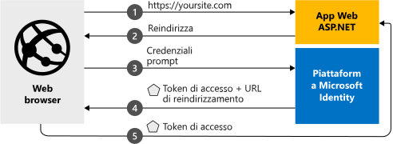

# <a name="quickstart-add-sign-in-with-microsoft-to-an-aspnet-web-app"></a>Guida introduttiva: Aggiungere l'accesso con Microsoft a un'app Web ASP.NET

[!INCLUDE [active-directory-develop-applies-v2](../../../includes/active-directory-develop-applies-v2.md)]

Questa guida introduttiva descrive come un'app Web ASP.NET può consentire l'accesso ad account personali (hotmail.com, outlook.com e altri), aziendali o dell'istituto di istruzione da una qualsiasi istanza di Azure Active Directory (Azure AD).



> [!div renderon="docs"]
> ## <a name="register-and-download-your-quickstart-app"></a>Registrare e scaricare l'app della guida introduttiva
> Per avviare l'applicazione della guida introduttiva sono disponibili due opzioni:
> * [Rapida] [Opzione 1: Registrare e configurare automaticamente l'app e quindi scaricare l'esempio di codice](#option-1-register-and-auto-configure-your-app-and-then-download-your-code-sample)
> * [Manuale] [Opzione 2: Registrare e configurare manualmente l'applicazione e il codice di esempio](#option-2-register-and-manually-configure-your-application-and-code-sample)
>
> ### <a name="option-1-register-and-auto-configure-your-app-and-then-download-your-code-sample"></a>Opzione 1: Registrare e configurare automaticamente l'app e quindi scaricare l'esempio di codice
>
> 1. Passare al nuovo riquadro [Portale di Azure - Registrazioni app](https://portal.azure.com/#blade/Microsoft_AAD_RegisteredApps/applicationsListBlade/quickStartType/AspNetWebAppQuickstartPage/sourceType/docs).
> 1. Immettere un nome per l'applicazione e fare clic su **Registra**.
> 1. Seguire le istruzioni per scaricare e configurare automaticamente la nuova applicazione con un clic.
>
> ### <a name="option-2-register-and-manually-configure-your-application-and-code-sample"></a>Opzione 2: Registrare e configurare manualmente l'applicazione e il codice di esempio
>
> #### <a name="step-1-register-your-application"></a>Passaggio 1: Registrare l'applicazione
> Per registrare l'applicazione e aggiungere manualmente le informazioni di registrazione dell'app alla soluzione, seguire questa procedura:
>
> 1. Accedere al [portale di Azure](https://portal.azure.com) con un account aziendale o dell'istituto di istruzione oppure con un account Microsoft personale.
> 1. Se l'account consente di accedere a più tenant, selezionare l'account nell'angolo in alto a destra e impostare la sessione del portale sul tenant di Azure Active Directory desiderato.
> 1. Passare alla pagina [Registrazioni app](https://go.microsoft.com/fwlink/?linkid=2083908) di Microsoft Identity Platform per sviluppatori.
> 1. Selezionare **Nuova registrazione**.
> 1. Nella pagina **Registra un'applicazione** visualizzata immettere le informazioni di registrazione dell'applicazione.
>      - Nella sezione **Nome** immettere un nome di applicazione significativo che verrà visualizzato agli utenti dell'app, ad esempio `ASPNET-Quickstart`.
>      - Aggiungere `https://localhost:44368/` in **URI di reindirizzamento** e fare clic su **Registra**.
Selezionare il menu **Autenticazione**, impostare **Token ID** in **Concessione implicita** e quindi selezionare **Salva**.

> [!div class="sxs-lookup" renderon="portal"]
> #### <a name="step-1-configure-your-application-in-azure-portal"></a>Passaggio 1: Configurare l'applicazione nel portale di Azure
> Per il funzionamento dell'esempio di codice di questa guida introduttiva è necessario aggiungere un URL di risposta come `https://localhost:44368/`.
> > [!div renderon="portal" id="makechanges" class="nextstepaction"]
> > [Apporta questa modifica per me]()
>
> > [!div id="appconfigured" class="alert alert-info"]
> >  L'applicazione è configurata con questo attributo

#### <a name="step-2-download-your-project"></a>Passaggio 2: Scaricare il progetto

[Scaricare la soluzione di Visual Studio 2017](https://github.com/AzureADQuickStarts/AppModelv2-WebApp-OpenIDConnect-DotNet/archive/master.zip).

#### <a name="step-3-configure-your-visual-studio-project"></a>Passaggio 3: Configurare il progetto di Visual Studio

1. Estrarre il file con estensione zip in una cartella locale vicina alla cartella radice, ad esempio **C:\Azure-Samples**
1. Aprire la soluzione in Visual Studio (AppModelv2-WebApp-OpenIDConnect-DotNet.sln)
1. A seconda della versione di Visual Studio, potrebbe essere necessario fare clic con il pulsante destro del mouse sul progetto `AppModelv2-WebApp-OpenIDConnect-DotNet` e su **Ripristina pacchetti NuGet**
1. Modificare **Web.config** e sostituire i parametri `ClientId` e `Tenant` con le righe seguenti:

    ```xml
    <add key="ClientId" value="Enter_the_Application_Id_here" />
    <add key="Tenant" value="Enter_the_Tenant_Info_Here" />
    ```

> [!div renderon="docs"]
> Dove:
> - `Enter_the_Application_Id_here` è l'ID applicazione dell'applicazione registrata.
> - `Enter_the_Tenant_Info_Here` è una delle opzioni riportate di seguito.
>   - Se l'applicazione supporta **Solo l'organizzazione personale**, sostituire questo valore con l'**ID tenant** o il **nome del tenant** (ad esempio, contoso.microsoft.com)
>   - Se l'applicazione supporta **Account in qualsiasi directory organizzativa**, sostituire questo valore con `organizations`
>   - Se l'applicazione supporta **Tutti gli utenti di account Microsoft**, sostituire questo valore con `common`
>
> > [!TIP]
> > Per trovare i valori di *ID applicazione*, *ID della directory (tenant)* e *Tipi di account supportati*, passare alla pagina **Panoramica**.

## <a name="more-information"></a>Altre informazioni

Questa sezione include una panoramica del codice necessario per consentire l'accesso degli utenti. La panoramica aiuta a capire il funzionamento del codice, gli argomenti principali e anche se si desidera aggiungere l'accesso a un'applicazione ASP.NET esistente.

### <a name="owin-middleware-nuget-packages"></a>Pacchetti NuGet middleware OWIN

È possibile impostare la pipeline di autenticazione con l'autenticazione basata su cookie usando OpenID Connect in ASP.NET con i pacchetti middleware OWIN. È possibile installare questi pacchetti eseguendo i comandi seguenti nella **Console di Gestione pacchetti** di Visual Studio:

```powershell
Install-Package Microsoft.Owin.Security.OpenIdConnect
Install-Package Microsoft.Owin.Security.Cookies
Install-Package Microsoft.Owin.Host.SystemWeb  
```

### <a name="owin-startup-class"></a>Classe di avvio OWIN

Il middleware OWIN usa una *classe di avvio* che viene eseguita in seguito all'inizializzazione del processo di hosting (nel caso di questa guida introduttiva il file *startup.cs* che si trova nella cartella radice). Il codice seguente mostra il parametro usato da questa guida introduttiva:

```csharp
public void Configuration(IAppBuilder app)
{
    app.SetDefaultSignInAsAuthenticationType(CookieAuthenticationDefaults.AuthenticationType);

    app.UseCookieAuthentication(new CookieAuthenticationOptions());
    app.UseOpenIdConnectAuthentication(
        new OpenIdConnectAuthenticationOptions
        {
            // Sets the ClientId, authority, RedirectUri as obtained from web.config
            ClientId = clientId,
            Authority = authority,
            RedirectUri = redirectUri,
            // PostLogoutRedirectUri is the page that users will be redirected to after sign-out. In this case, it is using the home page
            PostLogoutRedirectUri = redirectUri,
            Scope = OpenIdConnectScope.OpenIdProfile,
            // ResponseType is set to request the id_token - which contains basic information about the signed-in user
            ResponseType = OpenIdConnectResponseType.IdToken,
            // ValidateIssuer set to false to allow personal and work accounts from any organization to sign in to your application
            // To only allow users from a single organizations, set ValidateIssuer to true and 'tenant' setting in web.config to the tenant name
            // To allow users from only a list of specific organizations, set ValidateIssuer to true and use ValidIssuers parameter
            TokenValidationParameters = new TokenValidationParameters()
            {
                ValidateIssuer = false // Simplification (see note below)
            },
            // OpenIdConnectAuthenticationNotifications configures OWIN to send notification of failed authentications to OnAuthenticationFailed method
            Notifications = new OpenIdConnectAuthenticationNotifications
            {
                AuthenticationFailed = OnAuthenticationFailed
            }
        }
    );
}
```

> |Where  |  |
> |---------|---------|
> | `ClientId`     | ID dell'applicazione registrata nel portale di Azure |
> | `Authority`    | Endpoint del servizio token di sicurezza per l'utente da autenticare. In genere <https://login.microsoftonline.com/{tenant}/v2.0> per il cloud pubblico, dove {tenant} è il nome del tenant, l'ID del tenant, oppure *common* per un riferimento all'endpoint comune (usato per le applicazioni multi-tenant) |
> | `RedirectUri`  | URL a cui vengono indirizzati gli utenti dopo l'autenticazione con l'endpoint di Microsoft Identity Platform |
> | `PostLogoutRedirectUri`     | URL a cui vengono indirizzati gli utenti dopo la disconnessione |
> | `Scope`     | Elenco di ambiti richiesti, separati da spazi |
> | `ResponseType`     | Richiesta che la risposta dell'autenticazione contenga un ID token |
> | `TokenValidationParameters`     | Elenco di parametri per la convalida del token. In questo caso `ValidateIssuer` è impostato su `false` a indicare che può accettare accessi provenienti da tutti i tipi di account personale, aziendale o dell'istituto di istruzione |
> | `Notifications`     | Elenco di delegati che possono essere eseguiti su messaggi *OpenIdConnect* diversi |


> [!NOTE]
> L'impostazione di `ValidateIssuer = false` è una semplificazione per questo avvio rapido. Nelle applicazioni reali è necessario convalidare l'autorità di certificazione.
> Vedere gli esempi per comprendere come eseguire questa operazione.

### <a name="initiate-an-authentication-challenge"></a>Avviare una richiesta di autenticazione

È possibile indurre un utente a eseguire l'accesso inserendo una richiesta di autenticazione nel controller in uso:

```csharp
public void SignIn()
{
    if (!Request.IsAuthenticated)
    {
        HttpContext.GetOwinContext().Authentication.Challenge(
            new AuthenticationProperties{ RedirectUri = "/" },
            OpenIdConnectAuthenticationDefaults.AuthenticationType);
    }
}
```

> [!TIP]
> L'aggiunta di una richiesta di autenticazione tramite questo metodo è facoltativa e in genere viene usata quando si desidera che sia gli utenti autenticati che quelli non autenticati possano accedere a una visualizzazione. È possibile in alternativa proteggere i controller usando il metodo descritto nella sezione successiva.

### <a name="protect-a-controller-or-a-controllers-method"></a>Proteggere un controller o un metodo del controller

È possibile proteggere un controller o azioni del controller usando l'attributo `[Authorize]`. Questo attributo limita l'accesso al controller o alle azioni consentendo solo agli utenti autenticati di accedere alle azioni del controller. Questo significa che la richiesta di autenticazione verrà eseguita automaticamente quando un utente *non autenticato* tenta di accedere a una delle azioni o al controller dotato dell'attributo `[Authorize]`.

## <a name="next-steps"></a>Passaggi successivi

Provare l'esercitazione per ASP.NET per una guida dettagliata completa sulla creazione di applicazioni e nuove funzionalità, tra cui una spiegazione completa di questa guida introduttiva.

### <a name="learn-the-steps-to-create-the-application-used-in-this-quickstart"></a>Informazioni sulla procedura per creare l'applicazione usata in questa guida introduttiva

> [!div class="nextstepaction"]
> [Esercitazione sull'accesso](./tutorial-v2-asp-webapp.md)

[!INCLUDE [Help and support](../../../includes/active-directory-develop-help-support-include.md)]
