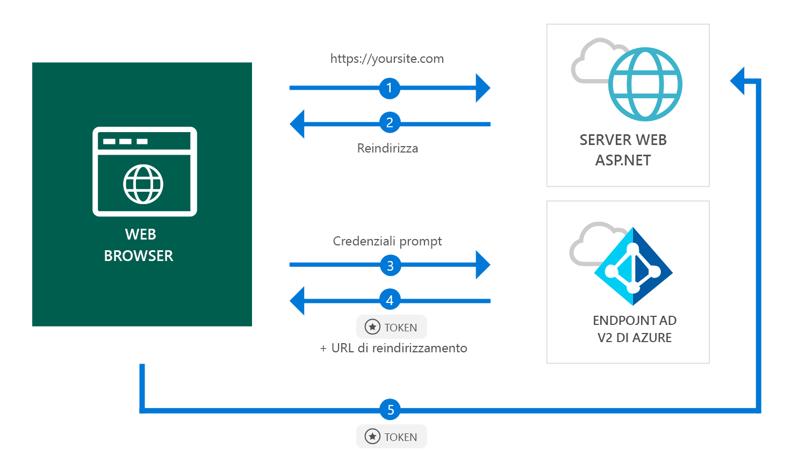

# <a name="quickstart-add-sign-in-with-microsoft-to-an-aspnet-web-app"></a>Guida introduttiva: Aggiungere l'accesso con Microsoft a un'app Web ASP.NET

[!INCLUDE [active-directory-develop-applies-v2](../../../includes/active-directory-develop-applies-v2.md)]

Questa guida introduttiva descrive come un'app Web ASP.NET può consentire l'accesso ad account personali (hotmail.com, outlook.com e altri), aziendali o dell'istituto di istruzione da una qualsiasi istanza di Azure Active Directory (Azure AD).



> [!div renderon="docs"]
> ## <a name="register-your-application-and-download-your-quickstart-app"></a>Registrare l'applicazione e scaricare l'app della guida introduttiva
>
> ### <a name="register-and-configure-your-application-and-code-sample"></a>Registrare e configurare l'applicazione e il codice di esempio
> #### <a name="step-1-register-your-application"></a>Passaggio 1: Registrare l'applicazione
> 
> 1. Passare al [portale di registrazione delle applicazioni Microsoft](https://apps.dev.microsoft.com/portal/register-app).
> 1. Specificare un nome per l'applicazione, assicurarsi che l'opzione **Installazione guidata** sia deselezionata e fare clic su **Crea**.
> 1. Fare clic su `Add Platform` e quindi selezionare `Web`.
> 1. Assicurarsi che l'opzione **Consenti il flusso implicito** sia *selezionata*.
> 1. In **URL di reindirizzamento** immettere `https://localhost:44368/`.
> 1. Scorrere in basso fino alla fine della pagina e fare clic su **Salva**.

> [!div class="sxs-lookup" renderon="portal"]
> #### <a name="step-1-configure-your-application-in-azure-portal"></a>Passaggio 1: Configurare l'applicazione nel portale di Azure
> Per il funzionamento dell'esempio di codice di questa guida introduttiva è necessario aggiungere un URL di risposta come `https://localhost:44368/`.
> > [!div renderon="portal" id="makechanges" class="nextstepaction"]
> > [Apporta questa modifica per me]()
>
> > [!div id="appconfigured" class="alert alert-info"]
> >  L'applicazione viene configurata con questo attributo

#### <a name="step-2-download-your-project"></a>Passaggio 2: Scaricare il progetto

[Scaricare la soluzione di Visual Studio 2017](https://github.com/AzureADQuickStarts/AppModelv2-WebApp-OpenIDConnect-DotNet/archive/master.zip).

#### <a name="step-3-configure-your-visual-studio-project"></a>Passaggio 3: Configurare il progetto di Visual Studio

1. Estrarre il file con estensione zip in una cartella locale vicina alla cartella radice, ad esempio **C:\Azure-Samples**
1. Aprire la soluzione in Visual Studio (AppModelv2-WebApp-OpenIDConnect-DotNet.sln)
1. Modificare il file **Web.config** e sostituire `Enter_the_Application_Id_here` con l'ID dell'applicazione già registrata:

    ```xml
    <add key="ClientId" value="Enter_the_Application_Id_here" />
    ```
    
> [!div class="sxs-lookup" renderon="portal"]
> [!IMPORTANT]
> Se l'applicazione è un'*applicazione a tenant singolo* (rivolta solo agli account in questa directory), nel file **Web.config** individuare il valore per `Tenant` e sostituire `common` con l'**ID tenant** o il **nome tenant** (ad esempio contoso.microsoft.com). È possibile ottenere il nome del tenant nella **pagina Panoramica**.

## <a name="more-information"></a>Altre informazioni

Questa sezione include una panoramica del codice necessario per consentire l'accesso degli utenti. La panoramica aiuta a capire il funzionamento del codice, gli argomenti principali e anche se si desidera aggiungere l'accesso a un'applicazione ASP.NET esistente.

### <a name="owin-middleware-nuget-packages"></a>Pacchetti NuGet middleware OWIN

È possibile impostare la pipeline di autenticazione con l'autenticazione basata su cookie usando OpenID Connect in ASP.NET con i pacchetti middleware OWIN. È possibile installare questi pacchetti eseguendo i comandi seguenti nella **Console di Gestione pacchetti** di Visual Studio:

```powershell
Install-Package Microsoft.Owin.Security.OpenIdConnect
Install-Package Microsoft.Owin.Security.Cookies
Install-Package Microsoft.Owin.Host.SystemWeb
```

### <a name="owin-startup-class"></a>Classe di avvio OWIN

Il middleware OWIN usa una *classe di avvio* che viene eseguita in seguito all'inizializzazione del processo di hosting (nel caso di questa guida introduttiva il file *startup.cs* che si trova nella cartella radice). Il codice seguente mostra il parametro usato da questa guida introduttiva:

```csharp
public void Configuration(IAppBuilder app)
{
    app.SetDefaultSignInAsAuthenticationType(CookieAuthenticationDefaults.AuthenticationType);

    app.UseCookieAuthentication(new CookieAuthenticationOptions());
    app.UseOpenIdConnectAuthentication(
        new OpenIdConnectAuthenticationOptions
        {
            // Sets the ClientId, authority, RedirectUri as obtained from web.config
            ClientId = clientId,
            Authority = authority,
            RedirectUri = redirectUri,
            // PostLogoutRedirectUri is the page that users will be redirected to after sign-out. In this case, it is using the home page
            PostLogoutRedirectUri = redirectUri,
            Scope = OpenIdConnectScope.OpenIdProfile,
            // ResponseType is set to request the id_token - which contains basic information about the signed-in user
            ResponseType = OpenIdConnectResponseType.IdToken,
            // ValidateIssuer set to false to allow personal and work accounts from any organization to sign in to your application
            // To only allow users from a single organizations, set ValidateIssuer to true and 'tenant' setting in web.config to the tenant name
            // To allow users from only a list of specific organizations, set ValidateIssuer to true and use ValidIssuers parameter 
            TokenValidationParameters = new TokenValidationParameters()
            {
                ValidateIssuer = false
            },
            // OpenIdConnectAuthenticationNotifications configures OWIN to send notification of failed authentications to OnAuthenticationFailed method
            Notifications = new OpenIdConnectAuthenticationNotifications
            {
                AuthenticationFailed = OnAuthenticationFailed
            }
        }
    );
}
```

> |Where  |  |
> |---------|---------|
> | `ClientId`     | ID dell'applicazione registrata nel portale di Azure |
> | `Authority`    | Endpoint del servizio token di sicurezza per l'utente da autenticare. In genere https://login.microsoftonline.com/{tenant}/v2.0 per il cloud pubblico, dove {tenant} è il nome del tenant, l'ID del tenant, oppure *common* per un riferimento all'endpoint comune (usato per le applicazioni multi-tenant) |
> | `RedirectUri`  | URL a cui vengono indirizzati gli utenti dopo l'autenticazione con l'endpoint di Azure AD v2.0 |
> | `PostLogoutRedirectUri`     | URL a cui vengono indirizzati gli utenti dopo la disconnessione |
> | `Scope`     | Elenco di ambiti richiesti, separati da spazi |
> | `ResponseType`     | Richiesta che la risposta dell'autenticazione contenga un ID token |
> | `TokenValidationParameters`     | Elenco di parametri per la convalida del token. In questo caso `ValidateIssuer` è impostato su `false` a indicare che può accettare accessi provenienti da tutti i tipi di account personale, aziendale o dell'istituto di istruzione |
> | `Notifications`     | Elenco di delegati che possono essere eseguiti su messaggi *OpenIdConnect* diversi |

### <a name="initiate-an-authentication-challenge"></a>Avviare una richiesta di autenticazione

È possibile indurre un utente a eseguire l'accesso inserendo una richiesta di autenticazione nel controller in uso:

```csharp
public void SignIn()
{
    if (!Request.IsAuthenticated)
    {
        HttpContext.GetOwinContext().Authentication.Challenge(
            new AuthenticationProperties{ RedirectUri = "/" },
            OpenIdConnectAuthenticationDefaults.AuthenticationType);
    }
}
```

> [!TIP]
> L'aggiunta di una richiesta di autenticazione tramite questo metodo è facoltativa e in genere viene usata quando si desidera che sia gli utenti autenticati che quelli non autenticati possano accedere a una visualizzazione. È possibile in alternativa proteggere i controller usando il metodo descritto nella sezione successiva.

### <a name="protect-a-controller-or-a-controllers-method"></a>Proteggere un controller o un metodo del controller

È possibile proteggere un controller o azioni del controller usando l'attributo `[Authorize]`. Questo attributo limita l'accesso al controller o alle azioni consentendo solo agli utenti autenticati di accedere alle azioni del controller. Questo significa che la richiesta di autenticazione verrà eseguita automaticamente quando un utente *non autenticato* tenta di accedere a una delle azioni o al controller dotato dell'attributo `[Authorize]`.

## <a name="next-steps"></a>Passaggi successivi

Provare l'esercitazione per ASP.NET per una guida dettagliata completa sulla creazione di applicazioni e nuove funzionalità, tra cui una spiegazione completa di questa guida introduttiva.

### <a name="learn-the-steps-to-create-the-application-used-in-this-quickstart"></a>Informazioni sulla procedura per creare l'applicazione usata in questa guida introduttiva

> [!div class="nextstepaction"]
> [Esercitazione sull'accesso](.\tutorial-v2-asp-webapp.md)

[!INCLUDE [Help and support](../../../includes/active-directory-develop-help-support-include.md)]