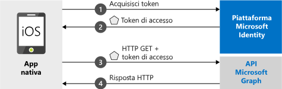

# <a name="quickstart-sign-in-users-and-call-the-microsoft-graph-api-from-an-ios-app"></a>Guida introduttiva: Accesso utenti e chiamata dell'API Microsoft Graph da un'app iOS

[!INCLUDE [active-directory-develop-applies-v2-msal](../../../includes/active-directory-develop-applies-v2-msal.md)]

Questa guida introduttiva contiene un esempio di codice che illustra come un'applicazione nativa iOS può eseguire l'accesso di account personali, di lavoro o dell'istituto di istruzione, ottenere un token di accesso e chiamare l'API Microsoft Graph.



> [!NOTE]
> **Prerequisiti**
> * XCode 10+
> * iOS 10+ 

> [!div renderon="docs"]
> ## <a name="register-and-download-your-quickstart-app"></a>Registrare e scaricare l'app della guida introduttiva
> Per avviare l'applicazione della guida introduttiva sono disponibili due opzioni:
> * [Rapida] [Opzione 1: Registrare e configurare automaticamente l'app e quindi scaricare l'esempio di codice](#option-1-register-and-auto-configure-your-app-and-then-download-your-code-sample)
> * [Manuale] [Opzione 2: Registrare e configurare manualmente l'applicazione e il codice di esempio](#option-2-register-and-manually-configure-your-application-and-code-sample)
>
> ### <a name="option-1-register-and-auto-configure-your-app-and-then-download-your-code-sample"></a>Opzione 1: Registrare e configurare automaticamente l'app e quindi scaricare l'esempio di codice
> #### <a name="step-1-register-your-application"></a>Passaggio 1: Registrare l'applicazione
> Per registrare l'app
> 1. Passare al nuovo riquadro [Portale di Azure - Registrazioni app](https://portal.azure.com/#blade/Microsoft_AAD_RegisteredApps/applicationsListBlade/quickStartType/IosQuickstartPage/sourceType/docs).
> 1. Immettere un nome per l'applicazione e fare clic su **Registra**.
> 1. Seguire le istruzioni per scaricare e configurare automaticamente la nuova applicazione con un clic.
>
> ### <a name="option-2-register-and-manually-configure-your-application-and-code-sample"></a>Opzione 2: Registrare e configurare manualmente l'applicazione e il codice di esempio
>
> #### <a name="step-1-register-your-application"></a>Passaggio 1: Registrare l'applicazione
> Per registrare l'applicazione e aggiungere manualmente le informazioni di registrazione dell'app alla soluzione, seguire questa procedura:
>
> 1. Passare alla pagina [Registrazioni app](https://aka.ms/MobileAppReg) di Microsoft Identity Platform per sviluppatori.
> 1. Selezionare **Nuova registrazione**.
> 1. Nella pagina **Registra un'applicazione** visualizzata immettere le informazioni di registrazione dell'applicazione.
>      - Nella sezione **Nome** immettere un nome di applicazione significativo che verrà visualizzato agli utenti dell'app quando eseguono l'accesso o forniscono il proprio consenso all'app, ad esempio `iOSQuickstart`.
>      - Ignorare le altre configurazioni in questa pagina. 
>      - Premere il pulsante `Register`.
> 1. Fare clic sulla nuova app e passare a `Authentication` > `Add Platform` > `iOS`.    
>      - Immettere il valore di ***Identificatore del bundle*** per l'applicazione. 
> 1. Fare clic su `Configure` e salvare i dati di ***Configurazione MSAL*** per usarli in seguito. 

> [!div renderon="portal" class="sxs-lookup"]
>
> #### <a name="step-1-configure-your-application"></a>Passaggio 1: Configurare l'applicazione
> Per il funzionamento dell'esempio di codice di questo argomento di avvio rapido è necessario aggiungere un URI di reindirizzamento compatibile con il broker di autenticazione. 
> > [!div renderon="portal" id="makechanges" class="nextstepaction"]
> > [Apporta questa modifica per me]()
>
> > [!div id="appconfigured" class="alert alert-info"]
> >  L'applicazione è configurata con questi attributi

#### <a name="step-2-download-your-web-server-or-project"></a>Passaggio 2: Scaricare il server Web o il progetto

- [Scaricare il codice di esempio](https://github.com/Azure-Samples/active-directory-ios-swift-native-v2/archive/master.zip)

#### <a name="step-3-configure-your-project"></a>Passaggio 3: Configurare il progetto

> [!div renderon="docs"]
> Se in precedenza è stata selezionata l'opzione 1, è possibile ignorare questi passaggi. 

> [!div renderon="portal" class="sxs-lookup"]
> 1. Estrarre il file con estensione zip e aprire il progetto in XCode.
> 1. Modificare **ViewController.swift** e sostituire la riga che inizia con 'let kClientID' con il frammento di codice seguente:
>    ```swift
>    let kClientID = "Enter_the_Application_Id_here"
>    let kAuthority = "https://login.microsoftonline.com/Enter_the_Tenant_Info_Here"
>
>    ```
> 1. Fare clic con il pulsante destro del mouse su **Info.plist** e scegliere **Apri come** > **Codice sorgente**.
> 1. Sotto il nodo radice dict sostituire il valore con il proprio ***ID bundle***:
>
>    ```xml
>    <key>CFBundleURLTypes</key>
>    <array>
>       <dict>
>          <key>CFBundleURLSchemes</key>
>          <array>
>             <string>msauth.Enter_the_Bundle_Id_Here</string>
>          </array>
>       </dict>
>    </array>
> 
>    ```
> 1. Compilare ed eseguire l'app. 

> [!div renderon="docs"]
>
> 1. Estrarre il file con estensione zip e aprire il progetto in XCode.
> 1. Modificare **ViewController.swift** e sostituire la riga che inizia con 'let kClientID' con il frammento di codice seguente:
>
>    ```swift
>    let kClientID = "<ENTER_YOUR_APPLICATION/CLIENT_ID>"
> 
>    ```
> 1. Fare clic con il pulsante destro del mouse su **Info.plist** e scegliere **Apri come** > **Codice sorgente**.
> 1. Sotto il nodo radice dict sostituire il valore con il proprio ***ID bundle***:
>
>    ```xml
>    <key>CFBundleURLTypes</key>
>    <array>
>       <dict>
>          <key>CFBundleURLSchemes</key>
>          <array>
>             <string>msauth.<ENTER_YOUR_BUNDLE_ID></string>
>          </array>
>       </dict>
>    </array>
>
>    ```
> 1. Compilare ed eseguire l'app. 

## <a name="more-information"></a>Altre informazioni

Leggere queste sezioni per altre informazioni su questa guida introduttiva.

### <a name="getting-msal"></a>Recupero di MSAL

MSAL ([MSAL.framework](https://github.com/AzureAD/microsoft-authentication-library-for-objc)) è la libreria usata per concedere l'accesso agli utenti e richiedere i token usati per accedere a un'API protetta da Microsoft Identity Platform. È possibile aggiungere la libreria MSAL all'applicazione usando la procedura seguente:

```
$ vi Podfile

```
Aggiungere il codice seguente al podfile (con la destinazione del progetto):

```
use_frameworks!

target 'MSALiOS' do
   pod 'MSAL', '~> 0.4.0'
end

```

### <a name="msal-initialization"></a>Inizializzazione della libreria MSAL

È possibile aggiungere il riferimento per la libreria MSAL aggiungendo il codice seguente:

```swift
import MSAL
```

Inizializzare quindi la libreria MSAL usando il codice seguente:

```swift
let authority = try MSALAADAuthority(url: URL(string: kAuthority)!)
            
let msalConfiguration = MSALPublicClientApplicationConfig(clientId: kClientID, redirectUri: nil, authority: authority)
self.applicationContext = try MSALPublicClientApplication(configuration: msalConfiguration)

```

> |Dove: ||
> |---------|---------|
> | `clientId` | ID dell'applicazione registrata in *portal.azure.com* |
> | `authority` | Endpoint di Microsoft Identity Platform. Nella maggior parte dei casi sarà *https<span/>://login.microsoftonline.com/common* |
> | `redirectUri` | URI di reindirizzamento dell'applicazione. È possibile passare nil per usare il valore predefinito oppure specificare un URI di reindirizzamento personalizzato. |

### <a name="additional-app-requirements"></a>Requisiti aggiuntivi per l'app  

L'app deve inoltre includere quanto segue nel relativo `AppDelegate`. In questo modo, quando si esegue l'autenticazione, MSAL SDK gestisce la risposta del token restituita dall'app broker di autenticazione.

 ```swift
 func application(_ app: UIApplication, open url: URL, options: [UIApplication.OpenURLOptionsKey : Any] = [:]) -> Bool {
         guard let sourceApplication = options[UIApplication.OpenURLOptionsKey.sourceApplication] as? String else {
             return false
         }
         
         return MSALPublicClientApplication.handleMSALResponse(url, sourceApplication: sourceApplication)
     }

```

Per l'app deve infine essere definita una voce `LSApplicationQueriesSchemes` in ***Info.plist*** insieme a `CFBundleURLTypes`. Nell'esempio queste informazioni sono incluse. 

   ```xml 
   <key>LSApplicationQueriesSchemes</key>
   <array>
      <string>msauth</string>
      <string>msauthv2</string>
   </array>
   ```

### <a name="sign-in-users--request-tokens"></a>Concedere l'accesso agli utenti e richiedere token

La libreria MSAL dispone di due metodi per acquisire i token: `acquireToken` e `acquireTokenSilent`

#### <a name="acquiretoken-getting-a-token-interactively"></a>acquireToken: Recupero di un token in modo interattivo

In alcune situazioni gli utenti devono interagire con Microsoft Identity Platform. È ad esempio possibile che l'utente finale debba selezionare il proprio account, immettere le credenziali o fornire il consenso alla richiesta di autorizzazioni dell'app. Ad esempio, 

* La prima volta che gli utenti accedono all'applicazione
* Se un utente reimposta la password, dovrà immettere le credenziali 
* Quando l'applicazione richiede l'accesso a una risorsa per la prima volta
* Quando è necessario eseguire l'autenticazione a più fattori o soddisfare altri criteri di accesso condizionale

```swift
let parameters = MSALInteractiveTokenParameters(scopes: kScopes)
applicationContext.acquireToken(with: parameters) { (result, error) in /* Add your handling logic */}
```

> |Dove:||
> |---------|---------|
> | `scopes` | Contiene gli ambiti richiesti, ovvero `[ "user.read" ]` per Microsoft Graph o `[ "<Application ID URL>/scope" ]` per le API Web personalizzate (`api://<Application ID>/access_as_user`) |

#### <a name="acquiretokensilent-getting-an-access-token-silently"></a>acquireTokenSilent: Recupero di un token di accesso in modo silenzioso

Le app non dovrebbero richiedere agli utenti di accedere ogni volta che richiedono un token. Se l'utente ha già eseguito l'accesso, questo metodo consente alle app di richiedere i token in modo invisibile all'utente. 

```swift
let parameters = MSALSilentTokenParameters(scopes: kScopes, account: applicationContext.allAccounts().first)
applicationContext.acquireTokenSilent(with: parameters) { (result, error) in /* Add your handling logic */}
```

> |Dove: ||
> |---------|---------|
> | `scopes` | Contiene gli ambiti richiesti, ovvero `[ "user.read" ]` per Microsoft Graph o `[ "<Application ID URL>/scope" ]` per le API Web personalizzate (`api://<Application ID>/access_as_user`) |
> | `account` | Indica l'account per il quale viene richiesto un token. Questo argomento di avvio rapido si riferisce a un'applicazione con singolo account. Se si vuole creare un'app con più account, è necessario definire la logica per identificare l'account da usare per le richieste di token `applicationContext.account(forHomeAccountId: self.homeAccountId)` |

## <a name="next-steps"></a>Passaggi successivi

Provare l'esercitazione per iOS per una guida dettagliata completa sulla creazione di applicazioni, tra cui una spiegazione completa di questo avvio rapido.

### <a name="learn-the-steps-to-create-the-application-used-in-this-quickstart"></a>Informazioni sulla procedura per creare l'applicazione usata in questa guida introduttiva

> [!div class="nextstepaction"]
> [Chiamare l'API Microsoft Graph da un'applicazione iOS](https://docs.microsoft.com/azure/active-directory/develop/guidedsetups/active-directory-ios)

[!INCLUDE [Help and support](../../../includes/active-directory-develop-help-support-include.md)]