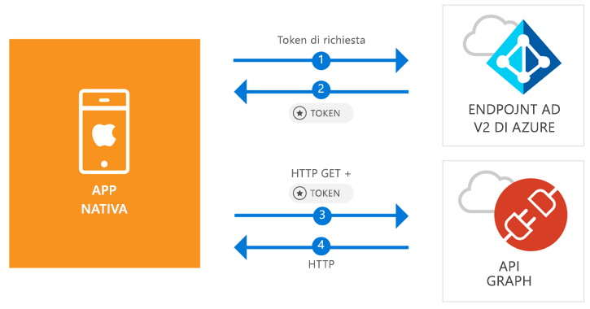

# <a name="quickstart-sign-in-users-and-call-the-microsoft-graph-api-from-an-ios-native-app"></a>Guida introduttiva: eseguire l'accesso degli utenti e chiamare l'API Microsoft Graph da un'app nativa iOS

[!INCLUDE [active-directory-develop-applies-v2-msal](../../../includes/active-directory-develop-applies-v2-msal.md)]

Questa guida introduttiva contiene un esempio di codice che illustra come un'applicazione nativa iOS può eseguire l'accesso di account personali, di lavoro o dell'istituto di istruzione, ottenere un token di accesso e chiamare l'API Microsoft Graph.



> [!div renderon="docs"]
> ## <a name="register-and-download"></a>Registrazione e download
> ### <a name="register-and-configure-your-application-and-code-sample"></a>Registrare e configurare l'applicazione e il codice di esempio
> #### <a name="step-1-register-your-application"></a>Passaggio 1: Registrare l'applicazione
> Per registrare l'applicazione e aggiungere le relative informazioni di registrazione alla soluzione, seguire questa procedura:
> 1. Passare al [portale di registrazione delle applicazioni Microsoft](https://apps.dev.microsoft.com/portal/register-app) per registrare un'applicazione.
> 1. Nella casella **Application Name** (Nome applicazione) immettere un nome per l'applicazione.
> 1. Verificare che la casella di controllo **Guided Setup** (Configurazione guidata) sia deselezionata e quindi selezionare **Create** (Crea).
> 1. Selezionare **Aggiungi piattaforma**, **Applicazione nativa** e quindi **Salva**.

> [!div renderon="portal" class="sxs-lookup"]
> #### <a name="step-1-configure-your-application"></a>Passaggio 1: Configurare l'applicazione
> Per far funzionare l'esempio di codice di questa guida introduttiva, è necessario aggiungere un URL di risposta come `msal<AppId>://auth`, dove msal<AppId> è l'ID di questa applicazione.
> > [!div renderon="portal" id="makechanges" class="nextstepaction"]
> > [Apporta questa modifica per me]()
>
> > [!div id="appconfigured" class="alert alert-info"]
> >  L'applicazione viene configurata con questo attributo

#### <a name="step-2-download-your-web-server-or-project"></a>Passaggio 2: Scaricare il server Web o il progetto

- [Scaricare il progetto di XCode](https://github.com/Azure-Samples/active-directory-ios-swift-native-v2/archive/master.zip)

#### <a name="step-3-configure-your-project"></a>Passaggio 3: Configurare il progetto

1. Estrarre il file con estensione zip e aprire il progetto in XCode.
1. Modificare **ViewController.swift** e sostituire la riga che inizia con 'let kClientID' con il frammento di codice seguente:

    > [!div renderon="portal" class="sxs-lookup"]
    > ```swift
    > let kClientID = "Enter_the_Application_Id_here"
    > ```

    > [!div renderon="docs"]
    > ```swift
    > let kClientID = "<ENTER_THE_APPLICATION_ID_HERE>"
    > ```   
1. Premere CTRL + clic su **Info.plist** per visualizzare il menu di scelta rapida e quindi selezionare **Apri come** > **Codice sorgente**.
1. Nel nodo radice dict aggiungere quanto segue:

    > [!div renderon="portal" class="sxs-lookup"]
    > ```xml
    > <key>CFBundleURLTypes</key>
    > <array>
    >     <dict>
    >         <key>CFBundleTypeRole</key>
    >         <string>Editor</string>
    >         <key>CFBundleURLName</key>
    >         <string>$(PRODUCT_BUNDLE_IDENTIFIER)</string>
    >         <key>CFBundleURLSchemes</key>
    >         <array>
    >             <string>msalEnter_the_Application_Id_here</string>
    >         </array>
    >     </dict>
    > </array>
    > ```

    > [!div renderon="docs"]
    > ```xml
    > <key>CFBundleURLTypes</key>
    > <array>
    >     <dict>
    >         <key>CFBundleTypeRole</key>
    >         <string>Editor</string>
    >         <key>CFBundleURLName</key>
    >         <string>$(PRODUCT_BUNDLE_IDENTIFIER)</string>
    >         <key>CFBundleURLSchemes</key>
    >         <array>
    >             <string>msal<ENTER_THE_APPLICATION_ID_HERE></string>
    >         </array>
    >     </dict>
    > </array>
    > ```
    
> [!div renderon="docs"]
> <span>5.</span> Sostituire `<ENTER_THE_APPLICATION_ID_HERE>` con l'*ID della propria applicazione*. Se è necessario trovare l'*ID applicazione*, andare alla pagina *Panoramica*.

## <a name="more-information"></a>Altre informazioni

Leggere queste sezioni per altre informazioni su questa guida introduttiva.

### <a name="msal"></a>MSAL

MSAL ([MSAL.framework](https://github.com/AzureAD/microsoft-authentication-library-for-objc)) è la libreria usata per concedere l'accesso agli utenti e richiedere i token usati per accedere a un'API protetta da Microsoft Azure Active Directory. È possibile aggiungere la libreria MSAL all'applicazione usando la procedura seguente:

```
$ vi Podfile
```
Aggiungere il codice seguente al podfile:

```
 target 'QuickStart' do
   use_frameworks!
 pod 'MSAL'
 end
```

### <a name="msal-initialization"></a>Inizializzazione della libreria MSAL

È possibile aggiungere il riferimento per la libreria MSAL aggiungendo il codice seguente:

```swift
import MSAL
```

Inizializzare quindi la libreria MSAL usando il codice seguente:

```swift
let authority = MSALAuthority(url: URL(string: kAuthority)!)
self.applicationContext = try MSALPublicClientApplication(clientId: kClientID, authority: authority)
```

> |Dove: ||
> |---------|---------|
> | `clientId` | ID dell'applicazione registrata in *portal.azure.com* |
> | `authority` | Endpoint di Azure AD v2.0 Nella maggior parte dei casi sarà *https<span/>://login.microsoftonline.com/common* |

### <a name="requesting-tokens"></a>Richiesta di token

La libreria MSAL dispone di due metodi per acquisire i token: `acquireToken` e `acquireTokenSilent`

#### <a name="getting-an-access-token-interactively"></a>Acquisizione di un token di accesso in modo interattivo

In alcune situazioni è necessario indurre gli utenti a interagire con l'endpoint di Azure AD v2.0, determinando così un cambio di contesto nel browser del sistema per convalidare le credenziali dell'utente o per ottenere il consenso. Di seguito sono riportati alcuni esempi:

* La prima volta che gli utenti accedono all'applicazione
* Quando gli utenti devono immettere nuovamente le credenziali perché la password è scaduta
* Quando l'applicazione richiede l'accesso a una risorsa per cui è necessario il consenso dell'utente
* Quando è necessaria l'autenticazione a due fattori

```swift
applicationContext.acquireToken(forScopes: self.kScopes) { (result, error) in /* Add your handling logic */}
```

> |Dove:||
> |---------|---------|
> | `forScopes` | Contiene gli ambiti richiesti, vale a dire [ "user.read" ]` for Microsoft Graph or `[ "<Application ID URL>/scope" ]` for custom Web APIs (i.e. `api://<Application ID>/access_as_user' |

#### <a name="getting-an-access-token-silently"></a>Recupero di un token di accesso in modo silenzioso

Non si desidera richiedere all'utente di convalidare le proprie credenziali ogni volta che deve accedere a una risorsa. La maggior parte delle volte si desidera che le acquisizioni e i rinnovi dei token avvengano senza alcuna interazione da parte dell'utente. È possibile usare il metodo `acquireTokenSilent` per ottenere i token per accedere alle risorse protette dopo il metodo `acquireToken` iniziale:

```swift
applicationContext.acquireTokenSilent(forScopes: self.kScopes, account: applicationContext.allAccounts().first) { (result, error) in /* Add your handling logic */}
```

> |Dove: ||
> |---------|---------|
> | `forScopes` | Contiene gli ambiti richiesti, vale a dire `[ "user.read" ]` per Microsoft Graph o `[ "<Application ID URL>/scope" ]` per le API Web personalizzate (ovvero `api://<Application ID>/access_as_user`) |
> | `account` | L'account che richiede il token (la libreria MSAL supporta anche più account in una singola app). Nel caso di questa Guida introduttiva il valore punta al primo account nella cache (`applicationContext.allAccounts().first`). |

## <a name="next-steps"></a>Passaggi successivi

Provare l'esercitazione per iOS per una guida dettagliata completa sulla creazione di applicazioni e nuove funzionalità, tra cui una spiegazione completa di questa guida introduttiva.

### <a name="learn-the-steps-to-create-the-application-used-in-this-quickstart"></a>Informazioni sulla procedura per creare l'applicazione usata in questa guida introduttiva

> [!div class="nextstepaction"]
> [Chiamare l'API Microsoft Graph da un'applicazione iOS](https://docs.microsoft.com/azure/active-directory/develop/guidedsetups/active-directory-ios)

[!INCLUDE [Help and support](../../../includes/active-directory-develop-help-support-include.md)]
