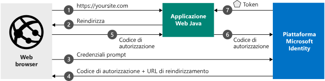

# <a name="quickstart-add-sign-in-with-microsoft-to-a-java-web-app"></a>Guida introduttiva: Aggiungere l'accesso con Microsoft a un'app Web Java

[!INCLUDE [active-directory-develop-applies-v2](../../../includes/active-directory-develop-applies-v2.md)]

Questo argomento di avvio rapido descrive come integrare un'app Web Java con Microsoft Identity Platform. L'app consentirà l'accesso di un utente, otterrà un token di accesso per chiamare l'API Microsoft Graph e creerà una richiesta all'API Microsoft Graph. 

Al termine della guida, l'applicazione accetterà accessi di account Microsoft personali (ad esempio outlook.com, live.com e di altro tipo) e di account aziendali o dell'istituto di istruzione di qualsiasi azienda o organizzazione che usa Azure Active Directory.



## <a name="prerequisites"></a>Prerequisiti

Ecco i prerequisiti per eseguire questo esempio: 
- Java Development Kit (JDK) 8 o versione successiva e Maven.

> [!div renderon="docs"]
> ## <a name="register-and-download-your-quickstart-app"></a>Registrare e scaricare l'app della guida introduttiva
> Per avviare l'applicazione della guida di avvio rapido sono disponibili due opzioni: rapida (Opzione 1) o manuale (Opzione 2)
> 
> ### <a name="option-1-register-and-auto-configure-your-app-and-then-download-your-code-sample"></a>Opzione 1: Registrare e configurare automaticamente l'app e quindi scaricare l'esempio di codice
>
> 1. Passare a [Registrazioni app nel portale di Azure](https://portal.azure.com/#blade/Microsoft_AAD_IAM/ActiveDirectoryMenuBlade/RegisteredApps).
> 1. Immettere un nome per l'applicazione e fare clic su **Registra**.
> 1. Seguire le istruzioni per scaricare e configurare automaticamente la nuova applicazione.
>
> ### <a name="option-2-register-and-manually-configure-your-application-and-code-sample"></a>Opzione 2: Registrare e configurare manualmente l'applicazione e il codice di esempio
> 
>
> #### <a name="step-1-download-the-code-sample"></a>Passaggio 1: Scaricare il codice di esempio
> 
> - [Scaricare il codice di esempio](https://github.com/Azure-Samples/ms-identity-java-webapp/archive/master.zip)
>
> #### <a name="step-2-open-applicationproperties"></a>Passaggio 2: Aprire application.properties
>
> 1. Estrarre il file ZIP in una cartella locale.
> 1. (Facoltativo) Se si usa un IDE (Integrated Development Environment), aprire l'esempio al suo interno.
> 1. Aprire il file *application.properties*. I valori per `aad.clientId`, `aad.authority`e `aad.secretKey` verranno inseriti quando si registra l'applicazione nel passaggio successivo.


> #### <a name="step-3-register-your-application"></a>Passaggio 3: Registrare l'applicazione
> Per registrare l'applicazione e aggiungere manualmente le informazioni di registrazione dell'app alla soluzione, seguire questa procedura:
>
> 1. Accedere al [portale di Azure](https://portal.azure.com) con un account aziendale o dell'istituto di istruzione oppure con un account Microsoft personale.
> 1. Se l'account consente di accedere a più tenant, selezionare l'account nell'angolo in alto a destra e impostare la sessione del portale sul tenant di Azure Active Directory desiderato.
> 1. Passare alla pagina [Registrazioni app](https://go.microsoft.com/fwlink/?linkid=2083908) di Microsoft Identity Platform per sviluppatori.
> 1. Selezionare **Nuova registrazione**.
> 1. Nella pagina **Registra un'applicazione** visualizzata immettere le informazioni di registrazione dell'applicazione.
>    - Nella sezione **Nome** immettere un nome di applicazione significativo che verrà visualizzato agli utenti dell'app, ad esempio `java-webapp`.
>    - Lasciare vuoto il campo **URI di reindirizzamento** per il momento e selezionare **Registra**.
> 1. Trovare il valore **ID applicazione (client)** dell'applicazione. Aggiornare il valore di `Enter_the_Application_Id_here` nel file *application.properties*.
> 1. Trovare il valore **ID directory (tenant)** dell'applicazione. Aggiornare il valore di `Enter_the_Tenant_Info_Here` nel file *application.properties*. 
> 1. Selezionare il menu **Autenticazione** e quindi aggiungere le informazioni seguenti:
>    - In **URI di reindirizzamento** aggiungere `http://localhost:8080/msal4jsamples/secure/aad` e `https://localhost:8080/msal4jsamples/graph/users`.
>    - Selezionare **Salva**.
> 1. Nel menu a sinistra scegliere **Certificati e segreti** e fare clic su **Nuovo segreto client** nella sezione **Segreti client**:
>     
>    - Digitare una descrizione della chiave, ad esempio app secret.
>    - Selezionare **Tra 1 anno** per la durata della chiave.
>    - Quando si fa clic su **Aggiungi**, verrà visualizzato il valore della chiave. 
>    - Copiare il valore della chiave. Aprire il file *application.properties* scaricato in precedenza e aggiornare il valore di `Enter_the_Client_Secret_Here` con il valore della chiave. 
>
> [!div class="sxs-lookup" renderon="portal"]
> #### <a name="step-1-configure-your-application-in-the-azure-portal"></a>Passaggio 1: Configurare l'applicazione nel portale di Azure
> Per il corretto funzionamento del codice di esempio di questo argomento di avvio rapido, è necessario:
> 1. Aggiungere gli URL di risposta, come `http://localhost:8080/msal4jsamples/secure/aad` e `https://localhost:8080/msal4jsamples/graph/users`.
> 1. Creare un segreto client.
> > [!div renderon="portal" id="makechanges" class="nextstepaction"]
> > [Apporta questa modifica per me]()
>
> > [!div id="appconfigured" class="alert alert-info"]
> >  L'applicazione è configurata con questi attributi.
> 
> #### <a name="step-2-download-the-code-sample"></a>Passaggio 2: Scaricare il codice di esempio
> 
> - [Scaricare il codice di esempio](https://github.com/Azure-Samples/ms-identity-java-webapp/archive/master.zip)
> 
> #### <a name="step-3-configure-the-code-sample"></a>Passaggio 3: Configurare il codice di esempio 
> 
> 1. Estrarre il file ZIP in una cartella locale.
> 1. Se si usa un IDE (Integrated Development Environment), aprire l'esempio al suo interno.
> 1. Aprire il file **application.properties**, disponibile nel percorso *src/main/resources/* .
> 1. Sostituire le proprietà dell'applicazione.
>   1. Trovare `aad.clientId` e aggiornare il valore di `Enter_the_Application_Id_here` con il valore dell'**ID applicazione (client)** dell'applicazione registrata. 
>   1. Trovare `aad.authority` e aggiornare il valore di `Enter_the_Tenant_Name_Here` con il valore dell'**ID directory (tenant)** dell'applicazione registrata.
>   1. Trovare `aad.secretKey` e aggiornare il valore di `Enter_the_Client_Secret_Here` con il valore di **Segreto client** creato in **Certificati e segreti** per l'applicazione registrata.

#### <a name="step-4-run-the-code-sample"></a>Passaggio 4: Eseguire il codice di esempio
1. Eseguire il codice di esempio, aprire un browser e passare a *http://localhost:8080* .
1. La prima pagina contiene un pulsante di **accesso**. Fare clic sul pulsante di **accesso** per essere reindirizzati in Azure Active Directory. All'utente verranno richieste le credenziali.  
1. Una volta eseguita l'autenticazione in Azure Active Directory, verranno reindirizzati in *http://localhost:8080/msal4jsamples/secure/aad* . Sono ufficialmente connessi all'applicazione e nella pagina dovrebbero essere visualizzate informazioni per l'account che ha eseguito l'accesso. Include inoltre i pulsanti seguenti: 
    - *Disconnetti*: disconnette l'utente corrente dall'applicazione e lo reindirizza alla home page.
    - *Mostra utenti*: acquisisce un token per Microsoft Graph, quindi chiama Microsoft Graph con il token collegato alla richiesta per ottenere tutti gli utenti del tenant.


## <a name="more-information"></a>Altre informazioni

### <a name="getting-msal"></a>Recupero di MSAL
MSAL4J è la libreria usata per far accedere gli utenti e richiedere i token usati per accedere a un'API protetta da Microsoft Identity Platform. È possibile aggiungere MSAL4J all'applicazione usando Maven o Gradle per gestire le dipendenze apportando le modifiche seguenti al file pom.xml o build.gradle nell'applicazione. 

```XML
<dependency>
    <groupId>com.microsoft.azure</groupId>
    <artifactId>msal4j</artifactId>
    <version>0.5.0-preview</version>
</dependency>
```

```$xslt
compile group: 'com.microsoft.azure', name: 'msal4j', version: '0.5.0-preview'
```


### <a name="msal-initialization"></a>Inizializzazione di MSAL
È possibile inserire il riferimento a MSAL4J aggiungendo il codice seguente all'inizio del file in cui verrà usato MSAL4J: 

```Java
import com.microsoft.aad.msal4j.*;
```

## <a name="next-steps"></a>Passaggi successivi

Altre informazioni sulle autorizzazioni e sul consenso:

> [!div class="nextstepaction"]
> [Autorizzazioni e consenso](https://docs.microsoft.com/en-us/azure/active-directory/develop/v2-permissions-and-consent)

Per altre informazioni sul flusso di autenticazione per questo scenario, vedere il flusso del codice di autorizzazione Oauth 2.0:

> [!div class="nextstepaction"]
> [Flusso Oauth del codice di autorizzazione](https://docs.microsoft.com/en-us/azure/active-directory/develop/v2-oauth2-auth-code-flow)

Contribuire al miglioramento di Microsoft Identity Platform. Completare un breve sondaggio di due domande per condividere la propria opinione.

> [!div class="nextstepaction"]
> [Sondaggio su Microsoft Identity Platform](https://forms.office.com/Pages/ResponsePage.aspx?id=v4j5cvGGr0GRqy180BHbRyKrNDMV_xBIiPGgSvnbQZdUQjFIUUFGUE1SMEVFTkdaVU5YT0EyOEtJVi4u)

[!INCLUDE [Help and support](../../../includes/active-directory-develop-help-support-include.md)]
