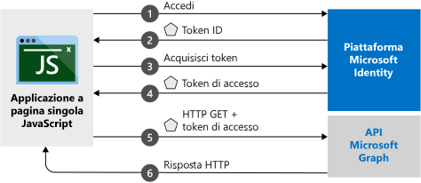

# <a name="quickstart-sign-in-users-and-get-an-access-token-in-a-javascript-spa"></a>Guida introduttiva: Accedere agli utenti e ottenere un token di accesso in un'applicazione a pagina singola JavaScript

In questa guida di avvio rapido si usa codice di esempio per dimostrare in che modo un'applicazione a pagina singola JavaScript possa concedere l'accesso ad account personali, aziendali o dell'istituto di istruzione. Un'applicazione a pagina singola può anche ottenere un token di accesso per chiamare l'API Microsoft Graph o un'API Web. Per un'illustrazione, vedere [Funzionamento dell'esempio](#how-the-sample-works).

## <a name="prerequisites"></a>Prerequisiti

* Sottoscrizione di Azure: [creare un account gratuito](https://azure.microsoft.com/free/?WT.mc_id=A261C142F)
* [Node.js](https://nodejs.org/en/download/).
* [Visual Studio Code](https://code.visualstudio.com/download) (per modificare i file di progetto) oppure [Visual Studio 2019](https://visualstudio.microsoft.com/downloads/) (per eseguire il progetto come soluzione di Visual Studio).

> [!div renderon="docs"]
> ## <a name="register-and-download-your-quickstart-application"></a>Registrare e scaricare l'app dell'avvio rapido
> Per avviare l'applicazione di avvio rapido, usare una delle opzioni seguenti.
>
> ### <a name="option-1-express-register-and-auto-configure-your-app-and-then-download-your-code-sample"></a>Opzione 1 (Modalità rapida): Registrare e configurare automaticamente l'app e quindi scaricare l'esempio di codice
>
> 1. Accedere al [portale di Azure](https://portal.azure.com) con un account aziendale o dell'istituto di istruzione oppure con un account Microsoft personale.
> 1. Se l'account consente di accedere a più tenant, selezionare l'account in alto a destra e quindi impostare la sessione del portale sul tenant di Azure Active Directory (Azure AD) che si vuole usare.
> 1. Passare al nuovo riquadro [Portale di Azure - Registrazioni app](https://portal.azure.com/#blade/Microsoft_AAD_RegisteredApps/ApplicationsListBlade/quickStartType/JavascriptSpaQuickstartPage/sourceType/docs).
> 1. Immettere un nome per l'applicazione e fare clic su **Registra**.
> 1. Seguire le istruzioni per scaricare e configurare automaticamente la nuova applicazione.
>
> ### <a name="option-2-manual-register-and-manually-configure-your-application-and-code-sample"></a>Opzione 2 (Manuale): Registrare e configurare manualmente l'applicazione e il codice di esempio
>
> #### <a name="step-1-register-your-application"></a>Passaggio 1: Registrare l'applicazione
>
> 1. Accedere al [portale di Azure](https://portal.azure.com) con un account aziendale o dell'istituto di istruzione oppure con un account Microsoft personale.
>
> 1. Se l'account consente di accedere a più tenant, selezionare l'account in alto a destra e quindi impostare la sessione del portale sul tenant di Azure AD che si vuole usare.
> 1. Passare alla pagina [Registrazioni app](https://go.microsoft.com/fwlink/?linkid=2083908) di Microsoft Identity Platform per sviluppatori.
> 1. Selezionare **Nuova registrazione**.
> 1. Nella pagina **Registra un'applicazione** visualizzata immettere il nome dell'applicazione.
> 1. In **Tipi di account supportati** selezionare **Account in qualsiasi directory organizzativa e account Microsoft personali**.
> 1. Nell'elenco a discesa nella sezione **URI di reindirizzamento** selezionare la piattaforma **Web** e quindi impostare il valore su `http://localhost:30662/`.
> 1. Selezionare **Registra**. Nella pagina **Panoramica** dell'app prendere nota del valore del campo **ID applicazione (client)** per uso successivo.
> 1. Per questo avvio rapido è necessario abilitare il [flusso di concessione implicita](v2-oauth2-implicit-grant-flow.md). Nel riquadro sinistro dell'applicazione registrata selezionare **Autenticazione**.
> 1. Nella sezione **Impostazioni avanzate**, in **Concessione implicita**, selezionare entrambe le caselle di controllo **Token ID** e **Token di accesso**. I token ID e di accesso sono obbligatori perché l'app deve consentire l'accesso agli utenti e chiamare un'API.
> 1. Nella parte superiore della pagina selezionare **Salva**.

> [!div class="sxs-lookup" renderon="portal"]
> #### <a name="step-1-configure-your-application-in-the-azure-portal"></a>Passaggio 1: Configurare l'applicazione nel portale di Azure
> Per il funzionamento dell'esempio di codice di questa guida introduttiva è necessario aggiungere un URI di reindirizzamento come `http://localhost:30662/` e abilitare l'opzione **Concessione implicita**.
> > [!div renderon="portal" id="makechanges" class="nextstepaction"]
> > [Apporta queste modifiche per me]()
>
> > [!div id="appconfigured" class="alert alert-info"]
> >  L'applicazione è configurata con questi attributi.

#### <a name="step-2-download-the-project"></a>Passaggio 2: Scaricare il progetto

Selezionare l'opzione più adatta al proprio ambiente di sviluppo:

* Per eseguire il progetto con un server Web, ad esempio Node.js, [scaricare i file di progetto di base](https://github.com/Azure-Samples/active-directory-javascript-graphapi-v2/archive/quickstart.zip). Per aprire i file, usare un editor come [Visual Studio Code](https://code.visualstudio.com/).

* (Facoltativo) Per eseguire il progetto con il server IIS, [scaricare il progetto di Visual Studio](https://github.com/Azure-Samples/active-directory-javascript-graphapi-v2/archive/vsquickstart.zip). Estrarre il file con estensione zip in una cartella locale, ad esempio *C:\Azure-Samples*.

#### <a name="step-3-configure-your-javascript-app"></a>Passaggio 3: Configurare l'app JavaScript

> [!div renderon="docs"]
> Nella cartella *JavaScriptSPA* modificare *index.html* e impostare i valori `clientID` e `authority` presenti nella sezione `msalConfig`.

> [!div class="sxs-lookup" renderon="portal"]
> Nella cartella *JavaScriptSPA* modificare *index.html*e sostituire `msalConfig` con il codice seguente:

```javascript
var msalConfig = {
    auth: {
        clientId: "Enter_the_Application_Id_here",
        authority: "https://login.microsoftonline.com/Enter_the_Tenant_info_here",
        redirectURI: "http://localhost:30662/"
    },
    cache: {
        cacheLocation: "localStorage",
        storeAuthStateInCookie: true
    }
};

```
> [!div renderon="portal"]
> > [!NOTE]
> > Questo argomento di avvio rapido supporta Enter_the_Supported_Account_Info_Here.


> [!div renderon="docs"]
>
> Dove:
> - *\<Enter_the_Application_Id_here>* è il valore di **ID applicazione (client)** dell'applicazione registrata.
> - Il valore *\<Enter_the_Tenant_info_here>* deve essere impostato su una delle opzioni seguenti:
>    - Se l'applicazione supporta *Account solo in questa directory organizzativa*, sostituire questo valore con l'**ID tenant** o il **nome del tenant** (ad esempio, *contoso.microsoft.com*).
>    - Se l'applicazione supporta *Account in qualsiasi directory organizzativa*, sostituire questo valore con **organizations**.
>    - Se l'applicazione supporta *Account in qualsiasi directory organizzativa e account Microsoft personali*, sostituire questo valore con **common**. Per limitare il supporto ai *soli account Microsoft personali*, sostituire questo valore con **consumers**.
>
> > [!TIP]
> > Per trovare i valori di **ID applicazione (client)** , **ID della directory (tenant)** e **Tipi di account supportati**, passare alla pagina di **panoramica** dell'app nel portale di Azure.
>

#### <a name="step-4-run-the-project"></a>Passaggio 4: Eseguire il progetto

* Se si usa [Node.js](https://nodejs.org/en/download/):

    1. Per avviare il server, eseguire il comando seguente nella directory del progetto:

        ```batch
        npm install
        node server.js
        ```

    1. Aprire un Web browser e passare a `http://localhost:30662/`.
    1. Fare clic su **Accedi** per effettuare l'accesso e chiamare quindi l'API Microsoft Graph.


* Se si usa [Visual Studio](https://visualstudio.microsoft.com/downloads/), selezionare la soluzione del progetto e premere F5 per eseguire il progetto.

Dopo che il browser ha caricato l'applicazione, fare clic su **Accedi**. Al primo accesso viene chiesto di concedere il proprio consenso per consentire all'applicazione di accedere al profilo e completare la procedura di accesso. Dopo aver effettuato l'accesso, nella pagina devono essere visualizzate le informazioni del profilo utente.

## <a name="more-information"></a>Altre informazioni

### <a name="how-the-sample-works"></a>Funzionamento dell'esempio



### <a name="msaljs"></a>msal.js

Con la libreria MSAL è possibile concedere l'accesso agli utenti e richiedere i token usati per accedere a un'API protetta da Microsoft Identity Platform. Il file *index.html* dell'argomento di avvio rapido contiene un riferimento alla libreria:

```html
<script src="https://secure.aadcdn.microsoftonline-p.com/lib/1.0.0/js/msal.min.js"></script>
```
> [!TIP]
> È possibile sostituire la versione precedente con l'ultima versione rilasciata disponibile nella pagina delle [versioni di MSAL.js](https://github.com/AzureAD/microsoft-authentication-library-for-js/releases).


In alternativa, se Node.js è già installato, è possibile scaricare l'ultima versione tramite Node.js Package Manager (npm):

```batch
npm install msal
```

### <a name="msal-initialization"></a>Inizializzazione della libreria MSAL

Il codice di avvio rapido illustra anche come inizializzare la libreria MSAL:

```javascript
var msalConfig = {
    auth: {
        clientId: "Enter_the_Application_Id_here",
        authority: "https://login.microsoftonline.com/Enter_the_Tenant_Info_Here",
        redirectURI: "http://localhost:30662/"
    },
    cache: {
        cacheLocation: "localStorage",
        storeAuthStateInCookie: true
    }
};

var myMSALObj = new Msal.UserAgentApplication(msalConfig);
```

> |Where  |  |
> |---------|---------|
> |`clientId`     | ID dell'applicazione registrata nel portale di Azure.|
> |`authority`    | (Facoltativo) URL dell'autorità che supporta i tipi di account, come descritto nella sezione di configurazione precedente. L'autorità predefinita è `https://login.microsoftonline.com/common`. |
> |`redirectURI`     | URI di risposta/reindirizzamento configurato della registrazione dell'applicazione. In questo caso, `http://localhost:30662/`. |
> |`cacheLocation`  | (Facoltativo) Valore che consente di impostare l'archiviazione del browser per lo stato di autenticazione. L'impostazione predefinita è sessionStorage.   |
> |`storeAuthStateInCookie`  | (Facoltativo) Libreria che archivia lo stato della richiesta di autenticazione necessario per la convalida dei flussi di autenticazione nei cookie del browser. Questo cookie viene impostato per i browser Internet Explorer ed Edge per attenuare alcuni [problemi noti](https://github.com/AzureAD/microsoft-authentication-library-for-js/wiki/Known-issues-on-IE-and-Edge-Browser#issues). |

Per altre informazioni sulle opzioni configurabili disponibili, vedere [Inizializzare le applicazioni client](msal-js-initializing-client-applications.md).

### <a name="sign-in-users"></a>Consentire l'accesso degli utenti

Il frammento di codice seguente illustra come consentire l'accesso degli utenti:

```javascript
var requestObj = {
    scopes: ["user.read"]
};

myMSALObj.loginPopup(requestObj).then(function (loginResponse) {
    //Login Success callback code here
}).catch(function (error) {
    console.log(error);
});
```

> |Where  |  |
> |---------|---------|
> | `scopes`   | (Facoltativo) Contiene gli ambiti richiesti per il consenso dell'utente al momento dell'accesso, ad esempio: `[ "user.read" ]` per Microsoft Graph o `[ "<Application ID URL>/scope" ]` per le API Web personalizzate, ovvero `api://<Application ID>/access_as_user`. |

> [!TIP]
> In alternativa, è possibile usare il metodo `loginRedirect` per reindirizzare alla pagina corrente alla pagina di accesso anziché a una finestra popup.

### <a name="request-tokens"></a>Richiedere token

In MSAL sono disponibili tre metodi per acquisire i token: `acquireTokenRedirect`, `acquireTokenPopup` e `acquireTokenSilent`

#### <a name="get-a-user-token-silently"></a>Ottenere un token utente in modo automatico

Il metodo `acquireTokenSilent` gestisce le acquisizioni e i rinnovi dei token senza alcuna interazione da parte dell'utente. Dopo aver eseguito il metodo `loginRedirect` o `loginPopup` la prima volta, per le chiamate successive il metodo comunemente usato per ottenere i token usati per accedere a risorse protette è `acquireTokenSilent`. Le chiamate per richiedere o rinnovare i token vengono eseguite in modo invisibile per l'utente.

```javascript
var requestObj = {
    scopes: ["user.read"]
};

myMSALObj.acquireTokenSilent(requestObj).then(function (tokenResponse) {
    // Callback code here
    console.log(tokenResponse.accessToken);
}).catch(function (error) {
    console.log(error);
});
```

> |Where  |  |
> |---------|---------|
> | `scopes`   | Contiene gli ambiti da restituire nel token di accesso per l'API, ad esempio: `[ "user.read" ]` per Microsoft Graph o `[ "<Application ID URL>/scope" ]` per le API Web personalizzate, ovvero `api://<Application ID>/access_as_user`.|

#### <a name="get-a-user-token-interactively"></a>Ottenere un token utente in modo interattivo

In alcune situazioni è necessario forzare gli utenti a interagire con l'endpoint di Microsoft Identity Platform. Ad esempio:
* Un utente deve immettere nuovamente le credenziali perché la password è scaduta.
* L'applicazione richiede l'accesso ad ambiti di risorse aggiuntivi per cui è necessario il consenso dell'utente.
* È necessaria l'autenticazione a due fattori.

Per la maggior parte delle applicazioni, l'approccio consigliato è quello di chiamare prima `acquireTokenSilent`, quindi individuare l'eccezione e infine chiamare `acquireTokenPopup` (o `acquireTokenRedirect`) per avviare una richiesta interattiva.

Se si chiama `acquireTokenPopup`, viene visualizzata una finestra popup di accesso, mentre con `acquireTokenRedirect` gli utenti vengono reindirizzati all'endpoint di Microsoft Identity Platform. Nella finestra popup gli utenti devono interagire confermando le proprie credenziali, concedendo il consenso per la risorsa necessaria o completando l'autenticazione a due fattori.

```javascript
var requestObj = {
    scopes: ["user.read"]
};

myMSALObj.acquireTokenPopup(requestObj).then(function (tokenResponse) {
    // Callback code here
    console.log(tokenResponse.accessToken);
}).catch(function (error) {
    console.log(error);
});
```

> [!NOTE]
> Questo argomento di avvio rapido usa i metodi `loginRedirect` e `acquireTokenRedirect` con Microsoft Internet Explorer a causa di un [problema noto](https://github.com/AzureAD/microsoft-authentication-library-for-js/wiki/Known-issues-on-IE-and-Edge-Browser#issues) correlato alla gestione delle finestre popup da questo browser.

## <a name="next-steps"></a>Passaggi successivi

Per informazioni dettagliate sulla creazione dell'applicazione per questo argomento di avvio rapido, vedere:

> [!div class="nextstepaction"]
> [Esercitazione per l'accesso e la chiamata a MS Graph](https://docs.microsoft.com/azure/active-directory/develop/guidedsetups/active-directory-javascriptspa)

Per consultare il repository MSAL per documentazione, domande frequenti, problemi e altro ancora:

> [!div class="nextstepaction"]
> [Repository MSAL.js di GitHub](https://github.com/AzureAD/microsoft-authentication-library-for-js)

Contribuire al miglioramento di Microsoft Identity Platform. Completare un breve sondaggio di due domande per condividere la propria opinione.

> [!div class="nextstepaction"]
> [Sondaggio su Microsoft Identity Platform](https://forms.office.com/Pages/ResponsePage.aspx?id=v4j5cvGGr0GRqy180BHbRyKrNDMV_xBIiPGgSvnbQZdUQjFIUUFGUE1SMEVFTkdaVU5YT0EyOEtJVi4u)
