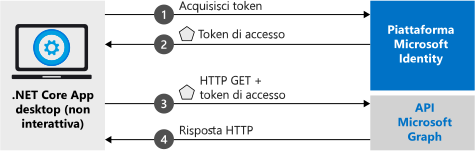

# <a name="quickstart-acquire-a-token-and-call-microsoft-graph-api-from-a-console-app-using-apps-identity"></a>Guida introduttiva: Acquisire un token e chiamare l'API Microsoft Graph da un'app console usando l'identità dell'app

In questo argomento di avvio rapido verrà illustrato come scrivere un'applicazione .NET Core che può ottenere un token di accesso usando l'identità dell'app e quindi chiamare l'API Microsoft Graph per visualizzare un [elenco di utenti](https://docs.microsoft.com/graph/api/user-list) nella directory. Questo scenario è utile nelle situazioni in cui un processo headless automatico o un servizio di Windows deve essere eseguito con un'identità di applicazione, invece che con l'identità di un utente.



## <a name="prerequisites"></a>Prerequisiti

Questo avvio rapido richiede [.NET Core 2.2](https://www.microsoft.com/net/download/dotnet-core/2.2).

> [!div renderon="docs"]
> ## <a name="register-and-download-your-quickstart-app"></a>Registrare e scaricare l'app della guida introduttiva

> [!div renderon="docs" class="sxs-lookup"]
>
> Per avviare l'applicazione della guida introduttiva sono disponibili due opzioni:
> * [Rapida] [Opzione 1: Registrare e configurare automaticamente l'app e quindi scaricare l'esempio di codice](#option-1-register-and-auto-configure-your-app-and-then-download-your-code-sample)
> * [Manuale] [Opzione 2: Registrare e configurare manualmente l'applicazione e il codice di esempio](#option-2-register-and-manually-configure-your-application-and-code-sample)
>
> ### <a name="option-1-register-and-auto-configure-your-app-and-then-download-your-code-sample"></a>Opzione 1: Registrare e configurare automaticamente l'app e quindi scaricare l'esempio di codice
>
> 1. Passare al nuovo riquadro [Portale di Azure - Registrazioni app](https://portal.azure.com/?Microsoft_AAD_RegisteredApps=true#blade/Microsoft_AAD_RegisteredApps/applicationsListBlade/quickStartType/DotNetCoreDaemonQuickstartPage/sourceType/docs).
> 1. Immettere un nome per l'applicazione e fare clic su **Registra**.
> 1. Seguire le istruzioni per scaricare e configurare automaticamente la nuova applicazione con un clic.
>
> ### <a name="option-2-register-and-manually-configure-your-application-and-code-sample"></a>Opzione 2: Registrare e configurare manualmente l'applicazione e il codice di esempio

> [!div renderon="docs"]
> #### <a name="step-1-register-your-application"></a>Passaggio 1: Registrare l'applicazione
> Per registrare l'applicazione e aggiungere manualmente le informazioni di registrazione dell'app alla soluzione, seguire questa procedura:
>
> 1. Accedere al [portale di Azure](https://portal.azure.com) con un account aziendale o dell'istituto di istruzione oppure con un account Microsoft personale.
> 1. Se l'account consente di accedere a più tenant, selezionare l'account nell'angolo in alto a destra e impostare la sessione del portale sul tenant di Azure Active Directory desiderato.
> 1. Passare alla pagina [Registrazioni app](https://go.microsoft.com/fwlink/?linkid=2083908) di Microsoft Identity Platform per sviluppatori.
> 1. Selezionare **Nuova registrazione**.
> 1. Nella pagina **Registra un'applicazione** visualizzata immettere le informazioni di registrazione dell'applicazione. 
> 1. Nella sezione **Nome** immettere un nome di applicazione significativo che verrà visualizzato dagli utenti dell'app, ad esempio `Daemon-console`, quindi sezionare **Registra** per creare l'applicazione.
> 1. Dopo la registrazione, selezionare il menu **Certificati e segreti**.
> 1. In **Segreti client** selezionare **+ Nuovo segreto client**. Assegnargli un nome e selezionare **Aggiungi**. Copiare il segreto in una posizione sicura. Sarà necessario usarlo nel codice.
> 1. Selezionare ora il menu **Autorizzazioni API**, selezionare il pulsante **+ Aggiungi un'autorizzazione**, selezionare **Microsoft Graph**.
> 1. Selezionare **Autorizzazioni applicazione**.
> 1. Nel nodo **Utente** selezionare **User.Read.All**, quindi selezionare **Aggiungi autorizzazioni**

> [!div class="sxs-lookup" renderon="portal"]
> ### <a name="download-and-configure-your-quickstart-app"></a>Scaricare e configurare l'app della guida introduttiva
> 
> #### <a name="step-1-configure-your-application-in-azure-portal"></a>Passaggio 1: Configurare l'applicazione nel portale di Azure
> Per fare in modo che l'esempio di codice per questo avvio rapido funzioni, è necessario creare un segreto client e aggiungere l'autorizzazione dell'applicazione **User.Read.All** dell'API Graph.
> > [!div renderon="portal" id="makechanges" class="nextstepaction"]
> > [Apporta queste modifiche per me]()
>
> > [!div id="appconfigured" class="alert alert-info"]
> >  L'applicazione è configurata con questi attributi.

#### <a name="step-2-download-your-visual-studio-project"></a>Passaggio 2: Scaricare il progetto di Visual Studio

[Scaricare il progetto di Visual Studio](https://github.com/Azure-Samples/active-directory-dotnetcore-daemon-v2/archive/msal3x.zip)

#### <a name="step-3-configure-your-visual-studio-project"></a>Passaggio 3: Configurare il progetto di Visual Studio

1. Estrarre il file ZIP in una cartella locale vicina alla radice del disco, ad esempio **C:\Azure-Samples**.
1. Aprire la soluzione **daemon-console.sln** in Visual Studio (facoltativo).
1. Modificare **appsettings.json** e sostituire i valori dei campi `ClientId`, `Tenant` e `ClientSecret` con il codice seguente:

    ```json
    "Tenant": "Enter_the_Tenant_Id_Here",
    "ClientId": "Enter_the_Application_Id_Here",
    "ClientSecret": "Enter_the_Client_Secret_Here"
    ```
    > > [!div renderon="portal" id="certandsecretspage" class="sxs-lookup"]
    > > [Generare un nuovo segreto client]()
    
    > [!div class="sxs-lookup" renderon="portal"]
    > > [!NOTE]
    > > Questo argomento di avvio rapido supporta Enter_the_Supported_Account_Info_Here.
    
    > [!div renderon="docs"]
    >> Dove:
    >> * `Enter_the_Application_Id_Here` è l'**ID applicazione (client)** per l'applicazione registrata.
    >> * `Enter_the_Tenant_Id_Here`: sostituire questo valore con l'**ID tenant** o il **nome del tenant** (ad esempio, contoso.microsoft.com)
    >> * `Enter_the_Client_Secret_Here`: sostituire questo valore con il segreto client creato nel passaggio 1.

    > [!div renderon="docs"]
    > > [!TIP]
    > > Per trovare i valori di **ID applicazione (client)** e **ID della directory (tenant)** , passare alla pagina **Panoramica** dell'app nel portale di Azure. Per generare una nuova chiave, passare alla pagina **Certificati e segreti**.
    
#### <a name="step-4-admin-consent"></a>Passaggio 4: Consenso dell'amministratore

Se si prova a eseguire l'applicazione a questo punto, si riceverà l'errore *HTTP 403 - Accesso negato*: `Insufficient privileges to complete the operation`. Questo errore si verifica perché le *autorizzazioni solo per app* richiedono il consenso amministratore. È quindi necessario che un amministratore globale della directory conceda il consenso all'applicazione. Selezionare una delle opzioni seguenti in base al ruolo:

##### <a name="global-tenant-administrator"></a>Amministratore del tenant globale

> [!div renderon="docs"]
> Gli amministratori del tenant globali devono passare alla pagina **Autorizzazioni API** nella registrazione dell'applicazione del portale di Azure (anteprima) e selezionare **Concedi consenso amministratore per {nome del tenant}** (dove {nome del tenant} è il nome della directory).

> [!div renderon="portal" class="sxs-lookup"]
> Gli amministratori globali devono passare alla pagina **Autorizzazioni API** e selezionare **Concedi consenso amministratore per Immettere_il_nome_tenant_qui**
> > [!div id="apipermissionspage"]
> > [Passare alla pagina Autorizzazioni API]()

##### <a name="standard-user"></a>Utente standard

Gli utenti standard del tenant devono chiedere a un amministratore globale di concedere il consenso amministratore per l'applicazione. A tale scopo, assegnare l'URL seguente all'amministratore:

```url
https://login.microsoftonline.com/Enter_the_Tenant_Id_Here/adminconsent?client_id=Enter_the_Application_Id_Here
```

> [!div renderon="docs"]
>> Dove:
>> * `Enter_the_Tenant_Id_Here`: sostituire questo valore con l'**ID tenant** o il **nome del tenant** (ad esempio, contoso.microsoft.com)
>> * `Enter_the_Application_Id_Here` è l'**ID applicazione (client)** per l'applicazione registrata.

> [!NOTE]
> Dopo aver concesso il consenso all'app usando l'URL precedente, potrebbe essere visualizzato l'errore *'AADSTS50011: No reply address is registered for the application'* (AADSTS50011: Nessun indirizzo di risposta registrato per l'applicazione). Ciò accade perché questa applicazione e l'URL non hanno un URI di reindirizzamento. Ignorare l'errore.

#### <a name="step-5-run-the-application"></a>Passaggio 5: Eseguire l'applicazione

Se si usa Visual Studio, premere **F5** per eseguire l'applicazione. In caso contrario, eseguire l'applicazione tramite il prompt dei comandi o la console:

```console
cd {ProjectFolder}\daemon-console
dotnet run
```

> Dove:
> * *{ProjectFolder}* è la cartella in cui è stato estratto il file ZIP, ad esempio **C:\Azure-Samples\active-directory-dotnetcore-daemon-v2**

Come risultato si dovrebbe vedere un elenco di utenti nel tenant di Azure AD.

> [!IMPORTANT]
> Questa applicazione della guida introduttiva usa un segreto client per identificarsi come client riservato. Poiché il segreto client viene aggiunto come testo normale ai file di progetto, per motivi di sicurezza è consigliabile usare un certificato anziché un segreto client prima di considerare l'applicazione come applicazione di produzione. Per altre informazioni su come usare un certificato, vedere [queste istruzioni](https://github.com/Azure-Samples/active-directory-dotnetcore-daemon-v2/#variation-daemon-application-using-client-credentials-with-certificates) nel repository GitHub per questo esempio.

## <a name="more-information"></a>Altre informazioni

### <a name="msalnet"></a>MSAL.NET

MSAL ([Microsoft.Identity.Client](https://www.nuget.org/packages/Microsoft.Identity.Client)) è la libreria usata per concedere l'accesso agli utenti e richiedere i token usati per accedere a un'API protetta da Microsoft Identity Platform. Come descritto, questo avvio rapido richiede i token usando l'identità propria dell'applicazione invece delle autorizzazioni delegate. Il flusso di autenticazione usato in questo caso è noto come *[flusso delle credenziali client OAuth](v2-oauth2-client-creds-grant-flow.md)* . Per altre informazioni su come usare MSAL.NET con il flusso delle credenziali client, vedere [questo articolo](https://aka.ms/msal-net-client-credentials).

 È possibile installare MSAL.NET eseguendo questo comando in **Console di Gestione pacchetti** in Visual Studio:

```powershell
Install-Package Microsoft.Identity.Client -Pre
```

In alternativa, se non si usa Visual Studio, è possibile eseguire il comando seguente per aggiungere MSAL al progetto:

```console
dotnet add package Microsoft.Identity.Client
```

### <a name="msal-initialization"></a>Inizializzazione della libreria MSAL

È possibile aggiungere il riferimento per la libreria MSAL aggiungendo il codice seguente:

```csharp
using Microsoft.Identity.Client;
```

Inizializzare quindi la libreria MSAL usando il codice seguente:

```csharp
IConfidentialClientApplication app;
app = ConfidentialClientApplicationBuilder.Create(config.ClientId)
                                          .WithClientSecret(config.ClientSecret)
                                          .WithAuthority(new Uri(config.Authority))
                                          .Build();
);
```

> | Dove: ||
> |---------|---------|
> | `config.ClientSecret` | È il segreto client creato per l'applicazione nel portale di Azure. |
> | `config.ClientId` | **ID applicazione (client)** dell'applicazione registrata nel portale di Azure. Questo valore è riportato nella pagina **Panoramica** dell'app nel portale di Azure. |
> | `config.Authority`    | (Facoltativo) Endpoint del servizio token di sicurezza per l'utente da autenticare, in genere <https://login.microsoftonline.com/{tenant}> per il cloud pubblico, dove {tenant} è il nome del tenant o l'ID tenant.|

Per altre informazioni, vedere la [documentazione di riferimento`ConfidentialClientApplication`](https://docs.microsoft.com/dotnet/api/microsoft.identity.client.iconfidentialclientapplication?view=azure-dotnet)

### <a name="requesting-tokens"></a>Richiesta di token

Per richiedere un token con l'identità dell'app, usare il metodo `AcquireTokenForClient`:

```csharp
result = await app.AcquireTokenForClient(scopes)
                  .ExecuteAsync();
```

> |Dove:| |
> |---------|---------|
> | `scopes` | Contiene gli ambiti richiesti. Per i client riservati, dovrebbe essere usato un formato simile a `{Application ID URI}/.default` per indicare che gli ambiti che vengono richiesti sono quelli definiti in modo statico nell'oggetto app impostato nel portale di Azure. Per Microsoft Graph, `{Application ID URI}` punta a `https://graph.microsoft.com`. Per le API Web personalizzate, `{Application ID URI}` è definito nella sezione **Esporre un'API** della registrazione dell'applicazione (anteprima) del portale di Azure. |

Per altre informazioni, vedere la [documentazione di riferimento`AcquireTokenForClient`](https://docs.microsoft.com/dotnet/api/microsoft.identity.client.confidentialclientapplication.acquiretokenforclient?view=azure-dotnet#Microsoft_Identity_Client_ConfidentialClientApplication_AcquireTokenForClientAsync_System_Collections_Generic_IEnumerable_System_String__)

[!INCLUDE [Help and support](../../../includes/active-directory-develop-help-support-include.md)]

## <a name="next-steps"></a>Passaggi successivi

> [!div class="nextstepaction"]
> [Esempio di daemon di .NET Core](https://github.com/Azure-Samples/active-directory-dotnetcore-daemon-v2)

Altre informazioni sulle autorizzazioni e sul consenso:

> [!div class="nextstepaction"]
> [Autorizzazioni e consenso](v2-permissions-and-consent.md)

Per altre informazioni sul flusso di autenticazione per questo scenario, vedere il flusso delle credenziali client Oauth 2.0:

> [!div class="nextstepaction"]
> [Flusso di credenziali client OAuth](v2-oauth2-client-creds-grant-flow.md)

> [!div class="nextstepaction"]
> [Client credential flows with MSAL.NET (Flussi di credenziali client con MSAL.NET)](https://aka.ms/msal-net-client-credentials)

Contribuire al miglioramento di Microsoft Identity Platform. Completare un breve sondaggio di due domande per condividere la propria opinione.

> [!div class="nextstepaction"]
> [Sondaggio su Microsoft Identity Platform](https://forms.office.com/Pages/ResponsePage.aspx?id=v4j5cvGGr0GRqy180BHbRyKrNDMV_xBIiPGgSvnbQZdUQjFIUUFGUE1SMEVFTkdaVU5YT0EyOEtJVi4u)