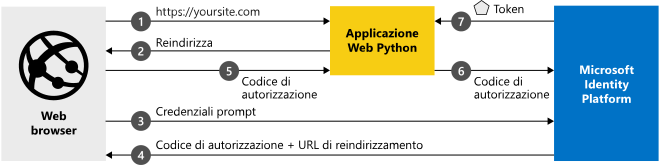

# <a name="quickstart-add-sign-in-with-microsoft-to-a-python-web-app"></a>Guida introduttiva: Aggiungere l'accesso con Microsoft a un'app Web Python

[!INCLUDE [active-directory-develop-applies-v2](../../../includes/active-directory-develop-applies-v2.md)]

Questa guida di avvio rapido descrive come integrare un'app Web Python con Microsoft Identity Platform. L'app consentirà l'accesso di un utente, otterrà un token di accesso per chiamare l'API Microsoft Graph e creerà una richiesta all'API Microsoft Graph.

Al termine della guida, l'applicazione accetterà accessi di account Microsoft personali (ad esempio outlook.com, live.com e di altro tipo) e di account aziendali o dell'istituto di istruzione di qualsiasi azienda o organizzazione che usa Azure Active Directory.



## <a name="prerequisites"></a>Prerequisiti

Ecco i prerequisiti per eseguire questo esempio:

- [Python 2.7+](https://www.python.org/downloads/release/python-2713) o [Python 3+](https://www.python.org/downloads/release/python-364/)
- [Flask](http://flask.pocoo.org/), [Flask-Session](https:/pythonhosted.org/Flask-Session/), [requests](https://2.python-requests.org/en/master/)
- [MSAL Python](https://github.com/AzureAD/microsoft-authentication-library-for-python) 
- Un tenant di Azure Active Directory (Azure AD). Per altre informazioni su come ottenere un tenant di Azure AD, vedere la [Come ottenere un tenant di Azure AD](https://docs.microsoft.com/azure/active-directory/develop/quickstart-create-new-tenant).

> [!div renderon="docs"]
>
> ## <a name="register-and-download-your-quickstart-app"></a>Registrare e scaricare l'app della guida introduttiva
>
> Per avviare l'applicazione della guida di avvio rapido sono disponibili due opzioni: rapida (Opzione 1) e manuale (Opzione 2)
>
> ### <a name="option-1-register-and-auto-configure-your-app-and-then-download-your-code-sample"></a>Opzione 1: Registrare e configurare automaticamente l'app e quindi scaricare l'esempio di codice
>
> 1. Passare a [Registrazioni app nel portale di Azure](https://portal.azure.com/#blade/Microsoft_AAD_IAM/ActiveDirectoryMenuBlade/RegisteredApps).
> 1. Selezionare **Nuova registrazione**.
> 1. Immettere un nome per l'applicazione e fare clic su **Registra**.
> 1. Seguire le istruzioni per scaricare e configurare automaticamente la nuova applicazione.
>
> ### <a name="option-2-register-and-manually-configure-your-application-and-code-sample"></a>Opzione 2: Registrare e configurare manualmente l'applicazione e il codice di esempio
>
> #### <a name="step-1-register-your-application"></a>Passaggio 1: Registrare l'applicazione
>
> Per registrare l'applicazione e aggiungere manualmente le informazioni di registrazione dell'app alla soluzione, seguire questa procedura:
>
> 1. Accedere al [portale di Azure](https://portal.azure.com) con un account aziendale o dell'istituto di istruzione oppure con un account Microsoft personale.
> 1. Se l'account consente di accedere a più tenant, selezionare l'account nell'angolo in alto a destra e impostare la sessione del portale sul tenant di Azure Active Directory desiderato.
> 1. Passare alla pagina [Registrazioni app](https://go.microsoft.com/fwlink/?linkid=2083908) di Microsoft Identity Platform per sviluppatori.
> 1. Selezionare **Nuova registrazione**.
> 1. Nella pagina **Registra un'applicazione** visualizzata immettere le informazioni di registrazione dell'applicazione.
>      - Nella sezione **Nome** immettere un nome di applicazione significativo che verrà visualizzato agli utenti dell'app, ad esempio `python-webapp`.
>      - In **Tipi di account supportati** selezionare **Account in qualsiasi directory organizzativa e account Microsoft personali**.
>      - Nell'elenco a discesa nella sezione **URI di reindirizzamento** selezionare la piattaforma **Web** e quindi impostare il valore su `http://localhost:5000/getAToken`.
>      - Selezionare **Registra**. Nella pagina **Panoramica** dell'app prendere nota del valore del campo **ID applicazione (client)** per uso successivo.
> 1. Nel menu a sinistra scegliere **Certificati e segreti** e fare clic su **Nuovo segreto client** nella sezione **Segreti client**:
>
>      - Digitare una descrizione della chiave, ad esempio app secret.
>      - Selezionare **Tra 1 anno** per la durata della chiave.
>      - Quando si fa clic su **Aggiungi**, verrà visualizzato il valore della chiave.
>      - Copiare il valore della chiave. Sarà necessario più avanti.
>
> [!div class="sxs-lookup" renderon="portal"]
>
> #### <a name="step-1-configure-your-application-in-azure-portal"></a>Passaggio 1: Configurare l'applicazione nel portale di Azure
>
> Per il corretto funzionamento del codice di esempio di questo argomento di avvio rapido, è necessario:
>
> 1. Aggiungere `http://localhost:5000/getAToken` come URL di risposta.
> 1. Creare un segreto client.
>
> > [!div renderon="portal" id="makechanges" class="nextstepaction"]
> > [Apporta questa modifica per me]()
> > [!div id="appconfigured" class="alert alert-info"]
> >  L'applicazione è configurata con questo attributo

#### <a name="step-2-download-your-project"></a>Passaggio 2: Scaricare il progetto

[Scaricare il codice di esempio](https://github.com/Azure-Samples/ms-identity-python-webapp/archive/master.zip)

#### <a name="step-3-configure-the-application"></a>Passaggio 3: Configurare l'applicazione

1. Estrarre il file con estensione zip in una cartella locale vicina alla cartella radice, ad esempio **C:\Azure-Samples**
1. Se si usa un IDE (Integrated Development Environment), aprire l'esempio al suo interno.
1. Aprire il file **app_config.py**, presente nella cartella radice e sostituirne il contenuto con il frammento di codice seguente:

```python
AUTHORITY = "https://login.microsoftonline.com/Enter_the_Tenant_Name_Here"
CLIENT_ID = "Enter_the_Application_Id_here"
CLIENT_SECRET = "Enter_the_Client_Secret_Here"
SCOPE = ["https://graph.microsoft.com/User.Read"]
REDIRECT_URI = "http://localhost:5000/getAToken"
```

> [!div renderon="docs"]
> Dove:
>
> - `Enter_the_Application_Id_here` è l'ID applicazione dell'applicazione registrata.
> - `Enter_the_Tenant_Info_Here` è una delle opzioni riportate di seguito.
>   - Se l'applicazione supporta **Solo l'organizzazione personale**, sostituire questo valore con l'**ID tenant** o il **nome del tenant** (ad esempio, contoso.onmicrosoft.com)
>   - Se l'applicazione supporta **Account in qualsiasi directory organizzativa**, sostituire questo valore con `organizations`
>   - Se l'applicazione supporta **Tutti gli utenti di account Microsoft**, sostituire questo valore con `common`
> - `Enter_the_Client_Secret_Here` corrisponde al valore di **Segreto client** creato in **Certificati e segreti** per l'applicazione registrata.

#### <a name="step-4-run-the-code-sample"></a>Passaggio 4: Eseguire il codice di esempio

- È necessario installare la libreria MSAL Python, il framework Flask, Flask-Sessions per la gestione delle sessioni sul lato server e requests con pip come descritto di seguito:

```Shell
pip install msal
pip install flask
pip install Flask-Session
pip install requests
```

- Se la variabile di ambiente per Flask è già impostata: Eseguire app.py dalla shell o dalla riga di comando:

```Shell
python app.py
```

- Se la variabile di ambiente per Flask non è impostata:

    1. Digitare i comandi seguenti nella shell o nella riga di comando passando alla directory del progetto:

```Shell
export FLASK_APP=app.py
export FLASK_DEBUG=1
flask run
```

[!INCLUDE [Help and support](../../../includes/active-directory-develop-help-support-include.md)]
