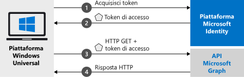

# <a name="quickstart-call-the-microsoft-graph-api-from-a-universal-windows-platform-uwp-application"></a>Guida introduttiva: Chiamare l'API Microsoft Graph da un'applicazione della piattaforma UWP (Universal Windows Platform)

Questo avvio rapido contiene un esempio di codice che illustra come un'applicazione UWP (Universal Windows Platform) può consentire l'accesso a utenti con account personali, aziendali o dell'istituto di istruzione, ottenere un token di accesso e chiamare l'API Microsoft Graph.



> [!div renderon="docs"]
> ## <a name="register-and-download-your-quickstart-app"></a>Registrare e scaricare l'app della guida introduttiva
> [!div renderon="docs" class="sxs-lookup"]
> Per avviare l'applicazione della guida introduttiva sono disponibili due opzioni:
> * [Rapida] [Opzione 1: Registrare e configurare automaticamente l'app e quindi scaricare l'esempio di codice](#option-1-register-and-auto-configure-your-app-and-then-download-your-code-sample)
> * [Manuale] [Opzione 2: Registrare e configurare manualmente l'applicazione e il codice di esempio](#option-2-register-and-manually-configure-your-application-and-code-sample)
>
> ### <a name="option-1-register-and-auto-configure-your-app-and-then-download-your-code-sample"></a>Opzione 1: Registrare e configurare automaticamente l'app e quindi scaricare l'esempio di codice
>
> 1. Passare al nuovo riquadro [Portale di Azure - Registrazioni app](https://portal.azure.com/#blade/Microsoft_AAD_RegisteredApps/applicationsListBlade/quickStartType/UwpQuickstartPage/sourceType/docs).
> 1. Immettere un nome per l'applicazione e fare clic su **Registra**.
> 1. Seguire le istruzioni per scaricare e configurare automaticamente la nuova applicazione con un clic.
>
> ### <a name="option-2-register-and-manually-configure-your-application-and-code-sample"></a>Opzione 2: Registrare e configurare manualmente l'applicazione e il codice di esempio
> [!div renderon="docs"]
> #### <a name="step-1-register-your-application"></a>Passaggio 1: Registrare l'applicazione
> Per registrare l'applicazione e aggiungere le informazioni di registrazione dell'app alla soluzione, seguire questa procedura:
> 1. Accedere al [portale di Azure](https://portal.azure.com) con un account aziendale o dell'istituto di istruzione oppure con un account Microsoft personale.
> 1. Se l'account consente di accedere a più tenant, selezionare l'account nell'angolo in alto a destra e impostare la sessione del portale sul tenant di Azure Active Directory desiderato.
> 1. Passare alla pagina [Registrazioni app](https://aka.ms/MobileAppReg) di Microsoft Identity Platform per sviluppatori.
> 1. Selezionare **Nuova registrazione**.
> 1. Nella pagina **Registra un'applicazione** visualizzata immettere le informazioni di registrazione dell'applicazione.
>      - Nella sezione **Nome** immettere un nome di applicazione significativo che verrà visualizzato agli utenti dell'app, ad esempio `UWP-App-calling-MsGraph`.
>      - Nella sezione **Tipi di account supportati** selezionare **Account in qualsiasi directory organizzativa e account Microsoft personali (ad esempio Skype, Xbox, Outlook.com)** .
>      - Selezionare **Registra** per creare l'applicazione.
> 1. Nell'elenco delle pagine per l'app selezionare **Autenticazione**.
> 1. Espandere la sezione **Desktop e dispositivi**.  Se **Desktop e dispositivi** non è visibile, fare prima clic sul banner in alto per visualizzare l'anteprima dell'esperienza di autenticazione.
> 1. Nella sezione **URI di reindirizzamento** selezionare **Aggiungi un URI**.  Digitare **urn:ietf:wg:oauth:2.0:oob**.
> 1. Selezionare **Salva**.

> [!div renderon="portal" class="sxs-lookup"]
> #### <a name="step-1-configure-your-application"></a>Passaggio 1: Configurare l'applicazione
> Per il funzionamento dell'esempio di codice di questa guida introduttiva è necessario aggiungere un URI di reindirizzamento come **urn:ietf:wg:oauth:2.0:oob**.
> > [!div renderon="portal" id="makechanges" class="nextstepaction"]
> > [Apporta questa modifica per me]()
>
> > [!div id="appconfigured" class="alert alert-info"]
> >  L'applicazione è configurata con questi attributi.

#### <a name="step-2-download-your-visual-studio-project"></a>Passaggio 2: Scaricare il progetto di Visual Studio

 - [Scaricare il progetto di Visual Studio](https://github.com/Azure-Samples/active-directory-dotnet-native-uwp-v2/archive/msal3x.zip)

#### <a name="step-3-configure-your-visual-studio-project"></a>Passaggio 3: Configurare il progetto di Visual Studio

1. Estrarre il file ZIP in una cartella locale vicina alla radice del disco, ad esempio **C:\Azure-Samples**.
1. Aprire il progetto in Visual Studio. È possibile che venga chiesto di installare UWP SDK. In tal caso, accettare.
1. Modificare **MainPage.Xaml.cs** e sostituire il valore del campo `ClientId`:

    ```csharp
    private const string ClientId = "Enter_the_Application_Id_here";
    ```
> [!div class="sxs-lookup" renderon="portal"]
> > [!NOTE]
> > Questo argomento di avvio rapido supporta Enter_the_Supported_Account_Info_Here.    

> [!div renderon="docs"]
> Dove:
> - `Enter_the_Application_Id_here` è l'ID applicazione dell'applicazione registrata.
>
> > [!TIP]
> > Per trovare il valore di *ID applicazione*, passare alla sezione **Panoramica** del portale

#### <a name="step-4-run-your-application"></a>Passaggio 4: Eseguire l'applicazione

Se si vuole provare l'avvio rapido sul computer Windows:

1. Sulla barra degli strumenti di Visual Studio scegliere la piattaforma corretta (probabilmente **x64** oppure **x86**, non ARM).
   > Osservare che l'impostazione relativa al dispositivo di destinazione passa da *Dispositivo* a *Computer locale*
1. Selezionare Debug | **Avvia senza eseguire debug**

## <a name="more-information"></a>Altre informazioni

Questa sezione contiene altre informazioni sulla guida introduttiva.

### <a name="msalnet"></a>MSAL.NET

MSAL ([Microsoft.Identity.Client](https://www.nuget.org/packages/Microsoft.Identity.Client)) è la libreria usata per concedere l'accesso agli utenti e richiedere token di sicurezza. I token di sicurezza vengono usati per accedere a un'API protetta da Microsoft Identity Platform per gli sviluppatori. È possibile installare MSAL eseguendo questo comando in *Console di Gestione pacchetti* in Visual Studio:

```powershell
Install-Package Microsoft.Identity.Client -IncludePrerelease
```

### <a name="msal-initialization"></a>Inizializzazione della libreria MSAL

È possibile aggiungere il riferimento per la libreria MSAL aggiungendo il codice seguente:

```csharp
using Microsoft.Identity.Client;
```

La libreria MSAL viene quindi inizializzata con il codice seguente:

```csharp
public static IPublicClientApplication PublicClientApp;
PublicClientApp = new PublicClientApplicationBuilder.Create(ClientId)
                                                    .Build();
```

> |Dove: ||
> |---------|---------|
> | `ClientId` | **ID applicazione (client)** dell'applicazione registrata nel portale di Azure. Questo valore è riportato nella pagina **Panoramica** dell'app nel portale di Azure. |

### <a name="requesting-tokens"></a>Richiesta di token

In MSAL sono disponibili due metodi per acquisire i token in un'app UWP: `AcquireTokenInteractive` e `AcquireTokenSilent`.

#### <a name="get-a-user-token-interactively"></a>Ottenere un token utente in modo interattivo

In alcune situazioni è necessario forzare gli utenti a interagire con l'endpoint di Microsoft Identity Platform tramite una finestra popup per convalidare le relative credenziali o per concedere il consenso. Di seguito sono riportati alcuni esempi:

- La prima volta che gli utenti accedono all'applicazione
- Quando gli utenti devono immettere nuovamente le credenziali perché la password è scaduta
- Quando l'applicazione richiede l'accesso a una risorsa per cui è necessario il consenso dell'utente
- Quando è necessaria l'autenticazione a due fattori

```csharp
authResult = await App.PublicClientApp.AcquireTokenInteractive(scopes)
                      .ExecuteAsync();
```

> |Dove:||
> |---------|---------|
> | `scopes` | Contiene gli ambiti richiesti, ad esempio `{ "user.read" }` per Microsoft Graph o `{ "api://<Application ID>/access_as_user" }` per le API Web personalizzate. |

#### <a name="get-a-user-token-silently"></a>Ottenere un token utente in modo automatico

Usare il metodo `AcquireTokenSilent` per ottenere i token per accedere alle risorse protette dopo il metodo `AcquireTokenInteractive` iniziale. Non si desidera richiedere all'utente di convalidare le proprie credenziali ogni volta che deve accedere a una risorsa. La maggior parte delle volte si desidera che le acquisizioni e i rinnovi dei token avvengano senza alcuna interazione da parte dell'utente

```csharp
var accounts = await App.PublicClientApp.GetAccountsAsync();
var firstAccount = accounts.FirstOrDefault();
authResult = await App.PublicClientApp.AcquireTokenSilent(scopes, firstAccount)
                                      .ExecuteAsync();
```

> |Dove: ||
> |---------|---------|
> | `scopes` | Contiene gli ambiti richiesti, ad esempio `{ "user.read" }` per Microsoft Graph o `{ "api://<Application ID>/access_as_user" }` per le API Web personalizzate |
> | `firstAccount` | Specifica il primo account utente nella cache (MSAL supporta più utenti in una singola app) |

[!INCLUDE [Help and support](../../../includes/active-directory-develop-help-support-include.md)]

## <a name="next-steps"></a>Passaggi successivi

Provare l'esercitazione di Windows Desktop per una guida dettagliata completa sulla creazione di applicazioni e di nuove funzionalità, tra cui una spiegazione completa di questa guida introduttiva.

> [!div class="nextstepaction"]
> [Piattaforma UWP (Universal Windows Platform): esercitazione sulla chiamata dell'API Graph](tutorial-v2-windows-uwp.md)

Contribuire al miglioramento di Microsoft Identity Platform. Completare un breve sondaggio di due domande per condividere la propria opinione.

> [!div class="nextstepaction"]
> [Sondaggio su Microsoft Identity Platform](https://forms.office.com/Pages/ResponsePage.aspx?id=v4j5cvGGr0GRqy180BHbRyKrNDMV_xBIiPGgSvnbQZdUQjFIUUFGUE1SMEVFTkdaVU5YT0EyOEtJVi4u)
