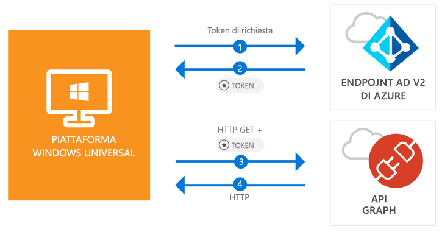

# <a name="quickstart-call-the-microsoft-graph-api-from-a-universal-windows-platform-uwp-application"></a>Guida introduttiva: Chiamare l'API Microsoft Graph da un'applicazione della piattaforma UWP (Universal Windows Platform)

[!INCLUDE [active-directory-develop-applies-v2-msal](../../../includes/active-directory-develop-applies-v2-msal.md)]

Questa guida introduttiva contiene un esempio di codice che illustra come un'applicazione UWP (Universal Windows Platform) può consentire l'accesso a utenti con account personali, aziendali o dell'istituto di istruzione, ottenere un token di accesso e chiamare l'API Microsoft Graph.



> [!div renderon="docs"]
> ## <a name="register-and-download-your-quickstart-app"></a>Registrare e scaricare l'app della guida introduttiva
> [!div renderon="docs" class="sxs-lookup"]
> Per avviare l'applicazione della guida introduttiva sono disponibili due opzioni:
> * [Rapida] [Opzione 1: Registrare e configurare automaticamente l'app e quindi scaricare l'esempio di codice](#option-1-register-and-auto-configure-your-app-and-then-download-your-code-sample)
> * [Manuale] [Opzione 2: Registrare e configurare manualmente l'applicazione e il codice di esempio](#option-2-register-and-manually-configure-your-application-and-code-sample)
>
> ### <a name="option-1-register-and-auto-configure-your-app-and-then-download-your-code-sample"></a>Opzione 1: Registrare e configurare automaticamente l'app e quindi scaricare l'esempio di codice
>
> 1. Passare alla [registrazione delle applicazioni nel portale di Azure](https://portal.azure.com/?Microsoft_AAD_RegisteredApps=true#blade/Microsoft_AAD_RegisteredApps).
> 1. Immettere un nome per l'applicazione e fare clic su **Registra**.
> 1. Seguire le istruzioni per scaricare e configurare automaticamente la nuova applicazione con un clic.
>
> ### <a name="option-2-register-and-manually-configure-your-application-and-code-sample"></a>Opzione 2: Registrare e configurare manualmente l'applicazione e il codice di esempio
> [!div renderon="docs"]
> #### <a name="step-1-register-your-application"></a>Passaggio 1: Registrare l'applicazione
> Per registrare l'applicazione e aggiungere le informazioni di registrazione dell'app alla soluzione, seguire questa procedura:
> 1. Accedere al [portale di Azure](https://portal.azure.com) con un account aziendale o dell'istituto di istruzione oppure con un account Microsoft personale.
> 1. Se l'account consente di accedere a più tenant, selezionare l'account nell'angolo in alto a destra e impostare la sessione del portale sul tenant di Azure Active Directory desiderato.
> 1. Nel riquadro di spostamento a sinistra selezionare il servizio **Azure Active Directory** e quindi **Registrazioni app (anteprima)** > **Nuova registrazione**.
> 1. Nella pagina **Registra un'applicazione** visualizzata immettere le informazioni di registrazione dell'applicazione.
>      - Nella sezione **Nome** immettere un nome di applicazione significativo che verrà visualizzato agli utenti dell'app, ad esempio `UWP-App-calling-MsGraph`.
>      - Nella sezione **Tipi di account supportati** selezionare **Account in qualsiasi directory organizzativa e account Microsoft personali (ad esempio Skype, Xbox, Outlook.com)**.
>      - Selezionare **Registra** per creare l'applicazione.
> 1. Nell'elenco delle pagine per l'app selezionare **Autenticazione**.
> 1. Nella sezione **URI di reindirizzamento** individuare la sezione **URI di reindirizzamento suggeriti per client pubblici (dispositivi mobili, desktop)** e selezionare **urn:ietf:wg:oauth:2.0:oob**.
> 1. Selezionare **Salva**.

> [!div renderon="portal" class="sxs-lookup alert alert-info"]
> #### <a name="step-1-configure-your-application"></a>Passaggio 1: Configurare l'applicazione
> Per il funzionamento dell'esempio di codice di questa guida introduttiva è necessario aggiungere un URI di reindirizzamento come **urn:ietf:wg:oauth:2.0:oob**.
> > [!div renderon="portal" id="makechanges" class="nextstepaction"]
> > [Apporta questa modifica per me]()
>
> > [!div id="appconfigured" class="alert alert-info"]
> >  L'applicazione è configurata con questi attributi.

#### <a name="step-2-download-your-visual-studio-project"></a>Passaggio 2: Scaricare il progetto di Visual Studio

 - [Scaricare il progetto di Visual Studio 2017](https://github.com/Azure-Samples/active-directory-dotnet-native-uwp-v2/archive/master.zip)

#### <a name="step-3-configure-your-visual-studio-project"></a>Passaggio 3: Configurare il progetto di Visual Studio

1. Estrarre il file ZIP in una cartella locale vicina alla radice del disco, ad esempio **C:\Azure-Samples**.
1. Aprire il progetto in Visual Studio.
1. Modificare **App.Xaml.cs** e sostituire i valori dei campi `ClientId` e `Tenant` con:

    ```csharp
    private static string ClientId = "Enter_the_Application_Id_here";
    private static string Tenant = "Enter_the_Tenant_Info_Here";
    ```

> [!div renderon="docs"]
> Dove:
> - `Enter_the_Application_Id_here` è l'ID applicazione dell'applicazione registrata.
> - `Enter_the_Tenant_Info_Here` è una delle opzioni riportate di seguito.
>   - Se l'applicazione supporta **Solo l'organizzazione personale**, sostituire questo valore con l'**ID tenant** o il **nome del tenant** (ad esempio, contoso.microsoft.com)
>   - Se l'applicazione supporta **Account in qualsiasi directory organizzativa**, sostituire questo valore con `organizations`
>   - Se l'applicazione supporta **Tutti gli utenti di account Microsoft**, sostituire questo valore con `common`
>
> > [!TIP]
> > Per trovare i valori di *ID applicazione*, *ID della directory (tenant)* e *Tipi di account supportati*, passare alla pagina **Panoramica**.

## <a name="more-information"></a>Altre informazioni

Questa sezione contiene altre informazioni sulla guida introduttiva.

### <a name="msalnet"></a>MSAL.NET

MSAL ([Microsoft.Identity.Client](https://www.nuget.org/packages/Microsoft.Identity.Client)) è la libreria usata per concedere l'accesso agli utenti e richiedere i token usati per accedere a un'API protetta da Microsoft Azure Active Directory. È possibile installare MSAL eseguendo questo comando in *Console di Gestione pacchetti* in Visual Studio:

```powershell
Install-Package Microsoft.Identity.Client -Pre
```

### <a name="msal-initialization"></a>Inizializzazione della libreria MSAL

È possibile aggiungere il riferimento per la libreria MSAL aggiungendo il codice seguente:

```csharp
using Microsoft.Identity.Client;
```

Inizializzare quindi la libreria MSAL usando il codice seguente:

```csharp
public static PublicClientApplication PublicClientApp = new PublicClientApplication(ClientId);
```

> |Dove: ||
> |---------|---------|
> | `ClientId` | **ID applicazione (client)** dell'applicazione registrata nel portale di Azure. Questo valore è riportato nella pagina **Panoramica** dell'app nel portale di Azure. |

### <a name="requesting-tokens"></a>Richiesta di token

In MSAL sono disponibili due metodi per acquisire i token: `AcquireTokenAsync` e `AcquireTokenSilentAsync`.

#### <a name="get-a-user-token-interactively"></a>Ottenere un token utente in modo interattivo

In alcune situazioni è necessario imporre agli utenti di interagire con l'endpoint di Azure AD v2.0 tramite una finestra popup per convalidare le credenziali o concedere il consenso. Di seguito sono riportati alcuni esempi:

- La prima volta che gli utenti accedono all'applicazione
- Quando gli utenti devono immettere nuovamente le credenziali perché la password è scaduta
- Quando l'applicazione richiede l'accesso a una risorsa per cui è necessario il consenso dell'utente
- Quando è necessaria l'autenticazione a due fattori

```csharp
authResult = await App.PublicClientApp.AcquireTokenAsync(scopes);
```

> |Dove:||
> |---------|---------|
> | `scopes` | Contiene gli ambiti richiesti, ad esempio `{ "user.read" }` per Microsoft Graph o `{ "api://<Application ID>/access_as_user" }` per le API Web personalizzate. |

#### <a name="get-a-user-token-silently"></a>Ottenere un token utente in modo automatico

Non si desidera richiedere all'utente di convalidare le proprie credenziali ogni volta che deve accedere a una risorsa. La maggior parte delle volte si desidera che le acquisizioni e i rinnovi dei token avvengano senza alcuna interazione da parte dell'utente. È possibile usare il metodo `AcquireTokenSilentAsync` per ottenere i token per accedere alle risorse protette dopo il metodo `AcquireTokenAsync` iniziale:

```csharp
var accounts = await App.PublicClientApp.GetAccountsAsync();
authResult = await App.PublicClientApp.AcquireTokenSilentAsync(scopes, accounts.FirstOrDefault());
```

> |Dove: ||
> |---------|---------|
> | `scopes` | Contiene gli ambiti richiesti, ad esempio `{ "user.read" }` per Microsoft Graph o `{ "api://<Application ID>/access_as_user" }` per le API Web personalizzate |
> | `accounts.FirstOrDefault()` | Specifica il primo utente nella cache (MSAL supporta più utenti in una singola app) |

[!INCLUDE [Help and support](../../../includes/active-directory-develop-help-support-include.md)]

## <a name="next-steps"></a>Passaggi successivi

Provare l'esercitazione di Windows Desktop per una guida dettagliata completa sulla creazione di applicazioni e di nuove funzionalità, tra cui una spiegazione completa di questa guida introduttiva.

> [!div class="nextstepaction"]
> [Piattaforma UWP (Universal Windows Platform): esercitazione sulla chiamata dell'API Graph](tutorial-v2-windows-uwp.md)
