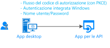
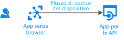

# Scenario: App desktop che chiama le API Web

Scopri tutto quello che ti serve per creare un'app desktop che chiama le API Web

## Prerequisiti

[!INCLUDE [Pre-requisites](../../../includes/active-directory-develop-scenarios-prerequisites.md)]

## Introduzione

Se non è già stato fatto, creare la prima applicazione seguendo la Guida introduttiva per desktop .NET, la Guida introduttiva di UWP o la Guida introduttiva all'app nativa macOS:

> [!div class="nextstepaction"]
> [Avvio rapido: Acquisire un token e chiamare l'API Microsoft Graph da un'app desktop Windows](./quickstart-v2-windows-desktop.md)

> [!div class="nextstepaction"]
> [Avvio rapido: Acquisire un token e chiamare Microsoft Graph API da un'app UWP](./quickstart-v2-uwp.md)

> [!div class="nextstepaction"]
> [Avvio rapido: Acquisire un token e chiamare Microsoft Graph API da un'app nativa macOS](./quickstart-v2-ios.md)

## Panoramica

Si scrive un'applicazione desktop e si vogliono accedere gli utenti all'applicazione e chiamare le API Web, ad esempio la Microsoft Graph, altre API Microsoft o la propria API Web. Sono disponibili diverse possibilità:

- È possibile usare l'acquisizione di token interattivo:

  - Se l'applicazione desktop supporta i controlli grafici, ad esempio se si tratta di un'applicazione Windows. Form, un'applicazione WPF o un'applicazione nativa macOS.
  - Se si tratta di un'applicazione .NET Core e si accetta che l'interazione di autenticazione con Azure AD avvenga nel browser di sistema

- Per le applicazioni ospitate in Windows, è anche possibile che le applicazioni in esecuzione nei computer aggiunti a un dominio Windows o ad AAD siano unite per acquisire un token in modo invisibile all'utente usando l'autenticazione integrata di Windows.
- Infine, anche se non è consigliabile, è possibile usare il nome utente e la password nelle applicazioni client pubbliche. È ancora necessario in alcuni scenari (ad esempio DevOps), ma è opportuno tenere presente che l'uso di questa funzione imposterà vincoli sull'applicazione. Ad esempio, non può accedere all'utente che deve eseguire l'autenticazione a più fattori (accesso condizionale). Inoltre, l'applicazione non trarrà vantaggio da Single Sign-On (SSO).

  Il flusso è anche contrario ai principi dell'autenticazione moderna e viene fornito solo per motivi legacy.

  

- Se si sta scrivendo uno strumento da riga di comando portabile, probabilmente un'applicazione .NET Core in esecuzione su Linux o Mac e si accetta che l'autenticazione venga delegata al browser di sistema, sarà possibile usare l'autenticazione interattiva. .NET Core non fornisce ancora un [Web browser](https://aka.ms/msal-net-uses-web-browser) e pertanto l'autenticazione viene eseguita nel browser di sistema. in caso contrario, l'opzione migliore in questo caso consiste nell'usare il flusso del codice del dispositivo. Questo flusso viene usato anche per le applicazioni senza un browser, ad esempio le applicazioni Internet delle cose

  

## Specifiche

Le applicazioni desktop hanno diverse specifiche, che dipendono principalmente dal fatto che l'applicazione usi o meno l'autenticazione interattiva.

## Passaggi successivi

> [!div class="nextstepaction"]
> [App desktop-registrazione app](scenario-desktop-app-registration.md)
