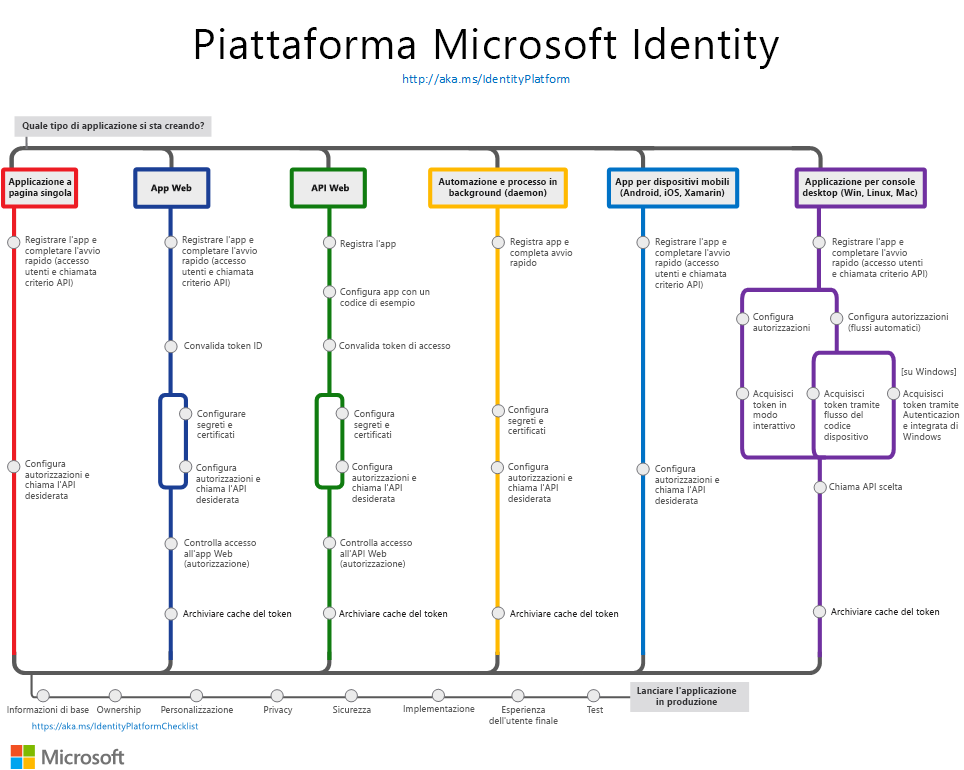

# Panoramica di Microsoft Identity Platform (v2.0)

Microsoft Identity Platform è un'evoluzione della piattaforma per sviluppatori di Azure Active Directory (Azure AD). Permette agli sviluppatori di compilare applicazioni che supportano l'accesso per tutte le identità Microsoft e il recupero di token per chiamare API Microsoft, come Microsoft Graph o API create dagli sviluppatori. Microsoft Identity Platform è costituito da:

- **Servizio di autenticazione conforme agli standard OAuth 2.0 e OpenID Connect**, che permette agli sviluppatori di autenticare qualsiasi identità Microsoft, tra cui:
  - Account aziendali o dell'istituto di istruzione (di cui viene effettuato il provisioning tramite Azure AD)
  - Account Microsoft personali, come Skype, Xbox e Outlook.com
  - Account di social networking o locali (tramite Azure AD B2C)
- **Librerie open source**: Microsoft Authentication Library (MSAL) e supporto per altre librerie conformi agli standard
- **Portale di gestione delle applicazioni**: esperienza di registrazione e configurazione integrata nel portale di Azure, insieme a tutte le altre funzionalità di gestione di Azure.
- **API di configurazione delle applicazioni e PowerShell**: per eseguire la configurazione a livello di codice delle applicazioni tramite l'API REST (Microsoft Graph e Azure Active Directory Graph 1.6) e PowerShell, in modo da automatizzare le attività DevOps.
- **Contenuti per gli sviluppatori**: documentazione concettuale e di riferimento, esempi di avvio rapido, esempi di codice, esercitazioni e guide pratiche.

Agli sviluppatori Microsoft Identity Platform offre un'integrazione uniforme con le innovazioni nell'area di sicurezza e identità, ad esempio l'autenticazione senza password, l'autenticazione incrementale e l'accesso condizionale.  Non è necessario implementare queste funzionalità personalmente: le applicazioni integrate con Microsoft Identity Platform sfruttano in modo nativo queste innovazioni.

Con Microsoft Identity Platform è possibile scrivere codice una sola volta e raggiungere qualsiasi utente. È possibile compilare un'app una sola volta e renderla funzionante su molte piattaforme oppure compilare un'app che operi come client nonché come applicazione della risorsa (API).

## Introduzione

L'uso di identità non deve necessariamente essere difficile. Scegliere uno [scenario](authentication-flows-app-scenarios.md) appropriato. Il percorso di ogni scenario include informazioni di avvio rapido e una pagina di panoramica per essere operativi in pochi minuti:

- [Creare un'applicazione a pagina singola](scenario-spa-overview.md)
- [Creare un'app Web per l'accesso degli utenti](scenario-web-app-sign-user-overview.md)
- [Creare un'app Web che chiama API Web](scenario-web-app-call-api-overview.md)
- [Creare un'API Web protetta](scenario-protected-web-api-overview.md)
- [Creare un'API Web che chiama altre API Web](scenario-web-api-call-api-overview.md)
- [Creare un'app desktop](scenario-desktop-overview.md)
- [Creare un'app daemon](scenario-daemon-overview.md)
- [Creare un'app per dispositivi mobili](scenario-mobile-overview.md)

Il grafico seguente mostra alcuni scenari di app di autenticazione comuni e può essere usato come riferimento quando si integra Microsoft Identity Platform con l'app.

## Passaggi successivi

Per altre informazioni sui concetti di base relativi all'autenticazione, è consigliabile iniziare con questi argomenti:

- [Flussi di autenticazione e scenari di applicazioni](authentication-flows-app-scenarios.md)
- [Nozioni di base sull'autenticazione](authentication-scenarios.md)
- [Entità servizio e applicazione](app-objects-and-service-principals.md)
- [Destinatari](v2-supported-account-types.md)
- [Autorizzazioni e consenso](v2-permissions-and-consent.md)
- [Token ID](id-tokens.md) e [token di accesso](access-tokens.md)

Compilare un'applicazione con un volume elevato di dati che chiama [Microsoft Graph](https://docs.microsoft.com/graph/overview).

Quando si è pronti ad avviare l'app in un **ambiente di produzione**, esaminare queste procedure consigliate:

- [Abilitare la registrazione](msal-logging.md) nell'applicazione.
- Abilitare la telemetria nell'applicazione.
- Abilitare i [proxy e personalizzare i client HTTP](msal-net-provide-httpclient.md).
- Testare l'integrazione seguendo l'[elenco di controllo per l'integrazione di Microsoft Identity Platform](identity-platform-integration-checklist.md).

## Altre informazioni

Se si intende creare un'applicazione per i clienti che supporti l'accesso di identità di social networking o locali, vedere [Panoramica di Azure AD B2C](https://docs.microsoft.com/azure/active-directory-b2c/tutorial-add-identity-providers).
