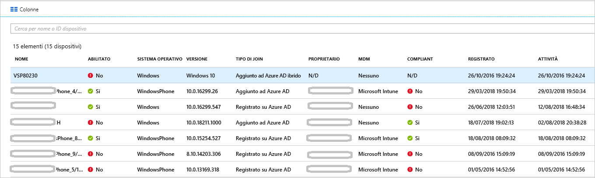

# <a name="how-to-manage-stale-devices-in-azure-ad"></a>Procedura: Gestire i dispositivi non aggiornati in Azure AD

In teoria, per completare il ciclo di vita, è necessario annullare la registrazione dei dispositivi registrati quando non sono più necessari. Tuttavia, in seguito ad esempio allo smarrimento o al furto di dispositivi, alla presenza di dispositivi guasti o alle reinstallazioni del sistema operativo, nell'ambiente in uso potrebbero essere presenti dispositivi non aggiornati. Gli amministratori IT hanno bisogno di un metodo per rimuovere i dispositivi non aggiornati, in modo da concentrare le risorse sulla gestione di quelli che necessitano effettivamente di gestione.

In questo articolo si imparerà a gestire in modo efficiente i dispositivi non aggiornati nell'ambiente in uso.
  

## <a name="what-is-a-stale-device"></a>Che cos'è un dispositivo non aggiornato?

Un dispositivo non aggiornato è un dispositivo che è stato registrato con Azure AD, ma che non è stato usato per accedere ad app cloud per un intervallo di tempo specifico. La presenza di dispositivi non aggiornati si ripercuote sulla possibilità di gestire e supportare i dispositivi e gli utenti nel tenant perché: 

- I dispositivi duplicati possono rendere difficile l'identificazione del dispositivo attualmente attivo da parte del personale del supporto tecnico.

- Un numero maggiore di dispositivi crea writeback dei dispositivi non necessari, aumentando il tempo richiesto per le sincronizzazioni di Azure AD Connect.

- Per ragioni di ordine e conformità, è preferibile avere uno stato pulito dei dispositivi. 


I dispositivi non aggiornati in Azure AD possono interferire con i criteri generali per il ciclo di vita adottati dall'organizzazione.


## <a name="detect-stale-devices"></a>Rilevare i dispositivi non aggiornati

Dal momento che un dispositivo non aggiornato è definito come dispositivo registrato che non è stato usato per accedere ad app cloud per uno specifico intervallo di tempo, il rilevamento dei dispositivi non aggiornati richiede una proprietà correlata al timestamp. In Azure AD questa proprietà è chiamata **ApproximateLastLogonTimestamp** o **timestamp dell'attività**. Se il delta tra il momento attuale e il valore del **timestamp dell'attività** supera l'intervallo di tempo definito per i dispositivi attivi, un dispositivo viene considerato non aggiornato. Il **timestamp dell'attività** è ora disponibile in anteprima pubblica.

## <a name="how-is-the-value-of-the-activity-timestamp-managed"></a>Come viene gestito il valore del timestamp dell'attività?  

La valutazione del timestamp dell'attività viene attivata da un tentativo di autenticazione di un dispositivo. Azure AD valuta il timestamp dell'attività quando:

- È stato attivato un criterio di accesso condizionale che richiede [dispositivi gestiti](../conditional-access/require-managed-devices.md) o [app client approvate](../conditional-access/app-based-conditional-access.md).

- I dispositivi Windows 10 che sono aggiunti ad Azure AD o aggiunti ad Azure AD ibrido sono attivi nella rete. 

- I dispositivi gestiti da Intune sono stati archiviati nel servizio.


Se il delta tra il valore esistente del timestamp dell'attività e il valore corrente è superiore a 14 giorni, il valore esistente viene sostituito con quello nuovo.
    

## <a name="how-do-i-get-the-activity-timestamp"></a>Come si ottiene il timestamp dell'attività?

Sono disponibili due opzioni per recuperare il valore del timestamp dell'attività:

- La colonna **Attività** nella [pagina Dispositivi](https://portal.azure.com/#blade/Microsoft_AAD_IAM/DevicesMenuBlade/Devices) nel portale di Azure

    


- Il cmdlet [Get-MsolDevice](https://docs.microsoft.com/powershell/module/msonline/get-msoldevice?view=azureadps-1.0)

    


## <a name="plan-the-cleanup-of-your-stale-devices"></a>Pianificare la pulizia dei dispositivi non aggiornati

Per eliminare in modo efficiente i dispositivi non aggiornati nell'ambiente in uso, è necessario definire criteri correlati. Questi criteri consentono di assicurarsi che siano state prese in esame tutte le considerazioni relative ai dispositivi non aggiornati. Le sezioni seguenti offrono esempi per le considerazioni sui criteri più comuni. 

### <a name="cleanup-account"></a>Account di pulizia

Per aggiornare un dispositivo di Azure AD, è necessario un account con assegnato uno dei ruoli seguenti:

- Amministratore globale

- Amministratore dispositivo cloud (nuovo ruolo attualmente disponibile)

- Amministratore del servizio Intune

Nel criterio di pulizia selezionare gli account con i ruoli richiesti assegnati. 


### <a name="timeframe"></a>Intervallo di tempo

Definire un intervallo di tempo che è l'indicatore per un dispositivo non aggiornato. Quando si definisce l'intervallo di tempo, fattorizzare la finestra di 14 giorni per l'aggiornamento del timestamp dell'attività nel valore. Ad esempio, non si deve considerare un timestamp inferiore a 14 giorni come indicatore di un dispositivo non aggiornato. Esistono scenari in cui un dispositivo può sembrare non aggiornato ma non lo è. Ad esempio, il proprietario del dispositivo interessato potrebbe essere in vacanza o in malattia.  che supera l'intervallo di tempo per i dispositivi non aggiornati.

### <a name="disable-devices"></a>Disabilitare i dispositivi

Non è consigliabile eliminare immediatamente un dispositivo che sembra non aggiornato, perché non è possibile annullare un'operazione di eliminazione in caso di falsi positivi. Come procedura consigliata, disabilitare un dispositivo per un periodo di tolleranza prima di eliminarlo. Nel criterio definire un intervallo di tempo per disabilitare un dispositivo prima di eliminarlo.


### <a name="mdm-controlled-devices"></a>Dispositivi controllati tramite MDM

Se il dispositivo è sotto il controllo di Intune o di qualsiasi altra soluzione MDM, ritirare il dispositivo nel sistema di gestione prima di disabilitarlo o eliminarlo.


### <a name="system-managed-devices"></a>Dispositivi gestiti dal sistema

Non eliminare i dispositivi gestiti dal sistema. Si tratta in genere di dispositivi come il pilota automatico e, una volta eliminati, non possono essere sottoposti a nuovo provisioning. Per impostazione predefinita, il nuovo cmdlet `get-msoldevice` esclude i dispositivi gestiti dal sistema. 


### <a name="hybrid-azure-ad-joined-devices"></a>Dispositivi aggiunti all'identità ibrida di Azure AD

I dispositivi aggiunti ad Azure AD ibrido devono seguire i criteri per la gestione dei dispositivi non aggiornati in locale. 

Per eseguire la pulizia di Azure AD:

- **Dispositivi Windows 10**: disabilitare o eliminare i dispositivi Windows 10 nell'istanza di AD locale e consentire ad Azure AD Connect di sincronizzare lo stato del dispositivo modificato in Azure AD.

- **Windows 7/8**: disabilitare o eliminare i dispositivi Windows 10 in Azure AD. Non è possibile usare Azure AD Connect per disabilitare o eliminare i dispositivi Windows 7/8 in Azure AD.


### <a name="azure-ad-joined-devices"></a>Dispositivi aggiunti ad Azure AD

Disabilitare o eliminare i dispositivi aggiunti ad Azure AD in Azure AD.


### <a name="azure-ad-registered-devices"></a>Dispositivi registrati in Azure AD

Disabilitare o eliminare i dispositivi registrati in Azure AD in Azure AD.


## <a name="clean-up-stale-devices-in-the-azure-portal"></a>Eseguire la pulizia dei dispositivi non aggiornati nel portale di Azure  

Anche se è possibile eliminare i dispositivi non aggiornati nel portale di Azure, è più efficiente gestire questo processo tramite uno script di PowerShell. Usare il modulo PowerShell V1 più recente per usare il filtro timestamp ed escludere tramite filtro i dispositivi gestiti dal sistema come il pilota automatico. A questo punto, non è consigliabile usare PowerShell V2.


Una tipica routine comprende i passaggi seguenti:

1. Connettersi ad Azure Active Directory usando il cmdlet [Connect-MsolService](https://docs.microsoft.com/powershell/module/msonline/connect-msolservice?view=azureadps-1.0).

2. Ottenere l'elenco dei dispositivi.

3. Disabilitare il dispositivo usando il cmdlet [Disable-MsolDevice](https://docs.microsoft.com/powershell/module/msonline/disable-msoldevice?view=azureadps-1.0). 

4. Attendere il periodo di tolleranza del numero di giorni specificati prima di eliminare il dispositivo.

5. Rimuovere il dispositivo usando il cmdlet [Remove-MsolDevice](https://docs.microsoft.com/powershell/module/msonline/remove-msoldevice?view=azureadps-1.0).

### <a name="get-the-list-of-devices"></a>Ottenere l'elenco dei dispositivi

Per ottenere tutti i dispositivi e archiviare i dati restituiti in un file CSV:

```powershell
Get-MsolDevice -all | select-object -Property Enabled, DeviceId, DisplayName, DeviceTrustType, Approxi
mateLastLogonTimestamp | export-csv devicelist-summary.csv
```

Se nella directory è presente un numero elevato di dispositivi, usare il filtro timestamp per limitare il numero dei dispositivi restituiti. Per ottenere tutti i dispositivi con un timestamp precedente a una data specifica e archiviare i dati restituiti in un file CSV: 

```powershell
$dt = [datetime]’2017/01/01’
Get-MsolDevice -all -LogonTimeBefore $dt | select-object -Property Enabled, DeviceId, DisplayName, DeviceTrustType, ApproximateLastLogonTimestamp | export-csv devicelist-olderthan-Jan-1-2017-summary.csv
```


## <a name="what-you-should-know"></a>Informazioni utili

### <a name="why-is-the-timestamp-not-updated-more-frequently"></a>Perché il timestamp non viene aggiornato più frequentemente?

Il timestamp viene aggiornato per supportare scenari del ciclo di vita dei dispositivi. Non si tratta di un controllo. Usare i log di controllo di accesso per aggiornamenti più frequenti nel dispositivo.

### <a name="why-should-i-worry-about-my-bitlocker-keys"></a>Perché occorre preoccuparsi delle chiavi BitLocker?

Quando sono configurate, le chiavi BitLocker per i dispositivi Windows 10 vengono archiviate nell'oggetto dispositivo in Azure AD. Se si elimina un dispositivo non aggiornato, vengono eliminate anche le chiavi BitLocker archiviate nel dispositivo. È necessario determinare se i criteri di pulizia sono allineati con l'effettivo ciclo di vita del dispositivo prima di eliminare un dispositivo non aggiornato. 

### <a name="how-do-i-know-all-the-type-of-devices-joined"></a>Come si riconoscono tutti i tipi di dispositivi aggiunti?

Per saperne di più sui diversi tipi, vedere la [panoramica sulla gestione dei dispositivi](overview.md).

### <a name="what-happens-when-i-disable-a-device"></a>Cosa accade quando si disabilita un dispositivo?

Viene negata qualsiasi autenticazione in cui viene usato un dispositivo per eseguire l'autenticazione in Azure AD. Esempi comuni:

- **Dispositivo aggiunto ad Azure AD ibrido**: gli utenti potrebbero essere in grado di usare il dispositivo per accedere al dominio locale. Tuttavia, non riescono ad accedere alle risorse di Azure AD come Office 365.

- **Dispositivo aggiunto ad Azure AD**: gli utenti non possono usare il dispositivo per eseguire l'accesso. 

- **Utenti di dispositivi mobili**: gli utenti non riescono ad accedere alle risorse di Azure AD come Office 365. 


## <a name="next-steps"></a>Passaggi successivi

Per una panoramica sulla gestione del dispositivo nel portale di Azure AD, vedere [Gestione dei dispositivi tramite il portale di Azure](device-management-azure-portal.md)


