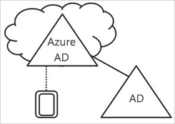
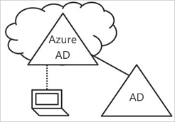
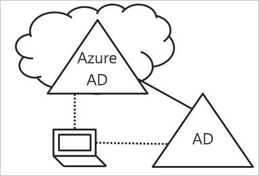

# Informazioni sulla gestione dei dispositivi in Azure Active Directory

In un mondo in cui i dispositivi mobili e il cloud hanno sempre più importanza, Azure Active Directory (Azure AD) consente ovunque l'accesso Single Sign-On a dispositivi, app e servizi. Con il proliferare dei dispositivi, inclusi i dispositivi Bring Your Own Device (BYOD), i professionisti IT hanno due obiettivi opposti:

- Fare in modo che gli utenti finali siano produttivi sempre e ovunque
- Proteggere gli asset aziendali in qualsiasi momento

Tramite i dispositivi gli utenti hanno accesso alle risorse aziendali. Per proteggere le risorse aziendali, gli amministratori IT vogliono avere il controllo su questi dispositivi. Ciò consente di verificare che gli utenti accedano alle risorse da dispositivi che soddisfano gli standard per sicurezza e conformità. 

La gestione dei dispositivi rappresenta anche il fondamento per l'[accesso condizionale basato su dispositivo](../conditional-access/require-managed-devices.md). Con l'accesso condizionale basato su dispositivo, è possibile assicurarsi che l'accesso alle risorse nell'ambiente sia possibile solo con dispositivi gestiti.   

Questo articolo illustra il funzionamento della gestione dei dispositivi in Azure Active Directory.

> [!VIDEO https://www.youtube.com/embed/NeezfKhomQU]

## Controllo dei dispositivi tramite Azure AD

Per controllare un dispositivo tramite Azure AD, sono disponibili due opzioni:

- Registrazione 
- Aggiunta

La **registrazione** di un dispositivo in Azure AD consente di gestire l'identità di un dispositivo. Quando un dispositivo viene registrato, Registrazione dispositivo Azure AD fornisce al dispositivo un'identità che viene usata per autenticare il dispositivo quando un utente accede ad Azure AD. È possibile usare l'identità per abilitare o disabilitare un dispositivo.

Con una soluzione di gestione di dispositivi mobili (MDM), ad esempio Microsoft Intune, gli attributi del dispositivo in Azure AD vengono aggiornati con informazioni aggiuntive sul dispositivo. Ciò permette di creare regole di accesso condizionale che subordinano l'accesso dai dispositivi al rispetto dei propri standard di sicurezza e conformità. Per altre informazioni sulla registrazione dei dispositivi in Microsoft Intune, vedere [Informazioni sulla registrazione dei dispositivi](https://docs.microsoft.com/intune/device-enrollment).

L'**aggiunta** di un dispositivo è un'estensione della registrazione di un dispositivo. Offre infatti tutti i vantaggi della registrazione di un dispositivo, oltre a modificarne lo stato locale. Modificando lo stato locale, gli utenti possono accedere a un dispositivo usando un account aziendale o dell'istituto di istruzione invece di un account personale.

## Dispositivi registrati in Azure AD   

L'obiettivo dei dispositivi registrati in Azure AD è di fornire supporto per lo scenario **Bring Your Own Device (BYOD)**. In questo scenario un utente può accedere alle risorse dell'organizzazione controllate da Azure Active Directory usando un dispositivo personale.  

L'accesso si basa su un account aziendale o dell'istituto di istruzione immesso nel dispositivo.  
Windows 10, ad esempio, consente agli utenti di aggiungere un account aziendale o dell'istituto di istruzione a un computer, un tablet o un telefono personale.  
Dopo l'aggiunta dell'account aziendale o dell'istituto di istruzione il dispositivo viene registrato in Azure AD e, facoltativamente, anche nel sistema di gestione di dispositivi mobili (MDM) configurato dall'organizzazione. Gli utenti dell'organizzazione possono aggiungere un account aziendale o dell'istituto di istruzione a un dispositivo personale in modo pratico:

- Durante il primo accesso a un'applicazione di lavoro
- Manualmente tramite il menu **Impostazioni** nel caso di Windows 10 

È possibile configurare dispositivi registrati in Azure AD per Windows 10, iOS, Android e macOS.

## Dispositivi aggiunti ad Azure AD

L'obiettivo dei dispositivi aggiunti ad Azure AD è di semplificare:

- Distribuzioni Windows di dispositivi di proprietà dell'azienda 
- Accesso ad app e risorse aziendali da qualsiasi dispositivo Windows
- Gestione basata su cloud di dispositivi di proprietà dell'azienda

È possibile distribuire Aggiunta ad Azure AD usando uno dei metodi seguenti: 
 - [Windows Autopilot](https://docs.microsoft.com/windows/deployment/windows-autopilot/windows-10-autopilot)
 - [Distribuzione in blocco](https://docs.microsoft.com/intune/windows-bulk-enroll)
 - [Esperienza self-service](azuread-joined-devices-frx.md) 

L'**aggiunta ad Azure AD** è destinata alle organizzazioni che mirano a usare prima di tutto il cloud, vale a dire che usano principalmente servizi cloud con lo scopo di ridurre l'uso di un'infrastruttura locale, o a usare esclusivamente il cloud, ovvero senza un'infrastruttura locale. Non vi è alcuna restrizione sulle dimensioni o sul tipo di organizzazioni che possono distribuire l'aggiunta ad Azure AD. L'aggiunta ad Azure AD funziona correttamente anche in un ambiente ibrido e può consentire l'accesso alle app e alle risorse sia su cloud sia locali.

L'implementazione di dispositivi aggiunti ad Azure AD offre i vantaggi seguenti:

- **Single Sign-On (SSO)** alle app e ai servizi SaaS gestiti da Azure. Gli utenti non visualizzano richieste di autenticazione aggiuntive quando accedono alle risorse. La funzionalità SSO è attiva anche quando non sono connessi alla rete di dominio disponibile.

- **Roaming conforme ai criteri dell'organizzazione** per le impostazioni utente tra dispositivi aggiunti. Non è necessario che gli utenti connettano un account Microsoft (ad esempio, Hotmail) per visualizzare le impostazioni tra dispositivi.

- **Accesso a Windows Store per le aziende** tramite l'account Azure AD. Gli utenti possono scegliere da un inventario di applicazioni preselezionate dall'organizzazione.

- Supporto di **Windows Hello** per un accesso sicuro e agevole alle risorse aziendali.

- **Limitazione dell'accesso** alle app solo dai dispositivi che soddisfano i criteri di conformità.

- **Accesso ottimizzato alle risorse locali** quando il dispositivo dispone della visibilità per il controller di dominio locale. 

Anche se l'aggiunta ad Azure AD è destinata soprattutto alle organizzazioni prive di un'infrastruttura Active Directory di Windows Server locale, è ovviamente possibile usarla in scenari in cui:

- Si vuole passare all'infrastruttura basata su cloud mediante Azure AD e MDM come Intune.

- Non è possibile usare un'aggiunta a un dominio locale, ad esempio se è necessario avere il controllo di dispositivi mobili come tablet e telefoni.

- Gli utenti hanno soprattutto necessità di accedere a Office 365 o ad altre app SaaS integrate con Azure AD.

- Si vuole gestire un gruppo di utenti in Azure AD invece che in Active Directory, ad esempio lavoratori stagionali, terzisti o studenti.

- Si vogliono fornire funzionalità di join ai lavoratori in succursali remote con un'infrastruttura locale limitata.

È possibile configurare dispositivi aggiunti ad Azure AD per dispositivi Windows 10.

## Dispositivi aggiunti all'identità ibrida di Azure AD

Per oltre un decennio, molte organizzazioni hanno usato l'aggiunta a un dominio ad Active Directory locale per consentire:

- Ai reparti IT di gestire i dispositivi di proprietà dell'azienda da una posizione centrale.

- Agli utenti di accedere ai dispositivi con il proprio account aziendale o dell'istituto di istruzione di Active Directory. 

In genere le aziende con un footprint locale si basano su metodi di creazione dell'immagine per effettuare il provisioning dei dispositivi e, per gestirli, usano **System Center Configuration Manager (SCCM)** o **Criteri di gruppo**.

Se l'ambiente ha un footprint AD locale e si vogliono anche sfruttare le funzionalità offerte da Azure Active Directory, è possibile implementare dispositivi aggiunti all'identità ibrida di Azure AD. Questi dispositivi vengono aggiunti all'istanza di Active Directory locale e registrati in Azure Active Directory.

È consigliabile usare dispositivi aggiunti all'identità ibrida di Azure AD se:

- Sono state distribuite app Win32 in questi dispositivi che fanno affidamento sull'autenticazione di computer Active Directory.

- Sono necessari criteri di gruppo per gestire i dispositivi.

- Si vuole continuare a usare soluzioni di creazione dell'immagine per configurare i dispositivi per i dipendenti.

È possibile configurare dispositivi aggiunti all'identità ibrida di Azure AD per Windows 10 e dispositivi di livello inferiore, ad esempio Windows 8 e Windows 7.

## Summary

Con la gestione dei dispositivi in Azure AD, è possibile: 

- Semplificare il processo per mettere i dispositivi sotto il controllo di Azure AD

- Fornire agli utenti un accesso facile da usare alle risorse basate sul cloud dell'organizzazione

Come regola generale, è consigliabile usare:

- Dispositivi registrati in Azure AD:

    - Per i dispositivi personali 

    - Per registrare manualmente i dispositivi con Azure AD

- Dispositivi aggiunti ad Azure AD: 

    - Per i dispositivi di proprietà dell'azienda

    - Per i dispositivi **non** aggiunti ad AD locale

    - Per registrare manualmente i dispositivi con Azure AD

    - Per modificare lo stato locale di un dispositivo

- Dispositivi aggiunti all'identità ibrida di Azure AD per i dispositivi aggiunti ad AD locale     

    - Per i dispositivi di proprietà dell'azienda

    - Per i dispositivi aggiunti ad AD locale

    - Per registrare automaticamente i dispositivi con Azure AD

    - Per modificare lo stato locale di un dispositivo

## Passaggi successivi

- Per una panoramica sulla gestione del dispositivo nel portale di Azure AD, vedere [Gestione dei dispositivi tramite il portale di Azure](device-management-azure-portal.md)

- Per altre informazioni sull'accesso condizionale basato su dispositivo, vedere l'articolo su come [configurare criteri di accesso condizionale basati sul dispositivo in Azure Active Directory](../conditional-access/require-managed-devices.md).

- Per configurare:
    - Dispositivi Windows 10 registrati in Azure Active Directory, vedere [Come configurare dispositivi Windows 10 registrati in Azure Active Directory](../user-help/device-management-azuread-registered-devices-windows10-setup.md)
    - Dispositivi aggiunti ad Azure Active Directory, vedere [Come configurare dispositivi aggiunti ad Azure Active Directory](../user-help/device-management-azuread-joined-devices-setup.md)
    - Dispositivi aggiunti all'identità ibrida di Azure AD, vedere [Come pianificare l'implementazione dell'aggiunta all'identità ibrida di Azure Active Directory](hybrid-azuread-join-plan.md).

