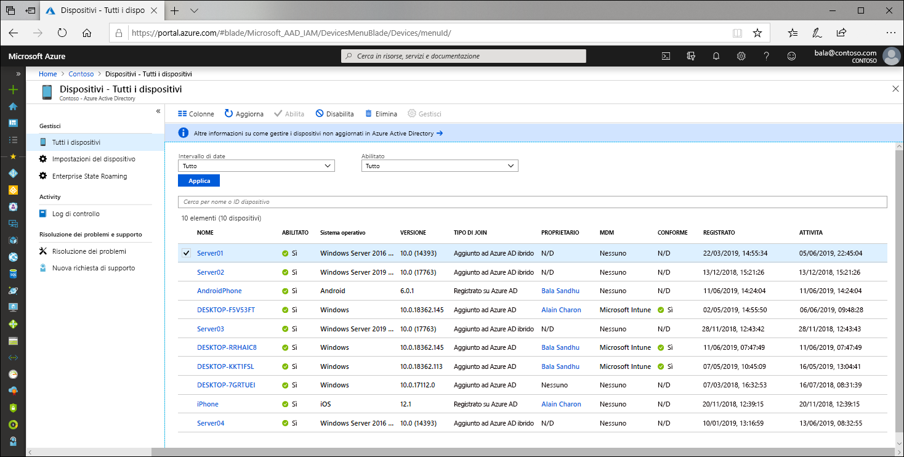

# Informazioni sulle identità dei dispositivi

Con la diffusione di dispositivi di tutte le forme e dimensioni e del concetto BYOD (Bring Your Own Device) i professionisti IT si trovano a dover affrontare due obiettivi opposti:

- Consentire agli utenti finali di essere produttivi sempre e ovunque
- Proteggere gli asset dell'organizzazione

Per proteggere questi asset, il personale IT deve gestire prima di tutto le identità dei dispositivi. A tale scopo, può usare strumenti come Microsoft Intune per assicurarsi che siano soddisfatti gli standard di sicurezza e conformità. Azure Active Directory (Azure AD) consente l'accesso Single Sign-On a dispositivi, app e servizi da qualsiasi posizione.

- Gli utenti hanno accesso agli asset dell'organizzazione di cui hanno bisogno. 
- Il personale IT dispone dei controlli necessari per proteggere l'organizzazione.

La gestione delle identità dei dispositivi costituisce un elemento fondamentale per l'[accesso condizionale basato su dispositivo](../conditional-access/require-managed-devices.md). Con i criteri di accesso condizionale basato su dispositivo, è possibile assicurarsi che l'accesso alle risorse nell'ambiente in uso sia possibile solo con dispositivi gestiti.

## Inserire i dispositivi in Azure AD

Per inserire un dispositivo in Azure AD, sono disponibili più opzioni:

- **Registrazione in Azure AD**
   - I dispositivi registrati in Azure AD personali sono in genere dispositivi personali o dispositivi mobili e sono accessibili con un account Microsoft personale o un altro account locale.
      - Windows 10
      - iOS
      - Android
      - MacOS
- **Aggiunta ad Azure AD**
   - I dispositivi aggiunti ad Azure AD sono di proprietà di un'organizzazione e sono accessibili con un account Azure AD appartenente all'organizzazione. Sono presenti solo nel cloud.
      - Windows 10 
- **Aggiunto a Azure AD in modalità ibrida**
   - I dispositivi aggiunti ad Azure AD in modalità ibrida sono di proprietà di un'organizzazione e sono accessibili con un account Azure AD appartenente all'organizzazione. Sono presenti nel cloud e nell'ambiente locale.
      - Windows 7, 8.1 o 10
      - Windows Server 2008 o versioni successive

## Gestione dei dispositivi

In Azure AD i dispositivi possono essere gestiti usando strumenti per la gestione di dispositivi mobili (MDM), come Microsoft Intune, System Center Configuration Manager, Criteri di gruppo (aggiunta ad Azure AD in modalità ibrida), strumenti per la gestione di applicazioni mobili (MAM) o altri strumenti di terze parti.

## Accesso alle risorse

I processi di registrazione e aggiunta offrono agli utenti l'accesso Single Sign-On (SSO) alle risorse del cloud e agli amministratori la possibilità di applicare criteri di accesso condizionale a tali risorse. 

I dispositivi aggiunti ad Azure AD, o ad Azure AD in modalità ibrida, usufruiscono dell'accesso SSO alle risorse locali dell'organizzazione e alle risorse del cloud. Altre informazioni sono disponibili nell'articolo [Funzionamento dell'accesso SSO alle risorse locali nei dispositivi aggiunti ad Azure AD](azuread-join-sso.md).

## Sicurezza dei dispositivi

- I **dispositivi registrati in Azure AD** usano un account gestito dall'utente finale, che può essere un account Microsoft o un'altra credenziale gestita in locale e protetta con almeno una delle tecnologie seguenti.
   - Password
   - PIN
   - Modello
   - Windows Hello
- I **dispositivi aggiunti ad Azure AD o ad Azure AD in modalità ibrida** usano un account aziendale in Azure AD protetto con almeno una delle tecnologie seguenti.
   - Password
   - Windows Hello for Business

## Provisioning

L'inserimento di dispositivi in Azure AD può essere eseguito in modalità self-service o tramite un processo di provisioning controllato dagli amministratori.

## Summary

Con la gestione delle identità dei dispositivi in Azure AD, è possibile:

- Semplificare il processo di inserimento e gestione dei dispositivi in Azure AD
- Fornire agli utenti un accesso facile da usare alle risorse basate sul cloud dell'organizzazione

## Requisiti relativi alle licenze

[!INCLUDE [Active Directory P1 license](../../../includes/active-directory-p1-license.md)]

## Passaggi successivi

- Vedere altre informazioni sui [dispositivi registrati in Azure AD](concept-azure-ad-register.md)
- Vedere altre informazioni sui [dispositivi aggiunti ad Azure AD](concept-azure-ad-join.md)
- Vedere altre informazioni sui [dispositivi aggiunti ad Azure AD in modalità ibrida](concept-azure-ad-join-hybrid.md)
- Per una panoramica sulla gestione delle identità dei dispositivi nel portale di Azure, vedere [Managing device identities using the Azure portal](device-management-azure-portal.md) (Gestione delle identità dei dispositivi tramite il portale di Azure).
- Per altre informazioni sull'accesso condizionale basato su dispositivo, vedere [Configurare i criteri di accesso condizionale basato su dispositivo di Azure Active Directory](../conditional-access/require-managed-devices.md).
