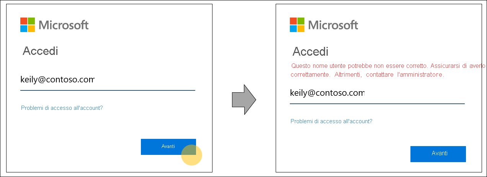
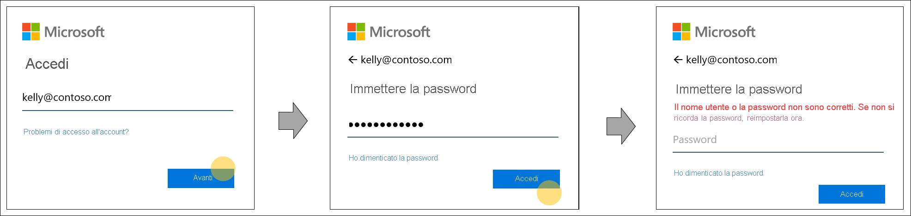

# Individuazione dell'area di autenticazione principale per le pagine di accesso di Azure Active Directory

È in corso una modifica del comportamento di accesso ad Azure Active Directory (Azure AD) per ampliare i metodi di autenticazione e migliorare l'usabilità. Durante l'accesso, Azure AD determina qual è l'area appropriata per l'autenticazione dell'utente. Azure AD prende decisioni intelligenti leggendo le impostazioni dell'organizzazione e dell'utente per il nome utente immesso nella pagina di accesso. Si tratta di un passo in avanti verso un futuro senza password che consente credenziali aggiuntive come FIDO 2.0.

## Comportamento dell'individuazione dell'area di autenticazione principale

In passato, l'individuazione dell'area di autenticazione principale era governata dal dominio fornito al momento dell'accesso o da un criterio di individuazione dell'area di autenticazione principale per alcune applicazioni legacy. Ad esempio, pur digitando il nome utente in modo non corretto, un utente di Azure Active Directory veniva comunque indirizzato alla schermata di raccolta delle credenziali dell'organizzazione. Questo errore si verificava quando l'utente specificava correttamente il nome di dominio dell'organizzazione "contoso.com". Questo comportamento non consente la granularità per personalizzare le esperienze per un singolo utente.

Per supportare una gamma più ampia di credenziali e aumentare l'usabilità, il comportamento di ricerca del nome utente di Azure Active Directory durante il processo di accesso è stato aggiornato. Il nuovo comportamento prende decisioni intelligenti leggendo le impostazioni a livello dell'organizzazione e a livello dell'utente in base nome utente immesso nella pagina di accesso. A tale scopo, Azure Active Directory verifica se il nome utente immesso nella pagina di accesso esiste nel dominio specificato o reindirizza l'utente per fornire le credenziali.

Un ulteriore vantaggio di questo nuovo processo sono i messaggi di errore migliorati. Di seguito sono riportati alcuni esempi dei messaggi di errore migliorati quando si accede a un'applicazione che supporta solo gli utenti di Azure Active Directory.

- Il nome utente non è corretto o non è ancora stato sincronizzato con Azure AD:
  
    
  
- Il nome di dominio non è corretto:
  
    
  
- L'utente tenta di accedere con un dominio non aziendale noto:
  
    
  
- La password non è corretta, ma il nome utente è accurato:  
  
    
  
> [!IMPORTANT]
> Questa funzionalità potrebbe avere un effetto sui domini federati che si basano sull'individuazione dell'area di autenticazione principale a livello di dominio precedente per forzare la federazione. Per aggiornamenti sulla data in cui verrà aggiunto il supporto del dominio federato, vedere [Individuazione dell'area di autenticazione principale durante l'accesso per i servizi Microsoft 365](https://azure.microsoft.com/updates/signin-hrd/). Nel frattempo, alcune organizzazioni hanno formato i propri dipendenti per accedere con un nome utente che non esiste in Azure Active Directory ma che contiene il nome di dominio appropriato, perché attualmente i nomi di dominio indirizzano gli utenti all'endpoint del dominio dell'organizzazione. Il nuovo comportamento di accesso non consente questa operazione. L'utente riceve una notifica per correggere il nome utente e non è autorizzato ad accedere con un nome utente che non esiste in Azure Active Directory.
>
> Se l'utente o l'organizzazione hanno implementato procedure che dipendono dal comportamento precedente, è importante che gli amministratori dell'organizzazione aggiornino la documentazione di accesso e autenticazione dei dipendenti e che forniscano ai dipendenti la formazione adeguata affinché usino il nome utente di Azure Active Directory per accedere.
  
In caso di problemi con il nuovo comportamento, è possibile inviare commenti nella sezione **Feedback** di questo articolo.  

## Passaggi successivi

[Personalizzare l'accesso](../fundamentals/add-custom-domain.md)
