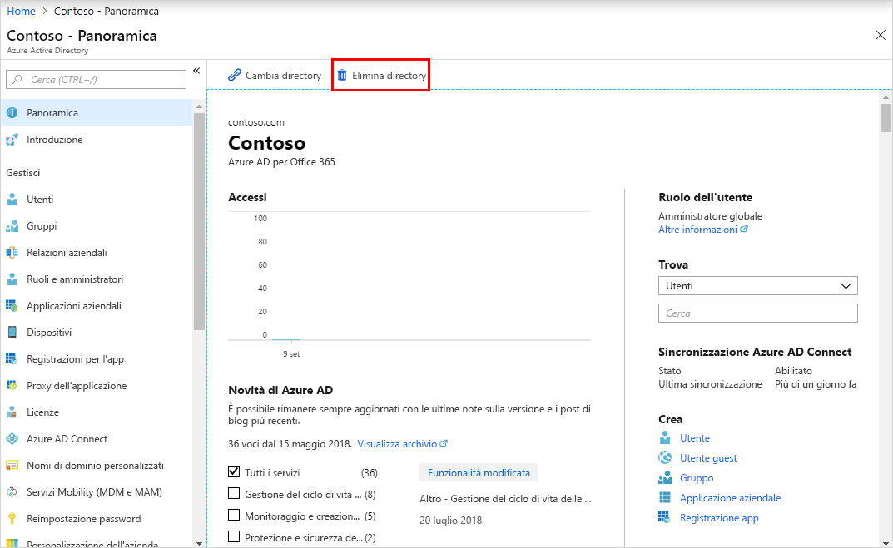

# Guida introduttiva: Creare un nuovo tenant in Azure Active Directory
Nel portale di Azure Active Directory (Azure AD) è possibile eseguire tutte le attività amministrative, inclusa la creazione di un nuovo tenant per l'organizzazione. 

In questa guida introduttiva si apprenderà come accedere al portale di Azure e ad Azure Active Directory e come creare un tenant di base per l'organizzazione.

Se non si ha una sottoscrizione di Azure, creare un [account gratuito](https://azure.microsoft.com/free/) prima di iniziare.

## Accedere al portale di Azure
Accedere al [portale di Azure](https://portal.azure.com/) dell'organizzazione con un account Amministratore globale.

## Creare un nuovo tenant per l'organizzazione
Dopo aver eseguito l'accesso al portale di Azure, è possibile creare un nuovo tenant per l'organizzazione. Il nuovo tenant rappresenta l'organizzazione e consente di gestire un'istanza specifica dei servizi cloud Microsoft per gli utenti interni ed esterni.

### Per creare un nuovo tenant
1. Selezionare **Crea una risorsa**, **Identità** e quindi **Azure Active Directory**.

    Viene visualizzata la pagina **Crea directory**.

    

2.  Nella pagina **Crea directory** immettere le informazioni seguenti:
    
    - Digitare _Contoso_ nella casella **Nome organizzazione**.

    - Digitare _Contoso_ nella casella **Nome di dominio iniziale**.

    - Nella casella **Paese o area geografica** lasciare l'opzione _Stati Uniti_.

3. Selezionare **Create**.

Viene creato il nuovo tenant con il dominio contoso.onmicrosoft.com.

## Pulire le risorse
Se non si intende continuare a usare questa applicazione, è possibile eliminare il tenant seguendo questa procedura:

- Selezionare **Azure Active Directory** e, nella pagina **Contoso - Panoramica**, selezionare **Elimina directory**.

    Viene eliminato il tenant, insieme alle informazioni associate.

    

## Passaggi successivi
- Modificare o aggiungere altri nomi di dominio: vedere [Aggiungere un nome di dominio personalizzato ad Azure Active Directory](add-custom-domain.md)

- Aggiungere utenti: vedere [Aggiungere o eliminare un nuovo utente](add-users-azure-active-directory.md)

- Aggiungere gruppi e membri: vedere [Creare un gruppo di base e aggiungere membri](active-directory-groups-create-azure-portal.md)

- Acquisire altre informazioni sull'[accesso in base al ruolo con Privileged Identity Management](../../role-based-access-control/pim-azure-resource.md) e sull'[accesso condizionale](../../role-based-access-control/conditional-access-azure-management.md) per gestire l'accesso alle risorse e alle applicazioni dell'organizzazione.

- Acquisire altre informazioni su Azure AD, tra cui [informazioni di base sulle licenze, sulla terminologia e sulle funzionalità associate](active-directory-whatis.md).
