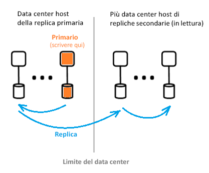

# Che cos'è l'architettura di Azure Active Directory?
Azure Active Directory (Azure AD) consente di gestire in modo sicuro l'accesso ai servizi e alle risorse di Azure per gli utenti. In Azure AD è inclusa una suite completa di funzionalità di gestione delle identità. Per informazioni sulle funzionalità di Azure AD, vedere [Informazioni su Azure Active Directory](active-directory-whatis.md).

Con Azure AD, è possibile creare e gestire utenti e gruppi e abilitare le autorizzazioni per consentire o negare l'accesso alle risorse aziendali. Per informazioni sulla gestione delle identità, vedere [Nozioni fondamentali sulla gestione delle identità di Azure](active-directory-whatis.md).

## Architettura di Azure AD
L'architettura distribuita geograficamente di Azure AD combina funzionalità complete di monitoraggio, reindirizzamento automatizzato, failover e ripristino che offrono ai clienti disponibilità e prestazioni a livello di organizzazione.

In questo articolo vengono illustrati gli elementi dell'architettura seguenti:
 *  Progettazione dell'architettura del servizio
 *  Scalabilità
 *  Disponibilità continua
 *  Data center

### Progettazione dell'architettura del servizio
L'approccio più diffuso per la compilazione di un sistema accessibile, utilizzabile e ad alto contenuto di dati consiste nell'usare blocchi predefiniti o unità di scala indipendenti. Per il livello di dati di Azure AD, le unità di scala sono note come *partizioni*. 

Il livello dati ha diversi servizi front-end che forniscono funzionalità di lettura/scrittura. Il diagramma seguente illustra come vengono garantiti i componenti di una partizione di directory singola in data center distribuiti geograficamente. 

  

I componenti dell'architettura di Azure AD includono una replica primaria e una replica secondaria.

**Replica primaria**

La *replica primaria* riceve tutte le *operazioni di scrittura* per la partizione a cui appartiene. Ogni operazione di scrittura viene immediatamente replicata in una replica secondaria in un data center diverso prima di restituire un'operazione riuscita al chiamante, assicurando così la durabilità con ridondanza geografica delle operazioni di scrittura.

**Repliche secondarie**

Tutte le directory *legge* vengono gestite dalle *repliche secondarie*, che si trovano in Data Center situati fisicamente in aree geografiche diverse. Esistono molte repliche secondarie perché i dati vengono replicati in modo asincrono. Letture di directory, ad esempio le richieste di autenticazione, vengono gestite dai Data Center vicini ai clienti. Le repliche secondarie sono responsabili della scalabilità delle operazioni di lettura.

### Scalabilità

La scalabilità è la possibilità per un servizio di espandersi per poter soddisfare le crescenti richieste in termini di prestazioni. La scalabilità delle operazioni di scrittura richiede il partizionamento dei dati. La scalabilità delle operazioni di lettura richiede la replica dei dati da una partizione a più repliche secondarie distribuite in tutto il mondo.

Le richieste provenienti dalle applicazioni directory vengono instradate al data center fisicamente più vicino. Le operazioni di scrittura vengono reindirizzate in modo trasparente alla replica primaria per garantire la coerenza delle operazioni di lettura/scrittura. Le repliche secondarie estendono considerevolmente la scalabilità delle partizioni perché in genere le directory gestiscono per lo più operazioni di lettura.

Le applicazioni directory si connettono ai data center più vicini, migliorando le prestazioni e rendendo possibile l'aumento del numero di istanze. Poiché una partizione di directory può avere più repliche secondarie, le repliche secondarie possono essere poste più vicino ai client delle directory. Solo i componenti del servizio directory interni con un numero elevato di operazioni di scrittura specificano come destinazione direttamente la replica primaria attiva.

### Disponibilità continua

La disponibilità (o tempo di attività) definisce la possibilità per un sistema di funzionare senza interruzioni. La chiave per la disponibilità elevata di Azure AD è che i servizi possono spostare rapidamente il traffico tra più Data Center distribuiti geograficamente. Ogni Data Center è indipendente, che consente la modalità di errore di annullamento della correlazione. Tramite questa progettazione a disponibilità elevata, Azure AD non richiede tempi di inattività per attività di manutenzione.

La progettazione delle partizioni di Azure AD è più semplice rispetto alla progettazione aziendale di AD, in quanto viene usata una progettazione a master singolo che include un processo di failover della replica primaria deterministico orchestrato con attenzione.

**Tolleranza di errore**

Un sistema è più disponibile se è a tolleranza di errore di hardware, di rete e di software. Per ogni partizione nella directory, esiste una replica master a disponibilità elevata: la replica primaria. In questa replica vengono eseguite solo operazioni di scrittura nella partizione. Questa replica viene monitorata in modo continuo e attento e le operazioni di scrittura possono essere immediatamente spostate in un'altra replica, che diventa la nuova replica primaria, se viene rilevato un errore. Durante il failover, è possibile che si verifichi una perdita di disponibilità in scrittura, in genere per 1-2 minuti. La disponibilità in lettura non è invece interessata durante questo intervallo di tempo.

Le operazioni di lettura (che sono più numerose di quelle di scrittura di diversi ordini di grandezza) passano solo alle repliche secondarie. Poiché le repliche secondarie sono idempotenti, la perdita di una replica in una determinata partizione viene facilmente compensata indirizzando le operazioni di lettura a un'altra replica, in genere nello stesso data center.

**Durabilità dei dati**

Un'operazione di scrittura è commit durevole su almeno due Data Center di poterlo riconosciuto. In questo caso il commit prima la scrittura nella replica primaria e quindi replicando immediatamente l'operazione di scrittura in almeno un altro Data Center. Questa azione di scrittura garantisce che un potenziale di perdita irreversibile del Data Center che ospita il database primario non comporta la perdita di dati.

Azure AD ha un [Obiettivo tempo di ripristino ](https://en.wikipedia.org/wiki/Recovery_time_objective) pari a zero per non perdere dati sui failover. Sono inclusi:
-  Rilascio di token e operazioni di lettura directory
-  Solo circa 5 minuti obiettivo tempo di ripristino concessi per le operazioni di scrittura nella directory

### Data center

Le repliche di Azure AD vengono archiviate in data center situati in tutto il mondo. Per altre informazioni, vedere [infrastruttura globale di Azure](https://azure.microsoft.com/global-infrastructure/).

Azure AD opera nei Data Center con le caratteristiche seguenti:

 * Autenticazione, Graph e gli altri servizi di AD si trovano dietro il servizio gateway. Il gateway gestisce il bilanciamento del carico di questi servizi. Verrà eseguito il failover automatico se viene rilevato che server non integri usano probe di integrità transazionali. Basato su questi probe di integrità, il Gateway instrada in modo dinamico il traffico ai Data Center integri.
 * Per la *legge*, la directory ha repliche secondarie e servizi front-end corrispondenti in una configurazione attiva-attiva opera in più Data Center. In caso di errore di un intero Data Center, il traffico verrà automaticamente instradato a un altro Data Center.
 *  Per la *scrive*, la directory verrà eseguito il failover replica primaria (master) nei Data Center tramite pianificato (nuova replica primaria viene sincronizzata con quella precedente) o le procedure di failover di emergenza. Durabilità dei dati avviene tramite la replica di tutti i commit in almeno due Data Center.

**Coerenza dei dati**

Il modello della directory si basa sulla coerenza finale. Un problema tipico dei sistemi distribuiti che eseguono la replica asincrona è che i dati restituiti da una "particolare" replica potrebbero non essere aggiornati. 

Azure AD offre la coerenza in lettura/scrittura per le applicazioni che specificano come destinazione una replica secondaria instradandone le operazioni di scrittura alla replica primaria ed effettuando di nuovo il pull sincrono delle operazioni di scrittura alla replica secondaria.

Per le operazioni di scrittura delle applicazioni che usano l'API Graph di Azure AD non è necessario mantenere l'affinità con la replica di una directory per la coerenza in lettura/scrittura. Il servizio Graph di Azure AD gestisce una sessione logica, che presenta affinità a una replica secondaria usata per le letture; affinità viene acquisita in un "token di replica" che il servizio graph memorizza usando una cache distribuita nel Data Center di replica secondaria. Questo token viene quindi usato per le operazioni successive nella stessa sessione logica. Per continuare a usare la stessa sessione logica, le richieste successive devono essere indirizzate a stesso Data Center di Azure AD. Non è possibile continuare a una sessione logica se il client richiede vengano indirizzate alle più Data Center di Azure AD; In questo caso il client dispone di diverse sessioni logiche che sono indipendenti drastica di lettura / scrittura.

 >[!NOTE]
 >Le operazioni di scrittura vengono immediatamente replicate nella replica secondaria in cui sono state rilasciate le operazioni di lettura della sessione logica.
 >

**Protezione dei backup**

La directory implementa le eliminazioni temporanee, invece delle eliminazioni definitive, per poter ripristinare facilmente utenti e tenant in caso di eliminazione accidentale da parte di un cliente. Se l'amministratore del tenant elimina accidentalmente un utente, può facilmente annullare l'operazione e ripristinare l'utente eliminato. 

Azure AD implementa backup giornalieri di tutti i dati e quindi può ripristinare autorevolmente i dati in caso di eliminazioni logiche o danneggiamenti. Il livello dati usa i codici di correzione degli errori e può quindi verificare la presenza di errori e correggere automaticamente determinati tipi di errori del disco.

**Metriche e monitoraggio**

L'esecuzione di un servizio a disponibilità elevata richiede funzionalità di monitoraggio e metriche di alto livello. Azure AD analizza e segnala ininterrottamente le principali metriche sull'integrità del servizio e i criteri di successo per ogni servizio. Vengono continuamente sviluppate e ottimizzate metriche e funzionalità di monitoraggio e avviso per ogni scenario, in ogni singolo servizio di Azure AD e nell'insieme di tutti i servizi.

Se un servizio di Azure AD non funziona come previsto, vengono immediatamente eseguite operazioni per ripristinare la funzionalità il prima possibile. La metrica più importante di cui Azure AD tiene traccia è la velocità con cui è possibile rilevare e attenuare un problema relativo a siti live per i clienti. Vengono effettuati considerevoli investimenti nelle funzionalità di monitoraggio e avviso per ridurre al minimo i tempi di rilevamento (obiettivo per il tempo di rilevamento: < 5 minuti) e nella conformità operativa per ridurre al minimo i tempi di attenuazione (obiettivo per il tempo di attenuazione: < 30 minuti).

**Operazioni sicure**

Per tutte le operazioni, vengono usati controlli operativi, ad esempio Multi-Factor Authentication (MFA), oltre al controllo di tutte le operazioni. Viene anche usato un sistema di elevazione JIT per concedere l'accesso temporaneo necessario per eventuali attività operative su richiesta su base regolare. Per altre informazioni, vedere [Il cloud attendibile](https://azure.microsoft.com/support/trust-center).

## Passaggi successivi
[Guida per gli sviluppatori di Azure Active Directory](https://docs.microsoft.com/azure/active-directory/develop/active-directory-developers-guide)

