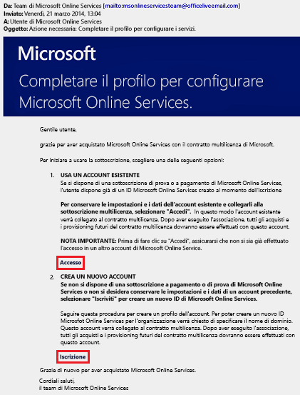
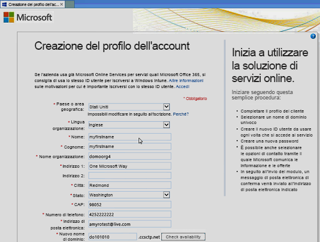
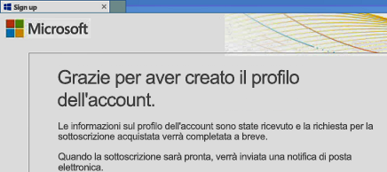
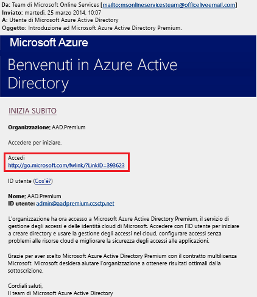
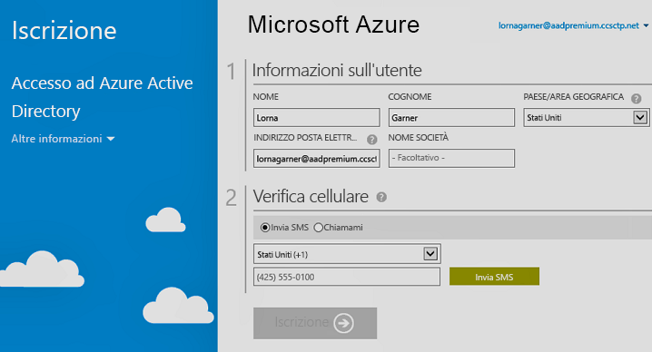

# Effettuare l'iscrizione alle edizioni Premium di Azure Active Directory
È possibile acquistare e associare le edizioni Premium di Azure Active Directory (Azure AD) alla sottoscrizione di Azure. Se è necessario creare una nuova sottoscrizione di Azure, sarà anche necessario attivare il piano di licenze e l'accesso al servizio Azure AD.

> [!NOTE]
>Le edizioni Premium e Basic di Azure AD sono disponibili per i clienti in Cina che usano l'istanza globale di Azure Active Directory. Le edizioni Azure AD Premium e Basic non sono attualmente supportate nel servizio di Azure gestito da 21Vianet in Cina. Per altre informazioni, contattare Microsoft tramite il [forum di Azure Active Directory](https://feedback.azure.com/forums/169401-azure-active-directory/).

Prima di iscriversi ad Active Directory Premium 1 o Premium 2, è necessario determinare quale sottoscrizione o piano esistente usare:

- La sottoscrizione di Azure o Office 365 esistente

- Il piano di licenza di Enterprise Mobility + Security

- Un piano per Contratti multilicenza Microsoft

Se si effettua l'iscrizione usando la sottoscrizione di Azure con licenze di Azure AD acquistate e attivate in precedenza, le licenze vengono attivate automaticamente nella stessa directory. Se non è questo il caso, è comunque necessario attivare il piano di licenze e l'accesso ad Azure AD. Per altre informazioni sull'attivazione del piano di licenze, vedere [Attivare un piano di licenze](#activate-your-new-license-plan). Per altre informazioni sull'attivazione dell'accesso ad Azure AD, vedere [Attivare l'accesso ad Azure Active Directory](#activate-your-azure-ad-access). 

## Effettuare l'iscrizione usando la sottoscrizione di Azure o Office 365 esistente
I sottoscrittori di Azure o Office 365 possono acquistare le edizioni Azure Active Directory Premium online. Per informazioni dettagliate vedere i video relativi a [come acquistare Azure Active Directory Premium (clienti esistenti)](https://channel9.msdn.com/Series/Azure-Active-Directory-Videos-Demos/How-to-Purchase-Azure-Active-Directory-Premium-Existing-Customer) o [come acquistare Azure Active Directory Premium (nuovi clienti)](https://channel9.msdn.com/Series/Azure-Active-Directory-Videos-Demos/How-to-Purchase-Azure-Active-Directory-Premium-New-Customers).

## Effettuare l'iscrizione con il piano di licenza di Enterprise Mobility + Security
Enterprise Mobility + Security è una suite di prodotti composta da Azure AD Premium, Azure Information Protection e Microsoft Intune. Se è già disponibile una licenza di EMS, è possibile iniziare con Azure AD, usando una di queste opzioni di gestione delle licenze:

Per altre informazioni su EMS, vedere il [ sito Web Enterprise Mobility + Security](https://www.microsoft.com/cloud-platform/enterprise-mobility-security).

- Provare EMS con una [versione di valutazione gratuita di Enterprise Mobility + Security E5](https://signup.microsoft.com/Signup?OfferId=87dd2714-d452-48a0-a809-d2f58c4f68b7&ali=1)

- Acquistare [licenze di Enterprise Mobility + Security E5](https://signup.microsoft.com/Signup?OfferId=e6de2192-536a-4dc3-afdc-9e2602b6c790&ali=1)

- Acquistare [licenze di Enterprise Mobility + Security E3](https://signup.microsoft.com/Signup?OfferId=4BBA281F-95E8-4136-8B0F-037D6062F54C&ali=1)

## Iscriversi usando il piano per Contratti multilicenza Microsoft
Tramite il piano per Contratti multilicenza Microsoft è possibile effettuare l'iscrizione ad Azure AD Premium usando uno di questi due programmi, in base al numero di licenze che si vuole ottenere:

- **Per 250 licenze o più.** [Contratto Enterprise Microsoft](https://www.microsoft.com/en-us/licensing/licensing-programs/enterprise.aspx)

- **Da 5 a 250 licenze.** [Open Volume License](https://www.microsoft.com/en-us/licensing/licensing-programs/open-license.aspx)

Per altre informazioni sulle opzioni di acquisto dei contratti multilicenza, vedere [Come acquistare tramite i contratti multilicenza](https://www.microsoft.com/en-us/licensing/how-to-buy/how-to-buy.aspx).

## Attivare il nuovo piano di licenza
Se si effettua l'iscrizione con un nuovo piano di licenza di Azure AD, è necessario attivarlo per l'organizzazione, usando l'indirizzo di posta elettronica di conferma inviato dopo l'acquisto.

### Per attivare il piano di licenza
- Aprire il messaggio di posta elettronica di conferma ricevuto da Microsoft dopo l'iscrizione e quindi fare clic su **Accedi** oppure **Iscriviti**.
   
    

    - **Accedi.** Scegliere questo collegamento se è già disponibile un tenant e quindi eseguire l'accesso con l'account amministratore esistente. È necessario essere un amministratore globale del tenant in cui le licenze vengono attivate.

    - **Iscriviti.** Scegliere questo collegamento se si vuole aprire la pagina **Creazione del profilo dell'account** e creare un nuovo tenant di Azure AD per il piano di licenza.

        

Al termine, verrà visualizzata una finestra di conferma di ringraziamento per l'attivazione del piano di licenza per il tenant.

## Attivare l'accesso ad Azure AD
Se si aggiungono nuove licenze di Azure AD Premium a una sottoscrizione esistente, l'accesso ad Azure AD dovrebbe già essere attivato. In caso contrario, sarà necessario attivare l'accesso ad Azure AD dopo aver ricevuto il **messaggio di posta elettronica di benvenuto**.  

Dopo il provisioning delle licenze acquistate nella directory, l'utente riceverà un **messaggio di posta elettronica di benvenuto**. Questo messaggio conferma che è possibile iniziare a gestire le licenze di Azure AD Premium o Enterprise Mobility + Security e le relative funzionalità. 

> [!TIP]
> Non sarà possibile accedere ad Azure AD per il nuovo tenant fino a quando non si attiva l'accesso alla directory di Azure AD dal messaggio di posta elettronica di benvenuto.

### Per attivare l'accesso ad Azure AD

1. Aprire il **messaggio di posta elettronica di benvenuto** e quindi fare clic su **Accedi**.
   
    

2. Dopo aver effettuato l'accesso, verrà richiesto di eseguire una verifica in due passaggi usando un dispositivo mobile.
   
    

Il processo di attivazione richiede in genere solo pochi minuti e si potrà poi iniziare a usare il tenant di Azure AD. 

## Passaggi successivi
Ora che si dispone di Azure AD Premium, è possibile [personalizzare il dominio](add-custom-domain.md), aggiungere [elementi di personalizzazione aziendale](customize-branding.md), [creare un tenant](active-directory-access-create-new-tenant.md) e [aggiungere gruppi](active-directory-groups-create-azure-portal.md) e [utenti](add-users-azure-active-directory.md).
