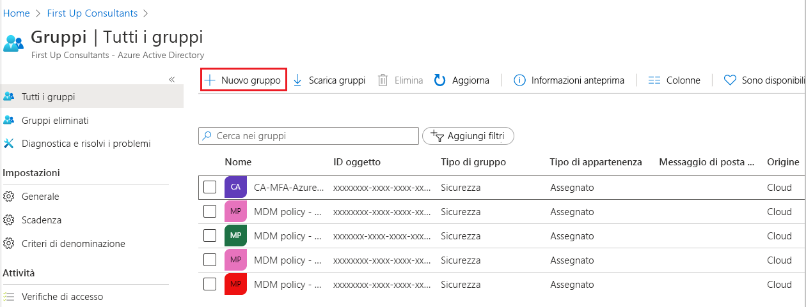
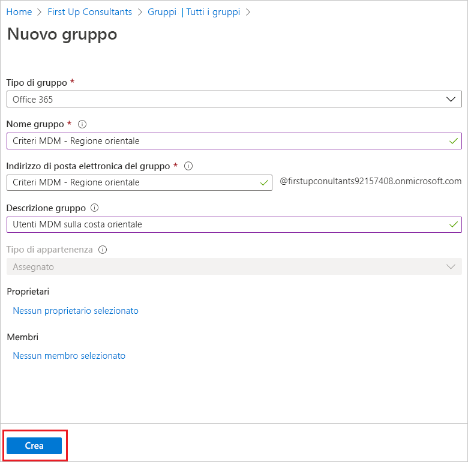
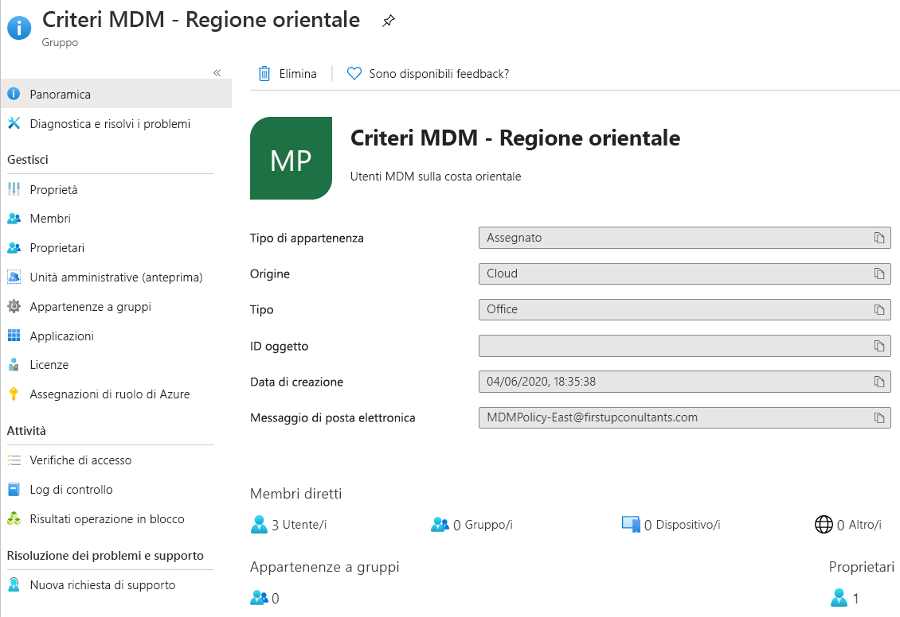

# Creare un gruppo di base e aggiungere membri con Azure Active Directory
È possibile creare un gruppo di base usando il portale di Azure Active Directory (Azure AD). Ai fini di questo articolo, un gruppo di base viene aggiunto a una singola risorsa dal proprietario della risorsa (amministratore) e include membri specifici (dipendenti) che devono accedere a tale risorsa. Per scenari più complessi, incluse le appartenenze dinamiche e la creazione di regole, vedere la [documentazione sulla gestione degli utenti di Azure Active Directory](../users-groups-roles/index.yml).

## Creare un gruppo di base e aggiungere membri
È possibile creare un gruppo di base e aggiungere i membri allo stesso tempo.

### Per creare un gruppo di base e aggiungere membri
1. Accedere al [portale di Azure](https://portal.azure.com) con un account amministratore globale per la directory.

2. Selezionare **Azure Active Directory**, **Gruppi** e quindi selezionare **Nuovo gruppo**.

    

3. Nella pagina **Gruppo** inserire le informazioni richieste.

    

    - **Tipo gruppo (obbligatorio).** Selezionare un tipo di gruppo predefinito. Sono inclusi:
        
        - **Sicurezza**. Usato per gestire l'accesso di membri e computer a risorse condivise per un gruppo di utenti. Ad esempio, è possibile creare un gruppo di sicurezza per criteri di sicurezza specifici. In questo modo, è possibile concedere un set di autorizzazioni a tutti i membri in una sola volta, invece di dover aggiungere autorizzazioni per ogni membro singolarmente. Per altre informazioni sulla gestione dell'accesso alle risorse, vedere [Gestire l'accesso alle risorse tramite i gruppi di Azure Active Directory](active-directory-manage-groups.md).
        
        - **Office 365**. Offre opportunità di collaborazione consentendo ai membri di accedere a cassette postali, calendari, file, siti di SharePoint e altri elementi condivisi. Questa opzione consente anche di concedere l'accesso al gruppo a utenti esterni all'organizzazione. Per altre informazioni sui gruppi di Office 365, vedere [Informazioni su Gruppi di Office 365](https://support.office.com/article/learn-about-office-365-groups-b565caa1-5c40-40ef-9915-60fdb2d97fa2).

    - **Nome gruppo (obbligatorio).** Aggiungere un nome per il gruppo, significativo e facile da ricordare.

    - **Descrizione gruppo.** Aggiungere una descrizione facoltativa per il gruppo.

    - **Tipo di appartenenza (obbligatorio).** Selezionare un tipo di appartenenza predefinito. Sono inclusi:

        - **Assegnato.** Consente di aggiungere utenti specifici come membri di questo gruppo con autorizzazioni univoche. Ai fini di questo articolo viene usata questa opzione.

        - **Utente dinamico.** Consente di usare le regole per i gruppi dinamici per aggiungere e rimuovere i membri automaticamente. Se cambiano gli attributi di un membro, il sistema esamina le regole per i gruppi dinamici per la directory per verificare se il membro soddisfa i requisiti delle regole (viene aggiunto) o non soddisfa più i requisiti delle regole (viene rimosso).

        - **Dispositivo dinamico.** Consente di usare le regole per i gruppi dinamici per aggiungere e rimuovere i dispositivi automaticamente. Se cambiano gli attributi di un dispositivo, il sistema esamina le regole per i gruppi dinamici per la directory per verificare se il dispositivo soddisfa i requisiti delle regole (viene aggiunto) o non soddisfa più i requisiti delle regole (viene rimosso).

        >[!Important]
        >È possibile creare un gruppo dinamico per dispositivi o utenti, ma non per entrambi. Non è inoltre possibile creare un gruppo di dispositivi in base agli attributi dei proprietari dei dispositivi. Le regole di appartenenza dei dispositivi possono fare riferimento solo agli attributi dei dispositivi. Per altre informazioni sulla creazione di un gruppo dinamico per utenti e dispositivi, vedere [Creare un gruppo dinamico e controllare lo stato](../users-groups-roles/groups-create-rule.md).

4. Selezionare **Create**.

    Il gruppo viene creato ed è pronto per l'aggiunta di membri.

5. Selezionare l'area **Membri** nella pagina **Gruppo** quindi iniziare a cercare i membri da aggiungere al gruppo nella pagina **Seleziona membri**.

    

6. Dopo aver aggiunto tutti i membri, scegliere **Seleziona**.

    La pagina **Panoramica gruppo** viene aggiornata per indicare il numero di membri aggiunti al gruppo.

    

## Passaggi successivi
Ora che è stato aggiunto un gruppo e almeno un utente, è possibile:

- [Visualizzare gruppi e membri](active-directory-groups-view-azure-portal.md)

- [Gestire l'appartenenza ai gruppi](active-directory-groups-membership-azure-portal.md)

- [Gestire le regole dinamiche per gli utenti in un gruppo](../users-groups-roles/groups-create-rule.md)

- [Modificare le impostazioni del gruppo](active-directory-groups-settings-azure-portal.md)

- [Gestire l'accesso alle risorse con i gruppi](active-directory-manage-groups.md)

- [Gestire l'accesso alle app SaaS con i gruppi](../users-groups-roles/groups-saasapps.md)

- [Gestire i gruppi con i comandi di PowerShell](../users-groups-roles/groups-settings-v2-cmdlets.md)

- [Associare o aggiungere una sottoscrizione di Azure ad Azure Active Directory](active-directory-how-subscriptions-associated-directory.md)