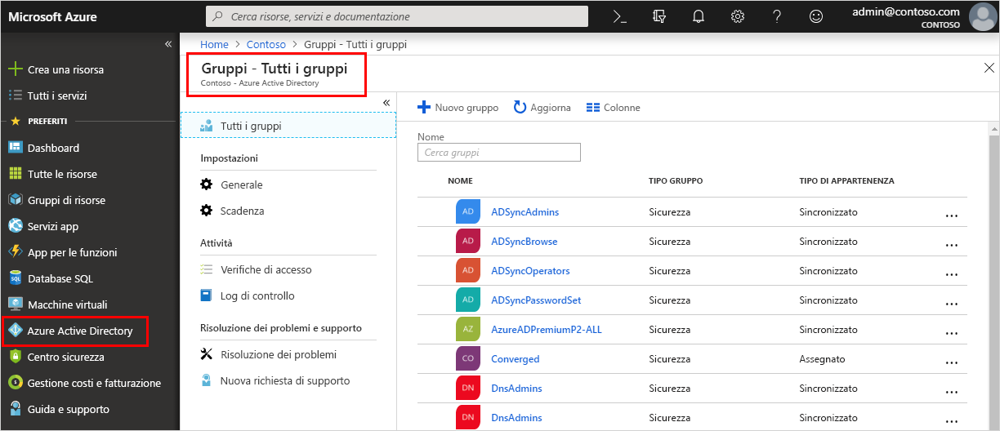

<!--As a brand-new Azure AD administrator, I need to view my organization’s groups along with the assigned members, so I can manage permissions to apps and services for people in my organization-->

# Avvio rapido: Visualizzare i gruppi e i membri dell'organizzazione in Azure Active Directory
È possibile visualizzare i gruppi esistenti dell'organizzazione e i membri dei gruppi usando il portale di Azure. I gruppi vengono usati per gestire gli utenti (membri) che necessitano tutti dello stesso accesso e delle stesse autorizzazioni per le app e i servizi con potenziali restrizioni.

In questa guida introduttiva si visualizzeranno tutti i gruppi esistenti dell'organizzazione e i membri assegnati.

Se non si ha una sottoscrizione di Azure, creare un [account gratuito](https://azure.microsoft.com/free/) prima di iniziare. 

## Prerequisiti
Prima di iniziare, è necessario:

- Creare un tenant di Azure Active Directory. Per altre informazioni, vedere [Accedere al portale di Azure Active Directory e creare un nuovo tenant](active-directory-access-create-new-tenant.md).

## Accedere al portale di Azure
È necessario accedere al [portale di Azure](https://portal.azure.com/) con un account amministratore globale per la directory.

## Creare un nuovo gruppo 
Creare un nuovo gruppo denominato _MDM policy - West_. Per altre informazioni sulla creazione di un gruppo, vedere [Come creare un gruppo di base e aggiungere membri](active-directory-groups-create-azure-portal.md).

1. Selezionare **Azure Active Directory**, **Gruppi** e quindi selezionare **Nuovo gruppo**.

2. Completare la pagina **Gruppo**:
    
    - **Tipo gruppo:** Scegliere **Sicurezza**
    
    - **Nome gruppo:** Digitare _criteri MDM - occidentale_
    
    - **Tipo di appartenenza:** Selezionare **Assegnato**.

3. Selezionare **Create**.

## Creare un nuovo utente
Creare un nuovo utente denominato _Alain Charon_. Un utente deve esistere prima di essere aggiunto come membro di un gruppo. Per altre informazioni sulla creazione di un utente, vedere [Come aggiungere o eliminare utenti](add-users-azure-active-directory.md).

1. Selezionare **Azure Active Directory**, **Utenti** e quindi selezionare **Nuovo utente**.

2. Completare la pagina **Utente**:

    - **Nome:** Digitare _Alain Charon_.

    - **Nome utente:** Digitare *alain@contoso.com*.

3. Copiare la password generata automaticamente nella casella **Password** e quindi selezionare **Crea**.

## Aggiungere un membro di un gruppo
Dopo aver creato un gruppo e un utente, è possibile aggiungere _Alain Charon_ come membro al gruppo _MDM policy - West_. Per altre informazioni sull'aggiunta di membri di un gruppo, vedere [Come aggiungere o rimuovere membri di un gruppo](active-directory-groups-members-azure-portal.md).

1. Selezionare **Azure Active Directory** > **Gruppi**.

2. Nella pagina **Gruppi - Tutti i gruppi** cercare e selezionare il gruppo **MDM policy - West**.

3. Nella pagina **Panoramica di MDM policy - West** selezionare **Membri** nell'area **Gestione**.

4. Selezionare **Aggiungi membri** e quindi cercare e selezionare **Alain Charon**.

5. Scegliere **Seleziona**.

## Visualizzare tutti i gruppi
È possibile visualizzare tutti i gruppi dell'organizzazione nella pagina **Gruppi - Tutti i gruppi** del portale di Azure.

- Selezionare **Azure Active Directory** > **Gruppi**.

    Verrà visualizzata la pagina **Gruppi - Tutti i gruppi** con tutti i gruppi attivi.

    

## Cercare il gruppo
Eseguire una ricerca nella pagina **Gruppi - Tutti i gruppi** per trovare il gruppo **MDM policy - West**.

1. Nella pagina **Gruppi - Tutti i gruppi** digitare _MDM_ nella casella **Cerca**.

    Nella casella **Cerca** vengono visualizzati i risultati della ricerca, incluso il gruppo _MDM policy - West_.

    

3. Selezionare il gruppo **MDM policy - West**.

4. Visualizzare le informazioni sul gruppo nella pagina **MDM policy - West Overview**, incluso il numero di membri del gruppo.

    

## Visualizzare i membri del gruppo
Dopo aver trovato il gruppo, è possibile visualizzare tutti i membri assegnati.

- Selezionare **Membri** nell'area **Gestione** e quindi esaminare l'elenco completo dei nomi dei membri assegnati a tale gruppo specifico, incluso _Alain Charon_.

    

## Pulire le risorse
Questo gruppo viene usato in diverse procedure disponibili nella sezione **Guide alle procedure** di questa documentazione. Se tuttavia si preferisce non usare questo gruppo, è possibile eliminarlo con i membri assegnati seguendo questa procedura:

1. Nella pagina **Gruppi - Tutti i gruppi** cercare il gruppo **MDM policy - West**.

2.  Selezionare il gruppo **MDM policy - West**.

    Viene visualizzata la pagina **Panoramica di MDM policy - West**.

3. Selezionare **Elimina**.

    Il gruppo e i membri associati vengono eliminati.

    

    >[!Important]
    >Questa operazione non elimina l'utente Alain Charon, ma solo l'appartenenza al gruppo eliminato.

## Passaggi successivi
Passare all'articolo successivo per informazioni su come associare una sottoscrizione ad Azure AD directory.

> [!div class="nextstepaction"]
> [Associare una sottoscrizione di Azure](active-directory-how-subscriptions-associated-directory.md)
