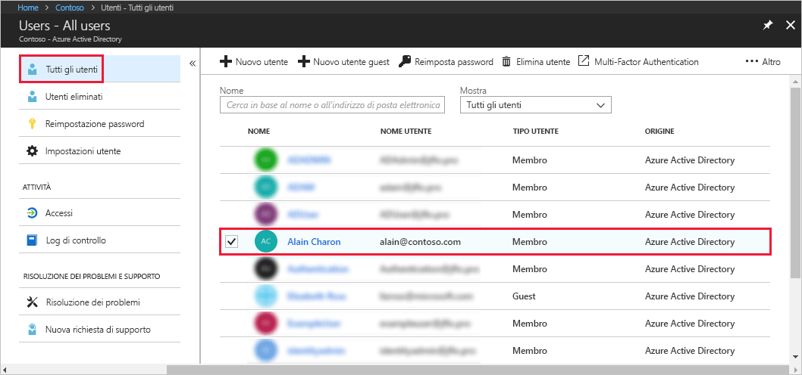

# Assegnare un utente ai ruoli di amministratore in Azure Active Directory
Questo articolo descrive come assegnare un ruolo di amministratore a un utente in Azure Active Directory (Azure AD). Per informazioni sull'aggiunta di nuovi utenti nell'organizzazione, vedere [Aggiungere nuovi utenti ad Azure Active Directory](../add-users-azure-active-directory.md). Gli utenti aggiunti non hanno autorizzazioni di amministratore per impostazione predefinita, ma è possibile assegnare loro dei ruoli in qualsiasi momento.

## Assegnare un ruolo a un utente
1. Accedere al [portale di Azure](https://portal.azure.com) con un account di amministratore globale o di amministratore del ruolo con privilegi per la directory.

2. Selezionare **Azure Active Directory**, selezionare **Utenti** e quindi fare clic su un utente specifico nell'elenco.

    

3. Per l'utente selezionato, scegliere **Ruolo directory**, **Aggiungi ruolo** e quindi selezionare i ruoli amministrativi appropriati nell'elenco **Ruoli della directory**, ad esempio **Amministratore dell'accesso condizionale**. Per altre informazioni sui ruoli amministrativi, vedere [Assegnazione dei ruoli di amministratore in Azure AD](../users-groups-roles/directory-assign-admin-roles.md). 

    

1. Premere **Seleziona** per salvare.

## Passaggi successivi
* [Avvio rapido: Aggiungere o eliminare utenti in Azure Active Directory](add-users-azure-active-directory.md)
* [Gestire i profili utente](active-directory-users-profile-azure-portal.md)
* [Aggiungere utenti guest da un'altra directory](../b2b/what-is-b2b.md) 
* [Assegnare un utente a un ruolo in Azure AD](active-directory-users-assign-role-azure-portal.md)
* [Ripristinare un utente eliminato](active-directory-users-restore.md)
