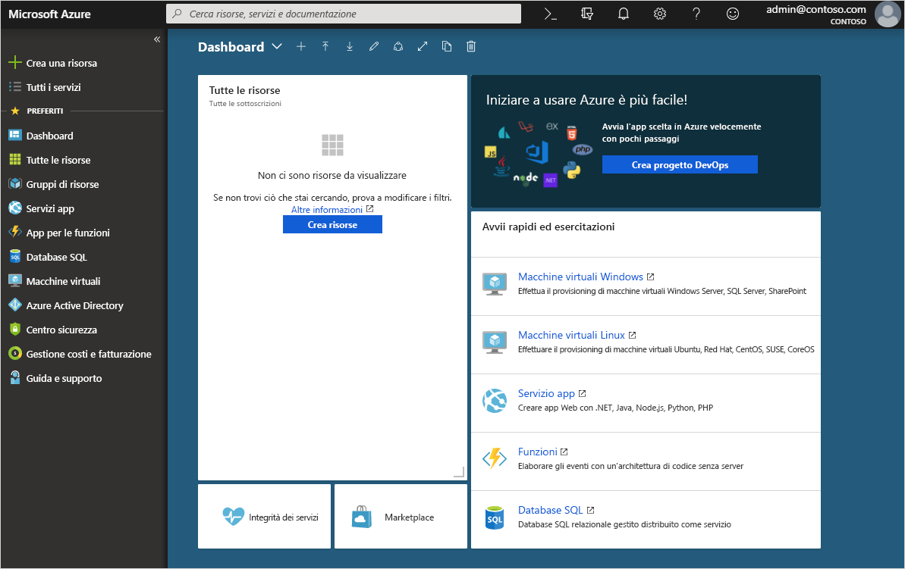

# Procedura: Aggiungere il dominio personalizzato usando il portale di Azure Active Directory
Ogni nuovo tenant di Azure AD include un nome di dominio iniziale, *nomedominio*.onmicrosoft.com. Non è possibile modificare o eliminare il nome di dominio iniziale, ma è possibile aggiungere i nomi dell'organizzazione all'elenco. L'aggiunta di nome di dominio personalizzati consente di creare nomi familiari per gli utenti, ad esempio *alain@contoso.com*.

## Prima di iniziare
Prima di poter aggiungere un nome di dominio personalizzato, è necessario crearlo con un registrar. Per un registrar accreditato, vedere [ICANN-Accredited Registrars](https://www.icann.org/registrar-reports/accredited-list.html) (Registrar accreditati da ICANN).

## Creare la directory in Azure AD
Dopo avere ottenuto il nome di dominio, è possibile creare la prima directory di Azure AD.

1. Accedere al [portale di Azure](https://portal.azure.com/) della directory usando un account con ruolo di **Proprietario** della sottoscrizione e quindi selezionare **Azure Active Directory**. Per altre informazioni sui ruoli della sottoscrizione, vedere [Ruoli di amministratore sottoscrizione classico, di controllo degli accessi in base al ruolo di Azure e di amministratore di Azure AD](../../role-based-access-control/rbac-and-directory-admin-roles.md#azure-rbac-roles).

    

    >[!TIP]
    > Se si intende eseguire la federazione dell'istanza locale di Active Directory di Windows Server con Azure AD, è necessario selezionare la casella di controllo **Desidero configurare questo dominio per l'accesso Single Sign-On con l'istanza di Active Directory locale** quando si esegue lo strumento Azure AD Connect per la sincronizzazione delle directory. È anche necessario registrare lo stesso nome di dominio selezionato per la federazione con la directory locale nel passaggio **Dominio di Azure AD** della procedura guidata. Per verificare come si presenta il passaggio nella procedura guidata, vedere [queste istruzioni](../hybrid/how-to-connect-install-custom.md#verify-the-azure-ad-domain-selected-for-federation). Se non si ha lo strumento Azure AD Connect, è possibile [scaricarlo da questa pagina](http://go.microsoft.com/fwlink/?LinkId=615771).

2. Creare la nuova directory seguendo i passaggi illustrati in [Create a new tenant for your organization](active-directory-access-create-new-tenant.md#create-a-new-tenant-for-your-organization) (Creare un nuovo tenant per l'organizzazione).

    >[!Important]
    >La persona che crea il tenant ne diventa automaticamente l'amministratore globale. L'amministratore globale può aggiungere altri amministratori al tenant.

## Aggiungere un nome di dominio personalizzato ad Azure AD
Dopo aver creato la directory, è possibile aggiungere il nome di dominio personalizzato.

1. Selezionare **Nomi di dominio personalizzati** e quindi selezionare **Aggiungi dominio personalizzato**.

    

2. Digitare il nuovo nome di dominio dell'organizzazione nella casella **Nome dominio personalizzato** (ad esempio, _contoso.com_) e quindi selezionare **Aggiungi dominio**.

    Il dominio non verificato viene aggiunto e viene visualizzata la pagina **Contoso** con le informazioni sul DNS.

    >[!Important]
    >Per il corretto funzionamento, è necessario includere .com, .net o un'altra estensione di primo livello.

    

4. Copiare le informazioni sul DNS dalla pagina **Contoso**. Ad esempio, MS=ms64983159.

    

## Aggiungere le informazioni sul DNS al registrar
Dopo aver aggiunto il nome di dominio personalizzato ad Azure AD, è necessario tornare al registrar e aggiungere le informazioni sul DNS di Azure AD dal file TXT copiato. La creazione di questo record TXT per il dominio "verifica" la proprietà del nome di dominio.

-  Tornare al registrar, creare un nuovo record TXT per il dominio basato sulle informazioni sul DNS copiate, impostare il **TTL** (durata) su 60 minuti e quindi salvare le informazioni.

    >[!Important]
    >È possibile registrare tutti i nomi di dominio desiderati. Tuttavia, ogni dominio ottiene il proprio record TXT da Azure AD. Prestare attenzione quando si immettono le informazioni del file TXT nel registrar. Se per errore si immettono informazioni non corrette o duplicate, sarà necessario attendere che il TTL raggiunga il timeout (60 minuti) prima di poter riprovare.

## Verificare il nome di dominio personalizzato
Dopo aver registrato il nome di dominio personalizzato, è necessario verificare che sia valido in Azure AD. La propagazione dal registrar ad Azure AD può essere immediata o richiedere alcuni giorni, a seconda del registrar.

### Per verificare il nome di dominio personalizzato
1. Accedere al [portale di Azure](https://portal.azure.com/) con un account amministratore globale per la directory.

2. Selezionare **Azure Active Directory** e quindi selezionare **Nomi di dominio personalizzati**.

3. Nella pagina **Fabrikam - Nomi di dominio personalizzati** selezionare il nome di dominio personalizzato **Contoso**.

    

4. Nella pagina **Contoso** selezionare **Verifica** per assicurarsi che il dominio personalizzato sia stato registrato correttamente e sia valido per Azure AD.

    

## Problemi comuni di verifica
- Se Azure AD non riesce a verificare un nome di dominio personalizzato, provare a mettere in pratica i suggerimenti seguenti:
    - **Attendere almeno un'ora e riprovare**. I record DNS devono essere propagati prima che Azure AD possa verificare il dominio e questo processo può richiedere un'ora o più.

    - **Verificare che il record DNS sia corretto.** Tornare al sito del registrar e verificare che la voce sia presente e che corrisponda alle informazioni relative alla voce DNS fornite da Azure AD.

    Se non è possibile aggiornare il record nel sito del registrar, è necessario condividere la voce con un utente che abbia le autorizzazioni appropriate per aggiungere la voce e verificare che sia corretta.

- **Verificare che il nome di dominio non sia già usato in un'altra directory.** Un nome di dominio può essere verificato esclusivamente in una directory. Se quindi il nome di dominio è attualmente verificato in un'altra directory, non può essere verificato anche nella nuova directory. Per risolvere questo problema di duplicazione, è necessario eliminare il nome di dominio dalla directory precedente. Per altre informazioni sull'eliminazione dei nomi di dominio, vedere [Gestire i nomi di dominio personalizzati](../users-groups-roles/domains-manage.md).

- **Assicurarsi che non vi siano tenant di Power BI non gestiti.** Se gli utenti hanno attivato Power BI con l'iscrizione self-service e creato un tenant non gestito per l'organizzazione, è necessario assumere la gestione come amministratore all'interno o esterno, usando PowerShell. Per altre informazioni su come acquisire la proprietà di una directory non gestita, vedere [Acquisire la proprietà di una directory non gestita come amministratore in Azure Active Directory](../users-groups-roles/domains-admin-takeover.md).

## Passaggi successivi

- Aggiungere un altro amministratore globale alla directory. Per altre informazioni, vedere [Come assegnare ruoli e amministratori](active-directory-users-assign-role-azure-portal.md)

- Per aggiungere utenti al dominio, vedere [Come aggiungere o eliminare utenti](add-users-azure-active-directory.md)

- Gestire le informazioni sul nome di dominio in Azure AD. Per altre informazioni, vedere [Gestione dei nomi di dominio personalizzati](../users-groups-roles/domains-manage.md)

- Se sono disponibili versioni locali di Windows Server che si vuole usare con Azure Active Directory, vedere [Integrare le directory locali con Azure Active Directory](../connect/active-directory-aadconnect.md).
