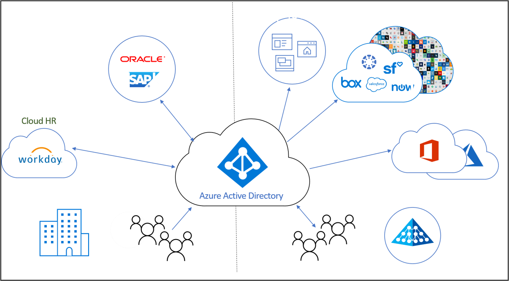

# Che cos'è la gestione del ciclo di vita delle identità?

Identity Governance consente alle organizzazioni trovare un equilibrio tra produttività (la velocità con cui una persona può accedere alle risorse necessarie, ad esempio quando inizia a collaborare con un'azienda) e sicurezza (come deve cambiare l'accesso nel tempo, ad esempio in seguito a variazioni della posizione lavorativa di tale persona).

La **gestione del ciclo di vita delle identità** rappresenta la base per Identity Governance e per una governance efficace su larga scala occorre modernizzare l'infrastruttura di gestione del ciclo di vita delle identità per le applicazioni. Lo scopo della gestione del ciclo di vita delle identità è automatizzare e gestire l'intero processo del ciclo di vita delle identità digitali. 

## Che cos'è un'identità digitale?

L'identità digitale è costituita da informazioni su un'entità usate da una o più risorse informatiche, ad esempio sistemi operativi o applicazioni. Queste entità possono rappresentare persone, organizzazioni, applicazioni o dispositivi.  L'identità viene in genere descritta dagli attributi associati, ad esempio il nome, gli identificatori e proprietà come i ruoli usati per la gestione dell'accesso.  Con questi attributi, i sistemi determinano ad esempio chi ha accesso a cosa e chi è autorizzato a usare questo o quel sistema.  

## Gestione del ciclo di vita delle identità digitali

La gestione delle identità digitali è un'attività complessa, in particolare per quanto riguarda la correlazione di oggetti reali, ad esempio una persona e la sua relazione con un'organizzazione come dipendente, con una rappresentazione digitale.    Nelle organizzazioni di piccole dimensioni, mantenere la rappresentazione digitale di singoli utenti che richiedono un'identità può essere un processo manuale: quando viene assunto qualcuno o si presenta un terzista, lo specialista IT può creare un apposito account in una directory e poi assegnare l'accesso necessario.  Tuttavia, nelle organizzazioni di dimensioni medio-grandi, l'automazione può garantire una scalabilità più efficiente e garantire l'accuratezza delle identità.

Il processo tipico per la definizione della gestione del ciclo di vita delle identità in un'organizzazione segue questi passaggi:

1. Determinare se sono già presenti sistemi di record, ovvero origini dati che l'organizzazione considera autorevoli.  Ad esempio, l'organizzazione può avere Workday come sistema di gestione delle risorse umane, che è un sistema autorevole per fornire l'elenco aggiornato di dipendenti e alcune delle relative proprietà, come il nome o il reparto.  Oppure un sistema di posta elettronica, ad esempio Exchange Online, può essere autorevole per l'indirizzo di posta elettronica di un dipendente.

2. Connettere questi sistemi di record a una o più directory e database usati dalle applicazioni e risolvere eventuali incoerenze tra le directory e i sistemi di record. Ad esempio, una directory potrebbe includere dati obsoleti, come un account di un ex dipendente, che non sono più necessari. 

3. Determinare quali processi possono essere usati per fornire informazioni autorevoli in assenza di un sistema di record.  Se ad esempio sono presenti identità digitali per i visitatori, ma l'organizzazione non ha un apposito database, potrebbe essere necessario trovare un metodo alternativo per determinare quando un'identità digitale per un visitatore non è più necessaria.

4. Eseguire una configurazione in modo che tali modifiche del sistema di record o di altri processi vengano replicate in ogni directory o database che richiede un aggiornamento.

## Gestione del ciclo di vita delle identità per rappresentare i dipendenti e altri individui con una relazione con l'organizzazione

Quando si pianifica la gestione del ciclo di vita delle identità per i dipendenti o per altri individui con una relazione con l'organizzazione, ad esempio terzisti o studenti, molte organizzazioni adottano il modello di "aggiunta, spostamento e uscita".  Si tratta di:
    
   - Aggiunta: quando un utente entra in un ambito per cui è richiesto l'accesso, queste applicazioni richiedono un'identità, quindi potrebbe essere necessario creare una nuova identità digitale se non ne è già disponibile una
   - Spostamento: quando un utente si sposta tra limiti, è necessario aggiungere o rimuovere autorizzazioni di accesso nell'identità digitale
   - Uscita: quando un utente lascia l'ambito per cui è richiesto l'accesso, può essere necessario rimuovere l'accesso e successivamente l'identità potrebbe non essere più richiesta da applicazioni diverse da quelle usate per motivi legali o di controllo

Quindi, se ad esempio nell'organizzazione entra un nuovo dipendente che è già stato affiliato in precedenza, sarà necessario fornirgli una nuova identità digitale, rappresentata come account utente in Azure AD.  La creazione di questo account rientrerà in un processo di "aggiunta", che può essere automatizzato se è presente un sistema di record, come Workday, che potrebbe indicare quando può iniziare a lavorare il nuovo dipendente.  In seguito, se un dipendente viene spostato, ad esempio dalle vendite al marketing, rientrerà nel processo di "spostamento".  In questo caso sarebbe necessario rimuovere i diritti di accesso che aveva nell'organizzazione di vendita, che non sono più necessari, e concedergli diritti nell'organizzazione di marketing, che sono ora necessari.

## Gestione del ciclo di vita delle identità per gli utenti guest

Processi simili sono necessari anche per gli utenti guest e di altro tipo.  La gestione entitlement di Azure AD utilizza Azure AD B2B (business-to-business) per fornire i controlli del ciclo di vita necessari per collaborare con persone esterne all'organizzazione che richiedono l'accesso alle risorse dell'organizzazione. Con Azure AD B2B, gli utenti esterni eseguono l'autenticazione nella propria home directory, ma hanno una rappresentazione nella directory dell'organizzazione. La rappresentazione nella directory consente di assegnare agli utenti l'accesso alle risorse dell'organizzazione.  La gestione entitlement consente a singoli individui esterni all'organizzazione di richiedere l'accesso, creando se necessario un'apposita identità digitale. Queste identità digitali vengono rimosse automaticamente quando l'utente perde l'accesso.  

## In che modo Azure AD automatizza la gestione del ciclo di vita delle identità?

Azure AD attualmente prevede le funzionalità seguenti:

* Gli utenti che rappresentano i dipendenti possono essere creati e aggiornati automaticamente in Azure AD e in Active Directory tramite [provisioning basato su risorse umane](what-is-hr-driven-provisioning.md)
* Gli utenti già presenti in Active Directory possono essere creati e gestiti automaticamente in Azure AD tramite [provisioning tra directory](what-is-inter-directory-provisioning.md)
* Gli utenti possono essere assegnati automaticamente a gruppi in base alle rispettive proprietà usando [gruppi dinamici](../external-identities/use-dynamic-groups.md#what-are-dynamic-groups) e possono, su richiesta, essere assegnati a gruppi, Teams, ruoli di Azure AD, ruoli di risorse di Azure e siti di SharePoint Online usando la [gestione entitlement](entitlement-management-scenarios.md) e la funzionalità [Privileged Identity Management](../privileged-identity-management/pim-configure.md)
* Gli aggiornamenti per gli utenti possono essere inviati automaticamente a più applicazioni tramite [provisioning di app](what-is-app-provisioning.md)

## Passaggi successivi 

- [Cos'è il provisioning?](what-is-provisioning.md)
- [Regolamentare l'accesso per gli utenti esterni nella gestione entitlement di Azure AD](/azure/active-directory/governance/entitlement-management-external-users.md)
- [Che cos'è il provisioning basato su risorse umane?](what-is-hr-driven-provisioning.md)
- [Che cos'è il provisioning di app?](what-is-app-provisioning.md)
- [Che cos'è il provisioning tra directory?](what-is-inter-directory-provisioning.md)
