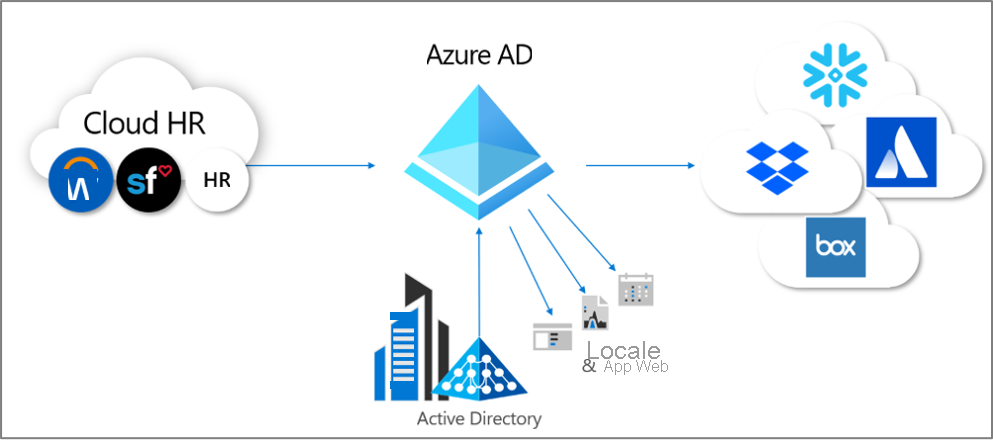
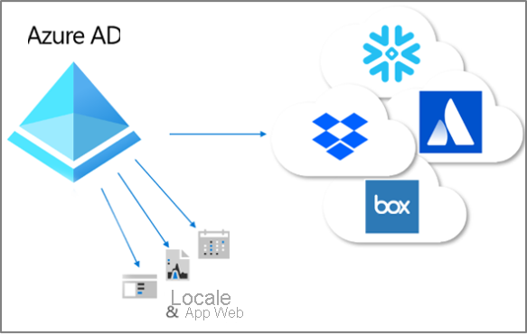

# Cos'è il provisioning?

Il provisioning e il deprovisioning sono i processi che assicurano la coerenza delle identità digitali tra più sistemi.  Questi processi vengono in genere utilizzati come parte della [gestione del ciclo di vita delle identità](what-is-identity-lifecycle-management.md).

Il **provisioning** è il processo di creazione di un'identità in un sistema di destinazione in base a determinate condizioni.  Il **deprovisioning** è il processo di rimozione dell'identità dal sistema di destinazione, quando le condizioni non vengono più soddisfatte. La **sincronizzazione** è il processo che consente di mantenere aggiornato l'oggetto di cui è stato effettuato il provisioning, in modo che l'oggetto di origine e quello di destinazione siano simili.

Ad esempio, un nuovo utente che entra a far parte dell'organizzazione viene immesso nel sistema di gestione delle risorse umane (RU).  A quel punto, il provisioning **dal** sistema RU **ad** Azure Active Directory (Azure AD) consente di creare un account utente corrispondente in Azure AD. Le applicazioni che eseguono query su Azure AD possono visualizzare l'account per il nuovo dipendente.  Nel caso di applicazioni che non usano Azure AD, il provisioning **da** Azure AD **ai** database di tali applicazioni assicura che l'utente sarà in grado di accedere a tutte le applicazioni necessarie.  L'utente può quindi iniziare a lavorare e avrà accesso fin dal primo giorno alle applicazioni e ai sistemi necessari.  Analogamente, quando le relative proprietà, ad esempio lo stato del reparto o dell'occupazione, cambiano nel sistema RU, la sincronizzazione degli aggiornamenti da tale sistema ad Azure AD e, inoltre, ad altre applicazioni e database di destinazione, garantisce la coerenza.

Azure AD attualmente fornisce tre aree di provisioning automatizzato.  Ad esempio:  

- Provisioning da un sistema di record autorevole esterno non basato su directory ad Azure AD tramite **[provisioning basato su risorse umane](#hr-driven-provisioning)**  
- Provisioning da Azure AD alle applicazioni tramite **[provisioning di app](#app-provisioning)**  
- Provisioning tra servizi di dominio di Azure AD e Active Directory, tramite **[provisioning tra directory](#inter-directory-provisioning)** 

## Provisioning basato su risorse umane

Il provisioning dal sistema RU ad Azure AD implica la creazione di oggetti, solitamente identità utente che rappresentano ogni dipendente, ma in alcuni casi altri oggetti che rappresentano reparti o altre strutture, in base alle informazioni del sistema.  

Lo scenario più comune è quando un nuovo dipendente entra a far parte dell'azienda e viene immesso nel sistema di gestione delle risorse umane.  Quando si verifica, ne viene effettuato automaticamente il provisioning come nuovo utente in Azure AD, senza la necessità di coinvolgere l'amministrazione per ogni nuova assunzione.  In generale, il provisioning basato su risorse umane copre gli scenari seguenti.

- **Assunzione di nuovi dipendenti**: quando viene aggiunto un nuovo dipendente a un sistema RU, viene automaticamente creato un account utente in Active Directory, in Azure AD e, facoltativamente, nelle directory di altre applicazioni supportate da Azure AD, con writeback dell'indirizzo di posta elettronica nel sistema RU.
- **Aggiornamenti di attributi e profili dei dipendenti**: se il record di un dipendente viene aggiornato nel sistema RU (ad esempio, il nome, la qualifica o il manager), il relativo account utente verrà aggiornato automaticamente in Active Directory, in Azure AD e, facoltativamente, in altre applicazioni supportate da Azure AD.
- **Interruzioni del rapporto con i dipendenti**: quando il rapporto con un dipendente viene terminato, il relativo account utente viene automaticamente bloccato per l'accesso o rimosso da Active Directory, Azure AD e altre applicazioni.
- **Riassunzioni dei dipendenti**: quando un dipendente viene riassunto e immesso nuovamente nel sistema RU nel cloud, è possibile riattivare automaticamente il vecchio account utente o effettuarne nuovamente il provisioning (a seconda delle preferenze).

Per il provisioning basato su risorse umane con Azure AD sono disponibili tre opzioni di distribuzione:

1. Per le organizzazioni con una singola sottoscrizione di Workday o SuccessFactors che non usano Active Directory
1. Per le organizzazioni con una singola sottoscrizione di Workday o SuccessFactors che hanno sia Active Directory che Azure AD
1. Per le organizzazioni con più sistemi RU o con un sistema RU locale come SAP, Oracle eBusiness o PeopleSoft

Per altre informazioni, vedere [Che cos'è il provisioning basato su risorse umane?](what-is-hr-driven-provisioning.md)

## Provisioning di app

In Azure AD, il termine **[provisioning di app](../app-provisioning/user-provisioning.md)** si riferisce alla creazione automatica di copie delle identità utente nelle applicazioni a cui gli utenti devono accedere, per le applicazioni che hanno un proprio archivio dati distinto da Azure AD o Active Directory. Oltre a creare le identità utente, il provisioning di app include la manutenzione e la rimozione delle identità utente da tali app quando lo stato o i ruoli dell'utente cambiano. Gli scenari comuni includono il provisioning di un utente di Azure AD in applicazioni come [Dropbox](../saas-apps/dropboxforbusiness-provisioning-tutorial.md), [Salesforce](../saas-apps/salesforce-provisioning-tutorial.md), [ServiceNow](../saas-apps/servicenow-provisioning-tutorial.md), in quanto ognuna di queste applicazioni ha un proprio repository utente distinto da Azure AD.

Per altre informazioni, vedere [Che cos'è il provisioning di app?](what-is-app-provisioning.md)

## Provisioning tra directory

Molte organizzazioni si affidano ad Active Directory e ad Azure AD e possono avere applicazioni connesse ad Active Directory, ad esempio file server locali.

Poiché molte organizzazioni in passato hanno distribuito il provisioning basato su risorse umane in locale, potrebbero avere già le identità utente per tutti i dipendenti in Active Directory.   Lo scenario più comune per il provisioning tra directory è quando un utente già presente in Active Directory viene sottoposto a provisioning in Azure AD.  Questo tipo provisioning viene in genere effettuato da agenti come il servizio di sincronizzazione di Azure AD Connect o il provisioning cloud di Azure AD Connect. 

Inoltre, è possibile che le organizzazioni scelgano di effettuare il provisioning anche in sistemi locali da Azure AD.  Ad esempio, un'organizzazione potrebbe avere inserito utenti guest nella directory di Azure AD che però dovranno avere accesso ad applicazioni Web basate sull'autenticazione integrata di Windows in locale tramite il proxy dell'app.  Per questi utenti in Azure AD è necessario effettuare il provisioning di account di AD in locale.

Per altre informazioni, vedere [Che cos'è il provisioning tra directory?](what-is-inter-directory-provisioning.md)

 
## Passaggi successivi 
- [Che cos'è la gestione del ciclo di vita delle identità?](what-is-identity-lifecycle-management.md)
- [Che cos'è il provisioning basato su risorse umane?](what-is-hr-driven-provisioning.md)
- [Che cos'è il provisioning di app?](what-is-app-provisioning.md)
- [Che cos'è il provisioning tra directory?](what-is-inter-directory-provisioning.md)