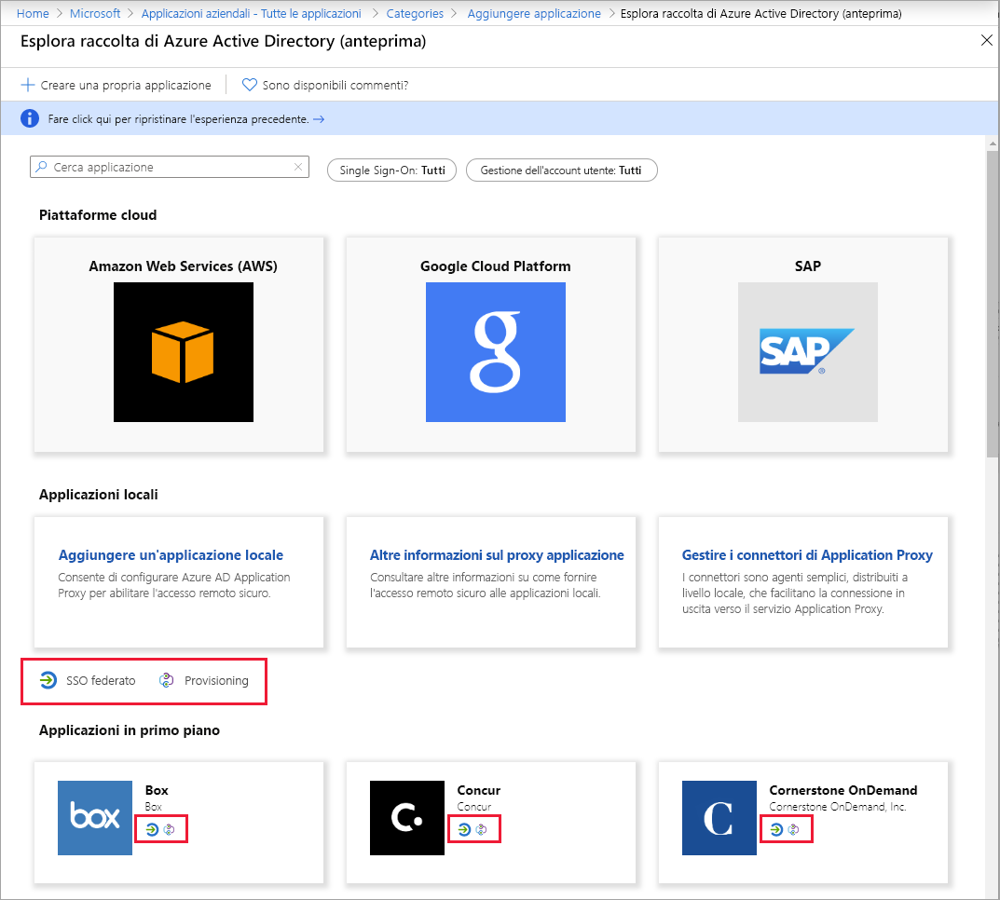
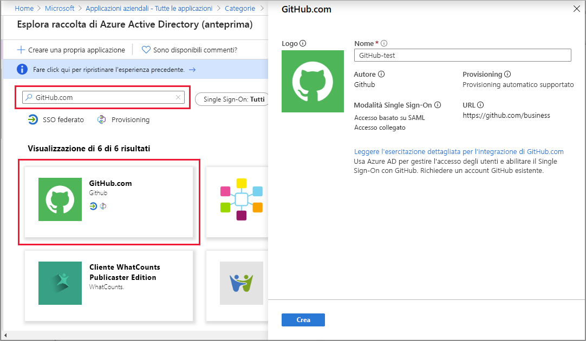

# Guida introduttiva: Aggiungere un'applicazione al tenant di Azure Active Directory

Azure Active Directory (Azure AD) offre una raccolta contenente migliaia di applicazioni preintegrate. Alcune delle applicazioni usate dall'organizzazione sono probabilmente incluse nella raccolta. Questa guida introduttiva usa il portale di Azure per aggiungere un'applicazione della raccolta al tenant di Azure Active Directory (Azure AD).

Dopo l'aggiunta di un'applicazione al tenant di Azure AD, è possibile:

- Gestire l'accesso degli utenti all'applicazione con criteri di accesso condizionale.
- Configurare gli utenti per l'accesso Single Sign-On all'applicazione con i rispettivi account Azure AD.

## Prima di iniziare

Per aggiungere un'applicazione al tenant, sono necessari gli elementi seguenti:

- Sottoscrizione di Azure AD
- Sottoscrizione abilitata per l'accesso Single Sign-On per l'applicazione

Accedere al [portale di Azure](https://portal.azure.com) come amministratore globale per il tenant di Azure AD, amministratore applicazione cloud o amministratore applicazione.

Per testare i passaggi di questa esercitazione è consigliabile usare un ambiente non di produzione. Se non è disponibile un ambiente non di produzione di Azure AD, è possibile [ottenere una versione di valutazione di un mese](https://azure.microsoft.com/pricing/free-trial/).

## Aggiungere un'applicazione al tenant di Azure AD

Per aggiungere un'applicazione della raccolta al tenant di Azure AD:

1. Nel [portale di Azure](https://portal.azure.com) selezionare **Azure Active Directory** nel riquadro di spostamento sinistro.

2. Nel riquadro **Azure Active Directory** selezionare **Applicazioni aziendali**. Verrà aperto il riquadro **Tutte le applicazioni**, in cui è visualizzato un campione casuale delle applicazioni presenti nel tenant di Azure AD.

3. Per aggiungere un'app della raccolta al tenant, selezionare **Nuova applicazione**. 

    

 4. Passare alla nuova esperienza di anteprima della raccolta: Nel banner nella parte superiore della **pagina Aggiungi applicazione** selezionare il collegamento **Fare clic qui per provare la nuova raccolta di app migliorata**.

5. Viene visualizzato il riquadro **Esplora la raccolta di Azure AD (anteprima)** , contenente sezioni per le piattaforme cloud, le applicazioni locali e le applicazioni in primo piano. Si noti che per le applicazioni elencate nella sezione **Applicazioni in primo piano** vengono visualizzate icone che indicano se l'accesso Single Sign-On (SSO) federato e il provisioning sono supportati.

    

6. È possibile sfogliare la raccolta per individuare l'applicazione da aggiungere oppure cercare l'applicazione immettendone il nome nella casella di ricerca. Selezionare quindi l'applicazione nei risultati. Nel modulo è possibile modificare il nome dell'applicazione in base alle esigenze dell'organizzazione. In questo esempio il nome è stato modificato in **GitHub-test**.

    

7. Selezionare **Create** (Crea). Verrà visualizzata una pagina Attività iniziali con le opzioni per configurare l'applicazione per l'organizzazione.

L'aggiunta dell'applicazione è completata. Le sezioni successive illustreranno come modificare il logo e altre proprietà dell'applicazione.

## Trovare l'applicazione del tenant di Azure AD

Si supponga di aver dovuto interrompere e di riprendere ora la configurazione dell'applicazione. La prima operazione da eseguire è trovare l'applicazione.

1. Nel **[portale di Azure](https://portal.azure.com)** selezionare **Azure Active Directory** nel riquadro di spostamento sinistro.
1. Nel riquadro **Azure Active Directory** selezionare **Applicazioni aziendali**.
1. Nel menu a discesa **Tipo di applicazione** selezionare **Tutte le applicazioni** e quindi **Applica**. Per altre informazioni sulle opzioni di visualizzazione, vedere [Visualizzare le applicazioni del tenant](view-applications-portal.md).
1. Verrà visualizzato un elenco di tutte le applicazioni nel tenant di Azure AD. L'elenco è un campione casuale. Per visualizzare altre applicazioni, selezionare **Mostra altro** una o più volte.
1. Per trovare rapidamente un'applicazione nel tenant, immettere il nome dell'applicazione nella casella di ricerca e selezionare **Applica**. In questo esempio viene trovata l'applicazione GitHub-test aggiunta in precedenza.

    

## Configurare le proprietà di accesso degli utenti

Dopo aver trovato l'applicazione, è possibile aprirla e configurarne le proprietà.

Per modificare le proprietà dell'applicazione:

1. Selezionare l'applicazione per aprirla.
2. Selezionare **Proprietà** per aprire il riquadro delle proprietà per la modifica.

    

3. Esaminare le opzioni di accesso. Le opzioni determinano la modalità di accesso all'applicazione per gli utenti assegnati o non assegnati all'applicazione, nonché se un utente può visualizzare l'applicazione nel pannello di accesso.

    - **Abilitata per l'accesso degli utenti?** determina se gli utenti assegnati all'applicazione potranno eseguire l'accesso.
    - **Assegnazione di utenti obbligatoria** determina se gli utenti non assegnati all'applicazione potranno eseguire l'accesso.
    - **Visibile agli utenti?** determina se un'app verrà visualizzata agli utenti assegnati nel pannello di accesso e nell'icona di avvio delle app di O365.

4. Usare le tabelle seguenti per scegliere le opzioni ottimali per le proprie esigenze.

   - Comportamento per gli utenti **assegnati**:

       | Impostazioni delle proprietà dell'applicazione | | | Esperienza degli utenti assegnati | |
       |---|---|---|---|---|
       | Abilitata per l'accesso degli utenti? | Assegnazione utenti obbligatoria | Visibile agli utenti? | Gli utenti assegnati possono eseguire l'accesso? | L'applicazione viene visualizzata agli utenti assegnati?* |
       | Sì | Sì | Sì | Sì | Sì  |
       | Sì | Sì | no  | Sì | no   |
       | Sì | no  | Sì | Sì | Sì  |
       | Sì | no  | no  | Sì | no   |
       | no  | Sì | Sì | no  | no   |
       | no  | Sì | no  | no  | no   |
       | no  | no  | Sì | no  | no   |
       | no  | no  | no  | no  | no   |

   - Comportamento per gli utenti **non assegnati**:

       | Impostazioni delle proprietà dell'applicazione | | | Esperienza degli utenti non assegnati | |
       |---|---|---|---|---|
       | Abilitata per l'accesso degli utenti? | Assegnazione utenti obbligatoria | Visibile agli utenti? | Gli utenti non assegnati possono eseguire l'accesso? | L'applicazione viene visualizzata agli utenti non assegnati?* |
       | Sì | Sì | Sì | no  | no   |
       | Sì | Sì | no  | no  | no   |
       | Sì | no  | Sì | Sì | no   |
       | Sì | no  | no  | Sì | no   |
       | no  | Sì | Sì | no  | no   |
       | no  | Sì | no  | no  | no   |
       | no  | no  | Sì | no  | no   |
       | no  | no  | no  | no  | no   |

     *L'applicazione viene visualizzata agli utenti nel pannello di accesso e nell'icona di avvio delle app di Office 365?

## Usare un logo personalizzato

Per usare un logo personalizzato:

1. Creare un logo di 215x215 pixel e salvarlo in formato PNG.
1. Dal momento che l'applicazione è già stata trovata, fare clic su di essa.
1. Nel riquadro di sinistra selezionare **Proprietà**.
1. Caricare il logo.
1. Al termine, fare clic su **Salva**. 

    

   > [!NOTE]
   > L'anteprima visualizzata in questo riquadro **Proprietà** non viene aggiornata immediatamente. Per visualizzare l'icona aggiornata, è possibile chiudere e riaprire le proprietà.

## Passaggi successivi

Ora che l'applicazione è stata aggiunta all'organizzazione di Azure AD, [scegliere un metodo di Single Sign-On](what-is-single-sign-on.md#choosing-a-single-sign-on-method) da usare e fare riferimento all'articolo appropriato di seguito:

- [Configurare l'accesso Single Sign-On basato su SAML](configure-single-sign-on-non-gallery-applications.md)
- [Configurare l'accesso Single Sign-On tramite password](configure-password-single-sign-on-non-gallery-applications.md)
- [Configurare l'accesso collegato](configure-linked-sign-on.md)
