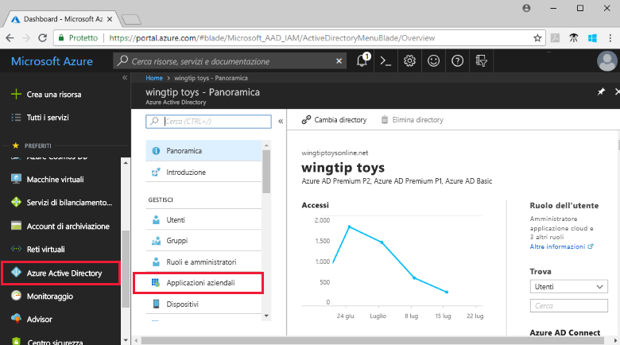
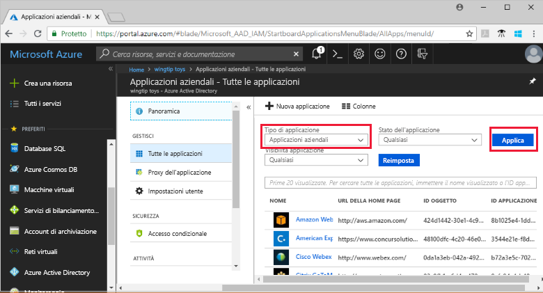
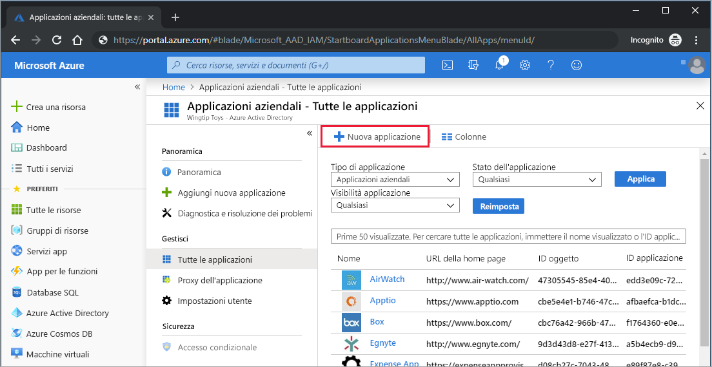
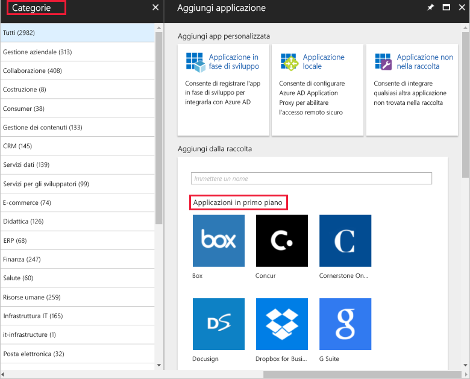
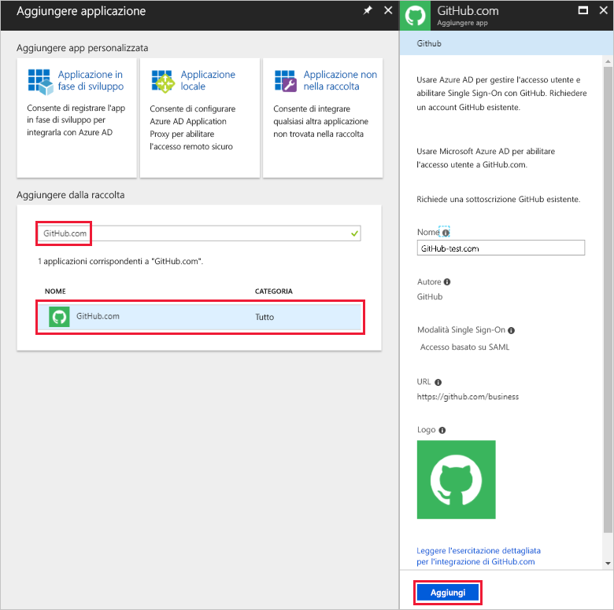
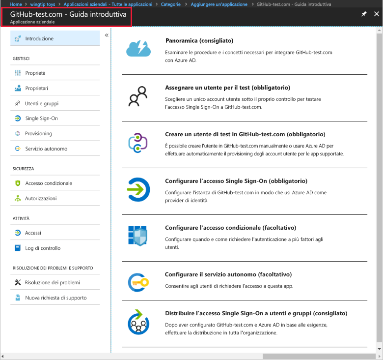
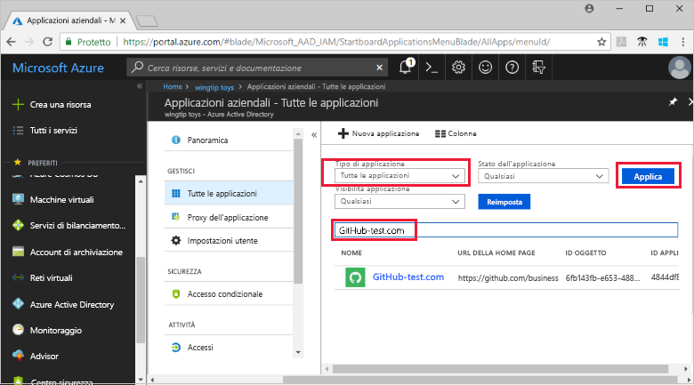
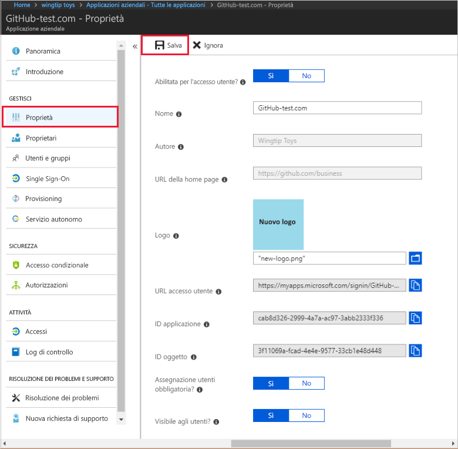
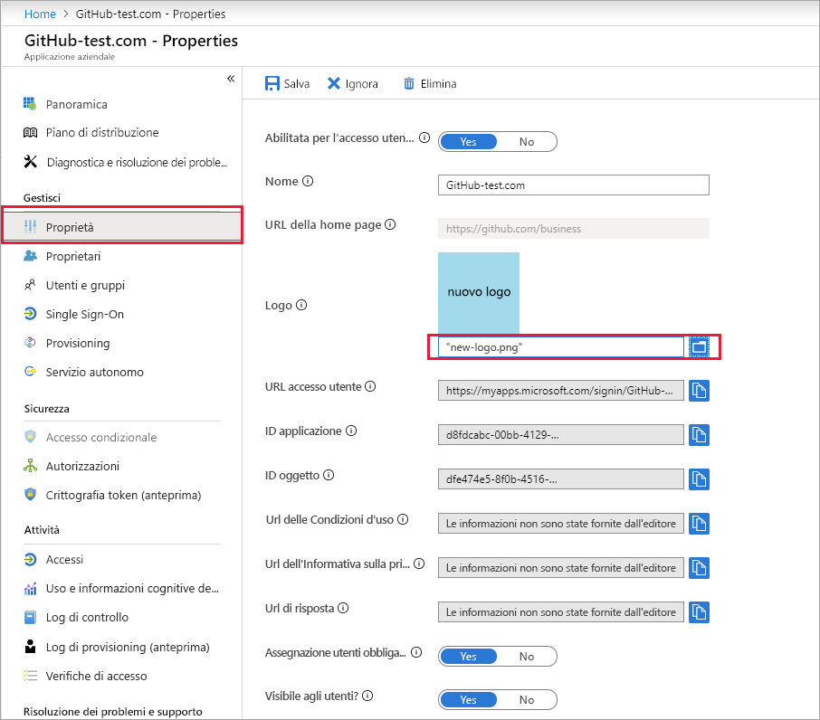

# Guida introduttiva: Aggiungere un'applicazione al tenant di Azure Active Directory

Azure Active Directory (Azure AD) offre una raccolta contenente migliaia di applicazioni preintegrate. Alcune delle applicazioni usate dall'organizzazione sono probabilmente incluse nella raccolta. Questa guida introduttiva usa il portale di Azure per aggiungere un'applicazione della raccolta al tenant di Azure Active Directory (Azure AD). 
 
Dopo l'aggiunta di un'applicazione al tenant di Azure AD, è possibile:

- Gestire l'accesso degli utenti all'applicazione con criteri di accesso condizionale.
- Configurare gli utenti per l'accesso Single Sign-On all'applicazione con i rispettivi account Azure AD.

## Prima di iniziare

Per aggiungere un'applicazione al tenant, sono necessari gli elementi seguenti:

- Sottoscrizione di Azure AD
- Sottoscrizione abilitata per l'accesso Single Sign-On per l'applicazione

Accedere al [portale di Azure](https://portal.azure.com) come amministratore globale per il tenant di Azure AD, amministratore applicazione cloud o amministratore applicazione.

Per testare i passaggi di questa esercitazione è consigliabile usare un ambiente non di produzione. Se non è disponibile un ambiente non di produzione di Azure AD, è possibile [ottenere una versione di valutazione di un mese](https://azure.microsoft.com/pricing/free-trial/).

## Aggiungere un'applicazione al tenant di Azure AD

Per aggiungere un'applicazione della raccolta al tenant di Azure AD:

1. Nel [portale di Azure](https://portal.azure.com) fare clic su **Azure Active Directory** nel pannello di spostamento a sinistra. 

2. Nel pannello **Azure Active Directory** fare clic su **Applicazioni aziendali**. 

    

3. Verrà visualizzato il pannello **Tutte le applicazioni**, contenente un campione casuale delle applicazioni nel tenant di Azure AD. 

    

4. Fare clic su **Nuova applicazione** nella parte superiore del pannello **Tutte le applicazioni**.

    

5. Per visualizzare un elenco delle applicazioni nella raccolta, è più semplice usare **Categorie**, perché le icone in **Applicazioni in primo piano** sono un campione casuale delle applicazioni della raccolta. 

    

    Per visualizzare altre applicazioni, si può fare clic su **Mostra altro**. Non è consigliabile eseguire la ricerca in questo modo, perché nella raccolta sono presenti migliaia di applicazioni.

6. Per cercare un'applicazione, immettere il nome dell'applicazione che si vuole aggiungere in **Aggiungi dalla raccolta**. Selezionare l'applicazione nei risultati e fare clic su **Aggiungi**. L'esempio seguente mostra il modulo **Aggiungi app** visualizzato dopo la ricerca di GitHub.com.

    

6. Nel modulo specifico dell'applicazione è possibile modificare le informazioni delle proprietà. Ad esempio, si può modificare il nome dell'applicazione in base alle esigenze dell'organizzazione. In questo esempio viene usato il nome **GitHub-test**.

8. Dopo aver apportato le modifiche alle proprietà, fare clic su **Aggiungi**.

9. Verrà visualizzata una pagina Attività iniziali con le opzioni per configurare l'applicazione per l'organizzazione. 

    

L'aggiunta dell'applicazione è completata. È ora possibile fare una pausa.  Le sezioni successive illustreranno come modificare il logo e altre proprietà dell'applicazione.

## Trovare l'applicazione del tenant di Azure AD

Si supponga di aver dovuto interrompere e di riprendere ora la configurazione dell'applicazione. La prima operazione da eseguire è trovare l'applicazione.

1. Nel **[portale di Azure](https://portal.azure.com)** fare clic su **Azure Active Directory** nel pannello di spostamento a sinistra. 

2. Nel pannello Azure Active Directory fare clic su **Applicazioni aziendali**. 

3. Nel menu a discesa **Tipo di applicazione** selezionare **Tutte le applicazioni** e fare clic su **Applica**. Per altre informazioni sulle opzioni di visualizzazione, vedere [Visualizzare le applicazioni del tenant](view-applications-portal.md).

4. Verrà visualizzato un elenco di tutte le applicazioni nel tenant di Azure AD.  L'elenco è un campione casuale. Per visualizzare altre applicazioni, fare clic su **Mostra altro** una o più volte. 

5. Per trovare rapidamente un'applicazione nel tenant, immettere il nome dell'applicazione nella casella di ricerca e fare clic su **Applica**. In questo esempio viene trovata l'applicazione GitHub-test aggiunta in precedenza.

    

## Configurare le proprietà di accesso degli utenti

Dopo aver trovato l'applicazione, è possibile aprirla e configurarne le proprietà.

Per modificare le proprietà dell'applicazione

1. Fare clic sull'applicazione per aprirla.
2. Fare clic su **Proprietà** per aprire il pannello delle proprietà per la modifica.

    

3. Esaminare le opzioni di accesso. La combinazione di **Abilitata per l'accesso degli utenti**, **Assegnazione utenti obbligatoria** e **Visibile agli utenti** determina se gli utenti assegnati o non assegnati all'applicazione potranno eseguire l'accesso,  nonché se l'applicazione verrà visualizzata agli utenti nel pannello di accesso. 

    - **Abilitata per l'accesso degli utenti** determina se gli utenti assegnati all'applicazione potranno eseguire l'accesso.
    - **Assegnazione di utenti obbligatoria** determina se gli utenti non assegnati all'applicazione potranno eseguire l'accesso.
    - **Visibile agli utenti** determina se un'app verrà visualizzata agli utenti assegnati nel pannello di accesso e nell'icona di avvio delle app di O365. 

4. Usare le tabelle seguenti per scegliere le opzioni ottimali per le proprie esigenze. 

     - Comportamento per gli utenti **assegnati**:

       | Impostazioni delle proprietà dell'applicazione | | | Esperienza degli utenti assegnati | |
       |---|---|---|---|---|
       | Abilitata per l'accesso degli utenti? | Assegnazione utenti obbligatoria | Visibile agli utenti? | Gli utenti assegnati possono eseguire l'accesso? | L'applicazione viene visualizzata agli utenti assegnati?* |
       | Sì | Sì | Sì | Sì | Sì  |
       | Sì | Sì | no  | Sì | no   |
       | Sì | no  | Sì | Sì | Sì  |
       | Sì | no  | no  | Sì | no   |
       | no  | Sì | Sì | no  | no   |
       | no  | Sì | no  | no  | no   |
       | no  | no  | Sì | no  | no   |
       | no  | no  | no  | no  | no   |

     - Comportamento per gli utenti **non assegnati**:
  
       | Impostazioni delle proprietà dell'applicazione | | | Esperienza degli utenti non assegnati | |
       |---|---|---|---|---|
       | Abilitata per l'accesso degli utenti? | Assegnazione utenti obbligatoria | Visibile agli utenti? | Gli utenti non assegnati possono eseguire l'accesso? | L'applicazione viene visualizzata agli utenti non assegnati?* |
       | Sì | Sì | Sì | no  | no   |
       | Sì | Sì | no  | no  | no   |
       | Sì | no  | Sì | Sì | no   |
       | Sì | no  | no  | Sì | no   |
       | no  | Sì | Sì | no  | no   |
       | no  | Sì | no  | no  | no   |
       | no  | no  | Sì | no  | no   |
       | no  | no  | no  | no  | no   |

    *L'applicazione viene visualizzata agli utenti nel pannello di accesso e nell'icona di avvio delle app di Office 365?

## Usare un logo personalizzato

Per usare un logo personalizzato:

1. Creare un logo di 215x215 pixel e salvarlo in formato PNG.
2. Dato che si è già trovata l'applicazione, fare clic su di essa.
2. Nel pannello a sinistra fare clic su **Proprietà**.
4. Caricare il logo.
5. Al termine, fare clic su **Salva**.

    

## Passaggi successivi

In questa guida introduttiva si è appreso come aggiungere un'applicazione della raccolta al tenant di Azure AD. Si è anche appreso come modificare le proprietà di un'applicazione. 

È ora possibile configurare l'applicazione per l'accesso Single Sign-On. 

> [!div class="nextstepaction"]
> [Configurare l'accesso Single Sign-On](configure-single-sign-on-portal.md)

