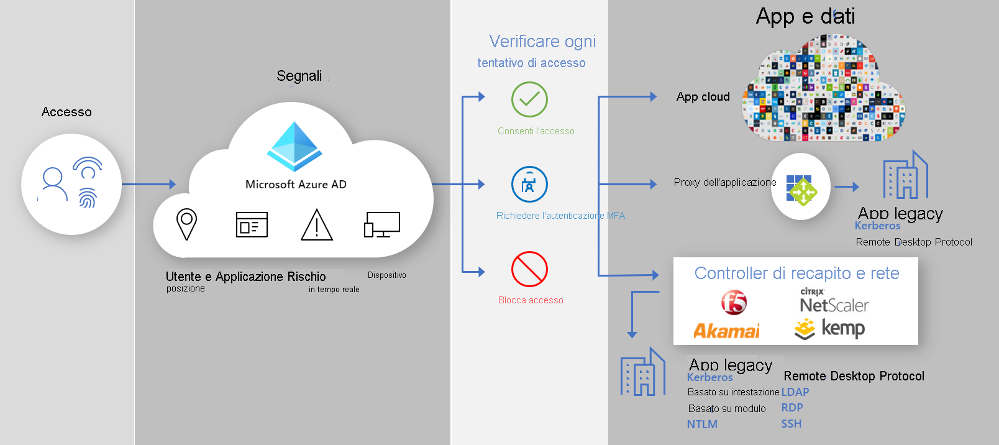

# Accesso ibrido sicuro: Proteggere le app legacy con reti e controller di distribuzione delle app

È ora possibile proteggere le applicazioni di autenticazione legacy locali e nel cloud connettendole ad Azure AD con la rete o il controller di distribuzione delle applicazioni esistente. In questo modo è possibile colmare il divario e migliorare il comportamento di sicurezza in tutte le applicazioni con funzionalità di Azure AD come l'accesso condizionale e Azure AD Identity Protection.

Usando la rete e il controller di distribuzione esistente, è possibile proteggere facilmente le applicazioni legacy ancora critiche per i processi aziendali, ma che non era possibile proteggere in passato con Azure AD. È probabile che siano già presenti tutti gli elementi necessari per iniziare a proteggere le applicazioni.

I fornitori seguenti offrono soluzioni preintegrate e linee guida dettagliate per l'integrazione con Azure AD.

* [F5 Big-IP APM](https://aka.ms/f5-hybridaccessguide)
* [Zscaler Private Access (ZPA)](https://aka.ms/zscaler-hybridaccessguide)
