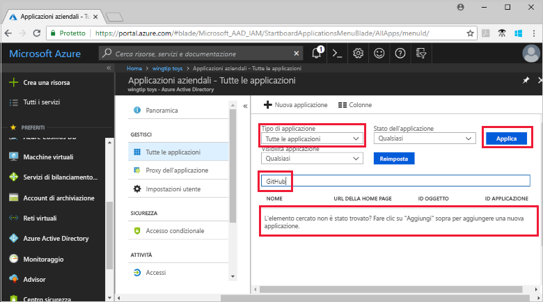
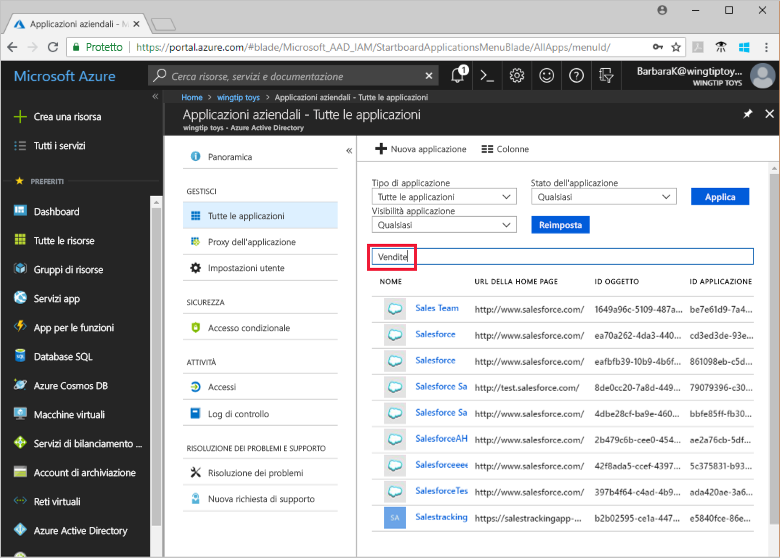

# Visualizzare le applicazioni del tenant di Azure Active Directory

Questa guida introduttiva usa il portale di Azure per visualizzare le applicazioni nel tenant di Azure Active Directory (Azure AD).

## Prima di iniziare

Per osservare i risultati, è necessario avere almeno un'applicazione nel tenant di Azure AD. Per aggiungere un'applicazione, vedere la guida introduttiva [Aggiungere un'applicazione](add-application-portal.md).

Accedere al [portale di Azure](https://portal.azure.com) come amministratore globale per il tenant di Azure AD, amministratore applicazione cloud o amministratore applicazione.

## Trovare l'elenco delle applicazioni del tenant

Le applicazioni del tenant di Azure AD sono visualizzabili nella sezione **Applicazioni aziendali** del portale di Azure.

Per trovare le applicazioni del tenant:

1. Nel **[portale di Azure](https://portal.azure.com)** selezionare **Azure Active Directory** nel riquadro di spostamento sinistro. 

1. Nel riquadro **Azure Active Directory** selezionare **Applicazioni aziendali**. 

1. Nel menu a discesa **Tipo di applicazione** selezionare **Tutte le applicazioni** e scegliere **Applica**. Verrà visualizzato un campione casuale delle applicazioni del tenant.
   
1. Per visualizzare altre applicazioni, selezionare **Carica altro** nella parte inferiore dell'elenco. A seconda del numero di applicazioni presenti nel tenant, potrebbe essere più semplice [cercare un'applicazione specifica](#search-for-a-tenant-application) anziché scorrere l'elenco.

## Selezionare le opzioni di visualizzazione

Selezionare le opzioni in base a ciò che si intende cercare.

1. È possibile visualizzare le applicazioni per **Tipo di applicazione**, **Stato dell'applicazione** e **Visibilità applicazione**. 

1. In **Tipo di applicazione** scegliere una di queste opzioni:

    - **Applicazioni aziendali** mostra le applicazioni non Microsoft.
    - **Applicazioni Microsoft** mostra le applicazioni Microsoft.
    - **Tutte le applicazioni** mostra le applicazioni sia Microsoft che non Microsoft.

1. In **Stato dell'applicazione** scegliere **Qualsiasi**, **Disabilitato** o **Abilitato**. L'opzione **Qualsiasi** include sia le applicazioni disabilitate sia quelle abilitate.

1. In **Visibilità applicazione** scegliere **Qualsiasi** o **Nascosto**. L'opzione **Nascosto** mostra le applicazioni presenti nel tenant ma non visibili agli utenti.

1. Dopo aver scelto le opzioni desiderate, selezionare **Applica**.
 

## Cercare un'applicazione del tenant

Per cercare un'applicazione specifica:

1. Nel menu **Tipo di applicazione** selezionare **Tutte le applicazioni** e scegliere **Applica**.

1. Immettere il nome dell'applicazione che si vuole trovare. Se l'applicazione è stata aggiunta al tenant di Azure AD, viene visualizzata nei risultati della ricerca. Questo esempio mostra che l'applicazione GitHub non è stata aggiunta alle applicazioni del tenant.

    

1. Provare a immettere le prime lettere del nome di un'applicazione. Questo esempio mostra tutte le applicazioni il cui nome inizia con **Sales**.

    

## Passaggi successivi

In questo argomento di avvio rapido si è appreso come visualizzare le applicazioni nel tenant di Azure AD. Si è appreso come filtrare l'elenco delle applicazioni per tipo, stato e visibilità dell'applicazione. È stato anche illustrato come cercare un'applicazione specifica.

Dopo aver trovato l'applicazione cercata, si può continuare ad [aggiungere altre applicazioni al tenant](add-application-portal.md). In alternativa, è possibile selezionare l'applicazione per visualizzare o modificare le proprietà e le opzioni di configurazione. Ad esempio, è possibile configurare l'accesso Single Sign-On. 

> [!div class="nextstepaction"]
> [Configurare l'accesso Single Sign-On](configure-single-sign-on-portal.md)

