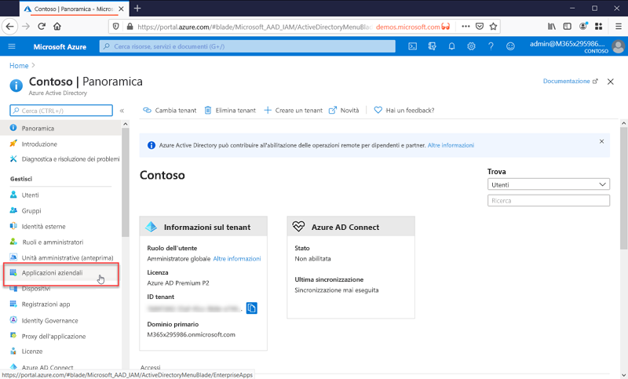

# Cos'è la gestione delle applicazioni?

Azure AD è un sistema di gestione delle identità e degli accessi (IAM). Fornisce un'unica posizione in cui archiviare le informazioni sulle identità digitali. È possibile configurare le applicazioni software per usare Azure AD come posizione di archiviazione delle informazioni sugli utenti. 

Azure AD deve essere configurato per l'integrazione con un'applicazione. In altre parole, deve sapere quali applicazioni lo usano come sistema di gestione delle identità. Il processo che consente ad Azure AD di rilevare la presenza di queste applicazioni e di gestirle è noto come gestione delle applicazioni.

È possibile gestire le applicazioni nel pannello **Applicazioni aziendali** che si trova nella sezione Gestione del portale di Azure Active Directory.

## Che cos'è un sistema di gestione delle identità e degli accessi (IAM)?
Un'applicazione è un software usato per uno scopo specifico. La maggior parte delle applicazioni richiede agli utenti di eseguire l'accesso in modo da fornire un'esperienza personalizzata a ogni utente. In altre parole, l'applicazione deve conoscere l'identità dell'utente che usa l'applicazione, perché sa quali funzionalità offrire o rimuovere per l'utente.

Se ogni applicazione tenesse traccia degli utenti separatamente, si otterrebbe un silo di nomi utente e account di accesso diversi per ogni applicazione. Un'applicazione non saprebbe nulla degli utenti di altre applicazioni.

Un sistema di gestione delle identità centralizzato risolve questo problema offrendo un'unica posizione in cui archiviare le informazioni sugli utenti che possono quindi essere usate da tutte le applicazioni. Questi sistemi sono noti come sistemi di gestione delle identità e degli accessi (IAM). Azure Active Directory è il sistema IAM per il cloud Microsoft.

>[!TIP]
>Un sistema IAM fornisce un'unica posizione in cui tenere traccia delle identità degli utenti. Azure AD è il sistema IAM per il cloud Microsoft.

## Perché gestire le applicazioni con una soluzione cloud?

In molte organizzazioni sono presenti centinaia di applicazioni a cui devono ricorrere i dipendenti per poter portare a termine il proprio lavoro. Gli utenti accedono a queste applicazioni da dispositivi e luoghi diversi. Ogni giorno, inoltre, vengono aggiunte, sviluppate e ritirate nuove applicazioni. Con un numero così elevato di applicazioni e punti di accesso, è ormai essenziale usare una soluzione basata sul cloud per gestire l'accesso degli utenti a tutte le applicazioni.

>[!TIP]
>La raccolta di app di Azure AD contiene molte delle applicazioni più diffuse già preconfigurate per interagire con Azure AD come provider di identità.

## Come funziona Azure AD con le applicazioni?

Azure AD semplifica la gestione delle applicazioni fornendo un unico sistema di gestione delle identità per le app cloud e locali. È possibile aggiungere ad Azure AD le proprie applicazioni SaaS (software come un servizio), locali e line-of-business. Gli utenti eseguono quindi l'accesso una sola volta per usare in modo facile e sicuro queste applicazioni, oltre a Microsoft 365 e ad altre applicazioni aziendali Microsoft. È possibile ridurre i costi amministrativi [automatizzando il provisioning degli utenti](../app-provisioning/user-provisioning.md). e usare l'autenticazione a più fattori e i criteri di accesso condizionale per fornire un accesso sicuro alle applicazioni.

## Quali tipi di applicazioni è possibile integrare con Azure AD?

Sono principalmente quattro i tipi di applicazione che è possibile aggiungere alle **applicazioni aziendali** e gestire con Azure AD:

- **Applicazioni della raccolta di Azure AD**. Azure AD ha una raccolta che contiene migliaia di applicazioni preintegrate per il Single Sign-On con Azure AD. Alcune delle applicazioni usate dall'organizzazione sono probabilmente incluse nella raccolta. Per altre informazioni, vedere [Guida introduttiva all'integrazione di Azure Active Directory con le applicazioni](plan-an-application-integration.md). Per le procedure dettagliate di integrazione per le singole app, vedere [Esercitazioni per l'integrazione di applicazioni SaaS con Azure Active Directory](https://docs.microsoft.com/azure/active-directory/saas-apps/).

- **Applicazioni locali con Application Proxy**. Con Azure AD Application Proxy è possibile integrare le app Web locali con Azure AD per supportare il Single Sign-On. Gli utenti finali possono accedere alle app Web locali nello stesso modo in cui accedono a Microsoft 365 e ad altre app SaaS. Vedere [Accesso remoto ad applicazioni locali tramite Azure Active Directory Application Proxy](application-proxy.md).

- **Applicazioni personalizzate**. È possibile integrare le applicazioni line-of-business create internamente con Azure AD per supportare il Single Sign-On. La registrazione dell'applicazione con Azure AD consente di avere il controllo dei criteri di autenticazione impostati per l'applicazione. Per altre informazioni, vedere [Sviluppare app line-of-business per Azure Active Directory](developer-guidance-for-integrating-applications.md).

- **Applicazioni non incluse nella raccolta**. È possibile aggiungere le proprie applicazioni ad Azure AD per supportare il Single Sign-On. È possibile integrare un'applicazione in diversi modi, alcuni dei quali sono descritti di seguito. Per altre informazioni, vedere [Configurare Single Sign-On SAML](configure-saml-single-sign-on.md).

>[!TIP]
>È possibile integrare Azure AD con un'applicazione anche se non è già preconfigurata e inclusa nella raccolta di app. È possibile **integrare Azure AD con uno qualsiasi** degli elementi seguenti:
> - Qualsiasi collegamento Web, o applicazione, che esegue il rendering di un **campo di nome utente e password**.
> - Qualsiasi applicazione che supporta i **protocolli SAML o OpenID Connect**.
> - Qualsiasi applicazione che supporta lo standard **System for Cross-domain Identity Management (SCIM)**.

## Gestione dei rischi con i criteri di accesso condizionale

Combinando l'accesso Single Sign-On (SSO) di Azure AD con l'[accesso condizionale](../conditional-access/concept-conditional-access-cloud-apps.md), è possibile garantire elevati livelli di sicurezza per l'accesso alle applicazioni. Le funzionalità di sicurezza includono la protezione dell'identità a livello di cloud, il controllo degli accessi basato sul rischio, l'autenticazione a più fattori nativa e i criteri di accesso condizionale. Queste funzionalità supportano criteri di controllo granulare basati sulle applicazioni o sui gruppi che necessitano di livelli di sicurezza superiori.

## Migliorare la produttività con l'accesso Single Sign-On

L'abilitazione dell'accesso Single Sign-On (SSO) nelle applicazioni e in Microsoft 365 offre agli utenti esistenti un'esperienza di accesso migliore riducendo o eliminando le richieste di accesso. L'ambiente dell'utente risulta inoltre più coerente ed è più difficile distrarsi senza dover gestire molteplici richieste di accesso o innumerevoli password. Il gruppo aziendale può gestire e approvare gli accessi tramite la modalità self-service e l'appartenenza dinamica. Consentendo al personale aziendale di competenza di gestire gli accessi a un'applicazione, è possibile anche migliorare la sicurezza del sistema delle identità.

L'accesso SSO migliora la sicurezza. *Senza l'accesso Single Sign-On*, gli amministratori devono creare e aggiornare account utente per ogni singola applicazione, con una considerevole perdita di tempo. Gli utenti devono inoltre tenere traccia di più credenziali per accedere alle applicazioni. Gli utenti, quindi, tendono a prendere nota delle password o a usare soluzioni di gestione delle password che comportano altri rischi per la sicurezza dei dati. [Altre informazioni sul Single Sign-On](what-is-single-sign-on.md).

## Gestione della governance e della conformità

Con Azure AD è possibile monitorare gli accessi alle applicazioni tramite report basati sugli strumenti di monitoraggio di eventi imprevisti della sicurezza. È possibile accedere ai report dal portale o dalle API. A livello di codice, è possibile anche controllare chi può accedere alle applicazioni e rimuovere l'accesso agli utenti inattivi tramite verifiche di accesso.

## Gestire i costi

Eseguendo la migrazione ad Azure AD è possibile anche risparmiare sui costi ed eliminare le complessità correlate alla gestione dell'infrastruttura locale. Azure AD consente infatti l'accesso self-service alle applicazioni, con un considerevole risparmio di tempo per gli amministratori e gli utenti. L'accesso Single Sign-On elimina le password specifiche delle applicazioni. La possibilità di eseguire l'accesso una sola volta consente di risparmiare sui costi correlati alla reimpostazione delle password delle applicazioni e alla perdita di produttività per il recupero delle password.

Per le applicazioni incentrate sulle risorse umane o altre applicazioni con un ampio set di utenti, è possibile sfruttare il provisioning delle app per automatizzare il processo di provisioning e deprovisioning degli utenti. Vedere [Automatizzare il provisioning e il deprovisioning di utenti nelle applicazioni con Azure AD](../app-provisioning/user-provisioning.md).

## Passaggi successivi

- [Serie di guide di avvio rapido sulla gestione delle applicazioni](view-applications-portal.md)
- [Introduzione all'integrazione delle applicazioni](plan-an-application-integration.md)
- [Come automatizzare il provisioning](../app-provisioning/user-provisioning.md)
