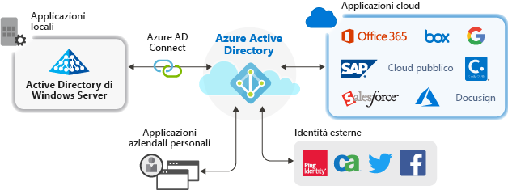

# Gestione di applicazioni con Azure Active Directory

Azure Active Directory (Azure AD) semplifica la gestione delle applicazioni fornendo un unico sistema di gestione delle identità per le app cloud e locali. È possibile aggiungere ad Azure AD le proprie applicazioni SaaS (software come un servizio), locali e line-of-business. Gli utenti eseguono quindi l'accesso una sola volta per accedere in modo facile e sicuro a queste applicazioni, oltre a Office 365 e ad altre applicazioni aziendali Microsoft. È anche possibile ridurre i costi amministrativi automatizzando il provisioning degli utenti e usare l'autenticazione a più fattori e i criteri di accesso condizionale per fornire un accesso sicuro alle applicazioni.

## Perché gestire le applicazioni con una soluzione cloud?

In molte organizzazioni sono presenti centinaia di applicazioni a cui devono ricorrere i dipendenti per poter portare a termine il proprio lavoro. Gli utenti accedono a queste applicazioni da dispositivi e luoghi diversi. Ogni giorno, inoltre, vengono aggiunte, sviluppate e ritirate nuove applicazioni. Con un numero così elevato di applicazioni e punti di accesso, è ormai essenziale usare una soluzione basata sul cloud per gestire l'accesso degli utenti a tutte le applicazioni.

## Quali tipi di applicazioni è possibile integrare con Azure AD?
Sono principalmente quattro i tipi di applicazione che è possibile aggiungere alle **applicazioni aziendali** e gestire con Azure AD:

-   **Applicazioni della raccolta di Azure AD**. Azure AD ha una raccolta che contiene migliaia di applicazioni preintegrate per il Single Sign-On con Azure AD. Alcune delle applicazioni usate dall'organizzazione sono probabilmente incluse nella raccolta. Per altre informazioni, vedere [Guida introduttiva all'integrazione di Azure Active Directory con le applicazioni](plan-an-application-integration.md). Per le procedure dettagliate di integrazione per le singole app, vedere [Esercitazioni per l'integrazione di applicazioni SaaS con Azure Active Directory](https://docs.microsoft.com/azure/active-directory/saas-apps/). 

-   **Applicazioni locali con Application Proxy**. Con Azure AD Application Proxy è possibile integrare le app Web locali con Azure AD per supportare il Single Sign-On. Gli utenti finali possono quindi accedere alle app Web locali nello stesso modo in cui accedono a Office 365 e ad altre app SaaS. [Perché usare Application Proxy e come funziona](what-is-application-proxy.md).

-   **Applicazioni personalizzate**. È possibile integrare le applicazioni line-of-business create internamente con Azure AD per supportare il Single Sign-On. La registrazione dell'applicazione con Azure AD consente di avere il controllo dei criteri di autenticazione impostati per l'applicazione. Per altre informazioni, vedere [Sviluppare app line-of-business per Azure Active Directory](developer-guidance-for-integrating-applications.md).

-   **Applicazioni non incluse nella raccolta**. È possibile aggiungere le proprie applicazioni ad Azure AD per supportare il Single Sign-On. Si può integrare qualsiasi collegamento Web o qualsiasi applicazione che usa un campo di nome utente e password, supporta i protocolli SAML o OpenID Connect oppure supporta SCIM. Per altre informazioni, vedere [Configurare il Single Sign-On per le app non incluse nella raccolta](configure-single-sign-on-non-gallery-applications.md).

## Gestione dei rischi con i criteri di accesso condizionale
Combinando l'accesso Single Sign-On (SSO) di Azure AD con l'[accesso condizionale](https://docs.microsoft.com/azure/active-directory/conditional-access/overview), è possibile garantire elevati livelli di sicurezza per l'accesso alle applicazioni. Le funzionalità di sicurezza includono la protezione dell'identità a livello di cloud, il controllo degli accessi basato sul rischio, l'autenticazione a più fattori nativa e i criteri di accesso condizionale. Queste funzionalità supportano criteri di controllo granulare basati sulle applicazioni o sui gruppi che necessitano di livelli di sicurezza superiori.

## Migliorare la produttività con l'accesso Single Sign-On
L'abilitazione dell'accesso Single Sign-On (SSO) nelle applicazioni e in Office 365 offre agli utenti esistenti un'esperienza di accesso migliore riducendo o eliminando le richieste di accesso. L'ambiente dell'utente risulta inoltre più coerente ed è più difficile distrarsi senza dover gestire molteplici richieste di accesso o innumerevoli password. Il gruppo aziendale può gestire e approvare gli accessi tramite la modalità self-service e l'appartenenza dinamica. Consentendo al personale aziendale di competenza di gestire gli accessi a un'applicazione, è possibile anche migliorare la sicurezza del sistema delle identità.

L'accesso SSO migliora la sicurezza. *Senza l'accesso Single Sign-On*, gli amministratori devono creare e aggiornare account utente per ogni singola applicazione, con una considerevole perdita di tempo. Gli utenti devono inoltre tenere traccia di più credenziali per accedere alle applicazioni. Gli utenti, quindi, tendono a prendere nota delle password o a usare soluzioni di gestione delle password che comportano altri rischi per la sicurezza dei dati. [Altre informazioni sul Single Sign-On](what-is-single-sign-on.md).

## Gestione della governance e della conformità
Con Azure AD è possibile monitorare gli accessi alle applicazioni tramite report basati sugli strumenti di monitoraggio di eventi imprevisti della sicurezza. È possibile accedere ai report dal portale o dalle API. A livello di codice, è possibile anche controllare chi può accedere alle applicazioni e rimuovere l'accesso agli utenti inattivi tramite verifiche di accesso.

## Gestire i costi
Eseguendo la migrazione ad Azure AD è possibile anche risparmiare sui costi ed eliminare le complessità correlate alla gestione dell'infrastruttura locale. Azure AD consente infatti l'accesso self-service alle applicazioni, con un considerevole risparmio di tempo per gli amministratori e gli utenti. L'accesso Single Sign-On elimina le password specifiche delle applicazioni. La possibilità di eseguire l'accesso una sola volta consente di risparmiare sui costi correlati alla reimpostazione delle password delle applicazioni e alla perdita di produttività per il recupero delle password.

## Passaggi successivi

- [Che cos'è Application Proxy?](what-is-application-proxy.md)
- [Guida introduttiva: Aggiungere un'applicazione al tenant di Azure Active Directory](add-application-portal.md)
